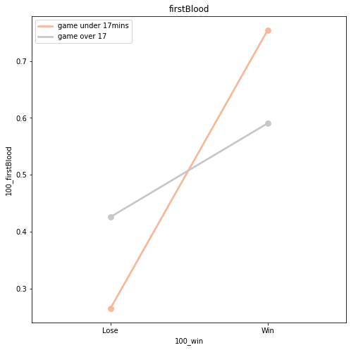
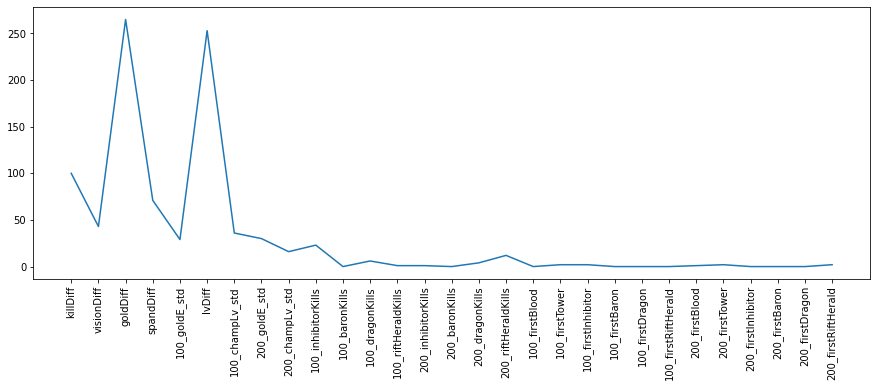
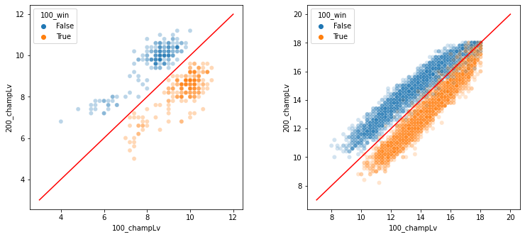

```python
import pandas as pd
import numpy as np
import seaborn as sns
import matplotlib.pyplot as plt
```

# 프로젝트 1차 EDA

 - 주제 : LOL 매치 데이터를 바탕으로 승패를 가려낼 수 있다.
     * 승패 예측에 주효한 변수가 존재할까?
     * (추가) 경기 시간에 따라 승패 예측 모델이 다르게 나타날 수 있을까?
     * (추가) 주요 변수의 분산은 승패 예측에 얼마나 영향력을 미칠까? >> 팀 내에서 특정 플레이어만 돋보일 경우 승리에 해가 될까?

## 데이터셋

 - League of Legends(LOL) - Ranked Games 2020
 - challenger,grandmaster,master 108,000 game data
 - 데이터 출처 : https://www.kaggle.com/gyejr95/league-of-legendslol-ranked-games-2020-ver1
 - 데이터 출처 : https://developer.riotgames.com/apis#match-v4
 
### 사용 데이터 설명
     - match_data_version1.pickle : 매치 관련 데이터
     - match_winner_data_version1.pickle : 승자 데이터
     - match_loser_data_version1.pickle : 패자 데이터

####  match 데이터


```python
raw_df = pd.read_pickle('data/match_data_version1.pickle')
raw_df.shape
```


    (108829, 14)


```python
pd.set_option('display.float_format', '{:.2f}'.format)
```


```python
raw_df.head()
```


<div>
<style scoped>
    .dataframe tbody tr th:only-of-type {
        vertical-align: middle;
    }

    .dataframe tbody tr th {
        vertical-align: top;
    }

    .dataframe thead th {
        text-align: right;
    }
</style>
<table border="1" class="dataframe">
  <thead>
    <tr style="text-align: right;">
      <th></th>
      <th>gameCreation</th>
      <th>gameDuration</th>
      <th>gameId</th>
      <th>gameMode</th>
      <th>gameType</th>
      <th>gameVersion</th>
      <th>mapId</th>
      <th>participantIdentities</th>
      <th>participants</th>
      <th>platformId</th>
      <th>queueId</th>
      <th>seasonId</th>
      <th>status.message</th>
      <th>status.status_code</th>
    </tr>
  </thead>
  <tbody>
    <tr>
      <th>0</th>
      <td>1585154663829.00</td>
      <td>1323.00</td>
      <td>4247263043.00</td>
      <td>CLASSIC</td>
      <td>MATCHED_GAME</td>
      <td>10.6.314.4405</td>
      <td>11.00</td>
      <td>[{'participantId': 1, 'player': {'platformId':...</td>
      <td>[{'participantId': 1, 'teamId': 100, 'champion...</td>
      <td>KR</td>
      <td>420.00</td>
      <td>13.00</td>
      <td>NaN</td>
      <td>nan</td>
    </tr>
    <tr>
      <th>1</th>
      <td>1585152108929.00</td>
      <td>1317.00</td>
      <td>4247155821.00</td>
      <td>CLASSIC</td>
      <td>MATCHED_GAME</td>
      <td>10.6.314.4405</td>
      <td>11.00</td>
      <td>[{'participantId': 1, 'player': {'platformId':...</td>
      <td>[{'participantId': 1, 'teamId': 100, 'champion...</td>
      <td>KR</td>
      <td>420.00</td>
      <td>13.00</td>
      <td>NaN</td>
      <td>nan</td>
    </tr>
    <tr>
      <th>2</th>
      <td>1585059026141.00</td>
      <td>932.00</td>
      <td>4243963257.00</td>
      <td>CLASSIC</td>
      <td>MATCHED_GAME</td>
      <td>10.6.313.8894</td>
      <td>11.00</td>
      <td>[{'participantId': 1, 'player': {'platformId':...</td>
      <td>[{'participantId': 1, 'teamId': 100, 'champion...</td>
      <td>KR</td>
      <td>420.00</td>
      <td>13.00</td>
      <td>NaN</td>
      <td>nan</td>
    </tr>
    <tr>
      <th>3</th>
      <td>1584977993720.00</td>
      <td>2098.00</td>
      <td>4241678498.00</td>
      <td>CLASSIC</td>
      <td>MATCHED_GAME</td>
      <td>10.6.313.8894</td>
      <td>11.00</td>
      <td>[{'participantId': 1, 'player': {'platformId':...</td>
      <td>[{'participantId': 1, 'teamId': 100, 'champion...</td>
      <td>KR</td>
      <td>420.00</td>
      <td>13.00</td>
      <td>NaN</td>
      <td>nan</td>
    </tr>
    <tr>
      <th>4</th>
      <td>1584973382886.00</td>
      <td>2344.00</td>
      <td>4241538868.00</td>
      <td>CLASSIC</td>
      <td>MATCHED_GAME</td>
      <td>10.6.313.8894</td>
      <td>11.00</td>
      <td>[{'participantId': 1, 'player': {'platformId':...</td>
      <td>[{'participantId': 1, 'teamId': 100, 'champion...</td>
      <td>KR</td>
      <td>420.00</td>
      <td>13.00</td>
      <td>NaN</td>
      <td>nan</td>
    </tr>
  </tbody>
</table>
</div>


```python
raw_df.info()
```

    <class 'pandas.core.frame.DataFrame'>
    Int64Index: 108829 entries, 0 to 0
    Data columns (total 14 columns):
     #   Column                 Non-Null Count   Dtype  
    ---  ------                 --------------   -----  
     0   gameCreation           108829 non-null  float64
     1   gameDuration           108829 non-null  float64
     2   gameId                 108829 non-null  float64
     3   gameMode               108829 non-null  object 
     4   gameType               108829 non-null  object 
     5   gameVersion            108829 non-null  object 
     6   mapId                  108829 non-null  float64
     7   participantIdentities  108829 non-null  object 
     8   participants           108829 non-null  object 
     9   platformId             108829 non-null  object 
     10  queueId                108829 non-null  float64
     11  seasonId               108829 non-null  float64
     12  status.message         0 non-null       object 
     13  status.status_code     0 non-null       float64
    dtypes: float64(7), object(7)
    memory usage: 12.5+ MB
    

 * gameCreation : 게임 생성번호
 * gameDuration : 게임 진행시간 (단위 : 초)
 * gameId : 게임(매치) 고유값
 * gameMode : 게임 모드
 * gameType : 게임 종류(TFT, Classic, URF 등, 현 분석에서는 Classic 만 사용할 예정)
 * gameVersion : 클라이언트의 버전
 * mapId : 맵 구분
 * participantIdentities : 플레이어 정보 (dict) 
 * participants : 플레이어 당 플레이 데이터 (dict)
 * platformId : 서버의 국가
 * queueId : team간의 게임이 성사된 id
 * seasonId : 시즌 번호
 * status.message : --
 * status.status_code : --
 * gameCreation : 듀오나 솔로 등의 상태로 참여 시 생성되는 번호로 유추되나 이번 분석에서는 사용하지 않음


```python
raw_df['gameCreation'].value_counts()
```


    1584360151678.00    2
    1581487345709.00    2
    1581316019069.00    2
    1584815530903.00    2
    1583572999175.00    2
                       ..
    1583440784595.00    1
    1574854371100.00    1
    1583447843795.00    1
    1567319881644.00    1
    1580551189560.00    1
    Name: gameCreation, Length: 108770, dtype: int64


* gameDuration : 게임 지속 시간(초)으로 다음과 같은 구분점을 가짐
  - <= 400 : 180 초 이후 플레이어의 게임 참여 상황에 따라 게임을 초기화 할 수 있고, 게임이 성립되지 않아 종료된 게임으로 판단
  - 400 < x <= 1020 : 900초 이후 한 쪽의 항복 선언으로 게임 종료가 가능하고, 해당 투표가 2번까지 진행되는 1020초까지 단기에 결판난 게임으로 판단
  - < 1020 : 중장기전으로 분류


```python
raw_df['gameDuration'].hist(bins = 100)
```


    <matplotlib.axes._subplots.AxesSubplot at 0x1c35dbce448>


    

    


```python
raw_df[raw_df['gameDuration'] <= 400]['gameDuration'].hist(bins = 30)
```


    <matplotlib.axes._subplots.AxesSubplot at 0x1c5bfde1608>


    

    


```python
raw_df[raw_df['gameDuration'] <= 400]['gameId'].count() / 108829
```


    0.011632928723042571


```python
raw_df[(raw_df['gameDuration'] > 400) & (raw_df['gameDuration'] <= 1020)]['gameDuration'].hist(bins = 50)
```


    <matplotlib.axes._subplots.AxesSubplot at 0x1c5bff0b048>


    

    


```python
raw_df[(raw_df['gameDuration'] > 400) &(raw_df['gameDuration'] <= 1020)]['gameId'].count() / 108829
```


    0.19501235883817733


* gameType : 단일 값으로 분석에 미사용


```python
print("gameMode 'CLASSIC': {0}".format(92857 / 108770)) ## 클래식 모드만 남기는 걸로

raw_df['gameType'].value_counts()
```

    gameMode 'CLASSIC': 0.8537004688792865
    


    MATCHED_GAME    108829
    Name: gameType, dtype: int64


* gameMode : 85%의 비중을 차지하는 CLASSIC 모드만 분석


```python
raw_df['gameMode'].value_counts()
```


    CLASSIC              92857
    ARAM                 12061
    URF                   2196
    ONEFORALL             1575
    KINGPORO               122
    TUTORIAL_MODULE_1       12
    TUTORIAL_MODULE_3        3
    TUTORIAL_MODULE_2        3
    Name: gameMode, dtype: int64


* mapId : 전체의 88.8% 에 해당하는 11 번 맵만 분석에 활용 (LOL rank game)


```python
print("mapId 11: {0}".format(96640 / 108829))
raw_df['mapId'].value_counts() ## 88.8% 에 해당하는 11번 맵만 분석
```

    mapId 11: 0.887998603313455
    


    11.00    96640
    12.00    12183
    10.00        6
    Name: mapId, dtype: int64


```python
raw_df['participantIdentities'][1]
```


    [{'participantId': 1,
      'player': {'platformId': 'KR',
       'accountId': 'F23ggf384dqSm_YjnKOXZ6AzT9AIuXnBae39fTdobe-8k7dHMULcr139',
       'summonerName': 'LPL Player',
       'summonerId': 'H5upZv7VdqopzqhvJWsAyMPm4KiuqCH7PMBlc4QLW4UUQY4',
       'currentPlatformId': 'KR',
       'currentAccountId': 'F23ggf384dqSm_YjnKOXZ6AzT9AIuXnBae39fTdobe-8k7dHMULcr139',
       'matchHistoryUri': '/v1/stats/player_history/KR/2372714339454208',
       'profileIcon': 29}},
     {'participantId': 2,
      'player': {'platformId': 'KR',
       'accountId': 'k9fNBRC8yXeqIJg2X3Tq3Ko2YuxFUd4fRfFSqC0Glyyk3Ds',
       'summonerName': 'GIDE0N',
       'summonerId': 'VRJ3UE5P3xbH7fAWhVv8teJ3vEDmYmTv9TCq59iZRrxdld0',
       'currentPlatformId': 'KR',
       'currentAccountId': 'k9fNBRC8yXeqIJg2X3Tq3Ko2YuxFUd4fRfFSqC0Glyyk3Ds',
       'matchHistoryUri': '/v1/stats/player_history/KR/210316631',
       'profileIcon': 25}},
     {'participantId': 3,
      'player': {'platformId': 'KR',
       'accountId': 'bVwP9CQfYvmYu0L_U7p5NCo14wsHOoRfbrnpvGBBPyp32M0',
       'summonerName': 'supupsupupsupup',
       'summonerId': '6jJ9FEFNazBPTdmsRhofkU0lFj_CQl1G7y-uKkIbgl45FSA',
       'currentPlatformId': 'KR',
       'currentAccountId': 'bVwP9CQfYvmYu0L_U7p5NCo14wsHOoRfbrnpvGBBPyp32M0',
       'matchHistoryUri': '/v1/stats/player_history/KR/208802310',
       'profileIcon': 4418}},
     {'participantId': 4,
      'player': {'platformId': 'kr',
       'accountId': '1C4v3z1Ly_5Raz1tWO1FDkWnEq8V9sxnyM9TjiYe9O2EcTA',
       'summonerName': 'HLE Bmav',
       'summonerId': 'cgkw20LcEbkxf1pkoa42CSzDC4lBqt3waYiqnpyrQxWP3fM',
       'currentPlatformId': 'KR',
       'currentAccountId': '1C4v3z1Ly_5Raz1tWO1FDkWnEq8V9sxnyM9TjiYe9O2EcTA',
       'matchHistoryUri': '/v1/stats/player_history/kr/210569816',
       'profileIcon': 4463}},
     {'participantId': 5,
      'player': {'platformId': 'KR',
       'accountId': 'IIWG7FRiqE8CuZaCslKkNxkglwpgnePPxDslb2tv66FKrgo',
       'summonerName': 'Youtube Thal',
       'summonerId': '8Cx100isJ6RMMeOmUX_-Wg0CESabVTYk-e8P8Ijj3zuIiB4',
       'currentPlatformId': 'KR',
       'currentAccountId': 'IIWG7FRiqE8CuZaCslKkNxkglwpgnePPxDslb2tv66FKrgo',
       'matchHistoryUri': '/v1/stats/player_history/KR/201236882',
       'profileIcon': 4090}},
     {'participantId': 6,
      'player': {'platformId': 'KR',
       'accountId': 'mRHYh0eHLlzin_tMAhQuBpRyvs87JU8fwAnRIXmX2Erii91t9TW98KMH',
       'summonerName': 'gapggg',
       'summonerId': '2NUrEYZ_r85O30z1yhHJxcC1JSjQMdv_oVaMFSgm9CtiZs0',
       'currentPlatformId': 'KR',
       'currentAccountId': 'mRHYh0eHLlzin_tMAhQuBpRyvs87JU8fwAnRIXmX2Erii91t9TW98KMH',
       'matchHistoryUri': '/v1/stats/player_history/KR/2372728072793472',
       'profileIcon': 22}},
     {'participantId': 7,
      'player': {'platformId': 'KR',
       'accountId': 'laVp9S-sMWhsLTd5Rl0rdUtRP8tNaEV0ph2bhwzIF2ZFmlVS-WGjlCCw',
       'summonerName': '죽이지 마라1',
       'summonerId': 'wAx8YND0e4p0prS2pBdSIiSt7S6E2DltenDV3JQHJd_SY90',
       'currentPlatformId': 'KR',
       'currentAccountId': 'laVp9S-sMWhsLTd5Rl0rdUtRP8tNaEV0ph2bhwzIF2ZFmlVS-WGjlCCw',
       'matchHistoryUri': '/v1/stats/player_history/KR/2309152638176608',
       'profileIcon': 6}},
     {'participantId': 8,
      'player': {'platformId': 'KR',
       'accountId': 'JMvYNBltKqodbowF-przG6hYYx4xjEebAlNpjnVxedJvc3YtpGl4-p08',
       'summonerName': 'zhong men dui ju',
       'summonerId': '41foCgS8tN9qwcFvXfKDba48aULtpourP2foWMCreNRC4C4',
       'currentPlatformId': 'KR',
       'currentAccountId': 'JMvYNBltKqodbowF-przG6hYYx4xjEebAlNpjnVxedJvc3YtpGl4-p08',
       'matchHistoryUri': '/v1/stats/player_history/KR/2372729821441408',
       'profileIcon': 29}},
     {'participantId': 9,
      'player': {'platformId': 'KR',
       'accountId': 'CBshAH3eSlOnMc1ntoJlf3E14TVfuABdbiQTIfpLgSMjs-R_nrCs_Su1',
       'summonerName': 'maiduiyou',
       'summonerId': 'dmh7O3sbF2CJt6lY4lNppWURxiNMXXNuL26NMp1pfvBDhYw',
       'currentPlatformId': 'KR',
       'currentAccountId': 'CBshAH3eSlOnMc1ntoJlf3E14TVfuABdbiQTIfpLgSMjs-R_nrCs_Su1',
       'matchHistoryUri': '/v1/stats/player_history/KR/2372729532198688',
       'profileIcon': 4447}},
     {'participantId': 10,
      'player': {'platformId': 'KR',
       'accountId': 'ImPwfj9Gb0tPHcMMnjVc6w44AedoxngtlVZJiqLqOKBRVP8neMBoEYHa',
       'summonerName': 'ggffggg',
       'summonerId': 'n_2q6lxDY6zivMxIy1lJSyq7S7kV11RBpl29ccDzj20LMSI',
       'currentPlatformId': 'KR',
       'currentAccountId': 'ImPwfj9Gb0tPHcMMnjVc6w44AedoxngtlVZJiqLqOKBRVP8neMBoEYHa',
       'matchHistoryUri': '/v1/stats/player_history/KR/2372727679749504',
       'profileIcon': 839}}]


```python
raw_df['participants'][1]
```


    [{'participantId': 1,
      'teamId': 100,
      'championId': 236,
      'spell1Id': 14,
      'spell2Id': 4,
      'stats': {'participantId': 1,
       'win': True,
       'item0': 2422,
       'item1': 3153,
       'item2': 3071,
       'item3': 1055,
       'item4': 1042,
       'item5': 1055,
       'item6': 3363,
       'kills': 3,
       'deaths': 5,
       'assists': 2,
       'largestKillingSpree': 2,
       'largestMultiKill': 1,
       'killingSprees': 1,
       'longestTimeSpentLiving': 351,
       'doubleKills': 0,
       'tripleKills': 0,
       'quadraKills': 0,
       'pentaKills': 0,
       'unrealKills': 0,
       'totalDamageDealt': 91081,
       'magicDamageDealt': 3316,
       'physicalDamageDealt': 83719,
       'trueDamageDealt': 4045,
       'largestCriticalStrike': 0,
       'totalDamageDealtToChampions': 16662,
       'magicDamageDealtToChampions': 916,
       'physicalDamageDealtToChampions': 15033,
       'trueDamageDealtToChampions': 712,
       'totalHeal': 1267,
       'totalUnitsHealed': 1,
       'damageSelfMitigated': 5791,
       'damageDealtToObjectives': 1885,
       'damageDealtToTurrets': 1885,
       'visionScore': 14,
       'timeCCingOthers': 1,
       'totalDamageTaken': 15543,
       'magicalDamageTaken': 4239,
       'physicalDamageTaken': 10620,
       'trueDamageTaken': 684,
       'goldEarned': 8452,
       'goldSpent': 7900,
       'turretKills': 1,
       'inhibitorKills': 0,
       'totalMinionsKilled': 166,
       'neutralMinionsKilled': 4,
       'neutralMinionsKilledTeamJungle': 0,
       'neutralMinionsKilledEnemyJungle': 4,
       'totalTimeCrowdControlDealt': 33,
       'champLevel': 14,
       'visionWardsBoughtInGame': 4,
       'sightWardsBoughtInGame': 0,
       'wardsPlaced': 11,
       'wardsKilled': 1,
       'firstBloodKill': False,
       'firstBloodAssist': False,
       'firstTowerKill': False,
       'firstTowerAssist': False,
       'combatPlayerScore': 0,
       'objectivePlayerScore': 0,
       'totalPlayerScore': 0,
       'totalScoreRank': 0,
       'playerScore0': 0,
       'playerScore1': 0,
       'playerScore2': 0,
       'playerScore3': 0,
       'playerScore4': 0,
       'playerScore5': 0,
       'playerScore6': 0,
       'playerScore7': 0,
       'playerScore8': 0,
       'playerScore9': 0,
       'perk0': 8005,
       'perk0Var1': 1496,
       'perk0Var2': 953,
       'perk0Var3': 543,
       'perk1': 9111,
       'perk1Var1': 551,
       'perk1Var2': 100,
       'perk1Var3': 0,
       'perk2': 9104,
       'perk2Var1': 19,
       'perk2Var2': 10,
       'perk2Var3': 0,
       'perk3': 8299,
       'perk3Var1': 381,
       'perk3Var2': 0,
       'perk3Var3': 0,
       'perk4': 8304,
       'perk4Var1': 12,
       'perk4Var2': 0,
       'perk4Var3': 0,
       'perk5': 8345,
       'perk5Var1': 3,
       'perk5Var2': 0,
       'perk5Var3': 0,
       'perkPrimaryStyle': 8000,
       'perkSubStyle': 8300,
       'statPerk0': 5005,
       'statPerk1': 5008,
       'statPerk2': 5002},
      'timeline': {'participantId': 1,
       'creepsPerMinDeltas': {'10-20': 7.8, '0-10': 7.5},
       'xpPerMinDeltas': {'10-20': 671.0999999999999, '0-10': 390.1},
       'goldPerMinDeltas': {'10-20': 459.9, '0-10': 253.4},
       'damageTakenPerMinDeltas': {'10-20': 936.0999999999999, '0-10': 383.6},
       'role': 'DUO_CARRY',
       'lane': 'MIDDLE'}},
     {'participantId': 2,
      'teamId': 100,
      'championId': 245,
      'spell1Id': 11,
      'spell2Id': 4,
      'stats': {'participantId': 2,
       'win': True,
       'item0': 2031,
       'item1': 3152,
       'item2': 1414,
       'item3': 3057,
       'item4': 3020,
       'item5': 0,
       'item6': 3364,
       'kills': 7,
       'deaths': 0,
       'assists': 7,
       'largestKillingSpree': 7,
       'largestMultiKill': 2,
       'killingSprees': 1,
       'longestTimeSpentLiving': 0,
       'doubleKills': 1,
       'tripleKills': 0,
       'quadraKills': 0,
       'pentaKills': 0,
       'unrealKills': 0,
       'totalDamageDealt': 114222,
       'magicDamageDealt': 75228,
       'physicalDamageDealt': 27464,
       'trueDamageDealt': 11530,
       'largestCriticalStrike': 0,
       'totalDamageDealtToChampions': 11674,
       'magicDamageDealtToChampions': 8938,
       'physicalDamageDealtToChampions': 2224,
       'trueDamageDealtToChampions': 512,
       'totalHeal': 10400,
       'totalUnitsHealed': 1,
       'damageSelfMitigated': 10264,
       'damageDealtToObjectives': 26704,
       'damageDealtToTurrets': 352,
       'visionScore': 27,
       'timeCCingOthers': 9,
       'totalDamageTaken': 19885,
       'magicalDamageTaken': 4652,
       'physicalDamageTaken': 14648,
       'trueDamageTaken': 584,
       'goldEarned': 9069,
       'goldSpent': 7850,
       'turretKills': 1,
       'inhibitorKills': 0,
       'totalMinionsKilled': 19,
       'neutralMinionsKilled': 103,
       'neutralMinionsKilledTeamJungle': 53,
       'neutralMinionsKilledEnemyJungle': 10,
       'totalTimeCrowdControlDealt': 291,
       'champLevel': 13,
       'visionWardsBoughtInGame': 6,
       'sightWardsBoughtInGame': 0,
       'wardsPlaced': 7,
       'wardsKilled': 5,
       'firstBloodKill': False,
       'firstBloodAssist': False,
       'firstTowerKill': False,
       'firstTowerAssist': False,
       'combatPlayerScore': 0,
       'objectivePlayerScore': 0,
       'totalPlayerScore': 0,
       'totalScoreRank': 0,
       'playerScore0': 0,
       'playerScore1': 0,
       'playerScore2': 0,
       'playerScore3': 0,
       'playerScore4': 0,
       'playerScore5': 0,
       'playerScore6': 0,
       'playerScore7': 0,
       'playerScore8': 0,
       'playerScore9': 0,
       'perk0': 8128,
       'perk0Var1': 879,
       'perk0Var2': 13,
       'perk0Var3': 697,
       'perk1': 8143,
       'perk1Var1': 339,
       'perk1Var2': 0,
       'perk1Var3': 0,
       'perk2': 8138,
       'perk2Var1': 30,
       'perk2Var2': 0,
       'perk2Var3': 0,
       'perk3': 8135,
       'perk3Var1': 4058,
       'perk3Var2': 5,
       'perk3Var3': 0,
       'perk4': 8304,
       'perk4Var1': 10,
       'perk4Var2': 3,
       'perk4Var3': 0,
       'perk5': 8321,
       'perk5Var1': 4,
       'perk5Var2': 0,
       'perk5Var3': 0,
       'perkPrimaryStyle': 8100,
       'perkSubStyle': 8300,
       'statPerk0': 5005,
       'statPerk1': 5008,
       'statPerk2': 5002},
      'timeline': {'participantId': 2,
       'creepsPerMinDeltas': {'10-20': 1.4, '0-10': 0.3},
       'xpPerMinDeltas': {'10-20': 513, '0-10': 325.1},
       'goldPerMinDeltas': {'10-20': 454.8, '0-10': 269},
       'csDiffPerMinDeltas': {'10-20': 0.7000000000000001,
        '0-10': 0.09999999999999998},
       'xpDiffPerMinDeltas': {'10-20': 154.9, '0-10': -20.19999999999996},
       'damageTakenPerMinDeltas': {'10-20': 1047.7, '0-10': 554.9},
       'damageTakenDiffPerMinDeltas': {'10-20': -283.2000000000001,
        '0-10': -217.49999999999997},
       'role': 'NONE',
       'lane': 'JUNGLE'}},
     {'participantId': 3,
      'teamId': 100,
      'championId': 350,
      'spell1Id': 7,
      'spell2Id': 3,
      'stats': {'participantId': 3,
       'win': True,
       'item0': 3174,
       'item1': 3853,
       'item2': 0,
       'item3': 1052,
       'item4': 3041,
       'item5': 0,
       'item6': 3364,
       'kills': 0,
       'deaths': 0,
       'assists': 12,
       'largestKillingSpree': 0,
       'largestMultiKill': 0,
       'killingSprees': 0,
       'longestTimeSpentLiving': 0,
       'doubleKills': 0,
       'tripleKills': 0,
       'quadraKills': 0,
       'pentaKills': 0,
       'unrealKills': 0,
       'totalDamageDealt': 13682,
       'magicDamageDealt': 9152,
       'physicalDamageDealt': 4530,
       'trueDamageDealt': 0,
       'largestCriticalStrike': 0,
       'totalDamageDealtToChampions': 7498,
       'magicDamageDealtToChampions': 6608,
       'physicalDamageDealtToChampions': 889,
       'trueDamageDealtToChampions': 0,
       'totalHeal': 7965,
       'totalUnitsHealed': 5,
       'damageSelfMitigated': 2488,
       'damageDealtToObjectives': 1332,
       'damageDealtToTurrets': 1272,
       'visionScore': 46,
       'timeCCingOthers': 6,
       'totalDamageTaken': 3200,
       'magicalDamageTaken': 133,
       'physicalDamageTaken': 3066,
       'trueDamageTaken': 0,
       'goldEarned': 6023,
       'goldSpent': 4935,
       'turretKills': 0,
       'inhibitorKills': 0,
       'totalMinionsKilled': 8,
       'neutralMinionsKilled': 0,
       'neutralMinionsKilledTeamJungle': 0,
       'neutralMinionsKilledEnemyJungle': 0,
       'totalTimeCrowdControlDealt': 31,
       'champLevel': 11,
       'visionWardsBoughtInGame': 6,
       'sightWardsBoughtInGame': 0,
       'wardsPlaced': 21,
       'wardsKilled': 4,
       'firstBloodKill': False,
       'firstBloodAssist': False,
       'firstTowerKill': False,
       'firstTowerAssist': False,
       'combatPlayerScore': 0,
       'objectivePlayerScore': 0,
       'totalPlayerScore': 0,
       'totalScoreRank': 0,
       'playerScore0': 0,
       'playerScore1': 0,
       'playerScore2': 0,
       'playerScore3': 0,
       'playerScore4': 0,
       'playerScore5': 0,
       'playerScore6': 0,
       'playerScore7': 0,
       'playerScore8': 0,
       'playerScore9': 0,
       'perk0': 8229,
       'perk0Var1': 695,
       'perk0Var2': 0,
       'perk0Var3': 0,
       'perk1': 8226,
       'perk1Var1': 250,
       'perk1Var2': 618,
       'perk1Var3': 0,
       'perk2': 8210,
       'perk2Var1': 0,
       'perk2Var2': 0,
       'perk2Var3': 0,
       'perk3': 8236,
       'perk3Var1': 24,
       'perk3Var2': 0,
       'perk3Var3': 0,
       'perk4': 8009,
       'perk4Var1': 3369,
       'perk4Var2': 500,
       'perk4Var3': 0,
       'perk5': 8017,
       'perk5Var1': 561,
       'perk5Var2': 0,
       'perk5Var3': 0,
       'perkPrimaryStyle': 8200,
       'perkSubStyle': 8000,
       'statPerk0': 5008,
       'statPerk1': 5008,
       'statPerk2': 5002},
      'timeline': {'participantId': 3,
       'creepsPerMinDeltas': {'10-20': 0.7, '0-10': 0.1},
       'xpPerMinDeltas': {'10-20': 454.20000000000005, '0-10': 238.8},
       'goldPerMinDeltas': {'10-20': 324.79999999999995,
        '0-10': 151.89999999999998},
       'damageTakenPerMinDeltas': {'10-20': 244.10000000000002,
        '0-10': 70.80000000000001},
       'role': 'DUO_SUPPORT',
       'lane': 'MIDDLE'}},
     {'participantId': 4,
      'teamId': 100,
      'championId': 110,
      'spell1Id': 21,
      'spell2Id': 4,
      'stats': {'participantId': 4,
       'win': True,
       'item0': 3142,
       'item1': 2033,
       'item2': 3179,
       'item3': 3158,
       'item4': 1036,
       'item5': 1036,
       'item6': 3363,
       'kills': 7,
       'deaths': 0,
       'assists': 2,
       'largestKillingSpree': 7,
       'largestMultiKill': 3,
       'killingSprees': 1,
       'longestTimeSpentLiving': 0,
       'doubleKills': 1,
       'tripleKills': 1,
       'quadraKills': 0,
       'pentaKills': 0,
       'unrealKills': 0,
       'totalDamageDealt': 111796,
       'magicDamageDealt': 4245,
       'physicalDamageDealt': 103533,
       'trueDamageDealt': 4017,
       'largestCriticalStrike': 0,
       'totalDamageDealtToChampions': 13016,
       'magicDamageDealtToChampions': 1643,
       'physicalDamageDealtToChampions': 11259,
       'trueDamageDealtToChampions': 114,
       'totalHeal': 83,
       'totalUnitsHealed': 1,
       'damageSelfMitigated': 3648,
       'damageDealtToObjectives': 3742,
       'damageDealtToTurrets': 2988,
       'visionScore': 16,
       'timeCCingOthers': 12,
       'totalDamageTaken': 6685,
       'magicalDamageTaken': 280,
       'physicalDamageTaken': 6404,
       'trueDamageTaken': 0,
       'goldEarned': 9868,
       'goldSpent': 7675,
       'turretKills': 2,
       'inhibitorKills': 0,
       'totalMinionsKilled': 192,
       'neutralMinionsKilled': 4,
       'neutralMinionsKilledTeamJungle': 0,
       'neutralMinionsKilledEnemyJungle': 4,
       'totalTimeCrowdControlDealt': 235,
       'champLevel': 12,
       'visionWardsBoughtInGame': 2,
       'sightWardsBoughtInGame': 0,
       'wardsPlaced': 9,
       'wardsKilled': 5,
       'firstBloodKill': False,
       'firstBloodAssist': False,
       'firstTowerKill': False,
       'firstTowerAssist': False,
       'combatPlayerScore': 0,
       'objectivePlayerScore': 0,
       'totalPlayerScore': 0,
       'totalScoreRank': 0,
       'playerScore0': 0,
       'playerScore1': 0,
       'playerScore2': 0,
       'playerScore3': 0,
       'playerScore4': 0,
       'playerScore5': 0,
       'playerScore6': 0,
       'playerScore7': 0,
       'playerScore8': 0,
       'playerScore9': 0,
       'perk0': 8229,
       'perk0Var1': 739,
       'perk0Var2': 0,
       'perk0Var3': 0,
       'perk1': 8226,
       'perk1Var1': 250,
       'perk1Var2': 853,
       'perk1Var3': 0,
       'perk2': 8233,
       'perk2Var1': 15,
       'perk2Var2': 20,
       'perk2Var3': 0,
       'perk3': 8237,
       'perk3Var1': 315,
       'perk3Var2': 0,
       'perk3Var3': 0,
       'perk4': 8345,
       'perk4Var1': 3,
       'perk4Var2': 0,
       'perk4Var3': 0,
       'perk5': 8347,
       'perk5Var1': 0,
       'perk5Var2': 0,
       'perk5Var3': 0,
       'perkPrimaryStyle': 8200,
       'perkSubStyle': 8300,
       'statPerk0': 5008,
       'statPerk1': 5008,
       'statPerk2': 5002},
      'timeline': {'participantId': 4,
       'creepsPerMinDeltas': {'10-20': 9.3, '0-10': 8.2},
       'xpPerMinDeltas': {'10-20': 474.9, '0-10': 308.5},
       'goldPerMinDeltas': {'10-20': 498, '0-10': 263},
       'damageTakenPerMinDeltas': {'10-20': 182.89999999999998, '0-10': 290.6},
       'role': 'SOLO',
       'lane': 'BOTTOM'}},
     {'participantId': 5,
      'teamId': 100,
      'championId': 57,
      'spell1Id': 4,
      'spell2Id': 12,
      'stats': {'participantId': 5,
       'win': True,
       'item0': 1054,
       'item1': 3067,
       'item2': 3047,
       'item3': 2055,
       'item4': 3068,
       'item5': 3076,
       'item6': 3340,
       'kills': 2,
       'deaths': 3,
       'assists': 8,
       'largestKillingSpree': 0,
       'largestMultiKill': 1,
       'killingSprees': 0,
       'longestTimeSpentLiving': 590,
       'doubleKills': 0,
       'tripleKills': 0,
       'quadraKills': 0,
       'pentaKills': 0,
       'unrealKills': 0,
       'totalDamageDealt': 97245,
       'magicDamageDealt': 74071,
       'physicalDamageDealt': 16179,
       'trueDamageDealt': 6995,
       'largestCriticalStrike': 12,
       'totalDamageDealtToChampions': 11393,
       'magicDamageDealtToChampions': 9313,
       'physicalDamageDealtToChampions': 2080,
       'trueDamageDealtToChampions': 0,
       'totalHeal': 6682,
       'totalUnitsHealed': 1,
       'damageSelfMitigated': 20243,
       'damageDealtToObjectives': 11640,
       'damageDealtToTurrets': 947,
       'visionScore': 22,
       'timeCCingOthers': 46,
       'totalDamageTaken': 18143,
       'magicalDamageTaken': 3757,
       'physicalDamageTaken': 14295,
       'trueDamageTaken': 90,
       'goldEarned': 7660,
       'goldSpent': 6600,
       'turretKills': 0,
       'inhibitorKills': 0,
       'totalMinionsKilled': 146,
       'neutralMinionsKilled': 0,
       'neutralMinionsKilledTeamJungle': 0,
       'neutralMinionsKilledEnemyJungle': 0,
       'totalTimeCrowdControlDealt': 407,
       'champLevel': 13,
       'visionWardsBoughtInGame': 4,
       'sightWardsBoughtInGame': 0,
       'wardsPlaced': 9,
       'wardsKilled': 3,
       'firstBloodKill': False,
       'firstBloodAssist': False,
       'firstTowerKill': False,
       'firstTowerAssist': False,
       'combatPlayerScore': 0,
       'objectivePlayerScore': 0,
       'totalPlayerScore': 0,
       'totalScoreRank': 0,
       'playerScore0': 0,
       'playerScore1': 0,
       'playerScore2': 0,
       'playerScore3': 0,
       'playerScore4': 0,
       'playerScore5': 0,
       'playerScore6': 0,
       'playerScore7': 0,
       'playerScore8': 0,
       'playerScore9': 0,
       'perk0': 8439,
       'perk0Var1': 399,
       'perk0Var2': 0,
       'perk0Var3': 0,
       'perk1': 8446,
       'perk1Var1': 551,
       'perk1Var2': 0,
       'perk1Var3': 0,
       'perk2': 8429,
       'perk2Var1': 54,
       'perk2Var2': 20,
       'perk2Var3': 11,
       'perk3': 8451,
       'perk3Var1': 155,
       'perk3Var2': 0,
       'perk3Var3': 0,
       'perk4': 8210,
       'perk4Var1': 0,
       'perk4Var2': 0,
       'perk4Var3': 0,
       'perk5': 8226,
       'perk5Var1': 250,
       'perk5Var2': 383,
       'perk5Var3': 0,
       'perkPrimaryStyle': 8400,
       'perkSubStyle': 8200,
       'statPerk0': 5005,
       'statPerk1': 5002,
       'statPerk2': 5002},
      'timeline': {'participantId': 5,
       'creepsPerMinDeltas': {'10-20': 6.4, '0-10': 6.800000000000001},
       'xpPerMinDeltas': {'10-20': 500.9, '0-10': 411.6},
       'goldPerMinDeltas': {'10-20': 371.79999999999995, '0-10': 262.4},
       'damageTakenPerMinDeltas': {'10-20': 1077.7, '0-10': 549},
       'role': 'SOLO',
       'lane': 'TOP'}},
     {'participantId': 6,
      'teamId': 200,
      'championId': 235,
      'spell1Id': 21,
      'spell2Id': 4,
      'stats': {'participantId': 6,
       'win': False,
       'item0': 3009,
       'item1': 3134,
       'item2': 3863,
       'item3': 2055,
       'item4': 3123,
       'item5': 1036,
       'item6': 3364,
       'kills': 0,
       'deaths': 4,
       'assists': 1,
       'largestKillingSpree': 0,
       'largestMultiKill': 0,
       'killingSprees': 0,
       'longestTimeSpentLiving': 718,
       'doubleKills': 0,
       'tripleKills': 0,
       'quadraKills': 0,
       'pentaKills': 0,
       'unrealKills': 0,
       'totalDamageDealt': 16876,
       'magicDamageDealt': 0,
       'physicalDamageDealt': 15180,
       'trueDamageDealt': 1695,
       'largestCriticalStrike': 217,
       'totalDamageDealtToChampions': 4618,
       'magicDamageDealtToChampions': 0,
       'physicalDamageDealtToChampions': 4618,
       'trueDamageDealtToChampions': 0,
       'totalHeal': 4952,
       'totalUnitsHealed': 5,
       'damageSelfMitigated': 4012,
       'damageDealtToObjectives': 3319,
       'damageDealtToTurrets': 1148,
       'visionScore': 30,
       'timeCCingOthers': 23,
       'totalDamageTaken': 10642,
       'magicalDamageTaken': 5013,
       'physicalDamageTaken': 5505,
       'trueDamageTaken': 124,
       'goldEarned': 4524,
       'goldSpent': 3875,
       'turretKills': 1,
       'inhibitorKills': 0,
       'totalMinionsKilled': 5,
       'neutralMinionsKilled': 0,
       'neutralMinionsKilledTeamJungle': 0,
       'neutralMinionsKilledEnemyJungle': 0,
       'totalTimeCrowdControlDealt': 80,
       'champLevel': 9,
       'visionWardsBoughtInGame': 5,
       'sightWardsBoughtInGame': 0,
       'wardsPlaced': 17,
       'wardsKilled': 2,
       'firstBloodKill': False,
       'firstBloodAssist': False,
       'firstTowerKill': False,
       'firstTowerAssist': False,
       'combatPlayerScore': 0,
       'objectivePlayerScore': 0,
       'totalPlayerScore': 0,
       'totalScoreRank': 0,
       'playerScore0': 0,
       'playerScore1': 0,
       'playerScore2': 0,
       'playerScore3': 0,
       'playerScore4': 0,
       'playerScore5': 0,
       'playerScore6': 0,
       'playerScore7': 0,
       'playerScore8': 0,
       'playerScore9': 0,
       'perk0': 8351,
       'perk0Var1': 25,
       'perk0Var2': 0,
       'perk0Var3': 0,
       'perk1': 8304,
       'perk1Var1': 12,
       'perk1Var2': 0,
       'perk1Var3': 0,
       'perk2': 8345,
       'perk2Var1': 3,
       'perk2Var2': 0,
       'perk2Var3': 0,
       'perk3': 8410,
       'perk3Var1': 42,
       'perk3Var2': 0,
       'perk3Var3': 0,
       'perk4': 8009,
       'perk4Var1': 143,
       'perk4Var2': 100,
       'perk4Var3': 0,
       'perk5': 8017,
       'perk5Var1': 247,
       'perk5Var2': 0,
       'perk5Var3': 0,
       'perkPrimaryStyle': 8300,
       'perkSubStyle': 8000,
       'statPerk0': 5005,
       'statPerk1': 5008,
       'statPerk2': 5002},
      'timeline': {'participantId': 6,
       'creepsPerMinDeltas': {'10-20': 0.2, '0-10': 0.1},
       'xpPerMinDeltas': {'10-20': 280.1, '0-10': 249.8},
       'goldPerMinDeltas': {'10-20': 207.4, '0-10': 155.4},
       'damageTakenPerMinDeltas': {'10-20': 536.5, '0-10': 275.2},
       'role': 'DUO_SUPPORT',
       'lane': 'BOTTOM'}},
     {'participantId': 7,
      'teamId': 200,
      'championId': 126,
      'spell1Id': 4,
      'spell2Id': 12,
      'stats': {'participantId': 7,
       'win': False,
       'item0': 3142,
       'item1': 0,
       'item2': 3147,
       'item3': 3111,
       'item4': 1083,
       'item5': 1055,
       'item6': 3363,
       'kills': 2,
       'deaths': 6,
       'assists': 2,
       'largestKillingSpree': 2,
       'largestMultiKill': 1,
       'killingSprees': 1,
       'longestTimeSpentLiving': 447,
       'doubleKills': 0,
       'tripleKills': 0,
       'quadraKills': 0,
       'pentaKills': 0,
       'unrealKills': 0,
       'totalDamageDealt': 120893,
       'magicDamageDealt': 10820,
       'physicalDamageDealt': 106171,
       'trueDamageDealt': 3901,
       'largestCriticalStrike': 0,
       'totalDamageDealtToChampions': 14837,
       'magicDamageDealtToChampions': 2016,
       'physicalDamageDealtToChampions': 12820,
       'trueDamageDealtToChampions': 0,
       'totalHeal': 971,
       'totalUnitsHealed': 1,
       'damageSelfMitigated': 7593,
       'damageDealtToObjectives': 6192,
       'damageDealtToTurrets': 2064,
       'visionScore': 16,
       'timeCCingOthers': 3,
       'totalDamageTaken': 14269,
       'magicalDamageTaken': 6810,
       'physicalDamageTaken': 7075,
       'trueDamageTaken': 384,
       'goldEarned': 8823,
       'goldSpent': 7625,
       'turretKills': 0,
       'inhibitorKills': 0,
       'totalMinionsKilled': 186,
       'neutralMinionsKilled': 15,
       'neutralMinionsKilledTeamJungle': 3,
       'neutralMinionsKilledEnemyJungle': 12,
       'totalTimeCrowdControlDealt': 67,
       'champLevel': 14,
       'visionWardsBoughtInGame': 1,
       'sightWardsBoughtInGame': 0,
       'wardsPlaced': 6,
       'wardsKilled': 2,
       'firstBloodKill': False,
       'firstBloodAssist': False,
       'firstTowerKill': False,
       'firstTowerAssist': False,
       'combatPlayerScore': 0,
       'objectivePlayerScore': 0,
       'totalPlayerScore': 0,
       'totalScoreRank': 0,
       'playerScore0': 0,
       'playerScore1': 0,
       'playerScore2': 0,
       'playerScore3': 0,
       'playerScore4': 0,
       'playerScore5': 0,
       'playerScore6': 0,
       'playerScore7': 0,
       'playerScore8': 0,
       'playerScore9': 0,
       'perk0': 8010,
       'perk0Var1': 334,
       'perk0Var2': 0,
       'perk0Var3': 0,
       'perk1': 8009,
       'perk1Var1': 735,
       'perk1Var2': 400,
       'perk1Var3': 0,
       'perk2': 9104,
       'perk2Var1': 20,
       'perk2Var2': 40,
       'perk2Var3': 0,
       'perk3': 8299,
       'perk3Var1': 506,
       'perk3Var2': 0,
       'perk3Var3': 0,
       'perk4': 8304,
       'perk4Var1': 10,
       'perk4Var2': 3,
       'perk4Var3': 0,
       'perk5': 8345,
       'perk5Var1': 3,
       'perk5Var2': 0,
       'perk5Var3': 0,
       'perkPrimaryStyle': 8000,
       'perkSubStyle': 8300,
       'statPerk0': 5008,
       'statPerk1': 5008,
       'statPerk2': 5001},
      'timeline': {'participantId': 7,
       'creepsPerMinDeltas': {'10-20': 9.4, '0-10': 7.3},
       'xpPerMinDeltas': {'10-20': 570.9, '0-10': 463.1},
       'goldPerMinDeltas': {'10-20': 432.4, '0-10': 294.6},
       'damageTakenPerMinDeltas': {'10-20': 870.4000000000001, '0-10': 376.9},
       'role': 'DUO',
       'lane': 'TOP'}},
     {'participantId': 8,
      'teamId': 200,
      'championId': 517,
      'spell1Id': 4,
      'spell2Id': 11,
      'stats': {'participantId': 8,
       'win': False,
       'item0': 3152,
       'item1': 0,
       'item2': 0,
       'item3': 1082,
       'item4': 1402,
       'item5': 3111,
       'item6': 3364,
       'kills': 3,
       'deaths': 3,
       'assists': 3,
       'largestKillingSpree': 2,
       'largestMultiKill': 1,
       'killingSprees': 1,
       'longestTimeSpentLiving': 720,
       'doubleKills': 0,
       'tripleKills': 0,
       'quadraKills': 0,
       'pentaKills': 0,
       'unrealKills': 0,
       'totalDamageDealt': 108070,
       'magicDamageDealt': 81738,
       'physicalDamageDealt': 18645,
       'trueDamageDealt': 7686,
       'largestCriticalStrike': 0,
       'totalDamageDealtToChampions': 9197,
       'magicDamageDealtToChampions': 7143,
       'physicalDamageDealtToChampions': 1522,
       'trueDamageDealtToChampions': 532,
       'totalHeal': 13254,
       'totalUnitsHealed': 1,
       'damageSelfMitigated': 11590,
       'damageDealtToObjectives': 1211,
       'damageDealtToTurrets': 469,
       'visionScore': 27,
       'timeCCingOthers': 12,
       'totalDamageTaken': 25109,
       'magicalDamageTaken': 6211,
       'physicalDamageTaken': 18558,
       'trueDamageTaken': 338,
       'goldEarned': 7788,
       'goldSpent': 6825,
       'turretKills': 0,
       'inhibitorKills': 0,
       'totalMinionsKilled': 16,
       'neutralMinionsKilled': 110,
       'neutralMinionsKilledTeamJungle': 79,
       'neutralMinionsKilledEnemyJungle': 15,
       'totalTimeCrowdControlDealt': 491,
       'champLevel': 11,
       'visionWardsBoughtInGame': 4,
       'sightWardsBoughtInGame': 0,
       'wardsPlaced': 3,
       'wardsKilled': 8,
       'firstBloodKill': False,
       'firstBloodAssist': False,
       'firstTowerKill': False,
       'firstTowerAssist': False,
       'combatPlayerScore': 0,
       'objectivePlayerScore': 0,
       'totalPlayerScore': 0,
       'totalScoreRank': 0,
       'playerScore0': 0,
       'playerScore1': 0,
       'playerScore2': 0,
       'playerScore3': 0,
       'playerScore4': 0,
       'playerScore5': 0,
       'playerScore6': 0,
       'playerScore7': 0,
       'playerScore8': 0,
       'playerScore9': 0,
       'perk0': 8021,
       'perk0Var1': 2183,
       'perk0Var2': 0,
       'perk0Var3': 0,
       'perk1': 8009,
       'perk1Var1': 989,
       'perk1Var2': 500,
       'perk1Var3': 0,
       'perk2': 9105,
       'perk2Var1': 16,
       'perk2Var2': 10,
       'perk2Var3': 0,
       'perk3': 8299,
       'perk3Var1': 180,
       'perk3Var2': 0,
       'perk3Var3': 0,
       'perk4': 8139,
       'perk4Var1': 438,
       'perk4Var2': 0,
       'perk4Var3': 0,
       'perk5': 8135,
       'perk5Var1': 2516,
       'perk5Var2': 2,
       'perk5Var3': 0,
       'perkPrimaryStyle': 8000,
       'perkSubStyle': 8100,
       'statPerk0': 5005,
       'statPerk1': 5008,
       'statPerk2': 5003},
      'timeline': {'participantId': 8,
       'creepsPerMinDeltas': {'10-20': 0.7, '0-10': 0.2},
       'xpPerMinDeltas': {'10-20': 358.1, '0-10': 345.29999999999995},
       'goldPerMinDeltas': {'10-20': 342.2, '0-10': 293.8},
       'csDiffPerMinDeltas': {'10-20': -0.7000000000000001,
        '0-10': -0.09999999999999998},
       'xpDiffPerMinDeltas': {'10-20': -154.9, '0-10': 20.19999999999996},
       'damageTakenPerMinDeltas': {'10-20': 1330.9, '0-10': 772.4},
       'damageTakenDiffPerMinDeltas': {'10-20': 283.2000000000001,
        '0-10': 217.49999999999997},
       'role': 'NONE',
       'lane': 'JUNGLE'}},
     {'participantId': 9,
      'teamId': 200,
      'championId': 58,
      'spell1Id': 4,
      'spell2Id': 14,
      'stats': {'participantId': 9,
       'win': False,
       'item0': 3071,
       'item1': 3075,
       'item2': 2055,
       'item3': 3111,
       'item4': 0,
       'item5': 1055,
       'item6': 3363,
       'kills': 3,
       'deaths': 4,
       'assists': 2,
       'largestKillingSpree': 3,
       'largestMultiKill': 1,
       'killingSprees': 1,
       'longestTimeSpentLiving': 928,
       'doubleKills': 0,
       'tripleKills': 0,
       'quadraKills': 0,
       'pentaKills': 0,
       'unrealKills': 0,
       'totalDamageDealt': 111030,
       'magicDamageDealt': 4722,
       'physicalDamageDealt': 105482,
       'trueDamageDealt': 826,
       'largestCriticalStrike': 0,
       'totalDamageDealtToChampions': 10035,
       'magicDamageDealtToChampions': 1914,
       'physicalDamageDealtToChampions': 7295,
       'trueDamageDealtToChampions': 826,
       'totalHeal': 4636,
       'totalUnitsHealed': 1,
       'damageSelfMitigated': 18878,
       'damageDealtToObjectives': 1482,
       'damageDealtToTurrets': 1482,
       'visionScore': 28,
       'timeCCingOthers': 12,
       'totalDamageTaken': 26510,
       'magicalDamageTaken': 7923,
       'physicalDamageTaken': 18120,
       'trueDamageTaken': 467,
       'goldEarned': 9008,
       'goldSpent': 8625,
       'turretKills': 1,
       'inhibitorKills': 0,
       'totalMinionsKilled': 182,
       'neutralMinionsKilled': 9,
       'neutralMinionsKilledTeamJungle': 5,
       'neutralMinionsKilledEnemyJungle': 4,
       'totalTimeCrowdControlDealt': 50,
       'champLevel': 14,
       'visionWardsBoughtInGame': 7,
       'sightWardsBoughtInGame': 0,
       'wardsPlaced': 14,
       'wardsKilled': 3,
       'firstBloodKill': True,
       'firstBloodAssist': False,
       'firstTowerKill': True,
       'firstTowerAssist': False,
       'combatPlayerScore': 0,
       'objectivePlayerScore': 0,
       'totalPlayerScore': 0,
       'totalScoreRank': 0,
       'playerScore0': 0,
       'playerScore1': 0,
       'playerScore2': 0,
       'playerScore3': 0,
       'playerScore4': 0,
       'playerScore5': 0,
       'playerScore6': 0,
       'playerScore7': 0,
       'playerScore8': 0,
       'playerScore9': 0,
       'perk0': 8005,
       'perk0Var1': 1013,
       'perk0Var2': 569,
       'perk0Var3': 443,
       'perk1': 9111,
       'perk1Var1': 631,
       'perk1Var2': 100,
       'perk1Var3': 0,
       'perk2': 9105,
       'perk2Var1': 17,
       'perk2Var2': 10,
       'perk2Var3': 0,
       'perk3': 8299,
       'perk3Var1': 595,
       'perk3Var2': 0,
       'perk3Var3': 0,
       'perk4': 8444,
       'perk4Var1': 1460,
       'perk4Var2': 0,
       'perk4Var3': 0,
       'perk5': 8451,
       'perk5Var1': 175,
       'perk5Var2': 0,
       'perk5Var3': 0,
       'perkPrimaryStyle': 8000,
       'perkSubStyle': 8400,
       'statPerk0': 5005,
       'statPerk1': 5008,
       'statPerk2': 5002},
      'timeline': {'participantId': 9,
       'creepsPerMinDeltas': {'10-20': 9.1, '0-10': 7.3},
       'xpPerMinDeltas': {'10-20': 579.5, '0-10': 475},
       'goldPerMinDeltas': {'10-20': 464.1, '0-10': 322.70000000000005},
       'damageTakenPerMinDeltas': {'10-20': 1718.2, '0-10': 575.7},
       'role': 'DUO',
       'lane': 'TOP'}},
     {'participantId': 10,
      'teamId': 200,
      'championId': 15,
      'spell1Id': 4,
      'spell2Id': 7,
      'stats': {'participantId': 10,
       'win': False,
       'item0': 1042,
       'item1': 0,
       'item2': 1054,
       'item3': 3508,
       'item4': 3006,
       'item5': 3086,
       'item6': 3363,
       'kills': 0,
       'deaths': 2,
       'assists': 0,
       'largestKillingSpree': 0,
       'largestMultiKill': 0,
       'killingSprees': 0,
       'longestTimeSpentLiving': 1120,
       'doubleKills': 0,
       'tripleKills': 0,
       'quadraKills': 0,
       'pentaKills': 0,
       'unrealKills': 0,
       'totalDamageDealt': 83071,
       'magicDamageDealt': 0,
       'physicalDamageDealt': 77626,
       'trueDamageDealt': 5445,
       'largestCriticalStrike': 339,
       'totalDamageDealtToChampions': 5531,
       'magicDamageDealtToChampions': 0,
       'physicalDamageDealtToChampions': 5531,
       'trueDamageDealtToChampions': 0,
       'totalHeal': 1016,
       'totalUnitsHealed': 2,
       'damageSelfMitigated': 3607,
       'damageDealtToObjectives': 1901,
       'damageDealtToTurrets': 1901,
       'visionScore': 10,
       'timeCCingOthers': 0,
       'totalDamageTaken': 9241,
       'magicalDamageTaken': 3498,
       'physicalDamageTaken': 5719,
       'trueDamageTaken': 24,
       'goldEarned': 6993,
       'goldSpent': 6650,
       'turretKills': 0,
       'inhibitorKills': 0,
       'totalMinionsKilled': 182,
       'neutralMinionsKilled': 0,
       'neutralMinionsKilledTeamJungle': 0,
       'neutralMinionsKilledEnemyJungle': 0,
       'totalTimeCrowdControlDealt': 0,
       'champLevel': 11,
       'visionWardsBoughtInGame': 0,
       'sightWardsBoughtInGame': 0,
       'wardsPlaced': 6,
       'wardsKilled': 3,
       'firstBloodKill': False,
       'firstBloodAssist': False,
       'firstTowerKill': False,
       'firstTowerAssist': False,
       'combatPlayerScore': 0,
       'objectivePlayerScore': 0,
       'totalPlayerScore': 0,
       'totalScoreRank': 0,
       'playerScore0': 0,
       'playerScore1': 0,
       'playerScore2': 0,
       'playerScore3': 0,
       'playerScore4': 0,
       'playerScore5': 0,
       'playerScore6': 0,
       'playerScore7': 0,
       'playerScore8': 0,
       'playerScore9': 0,
       'perk0': 8008,
       'perk0Var1': 1,
       'perk0Var2': 30,
       'perk0Var3': 0,
       'perk1': 9101,
       'perk1Var1': 373,
       'perk1Var2': 285,
       'perk1Var3': 0,
       'perk2': 9103,
       'perk2Var1': 0,
       'perk2Var2': 0,
       'perk2Var3': 0,
       'perk3': 8014,
       'perk3Var1': 5,
       'perk3Var2': 0,
       'perk3Var3': 0,
       'perk4': 8275,
       'perk4Var1': 3,
       'perk4Var2': 0,
       'perk4Var3': 0,
       'perk5': 8236,
       'perk5Var1': 14,
       'perk5Var2': 0,
       'perk5Var3': 0,
       'perkPrimaryStyle': 8000,
       'perkSubStyle': 8200,
       'statPerk0': 5005,
       'statPerk1': 5008,
       'statPerk2': 5002},
      'timeline': {'participantId': 10,
       'creepsPerMinDeltas': {'10-20': 9.7, '0-10': 8.5},
       'xpPerMinDeltas': {'10-20': 415.4, '0-10': 337.9},
       'goldPerMinDeltas': {'10-20': 352.6, '0-10': 272.79999999999995},
       'damageTakenPerMinDeltas': {'10-20': 531.8, '0-10': 267.20000000000005},
       'role': 'DUO_CARRY',
       'lane': 'BOTTOM'}}]


#### Winner / Loser 데이터


```python
winner_df = pd.read_pickle('data/match_winner_data_version1.pickle')
winner_df.shape
```


    (108829, 17)


* teamId : 팀 구분
* win : 승리 여부
* firstBlood : 먼저 적을 사망하게 했는지 여부
* first___ : 먼저 특정 종류의 오브젝트를 사냥했는지의 여부
* __ Kills : 특정 오브젝트를 사냥한 숫자


```python
winner_df.head()
```


<div>
<style scoped>
    .dataframe tbody tr th:only-of-type {
        vertical-align: middle;
    }

    .dataframe tbody tr th {
        vertical-align: top;
    }

    .dataframe thead th {
        text-align: right;
    }
</style>
<table border="1" class="dataframe">
  <thead>
    <tr style="text-align: right;">
      <th></th>
      <th>teamId</th>
      <th>win</th>
      <th>firstBlood</th>
      <th>firstTower</th>
      <th>firstInhibitor</th>
      <th>firstBaron</th>
      <th>firstDragon</th>
      <th>firstRiftHerald</th>
      <th>towerKills</th>
      <th>inhibitorKills</th>
      <th>baronKills</th>
      <th>dragonKills</th>
      <th>vilemawKills</th>
      <th>riftHeraldKills</th>
      <th>dominionVictoryScore</th>
      <th>bans</th>
      <th>gameId</th>
    </tr>
  </thead>
  <tbody>
    <tr>
      <th>0</th>
      <td>200</td>
      <td>Win</td>
      <td>False</td>
      <td>True</td>
      <td>True</td>
      <td>False</td>
      <td>True</td>
      <td>True</td>
      <td>9</td>
      <td>1</td>
      <td>0</td>
      <td>3</td>
      <td>0</td>
      <td>2</td>
      <td>0</td>
      <td>[{'championId': 523, 'pickTurn': 6}, {'champio...</td>
      <td>4247263043.00</td>
    </tr>
    <tr>
      <th>1</th>
      <td>100</td>
      <td>Win</td>
      <td>False</td>
      <td>False</td>
      <td>False</td>
      <td>False</td>
      <td>True</td>
      <td>True</td>
      <td>4</td>
      <td>0</td>
      <td>0</td>
      <td>2</td>
      <td>0</td>
      <td>2</td>
      <td>0</td>
      <td>[{'championId': 523, 'pickTurn': 1}, {'champio...</td>
      <td>4247155821.00</td>
    </tr>
    <tr>
      <th>2</th>
      <td>200</td>
      <td>Win</td>
      <td>True</td>
      <td>True</td>
      <td>True</td>
      <td>False</td>
      <td>True</td>
      <td>True</td>
      <td>5</td>
      <td>1</td>
      <td>0</td>
      <td>2</td>
      <td>0</td>
      <td>2</td>
      <td>0</td>
      <td>[{'championId': 350, 'pickTurn': 6}, {'champio...</td>
      <td>4243963257.00</td>
    </tr>
    <tr>
      <th>3</th>
      <td>200</td>
      <td>Win</td>
      <td>True</td>
      <td>True</td>
      <td>False</td>
      <td>False</td>
      <td>False</td>
      <td>True</td>
      <td>6</td>
      <td>0</td>
      <td>1</td>
      <td>3</td>
      <td>0</td>
      <td>1</td>
      <td>0</td>
      <td>[{'championId': 81, 'pickTurn': 6}, {'champion...</td>
      <td>4241678498.00</td>
    </tr>
    <tr>
      <th>4</th>
      <td>100</td>
      <td>Win</td>
      <td>True</td>
      <td>True</td>
      <td>True</td>
      <td>True</td>
      <td>True</td>
      <td>True</td>
      <td>11</td>
      <td>3</td>
      <td>2</td>
      <td>2</td>
      <td>0</td>
      <td>2</td>
      <td>0</td>
      <td>[{'championId': 30, 'pickTurn': 1}, {'champion...</td>
      <td>4241538868.00</td>
    </tr>
  </tbody>
</table>
</div>


```python
pd.DataFrame(winner_df['bans'][0])
```


<div>
<style scoped>
    .dataframe tbody tr th:only-of-type {
        vertical-align: middle;
    }

    .dataframe tbody tr th {
        vertical-align: top;
    }

    .dataframe thead th {
        text-align: right;
    }
</style>
<table border="1" class="dataframe">
  <thead>
    <tr style="text-align: right;">
      <th></th>
      <th>championId</th>
      <th>pickTurn</th>
    </tr>
  </thead>
  <tbody>
    <tr>
      <th>0</th>
      <td>523</td>
      <td>6</td>
    </tr>
    <tr>
      <th>1</th>
      <td>429</td>
      <td>7</td>
    </tr>
    <tr>
      <th>2</th>
      <td>142</td>
      <td>8</td>
    </tr>
    <tr>
      <th>3</th>
      <td>62</td>
      <td>9</td>
    </tr>
    <tr>
      <th>4</th>
      <td>-1</td>
      <td>10</td>
    </tr>
  </tbody>
</table>
</div>


```python
loser_df = pd.read_pickle('data/match_loser_data_version1.pickle')
loser_df.shape
```


    (108829, 17)


```python
loser_df.head()
```


<div>
<style scoped>
    .dataframe tbody tr th:only-of-type {
        vertical-align: middle;
    }

    .dataframe tbody tr th {
        vertical-align: top;
    }

    .dataframe thead th {
        text-align: right;
    }
</style>
<table border="1" class="dataframe">
  <thead>
    <tr style="text-align: right;">
      <th></th>
      <th>teamId</th>
      <th>win</th>
      <th>firstBlood</th>
      <th>firstTower</th>
      <th>firstInhibitor</th>
      <th>firstBaron</th>
      <th>firstDragon</th>
      <th>firstRiftHerald</th>
      <th>towerKills</th>
      <th>inhibitorKills</th>
      <th>baronKills</th>
      <th>dragonKills</th>
      <th>vilemawKills</th>
      <th>riftHeraldKills</th>
      <th>dominionVictoryScore</th>
      <th>bans</th>
      <th>gameId</th>
    </tr>
  </thead>
  <tbody>
    <tr>
      <th>0</th>
      <td>100</td>
      <td>Fail</td>
      <td>True</td>
      <td>False</td>
      <td>False</td>
      <td>False</td>
      <td>False</td>
      <td>False</td>
      <td>0</td>
      <td>0</td>
      <td>0</td>
      <td>0</td>
      <td>0</td>
      <td>0</td>
      <td>0</td>
      <td>[{'championId': -1, 'pickTurn': 1}, {'champion...</td>
      <td>4247263043.00</td>
    </tr>
    <tr>
      <th>1</th>
      <td>200</td>
      <td>Fail</td>
      <td>True</td>
      <td>True</td>
      <td>False</td>
      <td>False</td>
      <td>False</td>
      <td>False</td>
      <td>2</td>
      <td>0</td>
      <td>0</td>
      <td>0</td>
      <td>0</td>
      <td>0</td>
      <td>0</td>
      <td>[{'championId': 875, 'pickTurn': 6}, {'champio...</td>
      <td>4247155821.00</td>
    </tr>
    <tr>
      <th>2</th>
      <td>100</td>
      <td>Fail</td>
      <td>False</td>
      <td>False</td>
      <td>False</td>
      <td>False</td>
      <td>False</td>
      <td>False</td>
      <td>0</td>
      <td>0</td>
      <td>0</td>
      <td>0</td>
      <td>0</td>
      <td>0</td>
      <td>0</td>
      <td>[{'championId': 110, 'pickTurn': 1}, {'champio...</td>
      <td>4243963257.00</td>
    </tr>
    <tr>
      <th>3</th>
      <td>100</td>
      <td>Fail</td>
      <td>False</td>
      <td>False</td>
      <td>False</td>
      <td>True</td>
      <td>True</td>
      <td>False</td>
      <td>2</td>
      <td>0</td>
      <td>1</td>
      <td>1</td>
      <td>0</td>
      <td>0</td>
      <td>0</td>
      <td>[{'championId': 523, 'pickTurn': 1}, {'champio...</td>
      <td>4241678498.00</td>
    </tr>
    <tr>
      <th>4</th>
      <td>200</td>
      <td>Fail</td>
      <td>False</td>
      <td>False</td>
      <td>False</td>
      <td>False</td>
      <td>False</td>
      <td>False</td>
      <td>6</td>
      <td>1</td>
      <td>1</td>
      <td>3</td>
      <td>0</td>
      <td>0</td>
      <td>0</td>
      <td>[{'championId': 523, 'pickTurn': 6}, {'champio...</td>
      <td>4241538868.00</td>
    </tr>
  </tbody>
</table>
</div>


## 데이터 전처리

### match 테이블 전처리

 * 불필요한 컬럼 삭제
 * participants 컬럼 내 플레이어 데이터를 컬럼으로 데이터 프레임화 하기


```python
# match 테이블에서 분석에 사용할 컬럼을 선정
match_col = ['gameDuration', 'gameId','participants']
```


```python
match_df = raw_df[(raw_df['gameMode'] == 'CLASSIC') & (raw_df['mapId'] == 11)][match_col].reset_index(drop=True)
match_df.shape
```


    (92851, 3)


```python
match_df
```


<div>
<style scoped>
    .dataframe tbody tr th:only-of-type {
        vertical-align: middle;
    }

    .dataframe tbody tr th {
        vertical-align: top;
    }

    .dataframe thead th {
        text-align: right;
    }
</style>
<table border="1" class="dataframe">
  <thead>
    <tr style="text-align: right;">
      <th></th>
      <th>gameDuration</th>
      <th>gameId</th>
      <th>participants</th>
    </tr>
  </thead>
  <tbody>
    <tr>
      <th>0</th>
      <td>1323.00</td>
      <td>4247263043.00</td>
      <td>[{'participantId': 1, 'teamId': 100, 'champion...</td>
    </tr>
    <tr>
      <th>1</th>
      <td>1317.00</td>
      <td>4247155821.00</td>
      <td>[{'participantId': 1, 'teamId': 100, 'champion...</td>
    </tr>
    <tr>
      <th>2</th>
      <td>932.00</td>
      <td>4243963257.00</td>
      <td>[{'participantId': 1, 'teamId': 100, 'champion...</td>
    </tr>
    <tr>
      <th>3</th>
      <td>2098.00</td>
      <td>4241678498.00</td>
      <td>[{'participantId': 1, 'teamId': 100, 'champion...</td>
    </tr>
    <tr>
      <th>4</th>
      <td>2344.00</td>
      <td>4241538868.00</td>
      <td>[{'participantId': 1, 'teamId': 100, 'champion...</td>
    </tr>
    <tr>
      <th>...</th>
      <td>...</td>
      <td>...</td>
      <td>...</td>
    </tr>
    <tr>
      <th>92846</th>
      <td>934.00</td>
      <td>4039738326.00</td>
      <td>[{'participantId': 1, 'teamId': 100, 'champion...</td>
    </tr>
    <tr>
      <th>92847</th>
      <td>1418.00</td>
      <td>4170286047.00</td>
      <td>[{'participantId': 1, 'teamId': 100, 'champion...</td>
    </tr>
    <tr>
      <th>92848</th>
      <td>933.00</td>
      <td>4136207327.00</td>
      <td>[{'participantId': 1, 'teamId': 100, 'champion...</td>
    </tr>
    <tr>
      <th>92849</th>
      <td>1544.00</td>
      <td>4130964458.00</td>
      <td>[{'participantId': 1, 'teamId': 100, 'champion...</td>
    </tr>
    <tr>
      <th>92850</th>
      <td>2090.00</td>
      <td>4119954410.00</td>
      <td>[{'participantId': 1, 'teamId': 100, 'champion...</td>
    </tr>
  </tbody>
</table>
<p>92851 rows × 3 columns</p>
</div>


```python
# 데이터가 많아서 원활한 테스트를 위한 테스트 데이터 생성
# test_df = match_df.sample(frac = 0.3, ignore_index=True).copy()
# test_df.shape
```


```python
match_df.head()
```


<div>
<style scoped>
    .dataframe tbody tr th:only-of-type {
        vertical-align: middle;
    }

    .dataframe tbody tr th {
        vertical-align: top;
    }

    .dataframe thead th {
        text-align: right;
    }
</style>
<table border="1" class="dataframe">
  <thead>
    <tr style="text-align: right;">
      <th></th>
      <th>gameDuration</th>
      <th>gameId</th>
      <th>participants</th>
    </tr>
  </thead>
  <tbody>
    <tr>
      <th>0</th>
      <td>1323.00</td>
      <td>4247263043.00</td>
      <td>[{'participantId': 1, 'teamId': 100, 'champion...</td>
    </tr>
    <tr>
      <th>1</th>
      <td>1317.00</td>
      <td>4247155821.00</td>
      <td>[{'participantId': 1, 'teamId': 100, 'champion...</td>
    </tr>
    <tr>
      <th>2</th>
      <td>932.00</td>
      <td>4243963257.00</td>
      <td>[{'participantId': 1, 'teamId': 100, 'champion...</td>
    </tr>
    <tr>
      <th>3</th>
      <td>2098.00</td>
      <td>4241678498.00</td>
      <td>[{'participantId': 1, 'teamId': 100, 'champion...</td>
    </tr>
    <tr>
      <th>4</th>
      <td>2344.00</td>
      <td>4241538868.00</td>
      <td>[{'participantId': 1, 'teamId': 100, 'champion...</td>
    </tr>
  </tbody>
</table>
</div>


#### participants 데이터를 살려보자


```python
pd.DataFrame(match_df['participants'][0])
```


<div>
<style scoped>
    .dataframe tbody tr th:only-of-type {
        vertical-align: middle;
    }

    .dataframe tbody tr th {
        vertical-align: top;
    }

    .dataframe thead th {
        text-align: right;
    }
</style>
<table border="1" class="dataframe">
  <thead>
    <tr style="text-align: right;">
      <th></th>
      <th>participantId</th>
      <th>teamId</th>
      <th>championId</th>
      <th>spell1Id</th>
      <th>spell2Id</th>
      <th>stats</th>
      <th>timeline</th>
    </tr>
  </thead>
  <tbody>
    <tr>
      <th>0</th>
      <td>1</td>
      <td>100</td>
      <td>7</td>
      <td>1</td>
      <td>4</td>
      <td>{'participantId': 1, 'win': False, 'item0': 20...</td>
      <td>{'participantId': 1, 'creepsPerMinDeltas': {'1...</td>
    </tr>
    <tr>
      <th>1</th>
      <td>2</td>
      <td>100</td>
      <td>350</td>
      <td>3</td>
      <td>7</td>
      <td>{'participantId': 2, 'win': False, 'item0': 31...</td>
      <td>{'participantId': 2, 'creepsPerMinDeltas': {'1...</td>
    </tr>
    <tr>
      <th>2</th>
      <td>3</td>
      <td>100</td>
      <td>266</td>
      <td>4</td>
      <td>12</td>
      <td>{'participantId': 3, 'win': False, 'item0': 10...</td>
      <td>{'participantId': 3, 'creepsPerMinDeltas': {'1...</td>
    </tr>
    <tr>
      <th>3</th>
      <td>4</td>
      <td>100</td>
      <td>517</td>
      <td>4</td>
      <td>11</td>
      <td>{'participantId': 4, 'win': False, 'item0': 31...</td>
      <td>{'participantId': 4, 'creepsPerMinDeltas': {'1...</td>
    </tr>
    <tr>
      <th>4</th>
      <td>5</td>
      <td>100</td>
      <td>110</td>
      <td>4</td>
      <td>21</td>
      <td>{'participantId': 5, 'win': False, 'item0': 20...</td>
      <td>{'participantId': 5, 'creepsPerMinDeltas': {'1...</td>
    </tr>
    <tr>
      <th>5</th>
      <td>6</td>
      <td>200</td>
      <td>235</td>
      <td>1</td>
      <td>4</td>
      <td>{'participantId': 6, 'win': True, 'item0': 386...</td>
      <td>{'participantId': 6, 'creepsPerMinDeltas': {'1...</td>
    </tr>
    <tr>
      <th>6</th>
      <td>7</td>
      <td>200</td>
      <td>81</td>
      <td>7</td>
      <td>4</td>
      <td>{'participantId': 7, 'win': True, 'item0': 314...</td>
      <td>{'participantId': 7, 'creepsPerMinDeltas': {'1...</td>
    </tr>
    <tr>
      <th>7</th>
      <td>8</td>
      <td>200</td>
      <td>127</td>
      <td>4</td>
      <td>12</td>
      <td>{'participantId': 8, 'win': True, 'item0': 203...</td>
      <td>{'participantId': 8, 'creepsPerMinDeltas': {'1...</td>
    </tr>
    <tr>
      <th>8</th>
      <td>9</td>
      <td>200</td>
      <td>84</td>
      <td>4</td>
      <td>12</td>
      <td>{'participantId': 9, 'win': True, 'item0': 314...</td>
      <td>{'participantId': 9, 'creepsPerMinDeltas': {'1...</td>
    </tr>
    <tr>
      <th>9</th>
      <td>10</td>
      <td>200</td>
      <td>421</td>
      <td>11</td>
      <td>4</td>
      <td>{'participantId': 10, 'win': True, 'item0': 0,...</td>
      <td>{'participantId': 10, 'creepsPerMinDeltas': {'...</td>
    </tr>
  </tbody>
</table>
</div>


```python
## participants Column dict 에서 사용할 컬럼
pt_cols = ['participantId','teamId','championId','stats']
```


```python
pd.DataFrame(pd.DataFrame(match_df['participants'][0])['stats'])
```


<div>
<style scoped>
    .dataframe tbody tr th:only-of-type {
        vertical-align: middle;
    }

    .dataframe tbody tr th {
        vertical-align: top;
    }

    .dataframe thead th {
        text-align: right;
    }
</style>
<table border="1" class="dataframe">
  <thead>
    <tr style="text-align: right;">
      <th></th>
      <th>stats</th>
    </tr>
  </thead>
  <tbody>
    <tr>
      <th>0</th>
      <td>{'participantId': 1, 'win': False, 'item0': 20...</td>
    </tr>
    <tr>
      <th>1</th>
      <td>{'participantId': 2, 'win': False, 'item0': 31...</td>
    </tr>
    <tr>
      <th>2</th>
      <td>{'participantId': 3, 'win': False, 'item0': 10...</td>
    </tr>
    <tr>
      <th>3</th>
      <td>{'participantId': 4, 'win': False, 'item0': 31...</td>
    </tr>
    <tr>
      <th>4</th>
      <td>{'participantId': 5, 'win': False, 'item0': 20...</td>
    </tr>
    <tr>
      <th>5</th>
      <td>{'participantId': 6, 'win': True, 'item0': 386...</td>
    </tr>
    <tr>
      <th>6</th>
      <td>{'participantId': 7, 'win': True, 'item0': 314...</td>
    </tr>
    <tr>
      <th>7</th>
      <td>{'participantId': 8, 'win': True, 'item0': 203...</td>
    </tr>
    <tr>
      <th>8</th>
      <td>{'participantId': 9, 'win': True, 'item0': 314...</td>
    </tr>
    <tr>
      <th>9</th>
      <td>{'participantId': 10, 'win': True, 'item0': 0,...</td>
    </tr>
  </tbody>
</table>
</div>


* match_df >> participants >> stats


```python
## stat dict 에서 사용할 컬럼
stat_cols = ['participantId', 'win',
        "kills",
        "visionScore",
        #"timeCCingOthers", "totalTimeCrowdControlDealt",
        "goldEarned", "goldSpent",
        #"totalMinionsKilled", "neutralMinionsKilled",
        "champLevel"]
        #"wardsPlaced", "wardsKilled"]
```


```python
## stat 컬럼명 축소
stat_cols_convert = ['participantId', 'win',
        "kill",
        "vision",
        #"timeCC", "tTimeCC",
        "goldE", "goldS",
        #"minionK", "nMinionK",
        "champLv",
        #"wardsP", "wardsK"
        ]
```


```python
pt_df = pd.DataFrame(match_df['participants'][0])[pt_cols]
pt_df
```


<div>
<style scoped>
    .dataframe tbody tr th:only-of-type {
        vertical-align: middle;
    }

    .dataframe tbody tr th {
        vertical-align: top;
    }

    .dataframe thead th {
        text-align: right;
    }
</style>
<table border="1" class="dataframe">
  <thead>
    <tr style="text-align: right;">
      <th></th>
      <th>participantId</th>
      <th>teamId</th>
      <th>championId</th>
      <th>stats</th>
    </tr>
  </thead>
  <tbody>
    <tr>
      <th>0</th>
      <td>1</td>
      <td>100</td>
      <td>7</td>
      <td>{'participantId': 1, 'win': False, 'item0': 20...</td>
    </tr>
    <tr>
      <th>1</th>
      <td>2</td>
      <td>100</td>
      <td>350</td>
      <td>{'participantId': 2, 'win': False, 'item0': 31...</td>
    </tr>
    <tr>
      <th>2</th>
      <td>3</td>
      <td>100</td>
      <td>266</td>
      <td>{'participantId': 3, 'win': False, 'item0': 10...</td>
    </tr>
    <tr>
      <th>3</th>
      <td>4</td>
      <td>100</td>
      <td>517</td>
      <td>{'participantId': 4, 'win': False, 'item0': 31...</td>
    </tr>
    <tr>
      <th>4</th>
      <td>5</td>
      <td>100</td>
      <td>110</td>
      <td>{'participantId': 5, 'win': False, 'item0': 20...</td>
    </tr>
    <tr>
      <th>5</th>
      <td>6</td>
      <td>200</td>
      <td>235</td>
      <td>{'participantId': 6, 'win': True, 'item0': 386...</td>
    </tr>
    <tr>
      <th>6</th>
      <td>7</td>
      <td>200</td>
      <td>81</td>
      <td>{'participantId': 7, 'win': True, 'item0': 314...</td>
    </tr>
    <tr>
      <th>7</th>
      <td>8</td>
      <td>200</td>
      <td>127</td>
      <td>{'participantId': 8, 'win': True, 'item0': 203...</td>
    </tr>
    <tr>
      <th>8</th>
      <td>9</td>
      <td>200</td>
      <td>84</td>
      <td>{'participantId': 9, 'win': True, 'item0': 314...</td>
    </tr>
    <tr>
      <th>9</th>
      <td>10</td>
      <td>200</td>
      <td>421</td>
      <td>{'participantId': 10, 'win': True, 'item0': 0,...</td>
    </tr>
  </tbody>
</table>
</div>


```python
temp = pt_df['stats'].apply(pd.Series)[stat_cols]
temp.columns = stat_cols_convert

temp
```


<div>
<style scoped>
    .dataframe tbody tr th:only-of-type {
        vertical-align: middle;
    }

    .dataframe tbody tr th {
        vertical-align: top;
    }

    .dataframe thead th {
        text-align: right;
    }
</style>
<table border="1" class="dataframe">
  <thead>
    <tr style="text-align: right;">
      <th></th>
      <th>participantId</th>
      <th>win</th>
      <th>kill</th>
      <th>vision</th>
      <th>goldE</th>
      <th>goldS</th>
      <th>champLv</th>
    </tr>
  </thead>
  <tbody>
    <tr>
      <th>0</th>
      <td>1</td>
      <td>False</td>
      <td>3</td>
      <td>14</td>
      <td>6844</td>
      <td>6710</td>
      <td>12</td>
    </tr>
    <tr>
      <th>1</th>
      <td>2</td>
      <td>False</td>
      <td>0</td>
      <td>34</td>
      <td>5205</td>
      <td>5212</td>
      <td>10</td>
    </tr>
    <tr>
      <th>2</th>
      <td>3</td>
      <td>False</td>
      <td>4</td>
      <td>8</td>
      <td>8226</td>
      <td>7300</td>
      <td>13</td>
    </tr>
    <tr>
      <th>3</th>
      <td>4</td>
      <td>False</td>
      <td>4</td>
      <td>21</td>
      <td>7911</td>
      <td>7770</td>
      <td>11</td>
    </tr>
    <tr>
      <th>4</th>
      <td>5</td>
      <td>False</td>
      <td>4</td>
      <td>14</td>
      <td>8815</td>
      <td>8855</td>
      <td>10</td>
    </tr>
    <tr>
      <th>5</th>
      <td>6</td>
      <td>True</td>
      <td>10</td>
      <td>28</td>
      <td>9802</td>
      <td>8425</td>
      <td>12</td>
    </tr>
    <tr>
      <th>6</th>
      <td>7</td>
      <td>True</td>
      <td>4</td>
      <td>16</td>
      <td>9203</td>
      <td>8075</td>
      <td>12</td>
    </tr>
    <tr>
      <th>7</th>
      <td>8</td>
      <td>True</td>
      <td>4</td>
      <td>23</td>
      <td>11127</td>
      <td>8810</td>
      <td>14</td>
    </tr>
    <tr>
      <th>8</th>
      <td>9</td>
      <td>True</td>
      <td>6</td>
      <td>17</td>
      <td>9286</td>
      <td>9375</td>
      <td>13</td>
    </tr>
    <tr>
      <th>9</th>
      <td>10</td>
      <td>True</td>
      <td>7</td>
      <td>36</td>
      <td>10414</td>
      <td>7250</td>
      <td>13</td>
    </tr>
  </tbody>
</table>
</div>


* stats 데이터를 컬럼화 하여 원래의 participants 테이블에 merge


```python
pt_df = pt_df.merge(temp, how='left', on='participantId')
pt_df
```


<div>
<style scoped>
    .dataframe tbody tr th:only-of-type {
        vertical-align: middle;
    }

    .dataframe tbody tr th {
        vertical-align: top;
    }

    .dataframe thead th {
        text-align: right;
    }
</style>
<table border="1" class="dataframe">
  <thead>
    <tr style="text-align: right;">
      <th></th>
      <th>participantId</th>
      <th>teamId</th>
      <th>championId</th>
      <th>stats</th>
      <th>win</th>
      <th>kill</th>
      <th>vision</th>
      <th>goldE</th>
      <th>goldS</th>
      <th>champLv</th>
    </tr>
  </thead>
  <tbody>
    <tr>
      <th>0</th>
      <td>1</td>
      <td>100</td>
      <td>7</td>
      <td>{'participantId': 1, 'win': False, 'item0': 20...</td>
      <td>False</td>
      <td>3</td>
      <td>14</td>
      <td>6844</td>
      <td>6710</td>
      <td>12</td>
    </tr>
    <tr>
      <th>1</th>
      <td>2</td>
      <td>100</td>
      <td>350</td>
      <td>{'participantId': 2, 'win': False, 'item0': 31...</td>
      <td>False</td>
      <td>0</td>
      <td>34</td>
      <td>5205</td>
      <td>5212</td>
      <td>10</td>
    </tr>
    <tr>
      <th>2</th>
      <td>3</td>
      <td>100</td>
      <td>266</td>
      <td>{'participantId': 3, 'win': False, 'item0': 10...</td>
      <td>False</td>
      <td>4</td>
      <td>8</td>
      <td>8226</td>
      <td>7300</td>
      <td>13</td>
    </tr>
    <tr>
      <th>3</th>
      <td>4</td>
      <td>100</td>
      <td>517</td>
      <td>{'participantId': 4, 'win': False, 'item0': 31...</td>
      <td>False</td>
      <td>4</td>
      <td>21</td>
      <td>7911</td>
      <td>7770</td>
      <td>11</td>
    </tr>
    <tr>
      <th>4</th>
      <td>5</td>
      <td>100</td>
      <td>110</td>
      <td>{'participantId': 5, 'win': False, 'item0': 20...</td>
      <td>False</td>
      <td>4</td>
      <td>14</td>
      <td>8815</td>
      <td>8855</td>
      <td>10</td>
    </tr>
    <tr>
      <th>5</th>
      <td>6</td>
      <td>200</td>
      <td>235</td>
      <td>{'participantId': 6, 'win': True, 'item0': 386...</td>
      <td>True</td>
      <td>10</td>
      <td>28</td>
      <td>9802</td>
      <td>8425</td>
      <td>12</td>
    </tr>
    <tr>
      <th>6</th>
      <td>7</td>
      <td>200</td>
      <td>81</td>
      <td>{'participantId': 7, 'win': True, 'item0': 314...</td>
      <td>True</td>
      <td>4</td>
      <td>16</td>
      <td>9203</td>
      <td>8075</td>
      <td>12</td>
    </tr>
    <tr>
      <th>7</th>
      <td>8</td>
      <td>200</td>
      <td>127</td>
      <td>{'participantId': 8, 'win': True, 'item0': 203...</td>
      <td>True</td>
      <td>4</td>
      <td>23</td>
      <td>11127</td>
      <td>8810</td>
      <td>14</td>
    </tr>
    <tr>
      <th>8</th>
      <td>9</td>
      <td>200</td>
      <td>84</td>
      <td>{'participantId': 9, 'win': True, 'item0': 314...</td>
      <td>True</td>
      <td>6</td>
      <td>17</td>
      <td>9286</td>
      <td>9375</td>
      <td>13</td>
    </tr>
    <tr>
      <th>9</th>
      <td>10</td>
      <td>200</td>
      <td>421</td>
      <td>{'participantId': 10, 'win': True, 'item0': 0,...</td>
      <td>True</td>
      <td>7</td>
      <td>36</td>
      <td>10414</td>
      <td>7250</td>
      <td>13</td>
    </tr>
  </tbody>
</table>
</div>


```python
for col in temp :
    print(f'"{col}",')
```

    "participantId",
    "win",
    "kill",
    "vision",
    "goldE",
    "goldS",
    "champLv",
    


```python
teamId_agg = {
    'win' : 'mean',
    'kill' : 'sum',
    'vision' : 'sum',
#     'timeCC' : 'sum',
#     'tTimeCC' : 'sum',
    'goldE' : {'sum', 'std'},
    'goldS' : 'sum',
#     'minionK' : 'sum',
#     'nMinionK' : 'sum',
    'champLv' : {'mean', 'std'},
#     'wardsP' : 'sum',
#     'wardsK' : 'sum'}
    }
pt_agg_df = pt_df.groupby('teamId').agg(teamId_agg)
```

* 각 플레이어의 데이터를 양 팀의 데이터로 집계하여 표시


```python
pt_agg_df
```


<div>
<style scoped>
    .dataframe tbody tr th:only-of-type {
        vertical-align: middle;
    }

    .dataframe tbody tr th {
        vertical-align: top;
    }

    .dataframe thead tr th {
        text-align: left;
    }

    .dataframe thead tr:last-of-type th {
        text-align: right;
    }
</style>
<table border="1" class="dataframe">
  <thead>
    <tr>
      <th></th>
      <th>win</th>
      <th>kill</th>
      <th>vision</th>
      <th colspan="2" halign="left">goldE</th>
      <th>goldS</th>
      <th colspan="2" halign="left">champLv</th>
    </tr>
    <tr>
      <th></th>
      <th>mean</th>
      <th>sum</th>
      <th>sum</th>
      <th>sum</th>
      <th>std</th>
      <th>sum</th>
      <th>mean</th>
      <th>std</th>
    </tr>
    <tr>
      <th>teamId</th>
      <th></th>
      <th></th>
      <th></th>
      <th></th>
      <th></th>
      <th></th>
      <th></th>
      <th></th>
    </tr>
  </thead>
  <tbody>
    <tr>
      <th>100</th>
      <td>False</td>
      <td>15</td>
      <td>91</td>
      <td>37001</td>
      <td>1420.63</td>
      <td>35847</td>
      <td>11.20</td>
      <td>1.30</td>
    </tr>
    <tr>
      <th>200</th>
      <td>True</td>
      <td>31</td>
      <td>120</td>
      <td>49832</td>
      <td>809.33</td>
      <td>41935</td>
      <td>12.80</td>
      <td>0.84</td>
    </tr>
  </tbody>
</table>
</div>


```python
agg_cols = []

for col in pt_agg_df.columns :
    if col[0] in ['goldE', 'champLv']:
        agg_cols.append(col[0] + '_' + col[1])
    else :
        agg_cols.append(col[0]) 
    
agg_cols
```


    ['win',
     'kill',
     'vision',
     'goldE_sum',
     'goldE_std',
     'goldS',
     'champLv_mean',
     'champLv_std']


```python
pt_agg_df.columns = agg_cols
```


```python
pt_agg_df
```


<div>
<style scoped>
    .dataframe tbody tr th:only-of-type {
        vertical-align: middle;
    }

    .dataframe tbody tr th {
        vertical-align: top;
    }

    .dataframe thead th {
        text-align: right;
    }
</style>
<table border="1" class="dataframe">
  <thead>
    <tr style="text-align: right;">
      <th></th>
      <th>win</th>
      <th>kill</th>
      <th>vision</th>
      <th>goldE_sum</th>
      <th>goldE_std</th>
      <th>goldS</th>
      <th>champLv_mean</th>
      <th>champLv_std</th>
    </tr>
    <tr>
      <th>teamId</th>
      <th></th>
      <th></th>
      <th></th>
      <th></th>
      <th></th>
      <th></th>
      <th></th>
      <th></th>
    </tr>
  </thead>
  <tbody>
    <tr>
      <th>100</th>
      <td>False</td>
      <td>15</td>
      <td>91</td>
      <td>37001</td>
      <td>1420.63</td>
      <td>35847</td>
      <td>11.20</td>
      <td>1.30</td>
    </tr>
    <tr>
      <th>200</th>
      <td>True</td>
      <td>31</td>
      <td>120</td>
      <td>49832</td>
      <td>809.33</td>
      <td>41935</td>
      <td>12.80</td>
      <td>0.84</td>
    </tr>
  </tbody>
</table>
</div>


* 양팀의 데이터를 다시 게임 기준 한 개의 raw 로 치환하는 작업


```python
team_100 = pt_agg_df.loc[[100]].reset_index(drop= True)
team_100.columns = '100_'+team_100.columns

team_200 = pt_agg_df.loc[[200]].reset_index(drop= True)
team_200.columns = '200_'+team_200.columns
```


```python
team_100
```


<div>
<style scoped>
    .dataframe tbody tr th:only-of-type {
        vertical-align: middle;
    }

    .dataframe tbody tr th {
        vertical-align: top;
    }

    .dataframe thead th {
        text-align: right;
    }
</style>
<table border="1" class="dataframe">
  <thead>
    <tr style="text-align: right;">
      <th></th>
      <th>100_win</th>
      <th>100_kill</th>
      <th>100_vision</th>
      <th>100_goldE_sum</th>
      <th>100_goldE_std</th>
      <th>100_goldS</th>
      <th>100_champLv_mean</th>
      <th>100_champLv_std</th>
    </tr>
  </thead>
  <tbody>
    <tr>
      <th>0</th>
      <td>False</td>
      <td>15</td>
      <td>91</td>
      <td>37001</td>
      <td>1420.63</td>
      <td>35847</td>
      <td>11.20</td>
      <td>1.30</td>
    </tr>
  </tbody>
</table>
</div>


```python
pd.concat([team_100, team_200], axis = 1)
```


<div>
<style scoped>
    .dataframe tbody tr th:only-of-type {
        vertical-align: middle;
    }

    .dataframe tbody tr th {
        vertical-align: top;
    }

    .dataframe thead th {
        text-align: right;
    }
</style>
<table border="1" class="dataframe">
  <thead>
    <tr style="text-align: right;">
      <th></th>
      <th>100_win</th>
      <th>100_kill</th>
      <th>100_vision</th>
      <th>100_goldE_sum</th>
      <th>100_goldE_std</th>
      <th>100_goldS</th>
      <th>100_champLv_mean</th>
      <th>100_champLv_std</th>
      <th>200_win</th>
      <th>200_kill</th>
      <th>200_vision</th>
      <th>200_goldE_sum</th>
      <th>200_goldE_std</th>
      <th>200_goldS</th>
      <th>200_champLv_mean</th>
      <th>200_champLv_std</th>
    </tr>
  </thead>
  <tbody>
    <tr>
      <th>0</th>
      <td>False</td>
      <td>15</td>
      <td>91</td>
      <td>37001</td>
      <td>1420.63</td>
      <td>35847</td>
      <td>11.20</td>
      <td>1.30</td>
      <td>True</td>
      <td>31</td>
      <td>120</td>
      <td>49832</td>
      <td>809.33</td>
      <td>41935</td>
      <td>12.80</td>
      <td>0.84</td>
    </tr>
  </tbody>
</table>
</div>


* 위의 일련의 과정을 한 개의 함수로 변환


```python
def get_stats(x) :
    pt_df = pd.DataFrame(x)[pt_cols]
    
    temp = pt_df['stats'].apply(pd.Series)[stat_cols]
    temp.columns = stat_cols_convert
    
    pt_df = pt_df.merge(temp, how='left', on='participantId')
    
    pt_agg_df = pt_df.groupby('teamId').agg(teamId_agg)    
    
    agg_cols = []

    for col in pt_agg_df.columns :
        if col[0] in ['goldE', 'champLv']:
            agg_cols.append(col[0] + '_' + col[1])
        else :
            agg_cols.append(col[0]) 
            
    pt_agg_df.columns = agg_cols
    
    team_100 = pt_agg_df.loc[[100]].reset_index(drop= True)
    team_100.columns = '100_'+team_100.columns

    team_200 = pt_agg_df.loc[[200]].reset_index(drop= True)
    team_200.columns = '200_'+team_200.columns
    
    return pd.concat([team_100, team_200], axis = 1)
```

* 다시 전체 데이터 프레임에 적용하여 전체 데이터를 변환하는 함수를 작성합니다.


```python
def get_stats_df(df) :
    
    stats_df = pd.DataFrame()
    
    for i in range(df.shape[0]) :
        stats_df = stats_df.append(get_stats(df['participants'][i]))
        
    stats_df = stats_df.reset_index(drop=True)
        
    return stats_df
```

* match_df에 함수를 적용하여 사용할 데이터를 만들어냅니다.


```python
stats_df = get_stats_df(match_df)
stats_df.shape
```


    (92851, 16)


```python
match_df.shape
```


    (92851, 3)


```python
stats_df.head()
```


<div>
<style scoped>
    .dataframe tbody tr th:only-of-type {
        vertical-align: middle;
    }

    .dataframe tbody tr th {
        vertical-align: top;
    }

    .dataframe thead th {
        text-align: right;
    }
</style>
<table border="1" class="dataframe">
  <thead>
    <tr style="text-align: right;">
      <th></th>
      <th>100_win</th>
      <th>100_kill</th>
      <th>100_vision</th>
      <th>100_goldE_sum</th>
      <th>100_goldE_std</th>
      <th>100_goldS</th>
      <th>100_champLv_mean</th>
      <th>100_champLv_std</th>
      <th>200_win</th>
      <th>200_kill</th>
      <th>200_vision</th>
      <th>200_goldE_sum</th>
      <th>200_goldE_std</th>
      <th>200_goldS</th>
      <th>200_champLv_mean</th>
      <th>200_champLv_std</th>
    </tr>
  </thead>
  <tbody>
    <tr>
      <th>0</th>
      <td>False</td>
      <td>15</td>
      <td>91</td>
      <td>37001</td>
      <td>1420.63</td>
      <td>35847</td>
      <td>11.20</td>
      <td>1.30</td>
      <td>True</td>
      <td>31</td>
      <td>120</td>
      <td>49832</td>
      <td>809.33</td>
      <td>41935</td>
      <td>12.80</td>
      <td>0.84</td>
    </tr>
    <tr>
      <th>1</th>
      <td>True</td>
      <td>19</td>
      <td>125</td>
      <td>41072</td>
      <td>1468.91</td>
      <td>34960</td>
      <td>12.60</td>
      <td>1.14</td>
      <td>False</td>
      <td>8</td>
      <td>111</td>
      <td>37136</td>
      <td>1816.21</td>
      <td>33600</td>
      <td>11.80</td>
      <td>2.17</td>
    </tr>
    <tr>
      <th>2</th>
      <td>False</td>
      <td>5</td>
      <td>52</td>
      <td>22929</td>
      <td>1066.30</td>
      <td>21985</td>
      <td>8.40</td>
      <td>1.14</td>
      <td>True</td>
      <td>20</td>
      <td>74</td>
      <td>35364</td>
      <td>1164.55</td>
      <td>30755</td>
      <td>10.00</td>
      <td>1.00</td>
    </tr>
    <tr>
      <th>3</th>
      <td>False</td>
      <td>26</td>
      <td>249</td>
      <td>63447</td>
      <td>2593.17</td>
      <td>61925</td>
      <td>16.00</td>
      <td>1.22</td>
      <td>True</td>
      <td>36</td>
      <td>243</td>
      <td>70528</td>
      <td>3155.70</td>
      <td>63893</td>
      <td>16.80</td>
      <td>1.10</td>
    </tr>
    <tr>
      <th>4</th>
      <td>True</td>
      <td>27</td>
      <td>278</td>
      <td>74955</td>
      <td>2974.51</td>
      <td>71580</td>
      <td>16.60</td>
      <td>1.67</td>
      <td>False</td>
      <td>40</td>
      <td>237</td>
      <td>74596</td>
      <td>2500.95</td>
      <td>73910</td>
      <td>17.00</td>
      <td>0.71</td>
    </tr>
  </tbody>
</table>
</div>


* 분석에 사용할 메인 데이터 프레임 생성


```python
sample_df = pd.concat([match_df, stats_df], axis = 1).drop(['participants'], axis = 1)
```


```python
sample_df.head(5)
```


<div>
<style scoped>
    .dataframe tbody tr th:only-of-type {
        vertical-align: middle;
    }

    .dataframe tbody tr th {
        vertical-align: top;
    }

    .dataframe thead th {
        text-align: right;
    }
</style>
<table border="1" class="dataframe">
  <thead>
    <tr style="text-align: right;">
      <th></th>
      <th>gameDuration</th>
      <th>gameId</th>
      <th>100_win</th>
      <th>100_kill</th>
      <th>100_vision</th>
      <th>100_goldE_sum</th>
      <th>100_goldE_std</th>
      <th>100_goldS</th>
      <th>100_champLv_mean</th>
      <th>100_champLv_std</th>
      <th>200_win</th>
      <th>200_kill</th>
      <th>200_vision</th>
      <th>200_goldE_sum</th>
      <th>200_goldE_std</th>
      <th>200_goldS</th>
      <th>200_champLv_mean</th>
      <th>200_champLv_std</th>
    </tr>
  </thead>
  <tbody>
    <tr>
      <th>0</th>
      <td>1323.00</td>
      <td>4247263043.00</td>
      <td>False</td>
      <td>15</td>
      <td>91</td>
      <td>37001</td>
      <td>1420.63</td>
      <td>35847</td>
      <td>11.20</td>
      <td>1.30</td>
      <td>True</td>
      <td>31</td>
      <td>120</td>
      <td>49832</td>
      <td>809.33</td>
      <td>41935</td>
      <td>12.80</td>
      <td>0.84</td>
    </tr>
    <tr>
      <th>1</th>
      <td>1317.00</td>
      <td>4247155821.00</td>
      <td>True</td>
      <td>19</td>
      <td>125</td>
      <td>41072</td>
      <td>1468.91</td>
      <td>34960</td>
      <td>12.60</td>
      <td>1.14</td>
      <td>False</td>
      <td>8</td>
      <td>111</td>
      <td>37136</td>
      <td>1816.21</td>
      <td>33600</td>
      <td>11.80</td>
      <td>2.17</td>
    </tr>
    <tr>
      <th>2</th>
      <td>932.00</td>
      <td>4243963257.00</td>
      <td>False</td>
      <td>5</td>
      <td>52</td>
      <td>22929</td>
      <td>1066.30</td>
      <td>21985</td>
      <td>8.40</td>
      <td>1.14</td>
      <td>True</td>
      <td>20</td>
      <td>74</td>
      <td>35364</td>
      <td>1164.55</td>
      <td>30755</td>
      <td>10.00</td>
      <td>1.00</td>
    </tr>
    <tr>
      <th>3</th>
      <td>2098.00</td>
      <td>4241678498.00</td>
      <td>False</td>
      <td>26</td>
      <td>249</td>
      <td>63447</td>
      <td>2593.17</td>
      <td>61925</td>
      <td>16.00</td>
      <td>1.22</td>
      <td>True</td>
      <td>36</td>
      <td>243</td>
      <td>70528</td>
      <td>3155.70</td>
      <td>63893</td>
      <td>16.80</td>
      <td>1.10</td>
    </tr>
    <tr>
      <th>4</th>
      <td>2344.00</td>
      <td>4241538868.00</td>
      <td>True</td>
      <td>27</td>
      <td>278</td>
      <td>74955</td>
      <td>2974.51</td>
      <td>71580</td>
      <td>16.60</td>
      <td>1.67</td>
      <td>False</td>
      <td>40</td>
      <td>237</td>
      <td>74596</td>
      <td>2500.95</td>
      <td>73910</td>
      <td>17.00</td>
      <td>0.71</td>
    </tr>
  </tbody>
</table>
</div>


###  winner / loser 테이블 전처리

- 각 게임의 승자와 패자로 테이블이 구분되어 있어서, 각 팀의 순서대로 데이터를 재구성할 필요가 있음.

 * winner / loser 테이블을 행 방향으로 합쳐서 하나의 테이블로 바꾼 후
 * 100 / 200 번 팀의 데이터로 각각의 테이블을 재배치 후
 * 열 방향으로 매치별 데이터를 형성


```python
winner_df.head()
```


<div>
<style scoped>
    .dataframe tbody tr th:only-of-type {
        vertical-align: middle;
    }

    .dataframe tbody tr th {
        vertical-align: top;
    }

    .dataframe thead th {
        text-align: right;
    }
</style>
<table border="1" class="dataframe">
  <thead>
    <tr style="text-align: right;">
      <th></th>
      <th>teamId</th>
      <th>win</th>
      <th>firstBlood</th>
      <th>firstTower</th>
      <th>firstInhibitor</th>
      <th>firstBaron</th>
      <th>firstDragon</th>
      <th>firstRiftHerald</th>
      <th>towerKills</th>
      <th>inhibitorKills</th>
      <th>baronKills</th>
      <th>dragonKills</th>
      <th>vilemawKills</th>
      <th>riftHeraldKills</th>
      <th>dominionVictoryScore</th>
      <th>bans</th>
      <th>gameId</th>
    </tr>
  </thead>
  <tbody>
    <tr>
      <th>0</th>
      <td>200</td>
      <td>Win</td>
      <td>False</td>
      <td>True</td>
      <td>True</td>
      <td>False</td>
      <td>True</td>
      <td>True</td>
      <td>9</td>
      <td>1</td>
      <td>0</td>
      <td>3</td>
      <td>0</td>
      <td>2</td>
      <td>0</td>
      <td>[{'championId': 523, 'pickTurn': 6}, {'champio...</td>
      <td>4247263043.00</td>
    </tr>
    <tr>
      <th>1</th>
      <td>100</td>
      <td>Win</td>
      <td>False</td>
      <td>False</td>
      <td>False</td>
      <td>False</td>
      <td>True</td>
      <td>True</td>
      <td>4</td>
      <td>0</td>
      <td>0</td>
      <td>2</td>
      <td>0</td>
      <td>2</td>
      <td>0</td>
      <td>[{'championId': 523, 'pickTurn': 1}, {'champio...</td>
      <td>4247155821.00</td>
    </tr>
    <tr>
      <th>2</th>
      <td>200</td>
      <td>Win</td>
      <td>True</td>
      <td>True</td>
      <td>True</td>
      <td>False</td>
      <td>True</td>
      <td>True</td>
      <td>5</td>
      <td>1</td>
      <td>0</td>
      <td>2</td>
      <td>0</td>
      <td>2</td>
      <td>0</td>
      <td>[{'championId': 350, 'pickTurn': 6}, {'champio...</td>
      <td>4243963257.00</td>
    </tr>
    <tr>
      <th>3</th>
      <td>200</td>
      <td>Win</td>
      <td>True</td>
      <td>True</td>
      <td>False</td>
      <td>False</td>
      <td>False</td>
      <td>True</td>
      <td>6</td>
      <td>0</td>
      <td>1</td>
      <td>3</td>
      <td>0</td>
      <td>1</td>
      <td>0</td>
      <td>[{'championId': 81, 'pickTurn': 6}, {'champion...</td>
      <td>4241678498.00</td>
    </tr>
    <tr>
      <th>4</th>
      <td>100</td>
      <td>Win</td>
      <td>True</td>
      <td>True</td>
      <td>True</td>
      <td>True</td>
      <td>True</td>
      <td>True</td>
      <td>11</td>
      <td>3</td>
      <td>2</td>
      <td>2</td>
      <td>0</td>
      <td>2</td>
      <td>0</td>
      <td>[{'championId': 30, 'pickTurn': 1}, {'champion...</td>
      <td>4241538868.00</td>
    </tr>
  </tbody>
</table>
</div>


* 값이 없는 컬럼을 먼저 탈락 시킴


```python
winner_df['dominionVictoryScore'].value_counts()
```


    0    108829
    Name: dominionVictoryScore, dtype: int64


```python
# loser_df = pd.read_pickle('data/match_loser_data_version1.pickle')
loser_df.shape
```


    (108829, 17)


```python
loser_df.head()
```


<div>
<style scoped>
    .dataframe tbody tr th:only-of-type {
        vertical-align: middle;
    }

    .dataframe tbody tr th {
        vertical-align: top;
    }

    .dataframe thead th {
        text-align: right;
    }
</style>
<table border="1" class="dataframe">
  <thead>
    <tr style="text-align: right;">
      <th></th>
      <th>teamId</th>
      <th>win</th>
      <th>firstBlood</th>
      <th>firstTower</th>
      <th>firstInhibitor</th>
      <th>firstBaron</th>
      <th>firstDragon</th>
      <th>firstRiftHerald</th>
      <th>towerKills</th>
      <th>inhibitorKills</th>
      <th>baronKills</th>
      <th>dragonKills</th>
      <th>vilemawKills</th>
      <th>riftHeraldKills</th>
      <th>dominionVictoryScore</th>
      <th>bans</th>
      <th>gameId</th>
    </tr>
  </thead>
  <tbody>
    <tr>
      <th>0</th>
      <td>100</td>
      <td>Fail</td>
      <td>True</td>
      <td>False</td>
      <td>False</td>
      <td>False</td>
      <td>False</td>
      <td>False</td>
      <td>0</td>
      <td>0</td>
      <td>0</td>
      <td>0</td>
      <td>0</td>
      <td>0</td>
      <td>0</td>
      <td>[{'championId': -1, 'pickTurn': 1}, {'champion...</td>
      <td>4247263043.00</td>
    </tr>
    <tr>
      <th>1</th>
      <td>200</td>
      <td>Fail</td>
      <td>True</td>
      <td>True</td>
      <td>False</td>
      <td>False</td>
      <td>False</td>
      <td>False</td>
      <td>2</td>
      <td>0</td>
      <td>0</td>
      <td>0</td>
      <td>0</td>
      <td>0</td>
      <td>0</td>
      <td>[{'championId': 875, 'pickTurn': 6}, {'champio...</td>
      <td>4247155821.00</td>
    </tr>
    <tr>
      <th>2</th>
      <td>100</td>
      <td>Fail</td>
      <td>False</td>
      <td>False</td>
      <td>False</td>
      <td>False</td>
      <td>False</td>
      <td>False</td>
      <td>0</td>
      <td>0</td>
      <td>0</td>
      <td>0</td>
      <td>0</td>
      <td>0</td>
      <td>0</td>
      <td>[{'championId': 110, 'pickTurn': 1}, {'champio...</td>
      <td>4243963257.00</td>
    </tr>
    <tr>
      <th>3</th>
      <td>100</td>
      <td>Fail</td>
      <td>False</td>
      <td>False</td>
      <td>False</td>
      <td>True</td>
      <td>True</td>
      <td>False</td>
      <td>2</td>
      <td>0</td>
      <td>1</td>
      <td>1</td>
      <td>0</td>
      <td>0</td>
      <td>0</td>
      <td>[{'championId': 523, 'pickTurn': 1}, {'champio...</td>
      <td>4241678498.00</td>
    </tr>
    <tr>
      <th>4</th>
      <td>200</td>
      <td>Fail</td>
      <td>False</td>
      <td>False</td>
      <td>False</td>
      <td>False</td>
      <td>False</td>
      <td>False</td>
      <td>6</td>
      <td>1</td>
      <td>1</td>
      <td>3</td>
      <td>0</td>
      <td>0</td>
      <td>0</td>
      <td>[{'championId': 523, 'pickTurn': 6}, {'champio...</td>
      <td>4241538868.00</td>
    </tr>
  </tbody>
</table>
</div>


```python
wl_df = pd.concat([winner_df,loser_df], axis = 0, ignore_index=True).drop(['dominionVictoryScore', 'vilemawKills','bans'], axis = 1)
wl_df.head()
```


<div>
<style scoped>
    .dataframe tbody tr th:only-of-type {
        vertical-align: middle;
    }

    .dataframe tbody tr th {
        vertical-align: top;
    }

    .dataframe thead th {
        text-align: right;
    }
</style>
<table border="1" class="dataframe">
  <thead>
    <tr style="text-align: right;">
      <th></th>
      <th>teamId</th>
      <th>win</th>
      <th>firstBlood</th>
      <th>firstTower</th>
      <th>firstInhibitor</th>
      <th>firstBaron</th>
      <th>firstDragon</th>
      <th>firstRiftHerald</th>
      <th>towerKills</th>
      <th>inhibitorKills</th>
      <th>baronKills</th>
      <th>dragonKills</th>
      <th>riftHeraldKills</th>
      <th>gameId</th>
    </tr>
  </thead>
  <tbody>
    <tr>
      <th>0</th>
      <td>200</td>
      <td>Win</td>
      <td>False</td>
      <td>True</td>
      <td>True</td>
      <td>False</td>
      <td>True</td>
      <td>True</td>
      <td>9</td>
      <td>1</td>
      <td>0</td>
      <td>3</td>
      <td>2</td>
      <td>4247263043.00</td>
    </tr>
    <tr>
      <th>1</th>
      <td>100</td>
      <td>Win</td>
      <td>False</td>
      <td>False</td>
      <td>False</td>
      <td>False</td>
      <td>True</td>
      <td>True</td>
      <td>4</td>
      <td>0</td>
      <td>0</td>
      <td>2</td>
      <td>2</td>
      <td>4247155821.00</td>
    </tr>
    <tr>
      <th>2</th>
      <td>200</td>
      <td>Win</td>
      <td>True</td>
      <td>True</td>
      <td>True</td>
      <td>False</td>
      <td>True</td>
      <td>True</td>
      <td>5</td>
      <td>1</td>
      <td>0</td>
      <td>2</td>
      <td>2</td>
      <td>4243963257.00</td>
    </tr>
    <tr>
      <th>3</th>
      <td>200</td>
      <td>Win</td>
      <td>True</td>
      <td>True</td>
      <td>False</td>
      <td>False</td>
      <td>False</td>
      <td>True</td>
      <td>6</td>
      <td>0</td>
      <td>1</td>
      <td>3</td>
      <td>1</td>
      <td>4241678498.00</td>
    </tr>
    <tr>
      <th>4</th>
      <td>100</td>
      <td>Win</td>
      <td>True</td>
      <td>True</td>
      <td>True</td>
      <td>True</td>
      <td>True</td>
      <td>True</td>
      <td>11</td>
      <td>3</td>
      <td>2</td>
      <td>2</td>
      <td>2</td>
      <td>4241538868.00</td>
    </tr>
  </tbody>
</table>
</div>


```python
cat_100 = wl_df[wl_df['teamId'] == 100].drop('teamId', axis = 1).set_index('gameId')
cat_100.columns = '100_' + cat_100.columns
cat_200 = wl_df[wl_df['teamId'] == 200].drop('teamId', axis = 1).set_index('gameId')
cat_200.columns = '200_' + cat_200.columns

cat_df = cat_100.merge(cat_200, how='inner', on='gameId')
```


```python
sample_df = sample_df.merge(cat_df, how='inner', on='gameId')
print(sample_df.shape)
```


    ---------------------------------------------------------------------------

    NameError                                 Traceback (most recent call last)

    ~\AppData\Local\Temp/ipykernel_17736/76979175.py in <module>
    ----> 1 sample_df = sample_df.merge(cat_df, how='inner', on='gameId')
          2 print(sample_df.shape)
    

    NameError: name 'sample_df' is not defined


```python
sample_df.head()
# len(sample_df["gameDuration"] <= 1500)
```


<div>
<style scoped>
    .dataframe tbody tr th:only-of-type {
        vertical-align: middle;
    }

    .dataframe tbody tr th {
        vertical-align: top;
    }

    .dataframe thead th {
        text-align: right;
    }
</style>
<table border="1" class="dataframe">
  <thead>
    <tr style="text-align: right;">
      <th></th>
      <th>gameDuration</th>
      <th>gameId</th>
      <th>100_win</th>
      <th>100_kill</th>
      <th>100_vision</th>
      <th>100_goldE_sum</th>
      <th>100_goldE_std</th>
      <th>100_goldS</th>
      <th>100_champLv_mean</th>
      <th>100_champLv_std</th>
      <th>...</th>
      <th>200_firstTower</th>
      <th>200_firstInhibitor</th>
      <th>200_firstBaron</th>
      <th>200_firstDragon</th>
      <th>200_firstRiftHerald</th>
      <th>200_towerKills</th>
      <th>200_inhibitorKills</th>
      <th>200_baronKills</th>
      <th>200_dragonKills</th>
      <th>200_riftHeraldKills</th>
    </tr>
  </thead>
  <tbody>
    <tr>
      <th>0</th>
      <td>1323.00</td>
      <td>4247263043.00</td>
      <td>False</td>
      <td>15</td>
      <td>91</td>
      <td>37001</td>
      <td>1420.63</td>
      <td>35847</td>
      <td>11.20</td>
      <td>1.30</td>
      <td>...</td>
      <td>True</td>
      <td>True</td>
      <td>False</td>
      <td>True</td>
      <td>True</td>
      <td>9</td>
      <td>1</td>
      <td>0</td>
      <td>3</td>
      <td>2</td>
    </tr>
    <tr>
      <th>1</th>
      <td>1317.00</td>
      <td>4247155821.00</td>
      <td>True</td>
      <td>19</td>
      <td>125</td>
      <td>41072</td>
      <td>1468.91</td>
      <td>34960</td>
      <td>12.60</td>
      <td>1.14</td>
      <td>...</td>
      <td>True</td>
      <td>False</td>
      <td>False</td>
      <td>False</td>
      <td>False</td>
      <td>2</td>
      <td>0</td>
      <td>0</td>
      <td>0</td>
      <td>0</td>
    </tr>
    <tr>
      <th>2</th>
      <td>932.00</td>
      <td>4243963257.00</td>
      <td>False</td>
      <td>5</td>
      <td>52</td>
      <td>22929</td>
      <td>1066.30</td>
      <td>21985</td>
      <td>8.40</td>
      <td>1.14</td>
      <td>...</td>
      <td>True</td>
      <td>True</td>
      <td>False</td>
      <td>True</td>
      <td>True</td>
      <td>5</td>
      <td>1</td>
      <td>0</td>
      <td>2</td>
      <td>2</td>
    </tr>
    <tr>
      <th>3</th>
      <td>2098.00</td>
      <td>4241678498.00</td>
      <td>False</td>
      <td>26</td>
      <td>249</td>
      <td>63447</td>
      <td>2593.17</td>
      <td>61925</td>
      <td>16.00</td>
      <td>1.22</td>
      <td>...</td>
      <td>True</td>
      <td>False</td>
      <td>False</td>
      <td>False</td>
      <td>True</td>
      <td>6</td>
      <td>0</td>
      <td>1</td>
      <td>3</td>
      <td>1</td>
    </tr>
    <tr>
      <th>4</th>
      <td>2344.00</td>
      <td>4241538868.00</td>
      <td>True</td>
      <td>27</td>
      <td>278</td>
      <td>74955</td>
      <td>2974.51</td>
      <td>71580</td>
      <td>16.60</td>
      <td>1.67</td>
      <td>...</td>
      <td>False</td>
      <td>False</td>
      <td>False</td>
      <td>False</td>
      <td>False</td>
      <td>6</td>
      <td>1</td>
      <td>1</td>
      <td>3</td>
      <td>0</td>
    </tr>
  </tbody>
</table>
<p>5 rows × 40 columns</p>
</div>


```python
sample_df.columns
```


    Index(['gameDuration', 'gameId', '100_win', '100_kill', '100_vision',
           '100_goldE_sum', '100_goldE_std', '100_goldS', '100_champLv_mean',
           '100_champLv_std', '200_win', '200_kill', '200_vision', '200_goldE_sum',
           '200_goldE_std', '200_goldS', '200_champLv_mean', '200_champLv_std',
           '100_firstBlood', '100_firstTower', '100_firstInhibitor',
           '100_firstBaron', '100_firstDragon', '100_firstRiftHerald',
           '100_towerKills', '100_inhibitorKills', '100_baronKills',
           '100_dragonKills', '100_riftHeraldKills', '200_firstBlood',
           '200_firstTower', '200_firstInhibitor', '200_firstBaron',
           '200_firstDragon', '200_firstRiftHerald', '200_towerKills',
           '200_inhibitorKills', '200_baronKills', '200_dragonKills',
           '200_riftHeraldKills'],
          dtype='object')


```python
def classify_durationType(x) :
    if x <= 400 :
        return 0
    elif x <= 1020 :
        return 1
    elif x <= 1800 : 
        return 2
    else : 
        return 3
```


```python
sample_df['durationType']= sample_df['gameDuration'].map(classify_durationType)
sample_df['durationType'].value_counts()
```


    ---------------------------------------------------------------------------

    KeyError                                  Traceback (most recent call last)

    c:\programdata\anaconda3\envs\nano1\lib\site-packages\pandas\core\indexes\base.py in get_loc(self, key, method, tolerance)
       3360             try:
    -> 3361                 return self._engine.get_loc(casted_key)
       3362             except KeyError as err:
    

    c:\programdata\anaconda3\envs\nano1\lib\site-packages\pandas\_libs\index.pyx in pandas._libs.index.IndexEngine.get_loc()
    

    c:\programdata\anaconda3\envs\nano1\lib\site-packages\pandas\_libs\index.pyx in pandas._libs.index.IndexEngine.get_loc()
    

    pandas\_libs\hashtable_class_helper.pxi in pandas._libs.hashtable.PyObjectHashTable.get_item()
    

    pandas\_libs\hashtable_class_helper.pxi in pandas._libs.hashtable.PyObjectHashTable.get_item()
    

    KeyError: 'gameDuration'

    
    The above exception was the direct cause of the following exception:
    

    KeyError                                  Traceback (most recent call last)

    ~\AppData\Local\Temp/ipykernel_17736/1033556964.py in <module>
    ----> 1 sample_df['durationType']= sample_df['gameDuration'].map(classify_durationType)
          2 sample_df['durationType'].value_counts()
    

    c:\programdata\anaconda3\envs\nano1\lib\site-packages\pandas\core\frame.py in __getitem__(self, key)
       3453             if self.columns.nlevels > 1:
       3454                 return self._getitem_multilevel(key)
    -> 3455             indexer = self.columns.get_loc(key)
       3456             if is_integer(indexer):
       3457                 indexer = [indexer]
    

    c:\programdata\anaconda3\envs\nano1\lib\site-packages\pandas\core\indexes\base.py in get_loc(self, key, method, tolerance)
       3361                 return self._engine.get_loc(casted_key)
       3362             except KeyError as err:
    -> 3363                 raise KeyError(key) from err
       3364 
       3365         if is_scalar(key) and isna(key) and not self.hasnans:
    

    KeyError: 'gameDuration'


```python
sample_df
```


<div>
<style scoped>
    .dataframe tbody tr th:only-of-type {
        vertical-align: middle;
    }

    .dataframe tbody tr th {
        vertical-align: top;
    }

    .dataframe thead th {
        text-align: right;
    }
</style>
<table border="1" class="dataframe">
  <thead>
    <tr style="text-align: right;">
      <th></th>
      <th>gameDuration</th>
      <th>gameId</th>
      <th>100_win</th>
      <th>100_kill</th>
      <th>100_vision</th>
      <th>100_goldE_sum</th>
      <th>100_goldE_std</th>
      <th>100_goldS</th>
      <th>100_champLv_mean</th>
      <th>100_champLv_std</th>
      <th>...</th>
      <th>200_firstInhibitor</th>
      <th>200_firstBaron</th>
      <th>200_firstDragon</th>
      <th>200_firstRiftHerald</th>
      <th>200_towerKills</th>
      <th>200_inhibitorKills</th>
      <th>200_baronKills</th>
      <th>200_dragonKills</th>
      <th>200_riftHeraldKills</th>
      <th>durationType</th>
    </tr>
  </thead>
  <tbody>
    <tr>
      <th>0</th>
      <td>1323.00</td>
      <td>4247263043.00</td>
      <td>False</td>
      <td>15</td>
      <td>91</td>
      <td>37001</td>
      <td>1420.63</td>
      <td>35847</td>
      <td>11.20</td>
      <td>1.30</td>
      <td>...</td>
      <td>True</td>
      <td>False</td>
      <td>True</td>
      <td>True</td>
      <td>9</td>
      <td>1</td>
      <td>0</td>
      <td>3</td>
      <td>2</td>
      <td>2</td>
    </tr>
    <tr>
      <th>1</th>
      <td>1317.00</td>
      <td>4247155821.00</td>
      <td>True</td>
      <td>19</td>
      <td>125</td>
      <td>41072</td>
      <td>1468.91</td>
      <td>34960</td>
      <td>12.60</td>
      <td>1.14</td>
      <td>...</td>
      <td>False</td>
      <td>False</td>
      <td>False</td>
      <td>False</td>
      <td>2</td>
      <td>0</td>
      <td>0</td>
      <td>0</td>
      <td>0</td>
      <td>2</td>
    </tr>
    <tr>
      <th>2</th>
      <td>932.00</td>
      <td>4243963257.00</td>
      <td>False</td>
      <td>5</td>
      <td>52</td>
      <td>22929</td>
      <td>1066.30</td>
      <td>21985</td>
      <td>8.40</td>
      <td>1.14</td>
      <td>...</td>
      <td>True</td>
      <td>False</td>
      <td>True</td>
      <td>True</td>
      <td>5</td>
      <td>1</td>
      <td>0</td>
      <td>2</td>
      <td>2</td>
      <td>1</td>
    </tr>
    <tr>
      <th>3</th>
      <td>2098.00</td>
      <td>4241678498.00</td>
      <td>False</td>
      <td>26</td>
      <td>249</td>
      <td>63447</td>
      <td>2593.17</td>
      <td>61925</td>
      <td>16.00</td>
      <td>1.22</td>
      <td>...</td>
      <td>False</td>
      <td>False</td>
      <td>False</td>
      <td>True</td>
      <td>6</td>
      <td>0</td>
      <td>1</td>
      <td>3</td>
      <td>1</td>
      <td>2</td>
    </tr>
    <tr>
      <th>4</th>
      <td>2344.00</td>
      <td>4241538868.00</td>
      <td>True</td>
      <td>27</td>
      <td>278</td>
      <td>74955</td>
      <td>2974.51</td>
      <td>71580</td>
      <td>16.60</td>
      <td>1.67</td>
      <td>...</td>
      <td>False</td>
      <td>False</td>
      <td>False</td>
      <td>False</td>
      <td>6</td>
      <td>1</td>
      <td>1</td>
      <td>3</td>
      <td>0</td>
      <td>2</td>
    </tr>
    <tr>
      <th>...</th>
      <td>...</td>
      <td>...</td>
      <td>...</td>
      <td>...</td>
      <td>...</td>
      <td>...</td>
      <td>...</td>
      <td>...</td>
      <td>...</td>
      <td>...</td>
      <td>...</td>
      <td>...</td>
      <td>...</td>
      <td>...</td>
      <td>...</td>
      <td>...</td>
      <td>...</td>
      <td>...</td>
      <td>...</td>
      <td>...</td>
      <td>...</td>
    </tr>
    <tr>
      <th>93062</th>
      <td>934.00</td>
      <td>4039738326.00</td>
      <td>False</td>
      <td>8</td>
      <td>59</td>
      <td>23269</td>
      <td>825.83</td>
      <td>23104</td>
      <td>8.60</td>
      <td>1.34</td>
      <td>...</td>
      <td>False</td>
      <td>False</td>
      <td>True</td>
      <td>True</td>
      <td>2</td>
      <td>0</td>
      <td>0</td>
      <td>1</td>
      <td>1</td>
      <td>1</td>
    </tr>
    <tr>
      <th>93063</th>
      <td>1418.00</td>
      <td>4170286047.00</td>
      <td>True</td>
      <td>29</td>
      <td>129</td>
      <td>51997</td>
      <td>2634.06</td>
      <td>47758</td>
      <td>13.40</td>
      <td>1.82</td>
      <td>...</td>
      <td>False</td>
      <td>False</td>
      <td>True</td>
      <td>False</td>
      <td>1</td>
      <td>0</td>
      <td>0</td>
      <td>1</td>
      <td>0</td>
      <td>2</td>
    </tr>
    <tr>
      <th>93064</th>
      <td>933.00</td>
      <td>4136207327.00</td>
      <td>True</td>
      <td>17</td>
      <td>69</td>
      <td>32705</td>
      <td>1017.24</td>
      <td>26360</td>
      <td>9.60</td>
      <td>1.14</td>
      <td>...</td>
      <td>False</td>
      <td>False</td>
      <td>False</td>
      <td>False</td>
      <td>0</td>
      <td>0</td>
      <td>0</td>
      <td>0</td>
      <td>0</td>
      <td>1</td>
    </tr>
    <tr>
      <th>93065</th>
      <td>1544.00</td>
      <td>4130964458.00</td>
      <td>True</td>
      <td>20</td>
      <td>106</td>
      <td>50135</td>
      <td>2974.91</td>
      <td>46643</td>
      <td>13.80</td>
      <td>1.79</td>
      <td>...</td>
      <td>False</td>
      <td>False</td>
      <td>True</td>
      <td>True</td>
      <td>3</td>
      <td>0</td>
      <td>0</td>
      <td>2</td>
      <td>2</td>
      <td>2</td>
    </tr>
    <tr>
      <th>93066</th>
      <td>2090.00</td>
      <td>4119954410.00</td>
      <td>True</td>
      <td>30</td>
      <td>225</td>
      <td>69519</td>
      <td>1954.41</td>
      <td>65845</td>
      <td>16.00</td>
      <td>1.00</td>
      <td>...</td>
      <td>True</td>
      <td>False</td>
      <td>True</td>
      <td>True</td>
      <td>6</td>
      <td>1</td>
      <td>0</td>
      <td>3</td>
      <td>1</td>
      <td>2</td>
    </tr>
  </tbody>
</table>
<p>93067 rows × 41 columns</p>
</div>


```python
# sample_df = sample_df.drop(['gameDuration','gameId','200_win'], axis = 1)
sample_df = pd.read_csv('data/preprocessedData.csv')
sample_df.shape
```


    (93067, 38)


```python
# sample_df.to_csv('data/preprocessedData.csv', index=False)
```


```python
sample_df.columns
```


    Index(['gameDuration', 'gameId', '100_win', '100_kill', '100_vision',
           '100_goldE_sum', '100_goldE_std', '100_goldS', '100_champLv_mean',
           '100_champLv_std', '200_win', '200_kill', '200_vision', '200_goldE_sum',
           '200_goldE_std', '200_goldS', '200_champLv_mean', '200_champLv_std',
           '100_firstBlood', '100_firstTower', '100_firstInhibitor',
           '100_firstBaron', '100_firstDragon', '100_firstRiftHerald',
           '100_towerKills', '100_inhibitorKills', '100_baronKills',
           '100_dragonKills', '100_riftHeraldKills', '200_firstBlood',
           '200_firstTower', '200_firstInhibitor', '200_firstBaron',
           '200_firstDragon', '200_firstRiftHerald', '200_towerKills',
           '200_inhibitorKills', '200_baronKills', '200_dragonKills',
           '200_riftHeraldKills', 'durationType'],
          dtype='object')


```python
sample_df['killDiff'] = sample_df['100_kill'] - sample_df['200_kill']
sample_df['visionDiff'] = sample_df['100_vision'] - sample_df['200_vision']
sample_df['goldDiff'] = sample_df['100_goldE_sum'] - sample_df['200_goldE_sum']
sample_df['spandDiff'] = sample_df['100_goldS'] - sample_df['200_goldS']
sample_df['lvDiff'] = sample_df['100_champLv_mean'] - sample_df['200_champLv_mean']
```


```python
sample_df.head()
```


<div>
<style scoped>
    .dataframe tbody tr th:only-of-type {
        vertical-align: middle;
    }

    .dataframe tbody tr th {
        vertical-align: top;
    }

    .dataframe thead th {
        text-align: right;
    }
</style>
<table border="1" class="dataframe">
  <thead>
    <tr style="text-align: right;">
      <th></th>
      <th>100_win</th>
      <th>100_kill</th>
      <th>100_vision</th>
      <th>100_goldE_std</th>
      <th>100_goldE_sum</th>
      <th>100_goldS</th>
      <th>100_champLv_mean</th>
      <th>100_champLv_std</th>
      <th>200_kill</th>
      <th>200_vision</th>
      <th>...</th>
      <th>200_inhibitorKills</th>
      <th>200_baronKills</th>
      <th>200_dragonKills</th>
      <th>200_riftHeraldKills</th>
      <th>durationType</th>
      <th>killDiff</th>
      <th>visionDiff</th>
      <th>goldDiff</th>
      <th>spandDiff</th>
      <th>lvDiff</th>
    </tr>
  </thead>
  <tbody>
    <tr>
      <th>0</th>
      <td>0.00</td>
      <td>15</td>
      <td>91</td>
      <td>1420.63</td>
      <td>37001</td>
      <td>35847</td>
      <td>11.20</td>
      <td>1.30</td>
      <td>31</td>
      <td>120</td>
      <td>...</td>
      <td>1</td>
      <td>0</td>
      <td>3</td>
      <td>2</td>
      <td>2</td>
      <td>-16</td>
      <td>-29</td>
      <td>-12831</td>
      <td>-6088</td>
      <td>-1.60</td>
    </tr>
    <tr>
      <th>1</th>
      <td>1.00</td>
      <td>19</td>
      <td>125</td>
      <td>1468.91</td>
      <td>41072</td>
      <td>34960</td>
      <td>12.60</td>
      <td>1.14</td>
      <td>8</td>
      <td>111</td>
      <td>...</td>
      <td>0</td>
      <td>0</td>
      <td>0</td>
      <td>0</td>
      <td>2</td>
      <td>11</td>
      <td>14</td>
      <td>3936</td>
      <td>1360</td>
      <td>0.80</td>
    </tr>
    <tr>
      <th>2</th>
      <td>0.00</td>
      <td>5</td>
      <td>52</td>
      <td>1066.30</td>
      <td>22929</td>
      <td>21985</td>
      <td>8.40</td>
      <td>1.14</td>
      <td>20</td>
      <td>74</td>
      <td>...</td>
      <td>1</td>
      <td>0</td>
      <td>2</td>
      <td>2</td>
      <td>1</td>
      <td>-15</td>
      <td>-22</td>
      <td>-12435</td>
      <td>-8770</td>
      <td>-1.60</td>
    </tr>
    <tr>
      <th>3</th>
      <td>0.00</td>
      <td>26</td>
      <td>249</td>
      <td>2593.17</td>
      <td>63447</td>
      <td>61925</td>
      <td>16.00</td>
      <td>1.22</td>
      <td>36</td>
      <td>243</td>
      <td>...</td>
      <td>0</td>
      <td>1</td>
      <td>3</td>
      <td>1</td>
      <td>2</td>
      <td>-10</td>
      <td>6</td>
      <td>-7081</td>
      <td>-1968</td>
      <td>-0.80</td>
    </tr>
    <tr>
      <th>4</th>
      <td>1.00</td>
      <td>27</td>
      <td>278</td>
      <td>2974.51</td>
      <td>74955</td>
      <td>71580</td>
      <td>16.60</td>
      <td>1.67</td>
      <td>40</td>
      <td>237</td>
      <td>...</td>
      <td>1</td>
      <td>1</td>
      <td>3</td>
      <td>0</td>
      <td>2</td>
      <td>-13</td>
      <td>41</td>
      <td>359</td>
      <td>-2330</td>
      <td>-0.40</td>
    </tr>
  </tbody>
</table>
<p>5 rows × 43 columns</p>
</div>


```python
duration_df1 = sample_df[sample_df['durationType'] == 1].reset_index(drop = True)
duration_df2 = sample_df[sample_df['durationType'] >= 2].reset_index(drop = True)
```

## 변수 시각화

### 수치형 변수 시각화


```python
# 양편 kill 대비 승리여부

plt.figure(figsize=(12,6))

plt.subplot(121)
plt.subplots_adjust(left=0.2, bottom=0.1, right=1, top=0.9, wspace=0.3, hspace=0.2)
_ = sns.scatterplot(data = duration_df1, x='100_kill', y='200_kill', hue='100_win', alpha = 0.1)
plt.plot([0, 60], [0,60], 'r-')


plt.subplot(122)
_ = sns.scatterplot(data = duration_df2, x='100_kill', y='200_kill', hue='100_win', alpha = 0.1)
plt.plot([0, 70], [0,70], 'r-')
```


    [<matplotlib.lines.Line2D at 0x1bef5cccf70>]


    

    


* 경기 시간이 짧을 수록 양 팀의 수치 차이가 명확하게 나타나고, 경기 시간이 길어질 수록 차이가 줄어들어 변수의 영향력이 줄어듦을 확인할 수 있다.


```python
plt.figure(figsize = (12,5))

plt.subplot(121)
_ = sns.histplot(data = duration_df1, x='killDiff', hue= '100_win', kde = True, bins = 110)

plt.subplot(122)
_ = sns.histplot(data = duration_df2, x='killDiff', hue= '100_win', kde = True, bins = 130)
```


    

    


```python
plt.figure(figsize = (12,5))

# plt.subplot(121)
# _ = sns.barplot(data = duration_df1, x='100_towerKills', y = "100_win")

# sns.factorplot(win_lose_df, "win", "firstBlood")

```


    <Figure size 864x360 with 0 Axes>


```python
# 양편 시야 확보 대비 승리여부

plt.figure(figsize=(12,5))
plt.subplot(121)
plt.subplots_adjust(left=0.2, bottom=0.1, right=1, top=0.9, wspace=0.3, hspace=0.2)
_ = sns.scatterplot(data = duration_df1, x='100_vision', y='200_vision', hue='100_win', alpha = 0.1)
plt.plot([0, 110], [0,110], 'r-')


plt.subplot(122)
_ = sns.scatterplot(data = duration_df2, x='100_vision', y='200_vision', hue='100_win', alpha = 0.1)
plt.plot([0, 400], [0,400], 'r-')
```


    [<matplotlib.lines.Line2D at 0x1c0a1d45ca0>]


    

    


```python
plt.figure(figsize = (12,5))

plt.subplot(121)
_ = sns.histplot(data = duration_df1, x='visionDiff', hue= '100_win', kde = True, binwidth=1)

plt.subplot(122)
_ = sns.histplot(data = duration_df2, x='visionDiff', hue= '100_win', kde = True, binwidth=1)
```


    

    


* Kill stat 과 마찬가지로 양편의 차이를 보여주고 있으나, 차이의 정도는 다소 떨어짐을 알 수 있다.


```python
# _ = sns.scatterplot(data = sample_df, x='100_timeCC', y='200_timeCC', hue='100_win', alpha = 0.1)
# plt.plot([0, 400], [0,400], 'r-')
```


```python
plt.figure(figsize=(12,5))
plt.subplot(121)
plt.subplots_adjust(left=0.2, bottom=0.1, right=1, top=0.9, wspace=0.3, hspace=0.2)
_ = sns.scatterplot(data = duration_df1, x='100_goldE_sum', y='200_goldE_sum', hue='100_win', alpha = 0.1)
plt.plot([10000, 45000], [10000,45000], 'r-')

plt.subplot(122)
_ = sns.scatterplot(data = duration_df2, x='100_goldE_sum', y='200_goldE_sum', hue='100_win', alpha = 0.1)
plt.plot([20000, 100000], [20000,100000], 'r-')
```


    [<matplotlib.lines.Line2D at 0x1c0b27d5880>]


    

    


```python
plt.figure(figsize = (12,5))

plt.subplot(121)
_ = sns.histplot(data = duration_df1, x='goldDiff', hue= '100_win', kde = True)

plt.subplot(122)
_ = sns.histplot(data = duration_df2, x='goldDiff', hue= '100_win', kde = True)
```


    

    


```python
plt.figure(figsize=(12,5))
plt.subplot(121)
plt.subplots_adjust(left=0.2, bottom=0.1, right=1, top=0.9, wspace=0.3, hspace=0.2)
_ = sns.scatterplot(data = duration_df1, x='100_goldE_std', y='200_goldE_std', hue='100_win', alpha = 0.1)
plt.plot([0, 3000], [0,3000], 'r-')

plt.subplot(122)
_ = sns.scatterplot(data = duration_df2, x='100_goldE_std', y='200_goldE_std', hue='100_win', alpha = 0.1)
plt.plot([0, 6000], [0,6000], 'r-')
```


    [<matplotlib.lines.Line2D at 0x1c15b24cfa0>]


    

    


```python
temp = duration_df1[['100_win', '100_goldE_sum', '100_goldS','200_goldE_sum', '200_goldS']]
temp['100_gold_remain'] = temp['100_goldE_sum'] - temp['100_goldS']
temp['200_gold_remain'] = temp['200_goldE_sum'] - temp['200_goldS']
_ = sns.scatterplot(data = temp, x='100_gold_remain', y='200_gold_remain', hue='100_win', alpha = 0.3)
# plt.plot([0, 6000], [0,6000], 'r-')
```

    c:\programdata\anaconda3\envs\nano1\lib\site-packages\pandas\core\frame.py:3607: SettingWithCopyWarning: 
    A value is trying to be set on a copy of a slice from a DataFrame.
    Try using .loc[row_indexer,col_indexer] = value instead
    
    See the caveats in the documentation: https://pandas.pydata.org/pandas-docs/stable/user_guide/indexing.html#returning-a-view-versus-a-copy
      self._set_item(key, value)
    


    

    


```python
plt.figure(figsize=(12,5))
plt.subplot(121)
plt.subplots_adjust(left=0.2, bottom=0.1, right=1, top=0.9, wspace=0.3, hspace=0.2)
_ = sns.scatterplot(data = duration_df1, x='100_champLv_mean', y='200_champLv_mean', hue='100_win', alpha = 0.1)
plt.plot([3, 12], [3, 12], 'r-')

plt.subplot(122)
_ = sns.scatterplot(data = duration_df2, x='100_champLv_mean', y='200_champLv_mean', hue='100_win', alpha = 0.1)
plt.plot([7, 20], [7,20], 'r-')
```


    [<matplotlib.lines.Line2D at 0x1c160c2bdf0>]


    

    


```python
plt.figure(figsize = (12,5))

plt.subplot(121)
_ = sns.histplot(data = duration_df1, x='lvDiff', hue= '100_win', kde = True, binwidth = 0.2)

plt.subplot(122)
_ = sns.histplot(data = duration_df2, x='lvDiff', hue= '100_win', kde = True,  binwidth = 0.19)
```


    

    


```python
plt.figure(figsize = (12,5))

plt.subplot(121)
_ = sns.scatterplot(data = duration_df1, x='100_champLv_std', y='200_champLv_std', hue='100_win', alpha = 0.5)
plt.plot([0, 5], [0,5], 'r-')

plt.subplot(122)
_ = sns.scatterplot(data = duration_df2, x='100_champLv_std', y='200_champLv_std', hue='100_win', alpha = 0.5)
plt.plot([0, 5], [0,5], 'r-')


```


    [<matplotlib.lines.Line2D at 0x17acec8cd90>]


    

    


```python
# _ = sns.scatterplot(data = sample_df, x='100_wardsP', y='200_wardsP', hue='100_win', alpha = 0.08)
# plt.plot([0, 200], [0,200], 'r-')
```


    [<matplotlib.lines.Line2D at 0x2001bcafeb0>]


    

    


```python
# _ = sns.scatterplot(data = sample_df, x='100_wardsK', y='200_wardsK', hue='100_win', alpha = 0.08)
# plt.plot([0, 100], [0,100], 'r-')
```


    [<matplotlib.lines.Line2D at 0x2000974cd90>]


    

    


```python
plt.figure(figsize = (12,8))

plt.subplot(221)
plt.subplots_adjust(hspace=0.2)
_ = sns.histplot(data= sample_df[sample_df['durationType']==1], x='100_goldS', hue='100_win', palette='RdBu', kde=True)

plt.subplot(222)
_ = sns.histplot(data= sample_df[sample_df['durationType']==1], x='200_goldS', hue='100_win', palette='RdBu', kde=True)

plt.subplot(223)
_ = sns.histplot(data= sample_df[sample_df['durationType']==2], x='100_goldS', hue='100_win', palette='RdBu', kde=True)

plt.subplot(224)
_ = sns.histplot(data= sample_df[sample_df['durationType']==2], x='200_goldS', hue='100_win', palette='RdBu', kde=True)
```


    

    


```python
sns.histplot(data= sample_df[sample_df['durationType']==2], x='100_goldE_sum', hue='100_win', palette='RdBu', kde=True)
```


    <AxesSubplot:xlabel='100_goldE_sum', ylabel='Count'>


    

    


```python
sns.histplot(data= sample_df[sample_df['durationType']==2], x='100_goldE_std', hue='100_win', palette='RdBu', kde=True)
```


    <AxesSubplot:xlabel='100_goldE_std', ylabel='Count'>


    

    


```python
sns.histplot(data= sample_df[sample_df['durationType']==2], x='200_goldE_sum', hue='100_win', palette='RdBu', kde=True)
```


    <AxesSubplot:xlabel='200_goldE_sum', ylabel='Count'>


    

    


```python
plt.figure(figsize = (15,6))
_ = sns.countplot(data= sample_df[sample_df['durationType'] == 1], x='100_champLv_mean', hue='100_win', palette='RdBu')
plt.xticks(rotation = 90)
plt.show()
```


    

    


```python
plt.figure(figsize = (15,6))
_ = sns.countplot(data= sample_df[sample_df['durationType'] == 2], x='100_champLv_mean', hue='100_win', palette='RdBu')
plt.xticks(rotation = 90)
plt.show()
```


    

    


### 범주형 데이터 시각화


```python
from sklearn.preprocessing import LabelEncoder

def sort_out(df_to_sort, sample_df):
    tmp_df = df_to_sort.copy()
    sample = sample_df.copy()
    
    id_dur = sample.drop_duplicates().sort_values("gameId")[["gameDuration", "gameId"]].reset_index().copy()
    game_id = id_dur["gameId"]
    tmp_df = tmp_df.set_index("gameId").loc[game_id].copy()
    tmp_df = tmp_df.reset_index()
    tmp_df = tmp_df.drop_duplicates(['gameId'], keep='first').reset_index(drop = True)
    tmp_df["gameDuration"] = id_dur["gameDuration"]
    return tmp_df

def durationType(x) :
    if x <= 400 :
        return "match"
    elif x <= 1020 :
        return 1
    elif x<= 1800: 
        return 2
    else:
        return 3

winner = sort_out(winner_df, sample_df)
loser = sort_out(loser_df, sample_df)
loser.head()
```


    ---------------------------------------------------------------------------

    KeyError                                  Traceback (most recent call last)

    ~\AppData\Local\Temp/ipykernel_17736/3644669618.py in <module>
         23         return 3
         24 
    ---> 25 winner = sort_out(winner_df, sample_df)
         26 loser = sort_out(loser_df, sample_df)
         27 loser.head()
    

    ~\AppData\Local\Temp/ipykernel_17736/3644669618.py in sort_out(df_to_sort, sample_df)
          5     sample = sample_df.copy()
          6 
    ----> 7     id_dur = sample.drop_duplicates().sort_values("gameId")[["gameDuration", "gameId"]].reset_index().copy()
          8     game_id = id_dur["gameId"]
          9     tmp_df = tmp_df.set_index("gameId").loc[game_id].copy()
    

    c:\programdata\anaconda3\envs\nano1\lib\site-packages\pandas\util\_decorators.py in wrapper(*args, **kwargs)
        309                     stacklevel=stacklevel,
        310                 )
    --> 311             return func(*args, **kwargs)
        312 
        313         return wrapper
    

    c:\programdata\anaconda3\envs\nano1\lib\site-packages\pandas\core\frame.py in sort_values(self, by, axis, ascending, inplace, kind, na_position, ignore_index, key)
       6252 
       6253             by = by[0]
    -> 6254             k = self._get_label_or_level_values(by, axis=axis)
       6255 
       6256             # need to rewrap column in Series to apply key function
    

    c:\programdata\anaconda3\envs\nano1\lib\site-packages\pandas\core\generic.py in _get_label_or_level_values(self, key, axis)
       1774             values = self.axes[axis].get_level_values(key)._values
       1775         else:
    -> 1776             raise KeyError(key)
       1777 
       1778         # Check for duplicates
    

    KeyError: 'gameId'


```python
le = LabelEncoder()
# win_lose_df = pd.concat([winner,loser], axis = 0).drop(['dominionVictoryScore','vilemawKills','bans'], axis = 1).reset_index(drop = True)
bool_col = wl_df.select_dtypes(include = "bool").columns.to_list()

for col in bool_col:
    wl_df[col]=le.fit_transform(wl_df[col])
wl_df["win"] = wl_df["win"].replace({"Fail":"Lose"})

sns.pointplot(x ='win', y ='firstBlood', data = wl_df)  
```


    <AxesSubplot:xlabel='win', ylabel='firstBlood'>


    

    


```python
# win_lose_df['durationType']= win_lose_df['gameDuration'].apply(durationType)

# wl_duration1 = win_lose_df[win_lose_df["durationType"] == 1].copy()
# wl_duration2 = win_lose_df[win_lose_df["durationType"] == 2].copy()

plt.figure(figsize = (8,8))
sns.pointplot(x ='100_win', y ='100_firstBlood', data = sample_df[sample_df['durationType'] > 0], hue= "durationType", ci = None , palette="RdGy")
plt.xticks(ticks=[0,1], labels = ['Lose', 'Win'])
plt.legend(labels=["game under 17mins", "game over 17", 
                   #"game over 30 mins"
                  ])
plt.title("firstBlood")
plt.show()

```


    

    


```python
# firstTower	firstInhibitor	firstBaron	firstDragon	firstRiftHerald
plt.figure(figsize = (8,8))
sns.pointplot(x ='100_win', y ='100_firstTower', data = sample_df[sample_df['durationType'] > 0], hue= "durationType", ci = None, palette="RdGy")
plt.xticks(ticks=[0,1], labels = ['Lose', 'Win'])
plt.legend(labels=["game under 17mins", "game over 17mins"])
plt.title("firstTower")
plt.show()
```


    

    


```python
# firstTower	firstInhibitor	firstBaron	firstDragon	firstRiftHerald
plt.figure(figsize = (8,8))
sns.pointplot(x ='100_win', y ='100_firstInhibitor', data = sample_df[sample_df['durationType'] > 0], hue= "durationType", ci = None, palette="RdGy")
plt.xticks(ticks=[0,1], labels = ['Lose', 'Win'])
plt.legend(labels=["game under 17mins", "game over 17mins"])

plt.title("firstInhibitor")
plt.show()
```


    

    


```python
# firstTower	firstInhibitor	firstBaron	firstDragon	firstRiftHerald
plt.figure(figsize = (8,8))

sns.pointplot(x ='100_win', y ='100_firstBaron', data = sample_df[sample_df['durationType'] > 0], hue= "durationType", ci = None, palette="RdGy")
plt.xticks(ticks=[0,1], labels = ['Lose', 'Win'])
plt.legend(labels=["game under 17mins", "game over 17mins"])

plt.title("firstBaron")
plt.show()
```


    

    


```python
plt.figure(figsize = (8,8))

sns.pointplot(x ='100_win', y ='100_firstDragon', data = sample_df[sample_df['durationType'] > 0], hue= "durationType", ci = None, palette="RdGy")
plt.xticks(ticks=[0,1], labels = ['Lose', 'Win'])
plt.legend(labels=["game under 17mins", "game over 17mins"])

plt.title("firstDragon")
plt.show()
```


    

    


```python
plt.figure(figsize = (8,8))
sns.pointplot(x ='win', y ='firstDragon', data = win_lose_df, hue= "durationType", ci = None, palette="RdGy")
plt.legend(labels=["match disabled","game under 17mins", "game btw 17-30mins", "game over 30 mins"])
plt.title("firstDragon")
plt.show()
```


    

    


```python
plt.figure(figsize = (8,8))

sns.pointplot(x ='100_win', y ='100_firstRiftHerald', data = sample_df[sample_df['durationType'] > 0], hue= "durationType", ci = None, palette="RdGy")
plt.xticks(ticks=[0,1], labels = ['Lose', 'Win'])
plt.legend(labels=["game under 17mins", "game over 17mins"])

plt.title("firstRiftHerald")
plt.show()
```


    

    


```python
plt.figure(figsize = (8,8))
sns.pointplot(x ='win', y ='firstRiftHerald', data = win_lose_df, hue= "durationType", ci = None, palette="RdGy")
plt.legend(labels=["match disabled","game under 17mins", "game btw 17-30mins", "game over 30 mins"])
plt.title("firstRiftHerald")
plt.show()
```


    

    


```python
sample_df.columns
```


    Index(['gameDuration', 'gameId', '100_win', '100_kill', '100_vision',
           '100_timeCC', '100_tTimeCC', '100_goldE_std', '100_goldE_sum',
           '100_goldS', '100_minionK', '100_nMinionK', '100_champLv_mean',
           '100_champLv_std', '100_wardsP', '100_wardsK', '200_win', '200_kill',
           '200_vision', '200_timeCC', '200_tTimeCC', '200_goldE_std',
           '200_goldE_sum', '200_goldS', '200_minionK', '200_nMinionK',
           '200_champLv_mean', '200_champLv_std', '200_wardsP', '200_wardsK',
           '100_firstBlood', '100_firstTower', '100_firstInhibitor',
           '100_firstBaron', '100_firstDragon', '100_firstRiftHerald',
           '100_towerKills', '100_inhibitorKills', '100_baronKills',
           '100_dragonKills', '100_vilemawKills', '100_riftHeraldKills',
           '200_firstBlood', '200_firstTower', '200_firstInhibitor',
           '200_firstBaron', '200_firstDragon', '200_firstRiftHerald',
           '200_towerKills', '200_inhibitorKills', '200_baronKills',
           '200_dragonKills', '200_vilemawKills', '200_riftHeraldKills'],
          dtype='object')


```python
plt.figure(figsize = (12,8))

plt.subplot(221)
plt.subplots_adjust(hspace=0.2)
_ = sns.countplot(data= duration_df1, x='100_dragonKills', hue='100_win', palette='RdBu')

plt.subplot(222)
_ = sns.countplot(data= duration_df1, x='200_dragonKills', hue='100_win', palette='RdBu')

plt.subplot(223)
_ = sns.countplot(data= duration_df2, x='100_dragonKills', hue='100_win', palette='RdBu')

plt.subplot(224)
_ = sns.countplot(data= duration_df2, x='200_dragonKills', hue='100_win', palette='RdBu')
```


    <AxesSubplot:xlabel='100_baronKills', ylabel='count'>


    

    


```python
plt.figure(figsize = (12,8))

plt.subplot(221)
plt.subplots_adjust(hspace=0.2)
_ = sns.countplot(data= duration_df1, x='100_dragonKills', hue='100_win', palette='RdBu')

plt.subplot(222)
_ = sns.countplot(data= duration_df1, x='200_dragonKills', hue='100_win', palette='RdBu')

plt.subplot(223)
_ = sns.countplot(data= duration_df2, x='100_dragonKills', hue='100_win', palette='RdBu')

plt.subplot(224)
_ = sns.countplot(data= duration_df2, x='200_dragonKills', hue='100_win', palette='RdBu')


```


    

    


```python
sns.countplot(data= sample_df[sample_df['durationType'] == 1], x='100_riftHeraldKills', hue='100_win', palette='RdBu')
```


    <AxesSubplot:xlabel='100_riftHeraldKills', ylabel='count'>


    

    


```python
sns.countplot(data= sample_df[sample_df['durationType'] == 2], x='100_riftHeraldKills', hue='100_win', palette='RdBu')
```


    <AxesSubplot:xlabel='100_riftHeraldKills', ylabel='count'>


    

    


### 상관도 분석


```python
duration_df1.columns
```


    Index(['100_win', '100_kill', '100_vision', '100_goldE_std', '100_goldE_sum',
           '100_goldS', '100_champLv_mean', '100_champLv_std', '200_kill',
           '200_vision', '200_goldE_std', '200_goldE_sum', '200_goldS',
           '200_champLv_mean', '200_champLv_std', '100_firstBlood',
           '100_firstTower', '100_firstInhibitor', '100_firstBaron',
           '100_firstDragon', '100_firstRiftHerald', '100_towerKills',
           '100_inhibitorKills', '100_baronKills', '100_dragonKills',
           '100_riftHeraldKills', '200_firstBlood', '200_firstTower',
           '200_firstInhibitor', '200_firstBaron', '200_firstDragon',
           '200_firstRiftHerald', '200_towerKills', '200_inhibitorKills',
           '200_baronKills', '200_dragonKills', '200_riftHeraldKills',
           'durationType', 'killDiff', 'visionDiff', 'goldDiff', 'spandDiff',
           'lvDiff'],
          dtype='object')


```python
corr_cols = [
            '100_win',
            'killDiff', 'visionDiff', 'goldDiff', 'spandDiff','lvDiff',
            '100_champLv_std','200_champLv_std',
            '100_firstBlood', '100_firstTower', '100_firstInhibitor',
            '100_firstDragon', '100_firstRiftHerald', '100_towerKills',
            '100_inhibitorKills', '100_dragonKills',
            '100_riftHeraldKills', '200_firstBlood', '200_firstTower',
            '200_firstInhibitor', '200_firstDragon',
            '200_firstRiftHerald', '200_towerKills', '200_inhibitorKills',
            '200_dragonKills', '200_riftHeraldKills'
            ]

corr_cols2 = [
            '100_win',
            'killDiff', 'visionDiff', 'goldDiff', 'spandDiff','lvDiff',
            '100_champLv_std','200_champLv_std',
            '100_firstBlood', '100_firstTower', 
            '100_firstInhibitor', '100_firstBaron',
            '100_firstDragon', '100_firstRiftHerald', #'100_towerKills',
            '100_inhibitorKills', '100_baronKills', '100_dragonKills',
            '100_riftHeraldKills', '200_firstBlood', '200_firstTower',
            '200_firstInhibitor', '200_firstBaron', '200_firstDragon',
            '200_firstRiftHerald', #'200_towerKills', 
            '200_inhibitorKills',
            '200_baronKills', '200_dragonKills', '200_riftHeraldKills'
            ]
```


```python
corr_type1 = duration_df1[corr_cols2].corr()
corr_type2 = duration_df2[corr_cols2].corr()
```


```python
plt.figure(figsize=(20,20))
_ = sns.heatmap(corr_type1, annot = True, fmt = '.2f', cmap='YlGnBu')
```


    

    


```python
plt.figure(figsize=(5,15))
_ = sns.heatmap(corr_type1[['100_win']], annot = True, fmt = '.2f', cmap='YlGnBu')
```


    

    


```python
plt.figure(figsize=(22,22))
_ = sns.heatmap(corr_type2, annot = True, fmt = '.2f', cmap='YlGnBu')
```


    

    


```python
plt.figure(figsize=(5,20))
_ = sns.heatmap(corr_type2[['100_win']], annot = True, fmt = '.2f', cmap='YlGnBu')
```


    

    


```python
plt.figure(figsize=(8,15))

plt.subplot(121)
plt.subplots_adjust(left=0.125, bottom=0.1, right=1.2, top=0.9, wspace=1.5, hspace=0.2)
_ = sns.heatmap(corr_type1[['100_win']], annot = True, fmt = '.2f', cmap='YlGnBu')


plt.subplot(122)
_ = sns.heatmap(corr_type2[['100_win']], annot = True, fmt = '.2f', cmap='YlGnBu')
```


    

    


```python
sample_df.head()
```


<div>
<style scoped>
    .dataframe tbody tr th:only-of-type {
        vertical-align: middle;
    }

    .dataframe tbody tr th {
        vertical-align: top;
    }

    .dataframe thead th {
        text-align: right;
    }
</style>
<table border="1" class="dataframe">
  <thead>
    <tr style="text-align: right;">
      <th></th>
      <th>100_win</th>
      <th>100_kill</th>
      <th>100_vision</th>
      <th>100_goldE_std</th>
      <th>100_goldE_sum</th>
      <th>100_goldS</th>
      <th>100_champLv_mean</th>
      <th>100_champLv_std</th>
      <th>200_kill</th>
      <th>200_vision</th>
      <th>...</th>
      <th>200_inhibitorKills</th>
      <th>200_baronKills</th>
      <th>200_dragonKills</th>
      <th>200_riftHeraldKills</th>
      <th>durationType</th>
      <th>killDiff</th>
      <th>visionDiff</th>
      <th>goldDiff</th>
      <th>spandDiff</th>
      <th>lvDiff</th>
    </tr>
  </thead>
  <tbody>
    <tr>
      <th>0</th>
      <td>0.0</td>
      <td>15</td>
      <td>91</td>
      <td>1420.632148</td>
      <td>37001</td>
      <td>35847</td>
      <td>11.2</td>
      <td>1.303840</td>
      <td>31</td>
      <td>120</td>
      <td>...</td>
      <td>1</td>
      <td>0</td>
      <td>3</td>
      <td>2</td>
      <td>2</td>
      <td>-16</td>
      <td>-29</td>
      <td>-12831</td>
      <td>-6088</td>
      <td>-1.6</td>
    </tr>
    <tr>
      <th>1</th>
      <td>1.0</td>
      <td>19</td>
      <td>125</td>
      <td>1468.909562</td>
      <td>41072</td>
      <td>34960</td>
      <td>12.6</td>
      <td>1.140175</td>
      <td>8</td>
      <td>111</td>
      <td>...</td>
      <td>0</td>
      <td>0</td>
      <td>0</td>
      <td>0</td>
      <td>2</td>
      <td>11</td>
      <td>14</td>
      <td>3936</td>
      <td>1360</td>
      <td>0.8</td>
    </tr>
    <tr>
      <th>2</th>
      <td>0.0</td>
      <td>5</td>
      <td>52</td>
      <td>1066.302818</td>
      <td>22929</td>
      <td>21985</td>
      <td>8.4</td>
      <td>1.140175</td>
      <td>20</td>
      <td>74</td>
      <td>...</td>
      <td>1</td>
      <td>0</td>
      <td>2</td>
      <td>2</td>
      <td>1</td>
      <td>-15</td>
      <td>-22</td>
      <td>-12435</td>
      <td>-8770</td>
      <td>-1.6</td>
    </tr>
    <tr>
      <th>3</th>
      <td>0.0</td>
      <td>26</td>
      <td>249</td>
      <td>2593.168969</td>
      <td>63447</td>
      <td>61925</td>
      <td>16.0</td>
      <td>1.224745</td>
      <td>36</td>
      <td>243</td>
      <td>...</td>
      <td>0</td>
      <td>1</td>
      <td>3</td>
      <td>1</td>
      <td>2</td>
      <td>-10</td>
      <td>6</td>
      <td>-7081</td>
      <td>-1968</td>
      <td>-0.8</td>
    </tr>
    <tr>
      <th>4</th>
      <td>1.0</td>
      <td>27</td>
      <td>278</td>
      <td>2974.513490</td>
      <td>74955</td>
      <td>71580</td>
      <td>16.6</td>
      <td>1.673320</td>
      <td>40</td>
      <td>237</td>
      <td>...</td>
      <td>1</td>
      <td>1</td>
      <td>3</td>
      <td>0</td>
      <td>2</td>
      <td>-13</td>
      <td>41</td>
      <td>359</td>
      <td>-2330</td>
      <td>-0.4</td>
    </tr>
  </tbody>
</table>
<p>5 rows × 43 columns</p>
</div>


```python
num_col = [
       'killDiff', 'visionDiff', 
       #'100_kill', '100_vision',
       #'100_timeCC', '100_tTimeCC',
       'goldDiff', 'spandDiff',
       #'100_goldE_sum',
       '100_goldE_std', #'100_goldS',
       #'100_minionK', '100_nMinionK',
       'lvDiff', #'100_champLv_mean', 
       '100_champLv_std',
       #'100_wardsP', '100_wardsK',
       #'200_kill', '200_vision',
       #'200_timeCC', '200_tTimeCC',
       #'200_goldE_sum',
       '200_goldE_std',  #'200_goldS',
       #'200_minionK', '200_nMinionK',
       #'200_champLv_mean',
       '200_champLv_std', 
       #'200_wardsP', '200_wardsK', '100_towerKills', 
       '100_inhibitorKills', '100_baronKills',
       '100_dragonKills', '100_riftHeraldKills',#'200_towerKills',
       '200_inhibitorKills', '200_baronKills', '200_dragonKills',
       '200_riftHeraldKills'
        ]

cate_col = ['100_firstBlood', '100_firstTower', '100_firstInhibitor',
           '100_firstBaron', '100_firstDragon', '100_firstRiftHerald',
           '200_firstBlood', '200_firstTower', '200_firstInhibitor', 
            '200_firstBaron','200_firstDragon', '200_firstRiftHerald']

target_col = ['100_win']
```

## 승패 예측 모델링

### light Gradient Boosting Model


```python
from sklearn.preprocessing import StandardScaler
from lightgbm import LGBMClassifier

from sklearn.model_selection import train_test_split
from sklearn.metrics import classification_report
from sklearn.metrics import confusion_matrix
from sklearn.model_selection import GridSearchCV

from sklearn.linear_model import LogisticRegression
```


```python
duration_df1[num_col]
```


<div>
<style scoped>
    .dataframe tbody tr th:only-of-type {
        vertical-align: middle;
    }

    .dataframe tbody tr th {
        vertical-align: top;
    }

    .dataframe thead th {
        text-align: right;
    }
</style>
<table border="1" class="dataframe">
  <thead>
    <tr style="text-align: right;">
      <th></th>
      <th>killDiff</th>
      <th>visionDiff</th>
      <th>goldDiff</th>
      <th>spandDiff</th>
      <th>100_goldE_std</th>
      <th>lvDiff</th>
      <th>100_champLv_std</th>
      <th>200_goldE_std</th>
      <th>200_champLv_std</th>
      <th>100_inhibitorKills</th>
      <th>100_baronKills</th>
      <th>100_dragonKills</th>
      <th>100_riftHeraldKills</th>
      <th>200_inhibitorKills</th>
      <th>200_baronKills</th>
      <th>200_dragonKills</th>
      <th>200_riftHeraldKills</th>
    </tr>
  </thead>
  <tbody>
    <tr>
      <th>0</th>
      <td>-15</td>
      <td>-22</td>
      <td>-12435</td>
      <td>-8770</td>
      <td>1066.30</td>
      <td>-1.60</td>
      <td>1.14</td>
      <td>1164.55</td>
      <td>1.00</td>
      <td>0</td>
      <td>0</td>
      <td>0</td>
      <td>0</td>
      <td>1</td>
      <td>0</td>
      <td>2</td>
      <td>2</td>
    </tr>
    <tr>
      <th>1</th>
      <td>23</td>
      <td>28</td>
      <td>15101</td>
      <td>11385</td>
      <td>1445.46</td>
      <td>2.40</td>
      <td>0.89</td>
      <td>711.30</td>
      <td>1.10</td>
      <td>0</td>
      <td>0</td>
      <td>2</td>
      <td>1</td>
      <td>0</td>
      <td>0</td>
      <td>0</td>
      <td>0</td>
    </tr>
    <tr>
      <th>2</th>
      <td>9</td>
      <td>7</td>
      <td>7896</td>
      <td>7160</td>
      <td>1384.94</td>
      <td>1.40</td>
      <td>1.67</td>
      <td>743.28</td>
      <td>1.58</td>
      <td>0</td>
      <td>0</td>
      <td>2</td>
      <td>0</td>
      <td>0</td>
      <td>0</td>
      <td>0</td>
      <td>1</td>
    </tr>
    <tr>
      <th>3</th>
      <td>-13</td>
      <td>-14</td>
      <td>-9953</td>
      <td>-9225</td>
      <td>842.52</td>
      <td>-1.20</td>
      <td>1.30</td>
      <td>587.28</td>
      <td>0.71</td>
      <td>0</td>
      <td>0</td>
      <td>1</td>
      <td>0</td>
      <td>0</td>
      <td>0</td>
      <td>1</td>
      <td>1</td>
    </tr>
    <tr>
      <th>4</th>
      <td>-11</td>
      <td>-9</td>
      <td>-5935</td>
      <td>-2950</td>
      <td>863.40</td>
      <td>-0.80</td>
      <td>1.30</td>
      <td>909.20</td>
      <td>1.58</td>
      <td>0</td>
      <td>0</td>
      <td>1</td>
      <td>0</td>
      <td>0</td>
      <td>0</td>
      <td>1</td>
      <td>1</td>
    </tr>
    <tr>
      <th>...</th>
      <td>...</td>
      <td>...</td>
      <td>...</td>
      <td>...</td>
      <td>...</td>
      <td>...</td>
      <td>...</td>
      <td>...</td>
      <td>...</td>
      <td>...</td>
      <td>...</td>
      <td>...</td>
      <td>...</td>
      <td>...</td>
      <td>...</td>
      <td>...</td>
      <td>...</td>
    </tr>
    <tr>
      <th>15141</th>
      <td>-11</td>
      <td>-9</td>
      <td>-14528</td>
      <td>-6125</td>
      <td>1064.47</td>
      <td>-3.40</td>
      <td>2.30</td>
      <td>1011.94</td>
      <td>1.00</td>
      <td>0</td>
      <td>0</td>
      <td>0</td>
      <td>0</td>
      <td>1</td>
      <td>0</td>
      <td>0</td>
      <td>1</td>
    </tr>
    <tr>
      <th>15142</th>
      <td>16</td>
      <td>10</td>
      <td>7425</td>
      <td>5779</td>
      <td>1756.98</td>
      <td>1.00</td>
      <td>1.14</td>
      <td>1213.98</td>
      <td>1.14</td>
      <td>0</td>
      <td>0</td>
      <td>2</td>
      <td>1</td>
      <td>0</td>
      <td>0</td>
      <td>0</td>
      <td>0</td>
    </tr>
    <tr>
      <th>15143</th>
      <td>-10</td>
      <td>-15</td>
      <td>-10724</td>
      <td>3957</td>
      <td>887.23</td>
      <td>-1.60</td>
      <td>0.55</td>
      <td>1263.19</td>
      <td>1.41</td>
      <td>0</td>
      <td>0</td>
      <td>0</td>
      <td>1</td>
      <td>1</td>
      <td>0</td>
      <td>2</td>
      <td>0</td>
    </tr>
    <tr>
      <th>15144</th>
      <td>-11</td>
      <td>1</td>
      <td>-7775</td>
      <td>-2696</td>
      <td>825.83</td>
      <td>-1.20</td>
      <td>1.34</td>
      <td>1014.76</td>
      <td>1.30</td>
      <td>0</td>
      <td>0</td>
      <td>0</td>
      <td>0</td>
      <td>0</td>
      <td>0</td>
      <td>1</td>
      <td>1</td>
    </tr>
    <tr>
      <th>15145</th>
      <td>11</td>
      <td>36</td>
      <td>11788</td>
      <td>8240</td>
      <td>1017.24</td>
      <td>1.80</td>
      <td>1.14</td>
      <td>1035.59</td>
      <td>1.92</td>
      <td>1</td>
      <td>0</td>
      <td>1</td>
      <td>1</td>
      <td>0</td>
      <td>0</td>
      <td>0</td>
      <td>0</td>
    </tr>
  </tbody>
</table>
<p>15146 rows × 17 columns</p>
</div>


```python
scaler = StandardScaler()

x_num = duration_df1[num_col]
scaler.fit(x_num)
x_scaled = scaler.transform(x_num)

x_scaled = pd.DataFrame(x_scaled, index=x_num.index, columns = x_num.columns)

x_cat = duration_df1[cate_col].reset_index(drop = True)

X1 = pd.concat([x_scaled,x_cat], axis = 1)
y1 = duration_df1['100_win']
```


```python
x_scaled
```


<div>
<style scoped>
    .dataframe tbody tr th:only-of-type {
        vertical-align: middle;
    }

    .dataframe tbody tr th {
        vertical-align: top;
    }

    .dataframe thead th {
        text-align: right;
    }
</style>
<table border="1" class="dataframe">
  <thead>
    <tr style="text-align: right;">
      <th></th>
      <th>killDiff</th>
      <th>visionDiff</th>
      <th>goldDiff</th>
      <th>spandDiff</th>
      <th>100_goldE_std</th>
      <th>lvDiff</th>
      <th>100_champLv_std</th>
      <th>200_goldE_std</th>
      <th>200_champLv_std</th>
      <th>100_inhibitorKills</th>
      <th>100_baronKills</th>
      <th>100_dragonKills</th>
      <th>100_riftHeraldKills</th>
      <th>200_inhibitorKills</th>
      <th>200_baronKills</th>
      <th>200_dragonKills</th>
      <th>200_riftHeraldKills</th>
    </tr>
  </thead>
  <tbody>
    <tr>
      <th>0</th>
      <td>-1.14</td>
      <td>-1.05</td>
      <td>-1.19</td>
      <td>-1.14</td>
      <td>-0.07</td>
      <td>-0.91</td>
      <td>-0.26</td>
      <td>0.20</td>
      <td>-0.54</td>
      <td>-0.50</td>
      <td>0.00</td>
      <td>-0.90</td>
      <td>-0.90</td>
      <td>1.75</td>
      <td>0.00</td>
      <td>1.63</td>
      <td>3.09</td>
    </tr>
    <tr>
      <th>1</th>
      <td>1.61</td>
      <td>1.28</td>
      <td>1.39</td>
      <td>1.40</td>
      <td>0.74</td>
      <td>1.35</td>
      <td>-0.81</td>
      <td>-0.83</td>
      <td>-0.32</td>
      <td>-0.50</td>
      <td>0.00</td>
      <td>1.74</td>
      <td>0.99</td>
      <td>-0.48</td>
      <td>0.00</td>
      <td>-0.97</td>
      <td>-0.80</td>
    </tr>
    <tr>
      <th>2</th>
      <td>0.60</td>
      <td>0.30</td>
      <td>0.71</td>
      <td>0.87</td>
      <td>0.61</td>
      <td>0.78</td>
      <td>0.94</td>
      <td>-0.76</td>
      <td>0.78</td>
      <td>-0.50</td>
      <td>0.00</td>
      <td>1.74</td>
      <td>-0.90</td>
      <td>-0.48</td>
      <td>0.00</td>
      <td>-0.97</td>
      <td>1.14</td>
    </tr>
    <tr>
      <th>3</th>
      <td>-0.99</td>
      <td>-0.68</td>
      <td>-0.96</td>
      <td>-1.19</td>
      <td>-0.55</td>
      <td>-0.69</td>
      <td>0.11</td>
      <td>-1.11</td>
      <td>-1.20</td>
      <td>-0.50</td>
      <td>0.00</td>
      <td>0.42</td>
      <td>-0.90</td>
      <td>-0.48</td>
      <td>0.00</td>
      <td>0.33</td>
      <td>1.14</td>
    </tr>
    <tr>
      <th>4</th>
      <td>-0.85</td>
      <td>-0.45</td>
      <td>-0.58</td>
      <td>-0.40</td>
      <td>-0.50</td>
      <td>-0.46</td>
      <td>0.11</td>
      <td>-0.38</td>
      <td>0.78</td>
      <td>-0.50</td>
      <td>0.00</td>
      <td>0.42</td>
      <td>-0.90</td>
      <td>-0.48</td>
      <td>0.00</td>
      <td>0.33</td>
      <td>1.14</td>
    </tr>
    <tr>
      <th>...</th>
      <td>...</td>
      <td>...</td>
      <td>...</td>
      <td>...</td>
      <td>...</td>
      <td>...</td>
      <td>...</td>
      <td>...</td>
      <td>...</td>
      <td>...</td>
      <td>...</td>
      <td>...</td>
      <td>...</td>
      <td>...</td>
      <td>...</td>
      <td>...</td>
      <td>...</td>
    </tr>
    <tr>
      <th>15141</th>
      <td>-0.85</td>
      <td>-0.45</td>
      <td>-1.39</td>
      <td>-0.80</td>
      <td>-0.07</td>
      <td>-1.93</td>
      <td>2.35</td>
      <td>-0.14</td>
      <td>-0.54</td>
      <td>-0.50</td>
      <td>0.00</td>
      <td>-0.90</td>
      <td>-0.90</td>
      <td>1.75</td>
      <td>0.00</td>
      <td>-0.97</td>
      <td>1.14</td>
    </tr>
    <tr>
      <th>15142</th>
      <td>1.11</td>
      <td>0.44</td>
      <td>0.67</td>
      <td>0.69</td>
      <td>1.41</td>
      <td>0.56</td>
      <td>-0.26</td>
      <td>0.32</td>
      <td>-0.22</td>
      <td>-0.50</td>
      <td>0.00</td>
      <td>1.74</td>
      <td>0.99</td>
      <td>-0.48</td>
      <td>0.00</td>
      <td>-0.97</td>
      <td>-0.80</td>
    </tr>
    <tr>
      <th>15143</th>
      <td>-0.78</td>
      <td>-0.73</td>
      <td>-1.03</td>
      <td>0.46</td>
      <td>-0.45</td>
      <td>-0.91</td>
      <td>-1.58</td>
      <td>0.43</td>
      <td>0.40</td>
      <td>-0.50</td>
      <td>0.00</td>
      <td>-0.90</td>
      <td>0.99</td>
      <td>1.75</td>
      <td>0.00</td>
      <td>1.63</td>
      <td>-0.80</td>
    </tr>
    <tr>
      <th>15144</th>
      <td>-0.85</td>
      <td>0.02</td>
      <td>-0.76</td>
      <td>-0.37</td>
      <td>-0.58</td>
      <td>-0.69</td>
      <td>0.20</td>
      <td>-0.14</td>
      <td>0.15</td>
      <td>-0.50</td>
      <td>0.00</td>
      <td>-0.90</td>
      <td>-0.90</td>
      <td>-0.48</td>
      <td>0.00</td>
      <td>0.33</td>
      <td>1.14</td>
    </tr>
    <tr>
      <th>15145</th>
      <td>0.75</td>
      <td>1.65</td>
      <td>1.08</td>
      <td>1.00</td>
      <td>-0.17</td>
      <td>1.01</td>
      <td>-0.26</td>
      <td>-0.09</td>
      <td>1.56</td>
      <td>1.55</td>
      <td>0.00</td>
      <td>0.42</td>
      <td>0.99</td>
      <td>-0.48</td>
      <td>0.00</td>
      <td>-0.97</td>
      <td>-0.80</td>
    </tr>
  </tbody>
</table>
<p>15146 rows × 17 columns</p>
</div>


```python
X1_train, X1_test, y1_train, y1_test = train_test_split(X1, y1, test_size=0.3, random_state=910)
```


```python
scaler = StandardScaler()

x_num = duration_df2[num_col]
scaler.fit(x_num)
x_scaled = scaler.transform(x_num)

x_scaled = pd.DataFrame(x_scaled, index=x_num.index, columns = x_num.columns)

x_cat = duration_df2[cate_col].reset_index(drop = True)

X2 = pd.concat([x_scaled,x_cat], axis = 1)
y2 = duration_df2['100_win']
```


```python
X2_train, X2_test, y2_train, y2_test = train_test_split(X2, y2, test_size=0.3, random_state=910)
```


```python
lgbm = LGBMClassifier()
# parameters = {
# #     'min_data_in_leaf' : [10, 20, 30],
# #     'min_gain_to_split ' : [5,10,30],
#     'boosting_type' : ['gbdt', 'dart'],
#     'learning_rate' : [0.3, 0.01, 0.001],
# }

parameters = {
            'max_depth' : [3],
            'num_leaves' : [32,64,128],
            'min_data_in_leaf' : [1,5,10],
            'colsample_bytree' : [0.8, 1],
            'n_estimators' : [100,150]}

GS_light = GridSearchCV(lgbm, parameters, cv = 10, scoring = 'accuracy')
GS_light.fit(X1_train, y1_train)
```

    [LightGBM] [Warning] min_data_in_leaf is set=1, min_child_samples=20 will be ignored. Current value: min_data_in_leaf=1
    [LightGBM] [Warning] min_data_in_leaf is set=1, min_child_samples=20 will be ignored. Current value: min_data_in_leaf=1
    [LightGBM] [Warning] min_data_in_leaf is set=1, min_child_samples=20 will be ignored. Current value: min_data_in_leaf=1
    [LightGBM] [Warning] min_data_in_leaf is set=1, min_child_samples=20 will be ignored. Current value: min_data_in_leaf=1
    [LightGBM] [Warning] min_data_in_leaf is set=1, min_child_samples=20 will be ignored. Current value: min_data_in_leaf=1
    [LightGBM] [Warning] min_data_in_leaf is set=1, min_child_samples=20 will be ignored. Current value: min_data_in_leaf=1
    [LightGBM] [Warning] min_data_in_leaf is set=1, min_child_samples=20 will be ignored. Current value: min_data_in_leaf=1
    [LightGBM] [Warning] min_data_in_leaf is set=1, min_child_samples=20 will be ignored. Current value: min_data_in_leaf=1
    [LightGBM] [Warning] min_data_in_leaf is set=1, min_child_samples=20 will be ignored. Current value: min_data_in_leaf=1
    [LightGBM] [Warning] min_data_in_leaf is set=1, min_child_samples=20 will be ignored. Current value: min_data_in_leaf=1
    [LightGBM] [Warning] min_data_in_leaf is set=1, min_child_samples=20 will be ignored. Current value: min_data_in_leaf=1
    [LightGBM] [Warning] min_data_in_leaf is set=1, min_child_samples=20 will be ignored. Current value: min_data_in_leaf=1
    [LightGBM] [Warning] min_data_in_leaf is set=1, min_child_samples=20 will be ignored. Current value: min_data_in_leaf=1
    [LightGBM] [Warning] min_data_in_leaf is set=1, min_child_samples=20 will be ignored. Current value: min_data_in_leaf=1
    [LightGBM] [Warning] min_data_in_leaf is set=1, min_child_samples=20 will be ignored. Current value: min_data_in_leaf=1
    [LightGBM] [Warning] min_data_in_leaf is set=1, min_child_samples=20 will be ignored. Current value: min_data_in_leaf=1
    [LightGBM] [Warning] min_data_in_leaf is set=1, min_child_samples=20 will be ignored. Current value: min_data_in_leaf=1
    [LightGBM] [Warning] min_data_in_leaf is set=1, min_child_samples=20 will be ignored. Current value: min_data_in_leaf=1
    [LightGBM] [Warning] min_data_in_leaf is set=1, min_child_samples=20 will be ignored. Current value: min_data_in_leaf=1
    [LightGBM] [Warning] min_data_in_leaf is set=1, min_child_samples=20 will be ignored. Current value: min_data_in_leaf=1
    [LightGBM] [Warning] min_data_in_leaf is set=1, min_child_samples=20 will be ignored. Current value: min_data_in_leaf=1
    [LightGBM] [Warning] min_data_in_leaf is set=1, min_child_samples=20 will be ignored. Current value: min_data_in_leaf=1
    [LightGBM] [Warning] min_data_in_leaf is set=1, min_child_samples=20 will be ignored. Current value: min_data_in_leaf=1
    [LightGBM] [Warning] min_data_in_leaf is set=1, min_child_samples=20 will be ignored. Current value: min_data_in_leaf=1
    [LightGBM] [Warning] min_data_in_leaf is set=1, min_child_samples=20 will be ignored. Current value: min_data_in_leaf=1
    [LightGBM] [Warning] min_data_in_leaf is set=1, min_child_samples=20 will be ignored. Current value: min_data_in_leaf=1
    [LightGBM] [Warning] min_data_in_leaf is set=1, min_child_samples=20 will be ignored. Current value: min_data_in_leaf=1
    [LightGBM] [Warning] min_data_in_leaf is set=1, min_child_samples=20 will be ignored. Current value: min_data_in_leaf=1
    [LightGBM] [Warning] min_data_in_leaf is set=1, min_child_samples=20 will be ignored. Current value: min_data_in_leaf=1
    [LightGBM] [Warning] min_data_in_leaf is set=1, min_child_samples=20 will be ignored. Current value: min_data_in_leaf=1
    [LightGBM] [Warning] min_data_in_leaf is set=1, min_child_samples=20 will be ignored. Current value: min_data_in_leaf=1
    [LightGBM] [Warning] min_data_in_leaf is set=1, min_child_samples=20 will be ignored. Current value: min_data_in_leaf=1
    [LightGBM] [Warning] min_data_in_leaf is set=1, min_child_samples=20 will be ignored. Current value: min_data_in_leaf=1
    [LightGBM] [Warning] min_data_in_leaf is set=1, min_child_samples=20 will be ignored. Current value: min_data_in_leaf=1
    [LightGBM] [Warning] min_data_in_leaf is set=1, min_child_samples=20 will be ignored. Current value: min_data_in_leaf=1
    [LightGBM] [Warning] min_data_in_leaf is set=1, min_child_samples=20 will be ignored. Current value: min_data_in_leaf=1
    [LightGBM] [Warning] min_data_in_leaf is set=1, min_child_samples=20 will be ignored. Current value: min_data_in_leaf=1
    [LightGBM] [Warning] min_data_in_leaf is set=1, min_child_samples=20 will be ignored. Current value: min_data_in_leaf=1
    [LightGBM] [Warning] min_data_in_leaf is set=1, min_child_samples=20 will be ignored. Current value: min_data_in_leaf=1
    [LightGBM] [Warning] min_data_in_leaf is set=1, min_child_samples=20 will be ignored. Current value: min_data_in_leaf=1
    [LightGBM] [Warning] min_data_in_leaf is set=1, min_child_samples=20 will be ignored. Current value: min_data_in_leaf=1
    [LightGBM] [Warning] min_data_in_leaf is set=1, min_child_samples=20 will be ignored. Current value: min_data_in_leaf=1
    [LightGBM] [Warning] min_data_in_leaf is set=1, min_child_samples=20 will be ignored. Current value: min_data_in_leaf=1
    [LightGBM] [Warning] min_data_in_leaf is set=1, min_child_samples=20 will be ignored. Current value: min_data_in_leaf=1
    [LightGBM] [Warning] min_data_in_leaf is set=1, min_child_samples=20 will be ignored. Current value: min_data_in_leaf=1
    [LightGBM] [Warning] min_data_in_leaf is set=1, min_child_samples=20 will be ignored. Current value: min_data_in_leaf=1
    [LightGBM] [Warning] min_data_in_leaf is set=1, min_child_samples=20 will be ignored. Current value: min_data_in_leaf=1
    [LightGBM] [Warning] min_data_in_leaf is set=1, min_child_samples=20 will be ignored. Current value: min_data_in_leaf=1
    [LightGBM] [Warning] min_data_in_leaf is set=1, min_child_samples=20 will be ignored. Current value: min_data_in_leaf=1
    [LightGBM] [Warning] min_data_in_leaf is set=1, min_child_samples=20 will be ignored. Current value: min_data_in_leaf=1
    [LightGBM] [Warning] min_data_in_leaf is set=1, min_child_samples=20 will be ignored. Current value: min_data_in_leaf=1
    [LightGBM] [Warning] min_data_in_leaf is set=1, min_child_samples=20 will be ignored. Current value: min_data_in_leaf=1
    [LightGBM] [Warning] min_data_in_leaf is set=1, min_child_samples=20 will be ignored. Current value: min_data_in_leaf=1
    [LightGBM] [Warning] min_data_in_leaf is set=1, min_child_samples=20 will be ignored. Current value: min_data_in_leaf=1
    [LightGBM] [Warning] min_data_in_leaf is set=1, min_child_samples=20 will be ignored. Current value: min_data_in_leaf=1
    [LightGBM] [Warning] min_data_in_leaf is set=1, min_child_samples=20 will be ignored. Current value: min_data_in_leaf=1
    [LightGBM] [Warning] min_data_in_leaf is set=1, min_child_samples=20 will be ignored. Current value: min_data_in_leaf=1
    [LightGBM] [Warning] min_data_in_leaf is set=1, min_child_samples=20 will be ignored. Current value: min_data_in_leaf=1
    [LightGBM] [Warning] min_data_in_leaf is set=1, min_child_samples=20 will be ignored. Current value: min_data_in_leaf=1
    [LightGBM] [Warning] min_data_in_leaf is set=1, min_child_samples=20 will be ignored. Current value: min_data_in_leaf=1
    [LightGBM] [Warning] min_data_in_leaf is set=5, min_child_samples=20 will be ignored. Current value: min_data_in_leaf=5
    [LightGBM] [Warning] min_data_in_leaf is set=5, min_child_samples=20 will be ignored. Current value: min_data_in_leaf=5
    [LightGBM] [Warning] min_data_in_leaf is set=5, min_child_samples=20 will be ignored. Current value: min_data_in_leaf=5
    [LightGBM] [Warning] min_data_in_leaf is set=5, min_child_samples=20 will be ignored. Current value: min_data_in_leaf=5
    [LightGBM] [Warning] min_data_in_leaf is set=5, min_child_samples=20 will be ignored. Current value: min_data_in_leaf=5
    [LightGBM] [Warning] min_data_in_leaf is set=5, min_child_samples=20 will be ignored. Current value: min_data_in_leaf=5
    [LightGBM] [Warning] min_data_in_leaf is set=5, min_child_samples=20 will be ignored. Current value: min_data_in_leaf=5
    [LightGBM] [Warning] min_data_in_leaf is set=5, min_child_samples=20 will be ignored. Current value: min_data_in_leaf=5
    [LightGBM] [Warning] min_data_in_leaf is set=5, min_child_samples=20 will be ignored. Current value: min_data_in_leaf=5
    [LightGBM] [Warning] min_data_in_leaf is set=5, min_child_samples=20 will be ignored. Current value: min_data_in_leaf=5
    [LightGBM] [Warning] min_data_in_leaf is set=5, min_child_samples=20 will be ignored. Current value: min_data_in_leaf=5
    [LightGBM] [Warning] min_data_in_leaf is set=5, min_child_samples=20 will be ignored. Current value: min_data_in_leaf=5
    [LightGBM] [Warning] min_data_in_leaf is set=5, min_child_samples=20 will be ignored. Current value: min_data_in_leaf=5
    [LightGBM] [Warning] min_data_in_leaf is set=5, min_child_samples=20 will be ignored. Current value: min_data_in_leaf=5
    [LightGBM] [Warning] min_data_in_leaf is set=5, min_child_samples=20 will be ignored. Current value: min_data_in_leaf=5
    [LightGBM] [Warning] min_data_in_leaf is set=5, min_child_samples=20 will be ignored. Current value: min_data_in_leaf=5
    [LightGBM] [Warning] min_data_in_leaf is set=5, min_child_samples=20 will be ignored. Current value: min_data_in_leaf=5
    [LightGBM] [Warning] min_data_in_leaf is set=5, min_child_samples=20 will be ignored. Current value: min_data_in_leaf=5
    [LightGBM] [Warning] min_data_in_leaf is set=5, min_child_samples=20 will be ignored. Current value: min_data_in_leaf=5
    [LightGBM] [Warning] min_data_in_leaf is set=5, min_child_samples=20 will be ignored. Current value: min_data_in_leaf=5
    [LightGBM] [Warning] min_data_in_leaf is set=5, min_child_samples=20 will be ignored. Current value: min_data_in_leaf=5
    [LightGBM] [Warning] min_data_in_leaf is set=5, min_child_samples=20 will be ignored. Current value: min_data_in_leaf=5
    [LightGBM] [Warning] min_data_in_leaf is set=5, min_child_samples=20 will be ignored. Current value: min_data_in_leaf=5
    [LightGBM] [Warning] min_data_in_leaf is set=5, min_child_samples=20 will be ignored. Current value: min_data_in_leaf=5
    [LightGBM] [Warning] min_data_in_leaf is set=5, min_child_samples=20 will be ignored. Current value: min_data_in_leaf=5
    [LightGBM] [Warning] min_data_in_leaf is set=5, min_child_samples=20 will be ignored. Current value: min_data_in_leaf=5
    [LightGBM] [Warning] min_data_in_leaf is set=5, min_child_samples=20 will be ignored. Current value: min_data_in_leaf=5
    [LightGBM] [Warning] min_data_in_leaf is set=5, min_child_samples=20 will be ignored. Current value: min_data_in_leaf=5
    [LightGBM] [Warning] min_data_in_leaf is set=5, min_child_samples=20 will be ignored. Current value: min_data_in_leaf=5
    [LightGBM] [Warning] min_data_in_leaf is set=5, min_child_samples=20 will be ignored. Current value: min_data_in_leaf=5
    [LightGBM] [Warning] min_data_in_leaf is set=5, min_child_samples=20 will be ignored. Current value: min_data_in_leaf=5
    [LightGBM] [Warning] min_data_in_leaf is set=5, min_child_samples=20 will be ignored. Current value: min_data_in_leaf=5
    [LightGBM] [Warning] min_data_in_leaf is set=5, min_child_samples=20 will be ignored. Current value: min_data_in_leaf=5
    [LightGBM] [Warning] min_data_in_leaf is set=5, min_child_samples=20 will be ignored. Current value: min_data_in_leaf=5
    [LightGBM] [Warning] min_data_in_leaf is set=5, min_child_samples=20 will be ignored. Current value: min_data_in_leaf=5
    [LightGBM] [Warning] min_data_in_leaf is set=5, min_child_samples=20 will be ignored. Current value: min_data_in_leaf=5
    [LightGBM] [Warning] min_data_in_leaf is set=5, min_child_samples=20 will be ignored. Current value: min_data_in_leaf=5
    [LightGBM] [Warning] min_data_in_leaf is set=5, min_child_samples=20 will be ignored. Current value: min_data_in_leaf=5
    [LightGBM] [Warning] min_data_in_leaf is set=5, min_child_samples=20 will be ignored. Current value: min_data_in_leaf=5
    [LightGBM] [Warning] min_data_in_leaf is set=5, min_child_samples=20 will be ignored. Current value: min_data_in_leaf=5
    [LightGBM] [Warning] min_data_in_leaf is set=5, min_child_samples=20 will be ignored. Current value: min_data_in_leaf=5
    [LightGBM] [Warning] min_data_in_leaf is set=5, min_child_samples=20 will be ignored. Current value: min_data_in_leaf=5
    [LightGBM] [Warning] min_data_in_leaf is set=5, min_child_samples=20 will be ignored. Current value: min_data_in_leaf=5
    [LightGBM] [Warning] min_data_in_leaf is set=5, min_child_samples=20 will be ignored. Current value: min_data_in_leaf=5
    [LightGBM] [Warning] min_data_in_leaf is set=5, min_child_samples=20 will be ignored. Current value: min_data_in_leaf=5
    [LightGBM] [Warning] min_data_in_leaf is set=5, min_child_samples=20 will be ignored. Current value: min_data_in_leaf=5
    [LightGBM] [Warning] min_data_in_leaf is set=5, min_child_samples=20 will be ignored. Current value: min_data_in_leaf=5
    [LightGBM] [Warning] min_data_in_leaf is set=5, min_child_samples=20 will be ignored. Current value: min_data_in_leaf=5
    [LightGBM] [Warning] min_data_in_leaf is set=5, min_child_samples=20 will be ignored. Current value: min_data_in_leaf=5
    [LightGBM] [Warning] min_data_in_leaf is set=5, min_child_samples=20 will be ignored. Current value: min_data_in_leaf=5
    [LightGBM] [Warning] min_data_in_leaf is set=5, min_child_samples=20 will be ignored. Current value: min_data_in_leaf=5
    [LightGBM] [Warning] min_data_in_leaf is set=5, min_child_samples=20 will be ignored. Current value: min_data_in_leaf=5
    [LightGBM] [Warning] min_data_in_leaf is set=5, min_child_samples=20 will be ignored. Current value: min_data_in_leaf=5
    [LightGBM] [Warning] min_data_in_leaf is set=5, min_child_samples=20 will be ignored. Current value: min_data_in_leaf=5
    [LightGBM] [Warning] min_data_in_leaf is set=5, min_child_samples=20 will be ignored. Current value: min_data_in_leaf=5
    [LightGBM] [Warning] min_data_in_leaf is set=5, min_child_samples=20 will be ignored. Current value: min_data_in_leaf=5
    [LightGBM] [Warning] min_data_in_leaf is set=5, min_child_samples=20 will be ignored. Current value: min_data_in_leaf=5
    [LightGBM] [Warning] min_data_in_leaf is set=5, min_child_samples=20 will be ignored. Current value: min_data_in_leaf=5
    [LightGBM] [Warning] min_data_in_leaf is set=5, min_child_samples=20 will be ignored. Current value: min_data_in_leaf=5
    [LightGBM] [Warning] min_data_in_leaf is set=5, min_child_samples=20 will be ignored. Current value: min_data_in_leaf=5
    [LightGBM] [Warning] min_data_in_leaf is set=10, min_child_samples=20 will be ignored. Current value: min_data_in_leaf=10
    [LightGBM] [Warning] min_data_in_leaf is set=10, min_child_samples=20 will be ignored. Current value: min_data_in_leaf=10
    [LightGBM] [Warning] min_data_in_leaf is set=10, min_child_samples=20 will be ignored. Current value: min_data_in_leaf=10
    [LightGBM] [Warning] min_data_in_leaf is set=10, min_child_samples=20 will be ignored. Current value: min_data_in_leaf=10
    [LightGBM] [Warning] min_data_in_leaf is set=10, min_child_samples=20 will be ignored. Current value: min_data_in_leaf=10
    [LightGBM] [Warning] min_data_in_leaf is set=10, min_child_samples=20 will be ignored. Current value: min_data_in_leaf=10
    [LightGBM] [Warning] min_data_in_leaf is set=10, min_child_samples=20 will be ignored. Current value: min_data_in_leaf=10
    [LightGBM] [Warning] min_data_in_leaf is set=10, min_child_samples=20 will be ignored. Current value: min_data_in_leaf=10
    [LightGBM] [Warning] min_data_in_leaf is set=10, min_child_samples=20 will be ignored. Current value: min_data_in_leaf=10
    [LightGBM] [Warning] min_data_in_leaf is set=10, min_child_samples=20 will be ignored. Current value: min_data_in_leaf=10
    [LightGBM] [Warning] min_data_in_leaf is set=10, min_child_samples=20 will be ignored. Current value: min_data_in_leaf=10
    [LightGBM] [Warning] min_data_in_leaf is set=10, min_child_samples=20 will be ignored. Current value: min_data_in_leaf=10
    [LightGBM] [Warning] min_data_in_leaf is set=10, min_child_samples=20 will be ignored. Current value: min_data_in_leaf=10
    [LightGBM] [Warning] min_data_in_leaf is set=10, min_child_samples=20 will be ignored. Current value: min_data_in_leaf=10
    [LightGBM] [Warning] min_data_in_leaf is set=10, min_child_samples=20 will be ignored. Current value: min_data_in_leaf=10
    [LightGBM] [Warning] min_data_in_leaf is set=10, min_child_samples=20 will be ignored. Current value: min_data_in_leaf=10
    [LightGBM] [Warning] min_data_in_leaf is set=10, min_child_samples=20 will be ignored. Current value: min_data_in_leaf=10
    [LightGBM] [Warning] min_data_in_leaf is set=10, min_child_samples=20 will be ignored. Current value: min_data_in_leaf=10
    [LightGBM] [Warning] min_data_in_leaf is set=10, min_child_samples=20 will be ignored. Current value: min_data_in_leaf=10
    [LightGBM] [Warning] min_data_in_leaf is set=10, min_child_samples=20 will be ignored. Current value: min_data_in_leaf=10
    [LightGBM] [Warning] min_data_in_leaf is set=10, min_child_samples=20 will be ignored. Current value: min_data_in_leaf=10
    [LightGBM] [Warning] min_data_in_leaf is set=10, min_child_samples=20 will be ignored. Current value: min_data_in_leaf=10
    [LightGBM] [Warning] min_data_in_leaf is set=10, min_child_samples=20 will be ignored. Current value: min_data_in_leaf=10
    [LightGBM] [Warning] min_data_in_leaf is set=10, min_child_samples=20 will be ignored. Current value: min_data_in_leaf=10
    [LightGBM] [Warning] min_data_in_leaf is set=10, min_child_samples=20 will be ignored. Current value: min_data_in_leaf=10
    [LightGBM] [Warning] min_data_in_leaf is set=10, min_child_samples=20 will be ignored. Current value: min_data_in_leaf=10
    [LightGBM] [Warning] min_data_in_leaf is set=10, min_child_samples=20 will be ignored. Current value: min_data_in_leaf=10
    [LightGBM] [Warning] min_data_in_leaf is set=10, min_child_samples=20 will be ignored. Current value: min_data_in_leaf=10
    [LightGBM] [Warning] min_data_in_leaf is set=10, min_child_samples=20 will be ignored. Current value: min_data_in_leaf=10
    [LightGBM] [Warning] min_data_in_leaf is set=10, min_child_samples=20 will be ignored. Current value: min_data_in_leaf=10
    [LightGBM] [Warning] min_data_in_leaf is set=10, min_child_samples=20 will be ignored. Current value: min_data_in_leaf=10
    [LightGBM] [Warning] min_data_in_leaf is set=10, min_child_samples=20 will be ignored. Current value: min_data_in_leaf=10
    [LightGBM] [Warning] min_data_in_leaf is set=10, min_child_samples=20 will be ignored. Current value: min_data_in_leaf=10
    [LightGBM] [Warning] min_data_in_leaf is set=10, min_child_samples=20 will be ignored. Current value: min_data_in_leaf=10
    [LightGBM] [Warning] min_data_in_leaf is set=10, min_child_samples=20 will be ignored. Current value: min_data_in_leaf=10
    [LightGBM] [Warning] min_data_in_leaf is set=10, min_child_samples=20 will be ignored. Current value: min_data_in_leaf=10
    [LightGBM] [Warning] min_data_in_leaf is set=10, min_child_samples=20 will be ignored. Current value: min_data_in_leaf=10
    [LightGBM] [Warning] min_data_in_leaf is set=10, min_child_samples=20 will be ignored. Current value: min_data_in_leaf=10
    [LightGBM] [Warning] min_data_in_leaf is set=10, min_child_samples=20 will be ignored. Current value: min_data_in_leaf=10
    [LightGBM] [Warning] min_data_in_leaf is set=10, min_child_samples=20 will be ignored. Current value: min_data_in_leaf=10
    [LightGBM] [Warning] min_data_in_leaf is set=10, min_child_samples=20 will be ignored. Current value: min_data_in_leaf=10
    [LightGBM] [Warning] min_data_in_leaf is set=10, min_child_samples=20 will be ignored. Current value: min_data_in_leaf=10
    [LightGBM] [Warning] min_data_in_leaf is set=10, min_child_samples=20 will be ignored. Current value: min_data_in_leaf=10
    [LightGBM] [Warning] min_data_in_leaf is set=10, min_child_samples=20 will be ignored. Current value: min_data_in_leaf=10
    [LightGBM] [Warning] min_data_in_leaf is set=10, min_child_samples=20 will be ignored. Current value: min_data_in_leaf=10
    [LightGBM] [Warning] min_data_in_leaf is set=10, min_child_samples=20 will be ignored. Current value: min_data_in_leaf=10
    [LightGBM] [Warning] min_data_in_leaf is set=10, min_child_samples=20 will be ignored. Current value: min_data_in_leaf=10
    [LightGBM] [Warning] min_data_in_leaf is set=10, min_child_samples=20 will be ignored. Current value: min_data_in_leaf=10
    [LightGBM] [Warning] min_data_in_leaf is set=10, min_child_samples=20 will be ignored. Current value: min_data_in_leaf=10
    [LightGBM] [Warning] min_data_in_leaf is set=10, min_child_samples=20 will be ignored. Current value: min_data_in_leaf=10
    [LightGBM] [Warning] min_data_in_leaf is set=10, min_child_samples=20 will be ignored. Current value: min_data_in_leaf=10
    [LightGBM] [Warning] min_data_in_leaf is set=10, min_child_samples=20 will be ignored. Current value: min_data_in_leaf=10
    [LightGBM] [Warning] min_data_in_leaf is set=10, min_child_samples=20 will be ignored. Current value: min_data_in_leaf=10
    [LightGBM] [Warning] min_data_in_leaf is set=10, min_child_samples=20 will be ignored. Current value: min_data_in_leaf=10
    [LightGBM] [Warning] min_data_in_leaf is set=10, min_child_samples=20 will be ignored. Current value: min_data_in_leaf=10
    [LightGBM] [Warning] min_data_in_leaf is set=10, min_child_samples=20 will be ignored. Current value: min_data_in_leaf=10
    [LightGBM] [Warning] min_data_in_leaf is set=10, min_child_samples=20 will be ignored. Current value: min_data_in_leaf=10
    [LightGBM] [Warning] min_data_in_leaf is set=10, min_child_samples=20 will be ignored. Current value: min_data_in_leaf=10
    [LightGBM] [Warning] min_data_in_leaf is set=10, min_child_samples=20 will be ignored. Current value: min_data_in_leaf=10
    [LightGBM] [Warning] min_data_in_leaf is set=10, min_child_samples=20 will be ignored. Current value: min_data_in_leaf=10
    [LightGBM] [Warning] min_data_in_leaf is set=1, min_child_samples=20 will be ignored. Current value: min_data_in_leaf=1
    [LightGBM] [Warning] min_data_in_leaf is set=1, min_child_samples=20 will be ignored. Current value: min_data_in_leaf=1
    [LightGBM] [Warning] min_data_in_leaf is set=1, min_child_samples=20 will be ignored. Current value: min_data_in_leaf=1
    [LightGBM] [Warning] min_data_in_leaf is set=1, min_child_samples=20 will be ignored. Current value: min_data_in_leaf=1
    [LightGBM] [Warning] min_data_in_leaf is set=1, min_child_samples=20 will be ignored. Current value: min_data_in_leaf=1
    [LightGBM] [Warning] min_data_in_leaf is set=1, min_child_samples=20 will be ignored. Current value: min_data_in_leaf=1
    [LightGBM] [Warning] min_data_in_leaf is set=1, min_child_samples=20 will be ignored. Current value: min_data_in_leaf=1
    [LightGBM] [Warning] min_data_in_leaf is set=1, min_child_samples=20 will be ignored. Current value: min_data_in_leaf=1
    [LightGBM] [Warning] min_data_in_leaf is set=1, min_child_samples=20 will be ignored. Current value: min_data_in_leaf=1
    [LightGBM] [Warning] min_data_in_leaf is set=1, min_child_samples=20 will be ignored. Current value: min_data_in_leaf=1
    [LightGBM] [Warning] min_data_in_leaf is set=1, min_child_samples=20 will be ignored. Current value: min_data_in_leaf=1
    [LightGBM] [Warning] min_data_in_leaf is set=1, min_child_samples=20 will be ignored. Current value: min_data_in_leaf=1
    [LightGBM] [Warning] min_data_in_leaf is set=1, min_child_samples=20 will be ignored. Current value: min_data_in_leaf=1
    [LightGBM] [Warning] min_data_in_leaf is set=1, min_child_samples=20 will be ignored. Current value: min_data_in_leaf=1
    [LightGBM] [Warning] min_data_in_leaf is set=1, min_child_samples=20 will be ignored. Current value: min_data_in_leaf=1
    [LightGBM] [Warning] min_data_in_leaf is set=1, min_child_samples=20 will be ignored. Current value: min_data_in_leaf=1
    [LightGBM] [Warning] min_data_in_leaf is set=1, min_child_samples=20 will be ignored. Current value: min_data_in_leaf=1
    [LightGBM] [Warning] min_data_in_leaf is set=1, min_child_samples=20 will be ignored. Current value: min_data_in_leaf=1
    [LightGBM] [Warning] min_data_in_leaf is set=1, min_child_samples=20 will be ignored. Current value: min_data_in_leaf=1
    [LightGBM] [Warning] min_data_in_leaf is set=1, min_child_samples=20 will be ignored. Current value: min_data_in_leaf=1
    [LightGBM] [Warning] min_data_in_leaf is set=1, min_child_samples=20 will be ignored. Current value: min_data_in_leaf=1
    [LightGBM] [Warning] min_data_in_leaf is set=1, min_child_samples=20 will be ignored. Current value: min_data_in_leaf=1
    [LightGBM] [Warning] min_data_in_leaf is set=1, min_child_samples=20 will be ignored. Current value: min_data_in_leaf=1
    [LightGBM] [Warning] min_data_in_leaf is set=1, min_child_samples=20 will be ignored. Current value: min_data_in_leaf=1
    [LightGBM] [Warning] min_data_in_leaf is set=1, min_child_samples=20 will be ignored. Current value: min_data_in_leaf=1
    [LightGBM] [Warning] min_data_in_leaf is set=1, min_child_samples=20 will be ignored. Current value: min_data_in_leaf=1
    [LightGBM] [Warning] min_data_in_leaf is set=1, min_child_samples=20 will be ignored. Current value: min_data_in_leaf=1
    [LightGBM] [Warning] min_data_in_leaf is set=1, min_child_samples=20 will be ignored. Current value: min_data_in_leaf=1
    [LightGBM] [Warning] min_data_in_leaf is set=1, min_child_samples=20 will be ignored. Current value: min_data_in_leaf=1
    [LightGBM] [Warning] min_data_in_leaf is set=1, min_child_samples=20 will be ignored. Current value: min_data_in_leaf=1
    [LightGBM] [Warning] min_data_in_leaf is set=1, min_child_samples=20 will be ignored. Current value: min_data_in_leaf=1
    [LightGBM] [Warning] min_data_in_leaf is set=1, min_child_samples=20 will be ignored. Current value: min_data_in_leaf=1
    [LightGBM] [Warning] min_data_in_leaf is set=1, min_child_samples=20 will be ignored. Current value: min_data_in_leaf=1
    [LightGBM] [Warning] min_data_in_leaf is set=1, min_child_samples=20 will be ignored. Current value: min_data_in_leaf=1
    [LightGBM] [Warning] min_data_in_leaf is set=1, min_child_samples=20 will be ignored. Current value: min_data_in_leaf=1
    [LightGBM] [Warning] min_data_in_leaf is set=1, min_child_samples=20 will be ignored. Current value: min_data_in_leaf=1
    [LightGBM] [Warning] min_data_in_leaf is set=1, min_child_samples=20 will be ignored. Current value: min_data_in_leaf=1
    [LightGBM] [Warning] min_data_in_leaf is set=1, min_child_samples=20 will be ignored. Current value: min_data_in_leaf=1
    [LightGBM] [Warning] min_data_in_leaf is set=1, min_child_samples=20 will be ignored. Current value: min_data_in_leaf=1
    [LightGBM] [Warning] min_data_in_leaf is set=1, min_child_samples=20 will be ignored. Current value: min_data_in_leaf=1
    [LightGBM] [Warning] min_data_in_leaf is set=1, min_child_samples=20 will be ignored. Current value: min_data_in_leaf=1
    [LightGBM] [Warning] min_data_in_leaf is set=1, min_child_samples=20 will be ignored. Current value: min_data_in_leaf=1
    [LightGBM] [Warning] min_data_in_leaf is set=1, min_child_samples=20 will be ignored. Current value: min_data_in_leaf=1
    [LightGBM] [Warning] min_data_in_leaf is set=1, min_child_samples=20 will be ignored. Current value: min_data_in_leaf=1
    [LightGBM] [Warning] min_data_in_leaf is set=1, min_child_samples=20 will be ignored. Current value: min_data_in_leaf=1
    [LightGBM] [Warning] min_data_in_leaf is set=1, min_child_samples=20 will be ignored. Current value: min_data_in_leaf=1
    [LightGBM] [Warning] min_data_in_leaf is set=1, min_child_samples=20 will be ignored. Current value: min_data_in_leaf=1
    [LightGBM] [Warning] min_data_in_leaf is set=1, min_child_samples=20 will be ignored. Current value: min_data_in_leaf=1
    [LightGBM] [Warning] min_data_in_leaf is set=1, min_child_samples=20 will be ignored. Current value: min_data_in_leaf=1
    [LightGBM] [Warning] min_data_in_leaf is set=1, min_child_samples=20 will be ignored. Current value: min_data_in_leaf=1
    [LightGBM] [Warning] min_data_in_leaf is set=1, min_child_samples=20 will be ignored. Current value: min_data_in_leaf=1
    [LightGBM] [Warning] min_data_in_leaf is set=1, min_child_samples=20 will be ignored. Current value: min_data_in_leaf=1
    [LightGBM] [Warning] min_data_in_leaf is set=1, min_child_samples=20 will be ignored. Current value: min_data_in_leaf=1
    [LightGBM] [Warning] min_data_in_leaf is set=1, min_child_samples=20 will be ignored. Current value: min_data_in_leaf=1
    [LightGBM] [Warning] min_data_in_leaf is set=1, min_child_samples=20 will be ignored. Current value: min_data_in_leaf=1
    [LightGBM] [Warning] min_data_in_leaf is set=1, min_child_samples=20 will be ignored. Current value: min_data_in_leaf=1
    [LightGBM] [Warning] min_data_in_leaf is set=1, min_child_samples=20 will be ignored. Current value: min_data_in_leaf=1
    [LightGBM] [Warning] min_data_in_leaf is set=1, min_child_samples=20 will be ignored. Current value: min_data_in_leaf=1
    [LightGBM] [Warning] min_data_in_leaf is set=1, min_child_samples=20 will be ignored. Current value: min_data_in_leaf=1
    [LightGBM] [Warning] min_data_in_leaf is set=1, min_child_samples=20 will be ignored. Current value: min_data_in_leaf=1
    [LightGBM] [Warning] min_data_in_leaf is set=5, min_child_samples=20 will be ignored. Current value: min_data_in_leaf=5
    [LightGBM] [Warning] min_data_in_leaf is set=5, min_child_samples=20 will be ignored. Current value: min_data_in_leaf=5
    [LightGBM] [Warning] min_data_in_leaf is set=5, min_child_samples=20 will be ignored. Current value: min_data_in_leaf=5
    [LightGBM] [Warning] min_data_in_leaf is set=5, min_child_samples=20 will be ignored. Current value: min_data_in_leaf=5
    [LightGBM] [Warning] min_data_in_leaf is set=5, min_child_samples=20 will be ignored. Current value: min_data_in_leaf=5
    [LightGBM] [Warning] min_data_in_leaf is set=5, min_child_samples=20 will be ignored. Current value: min_data_in_leaf=5
    [LightGBM] [Warning] min_data_in_leaf is set=5, min_child_samples=20 will be ignored. Current value: min_data_in_leaf=5
    [LightGBM] [Warning] min_data_in_leaf is set=5, min_child_samples=20 will be ignored. Current value: min_data_in_leaf=5
    [LightGBM] [Warning] min_data_in_leaf is set=5, min_child_samples=20 will be ignored. Current value: min_data_in_leaf=5
    [LightGBM] [Warning] min_data_in_leaf is set=5, min_child_samples=20 will be ignored. Current value: min_data_in_leaf=5
    [LightGBM] [Warning] min_data_in_leaf is set=5, min_child_samples=20 will be ignored. Current value: min_data_in_leaf=5
    [LightGBM] [Warning] min_data_in_leaf is set=5, min_child_samples=20 will be ignored. Current value: min_data_in_leaf=5
    [LightGBM] [Warning] min_data_in_leaf is set=5, min_child_samples=20 will be ignored. Current value: min_data_in_leaf=5
    [LightGBM] [Warning] min_data_in_leaf is set=5, min_child_samples=20 will be ignored. Current value: min_data_in_leaf=5
    [LightGBM] [Warning] min_data_in_leaf is set=5, min_child_samples=20 will be ignored. Current value: min_data_in_leaf=5
    [LightGBM] [Warning] min_data_in_leaf is set=5, min_child_samples=20 will be ignored. Current value: min_data_in_leaf=5
    [LightGBM] [Warning] min_data_in_leaf is set=5, min_child_samples=20 will be ignored. Current value: min_data_in_leaf=5
    [LightGBM] [Warning] min_data_in_leaf is set=5, min_child_samples=20 will be ignored. Current value: min_data_in_leaf=5
    [LightGBM] [Warning] min_data_in_leaf is set=5, min_child_samples=20 will be ignored. Current value: min_data_in_leaf=5
    [LightGBM] [Warning] min_data_in_leaf is set=5, min_child_samples=20 will be ignored. Current value: min_data_in_leaf=5
    [LightGBM] [Warning] min_data_in_leaf is set=5, min_child_samples=20 will be ignored. Current value: min_data_in_leaf=5
    [LightGBM] [Warning] min_data_in_leaf is set=5, min_child_samples=20 will be ignored. Current value: min_data_in_leaf=5
    [LightGBM] [Warning] min_data_in_leaf is set=5, min_child_samples=20 will be ignored. Current value: min_data_in_leaf=5
    [LightGBM] [Warning] min_data_in_leaf is set=5, min_child_samples=20 will be ignored. Current value: min_data_in_leaf=5
    [LightGBM] [Warning] min_data_in_leaf is set=5, min_child_samples=20 will be ignored. Current value: min_data_in_leaf=5
    [LightGBM] [Warning] min_data_in_leaf is set=5, min_child_samples=20 will be ignored. Current value: min_data_in_leaf=5
    [LightGBM] [Warning] min_data_in_leaf is set=5, min_child_samples=20 will be ignored. Current value: min_data_in_leaf=5
    [LightGBM] [Warning] min_data_in_leaf is set=5, min_child_samples=20 will be ignored. Current value: min_data_in_leaf=5
    [LightGBM] [Warning] min_data_in_leaf is set=5, min_child_samples=20 will be ignored. Current value: min_data_in_leaf=5
    [LightGBM] [Warning] min_data_in_leaf is set=5, min_child_samples=20 will be ignored. Current value: min_data_in_leaf=5
    [LightGBM] [Warning] min_data_in_leaf is set=5, min_child_samples=20 will be ignored. Current value: min_data_in_leaf=5
    [LightGBM] [Warning] min_data_in_leaf is set=5, min_child_samples=20 will be ignored. Current value: min_data_in_leaf=5
    [LightGBM] [Warning] min_data_in_leaf is set=5, min_child_samples=20 will be ignored. Current value: min_data_in_leaf=5
    [LightGBM] [Warning] min_data_in_leaf is set=5, min_child_samples=20 will be ignored. Current value: min_data_in_leaf=5
    [LightGBM] [Warning] min_data_in_leaf is set=5, min_child_samples=20 will be ignored. Current value: min_data_in_leaf=5
    [LightGBM] [Warning] min_data_in_leaf is set=5, min_child_samples=20 will be ignored. Current value: min_data_in_leaf=5
    [LightGBM] [Warning] min_data_in_leaf is set=5, min_child_samples=20 will be ignored. Current value: min_data_in_leaf=5
    [LightGBM] [Warning] min_data_in_leaf is set=5, min_child_samples=20 will be ignored. Current value: min_data_in_leaf=5
    [LightGBM] [Warning] min_data_in_leaf is set=5, min_child_samples=20 will be ignored. Current value: min_data_in_leaf=5
    [LightGBM] [Warning] min_data_in_leaf is set=5, min_child_samples=20 will be ignored. Current value: min_data_in_leaf=5
    [LightGBM] [Warning] min_data_in_leaf is set=5, min_child_samples=20 will be ignored. Current value: min_data_in_leaf=5
    [LightGBM] [Warning] min_data_in_leaf is set=5, min_child_samples=20 will be ignored. Current value: min_data_in_leaf=5
    [LightGBM] [Warning] min_data_in_leaf is set=5, min_child_samples=20 will be ignored. Current value: min_data_in_leaf=5
    [LightGBM] [Warning] min_data_in_leaf is set=5, min_child_samples=20 will be ignored. Current value: min_data_in_leaf=5
    [LightGBM] [Warning] min_data_in_leaf is set=5, min_child_samples=20 will be ignored. Current value: min_data_in_leaf=5
    [LightGBM] [Warning] min_data_in_leaf is set=5, min_child_samples=20 will be ignored. Current value: min_data_in_leaf=5
    [LightGBM] [Warning] min_data_in_leaf is set=5, min_child_samples=20 will be ignored. Current value: min_data_in_leaf=5
    [LightGBM] [Warning] min_data_in_leaf is set=5, min_child_samples=20 will be ignored. Current value: min_data_in_leaf=5
    [LightGBM] [Warning] min_data_in_leaf is set=5, min_child_samples=20 will be ignored. Current value: min_data_in_leaf=5
    [LightGBM] [Warning] min_data_in_leaf is set=5, min_child_samples=20 will be ignored. Current value: min_data_in_leaf=5
    [LightGBM] [Warning] min_data_in_leaf is set=5, min_child_samples=20 will be ignored. Current value: min_data_in_leaf=5
    [LightGBM] [Warning] min_data_in_leaf is set=5, min_child_samples=20 will be ignored. Current value: min_data_in_leaf=5
    [LightGBM] [Warning] min_data_in_leaf is set=5, min_child_samples=20 will be ignored. Current value: min_data_in_leaf=5
    [LightGBM] [Warning] min_data_in_leaf is set=5, min_child_samples=20 will be ignored. Current value: min_data_in_leaf=5
    [LightGBM] [Warning] min_data_in_leaf is set=5, min_child_samples=20 will be ignored. Current value: min_data_in_leaf=5
    [LightGBM] [Warning] min_data_in_leaf is set=5, min_child_samples=20 will be ignored. Current value: min_data_in_leaf=5
    [LightGBM] [Warning] min_data_in_leaf is set=5, min_child_samples=20 will be ignored. Current value: min_data_in_leaf=5
    [LightGBM] [Warning] min_data_in_leaf is set=5, min_child_samples=20 will be ignored. Current value: min_data_in_leaf=5
    [LightGBM] [Warning] min_data_in_leaf is set=5, min_child_samples=20 will be ignored. Current value: min_data_in_leaf=5
    [LightGBM] [Warning] min_data_in_leaf is set=5, min_child_samples=20 will be ignored. Current value: min_data_in_leaf=5
    [LightGBM] [Warning] min_data_in_leaf is set=10, min_child_samples=20 will be ignored. Current value: min_data_in_leaf=10
    [LightGBM] [Warning] min_data_in_leaf is set=10, min_child_samples=20 will be ignored. Current value: min_data_in_leaf=10
    [LightGBM] [Warning] min_data_in_leaf is set=10, min_child_samples=20 will be ignored. Current value: min_data_in_leaf=10
    [LightGBM] [Warning] min_data_in_leaf is set=10, min_child_samples=20 will be ignored. Current value: min_data_in_leaf=10
    [LightGBM] [Warning] min_data_in_leaf is set=10, min_child_samples=20 will be ignored. Current value: min_data_in_leaf=10
    [LightGBM] [Warning] min_data_in_leaf is set=10, min_child_samples=20 will be ignored. Current value: min_data_in_leaf=10
    [LightGBM] [Warning] min_data_in_leaf is set=10, min_child_samples=20 will be ignored. Current value: min_data_in_leaf=10
    [LightGBM] [Warning] min_data_in_leaf is set=10, min_child_samples=20 will be ignored. Current value: min_data_in_leaf=10
    [LightGBM] [Warning] min_data_in_leaf is set=10, min_child_samples=20 will be ignored. Current value: min_data_in_leaf=10
    [LightGBM] [Warning] min_data_in_leaf is set=10, min_child_samples=20 will be ignored. Current value: min_data_in_leaf=10
    [LightGBM] [Warning] min_data_in_leaf is set=10, min_child_samples=20 will be ignored. Current value: min_data_in_leaf=10
    [LightGBM] [Warning] min_data_in_leaf is set=10, min_child_samples=20 will be ignored. Current value: min_data_in_leaf=10
    [LightGBM] [Warning] min_data_in_leaf is set=10, min_child_samples=20 will be ignored. Current value: min_data_in_leaf=10
    [LightGBM] [Warning] min_data_in_leaf is set=10, min_child_samples=20 will be ignored. Current value: min_data_in_leaf=10
    [LightGBM] [Warning] min_data_in_leaf is set=10, min_child_samples=20 will be ignored. Current value: min_data_in_leaf=10
    [LightGBM] [Warning] min_data_in_leaf is set=10, min_child_samples=20 will be ignored. Current value: min_data_in_leaf=10
    [LightGBM] [Warning] min_data_in_leaf is set=10, min_child_samples=20 will be ignored. Current value: min_data_in_leaf=10
    [LightGBM] [Warning] min_data_in_leaf is set=10, min_child_samples=20 will be ignored. Current value: min_data_in_leaf=10
    [LightGBM] [Warning] min_data_in_leaf is set=10, min_child_samples=20 will be ignored. Current value: min_data_in_leaf=10
    [LightGBM] [Warning] min_data_in_leaf is set=10, min_child_samples=20 will be ignored. Current value: min_data_in_leaf=10
    [LightGBM] [Warning] min_data_in_leaf is set=10, min_child_samples=20 will be ignored. Current value: min_data_in_leaf=10
    [LightGBM] [Warning] min_data_in_leaf is set=10, min_child_samples=20 will be ignored. Current value: min_data_in_leaf=10
    [LightGBM] [Warning] min_data_in_leaf is set=10, min_child_samples=20 will be ignored. Current value: min_data_in_leaf=10
    [LightGBM] [Warning] min_data_in_leaf is set=10, min_child_samples=20 will be ignored. Current value: min_data_in_leaf=10
    [LightGBM] [Warning] min_data_in_leaf is set=10, min_child_samples=20 will be ignored. Current value: min_data_in_leaf=10
    [LightGBM] [Warning] min_data_in_leaf is set=10, min_child_samples=20 will be ignored. Current value: min_data_in_leaf=10
    [LightGBM] [Warning] min_data_in_leaf is set=10, min_child_samples=20 will be ignored. Current value: min_data_in_leaf=10
    [LightGBM] [Warning] min_data_in_leaf is set=10, min_child_samples=20 will be ignored. Current value: min_data_in_leaf=10
    [LightGBM] [Warning] min_data_in_leaf is set=10, min_child_samples=20 will be ignored. Current value: min_data_in_leaf=10
    [LightGBM] [Warning] min_data_in_leaf is set=10, min_child_samples=20 will be ignored. Current value: min_data_in_leaf=10
    [LightGBM] [Warning] min_data_in_leaf is set=10, min_child_samples=20 will be ignored. Current value: min_data_in_leaf=10
    [LightGBM] [Warning] min_data_in_leaf is set=10, min_child_samples=20 will be ignored. Current value: min_data_in_leaf=10
    [LightGBM] [Warning] min_data_in_leaf is set=10, min_child_samples=20 will be ignored. Current value: min_data_in_leaf=10
    [LightGBM] [Warning] min_data_in_leaf is set=10, min_child_samples=20 will be ignored. Current value: min_data_in_leaf=10
    [LightGBM] [Warning] min_data_in_leaf is set=10, min_child_samples=20 will be ignored. Current value: min_data_in_leaf=10
    [LightGBM] [Warning] min_data_in_leaf is set=10, min_child_samples=20 will be ignored. Current value: min_data_in_leaf=10
    [LightGBM] [Warning] min_data_in_leaf is set=10, min_child_samples=20 will be ignored. Current value: min_data_in_leaf=10
    [LightGBM] [Warning] min_data_in_leaf is set=10, min_child_samples=20 will be ignored. Current value: min_data_in_leaf=10
    [LightGBM] [Warning] min_data_in_leaf is set=10, min_child_samples=20 will be ignored. Current value: min_data_in_leaf=10
    [LightGBM] [Warning] min_data_in_leaf is set=10, min_child_samples=20 will be ignored. Current value: min_data_in_leaf=10
    [LightGBM] [Warning] min_data_in_leaf is set=10, min_child_samples=20 will be ignored. Current value: min_data_in_leaf=10
    [LightGBM] [Warning] min_data_in_leaf is set=10, min_child_samples=20 will be ignored. Current value: min_data_in_leaf=10
    [LightGBM] [Warning] min_data_in_leaf is set=10, min_child_samples=20 will be ignored. Current value: min_data_in_leaf=10
    [LightGBM] [Warning] min_data_in_leaf is set=10, min_child_samples=20 will be ignored. Current value: min_data_in_leaf=10
    [LightGBM] [Warning] min_data_in_leaf is set=10, min_child_samples=20 will be ignored. Current value: min_data_in_leaf=10
    [LightGBM] [Warning] min_data_in_leaf is set=10, min_child_samples=20 will be ignored. Current value: min_data_in_leaf=10
    [LightGBM] [Warning] min_data_in_leaf is set=10, min_child_samples=20 will be ignored. Current value: min_data_in_leaf=10
    [LightGBM] [Warning] min_data_in_leaf is set=10, min_child_samples=20 will be ignored. Current value: min_data_in_leaf=10
    [LightGBM] [Warning] min_data_in_leaf is set=10, min_child_samples=20 will be ignored. Current value: min_data_in_leaf=10
    [LightGBM] [Warning] min_data_in_leaf is set=10, min_child_samples=20 will be ignored. Current value: min_data_in_leaf=10
    [LightGBM] [Warning] min_data_in_leaf is set=10, min_child_samples=20 will be ignored. Current value: min_data_in_leaf=10
    [LightGBM] [Warning] min_data_in_leaf is set=10, min_child_samples=20 will be ignored. Current value: min_data_in_leaf=10
    [LightGBM] [Warning] min_data_in_leaf is set=10, min_child_samples=20 will be ignored. Current value: min_data_in_leaf=10
    [LightGBM] [Warning] min_data_in_leaf is set=10, min_child_samples=20 will be ignored. Current value: min_data_in_leaf=10
    [LightGBM] [Warning] min_data_in_leaf is set=10, min_child_samples=20 will be ignored. Current value: min_data_in_leaf=10
    [LightGBM] [Warning] min_data_in_leaf is set=10, min_child_samples=20 will be ignored. Current value: min_data_in_leaf=10
    [LightGBM] [Warning] min_data_in_leaf is set=10, min_child_samples=20 will be ignored. Current value: min_data_in_leaf=10
    [LightGBM] [Warning] min_data_in_leaf is set=10, min_child_samples=20 will be ignored. Current value: min_data_in_leaf=10
    [LightGBM] [Warning] min_data_in_leaf is set=10, min_child_samples=20 will be ignored. Current value: min_data_in_leaf=10
    [LightGBM] [Warning] min_data_in_leaf is set=10, min_child_samples=20 will be ignored. Current value: min_data_in_leaf=10
    [LightGBM] [Warning] min_data_in_leaf is set=10, min_child_samples=20 will be ignored. Current value: min_data_in_leaf=10
    


    GridSearchCV(cv=10, estimator=LGBMClassifier(),
                 param_grid={'colsample_bytree': [0.8, 1], 'max_depth': [3],
                             'min_data_in_leaf': [1, 5, 10],
                             'n_estimators': [100, 150],
                             'num_leaves': [32, 64, 128]},
                 scoring='accuracy')


```python
# Cross validation 과정에서 계산된 정확도 값들을 출력해줍니다.
means = GS_light.cv_results_['mean_test_score']
stds = GS_light.cv_results_['std_test_score']
for mean, std, params in zip(means, stds, GS_light.cv_results_['params']):
    print("%0.3f (+/-%0.03f) for %r"
          % (mean, std * 2, params))
print()
```

    1.000 (+/-0.001) for {'colsample_bytree': 0.8, 'max_depth': 3, 'min_data_in_leaf': 1, 'n_estimators': 100, 'num_leaves': 32}
    1.000 (+/-0.001) for {'colsample_bytree': 0.8, 'max_depth': 3, 'min_data_in_leaf': 1, 'n_estimators': 100, 'num_leaves': 64}
    1.000 (+/-0.001) for {'colsample_bytree': 0.8, 'max_depth': 3, 'min_data_in_leaf': 1, 'n_estimators': 100, 'num_leaves': 128}
    0.999 (+/-0.002) for {'colsample_bytree': 0.8, 'max_depth': 3, 'min_data_in_leaf': 1, 'n_estimators': 150, 'num_leaves': 32}
    0.999 (+/-0.002) for {'colsample_bytree': 0.8, 'max_depth': 3, 'min_data_in_leaf': 1, 'n_estimators': 150, 'num_leaves': 64}
    0.999 (+/-0.002) for {'colsample_bytree': 0.8, 'max_depth': 3, 'min_data_in_leaf': 1, 'n_estimators': 150, 'num_leaves': 128}
    1.000 (+/-0.001) for {'colsample_bytree': 0.8, 'max_depth': 3, 'min_data_in_leaf': 5, 'n_estimators': 100, 'num_leaves': 32}
    1.000 (+/-0.001) for {'colsample_bytree': 0.8, 'max_depth': 3, 'min_data_in_leaf': 5, 'n_estimators': 100, 'num_leaves': 64}
    1.000 (+/-0.001) for {'colsample_bytree': 0.8, 'max_depth': 3, 'min_data_in_leaf': 5, 'n_estimators': 100, 'num_leaves': 128}
    1.000 (+/-0.001) for {'colsample_bytree': 0.8, 'max_depth': 3, 'min_data_in_leaf': 5, 'n_estimators': 150, 'num_leaves': 32}
    1.000 (+/-0.001) for {'colsample_bytree': 0.8, 'max_depth': 3, 'min_data_in_leaf': 5, 'n_estimators': 150, 'num_leaves': 64}
    1.000 (+/-0.001) for {'colsample_bytree': 0.8, 'max_depth': 3, 'min_data_in_leaf': 5, 'n_estimators': 150, 'num_leaves': 128}
    0.999 (+/-0.001) for {'colsample_bytree': 0.8, 'max_depth': 3, 'min_data_in_leaf': 10, 'n_estimators': 100, 'num_leaves': 32}
    0.999 (+/-0.001) for {'colsample_bytree': 0.8, 'max_depth': 3, 'min_data_in_leaf': 10, 'n_estimators': 100, 'num_leaves': 64}
    0.999 (+/-0.001) for {'colsample_bytree': 0.8, 'max_depth': 3, 'min_data_in_leaf': 10, 'n_estimators': 100, 'num_leaves': 128}
    1.000 (+/-0.001) for {'colsample_bytree': 0.8, 'max_depth': 3, 'min_data_in_leaf': 10, 'n_estimators': 150, 'num_leaves': 32}
    1.000 (+/-0.001) for {'colsample_bytree': 0.8, 'max_depth': 3, 'min_data_in_leaf': 10, 'n_estimators': 150, 'num_leaves': 64}
    1.000 (+/-0.001) for {'colsample_bytree': 0.8, 'max_depth': 3, 'min_data_in_leaf': 10, 'n_estimators': 150, 'num_leaves': 128}
    1.000 (+/-0.001) for {'colsample_bytree': 1, 'max_depth': 3, 'min_data_in_leaf': 1, 'n_estimators': 100, 'num_leaves': 32}
    1.000 (+/-0.001) for {'colsample_bytree': 1, 'max_depth': 3, 'min_data_in_leaf': 1, 'n_estimators': 100, 'num_leaves': 64}
    1.000 (+/-0.001) for {'colsample_bytree': 1, 'max_depth': 3, 'min_data_in_leaf': 1, 'n_estimators': 100, 'num_leaves': 128}
    0.999 (+/-0.002) for {'colsample_bytree': 1, 'max_depth': 3, 'min_data_in_leaf': 1, 'n_estimators': 150, 'num_leaves': 32}
    0.999 (+/-0.002) for {'colsample_bytree': 1, 'max_depth': 3, 'min_data_in_leaf': 1, 'n_estimators': 150, 'num_leaves': 64}
    0.999 (+/-0.002) for {'colsample_bytree': 1, 'max_depth': 3, 'min_data_in_leaf': 1, 'n_estimators': 150, 'num_leaves': 128}
    1.000 (+/-0.001) for {'colsample_bytree': 1, 'max_depth': 3, 'min_data_in_leaf': 5, 'n_estimators': 100, 'num_leaves': 32}
    1.000 (+/-0.001) for {'colsample_bytree': 1, 'max_depth': 3, 'min_data_in_leaf': 5, 'n_estimators': 100, 'num_leaves': 64}
    1.000 (+/-0.001) for {'colsample_bytree': 1, 'max_depth': 3, 'min_data_in_leaf': 5, 'n_estimators': 100, 'num_leaves': 128}
    1.000 (+/-0.001) for {'colsample_bytree': 1, 'max_depth': 3, 'min_data_in_leaf': 5, 'n_estimators': 150, 'num_leaves': 32}
    1.000 (+/-0.001) for {'colsample_bytree': 1, 'max_depth': 3, 'min_data_in_leaf': 5, 'n_estimators': 150, 'num_leaves': 64}
    1.000 (+/-0.001) for {'colsample_bytree': 1, 'max_depth': 3, 'min_data_in_leaf': 5, 'n_estimators': 150, 'num_leaves': 128}
    1.000 (+/-0.001) for {'colsample_bytree': 1, 'max_depth': 3, 'min_data_in_leaf': 10, 'n_estimators': 100, 'num_leaves': 32}
    1.000 (+/-0.001) for {'colsample_bytree': 1, 'max_depth': 3, 'min_data_in_leaf': 10, 'n_estimators': 100, 'num_leaves': 64}
    1.000 (+/-0.001) for {'colsample_bytree': 1, 'max_depth': 3, 'min_data_in_leaf': 10, 'n_estimators': 100, 'num_leaves': 128}
    1.000 (+/-0.001) for {'colsample_bytree': 1, 'max_depth': 3, 'min_data_in_leaf': 10, 'n_estimators': 150, 'num_leaves': 32}
    1.000 (+/-0.001) for {'colsample_bytree': 1, 'max_depth': 3, 'min_data_in_leaf': 10, 'n_estimators': 150, 'num_leaves': 64}
    1.000 (+/-0.001) for {'colsample_bytree': 1, 'max_depth': 3, 'min_data_in_leaf': 10, 'n_estimators': 150, 'num_leaves': 128}
    
    


```python
print(GS_light.best_params_)
print(GS_light.best_score_)
```

    {'colsample_bytree': 0.8, 'max_depth': 3, 'min_data_in_leaf': 10, 'n_estimators': 150, 'num_leaves': 32}
    0.9997170700478367
    

* DurationType 1 (under 1020) 정확도 확인


```python
pred = GS_light.predict(X1_test)

print(classification_report(y1_test, pred))
print(confusion_matrix(y1_test, pred))
```

                  precision    recall  f1-score   support
    
             0.0       1.00      1.00      1.00      2248
             1.0       1.00      1.00      1.00      2296
    
        accuracy                           1.00      4544
       macro avg       1.00      1.00      1.00      4544
    weighted avg       1.00      1.00      1.00      4544
    
    [[2246    2]
     [   1 2295]]
    


```python
plt.figure(figsize = (15,5))
plt.plot(X1.columns, GS_light.best_estimator_.feature_importances_)

plt.xticks(rotation = 90)
plt.show()
```


    

    


```python
lgbm = LGBMClassifier()

parameters = {
            'max_depth' : [3],
            'num_leaves' : [32,64,128],
            'min_data_in_leaf' : [1,5,10],
            'colsample_bytree' : [0.8, 1],
            'n_estimators' : [100,150]}

GS_light2 = GridSearchCV(lgbm, parameters, cv = 10, scoring = 'accuracy')
GS_light2.fit(X2_train, y2_train)
```

    [LightGBM] [Warning] min_data_in_leaf is set=1, min_child_samples=20 will be ignored. Current value: min_data_in_leaf=1
    [LightGBM] [Warning] min_data_in_leaf is set=1, min_child_samples=20 will be ignored. Current value: min_data_in_leaf=1
    [LightGBM] [Warning] min_data_in_leaf is set=1, min_child_samples=20 will be ignored. Current value: min_data_in_leaf=1
    [LightGBM] [Warning] min_data_in_leaf is set=1, min_child_samples=20 will be ignored. Current value: min_data_in_leaf=1
    [LightGBM] [Warning] min_data_in_leaf is set=1, min_child_samples=20 will be ignored. Current value: min_data_in_leaf=1
    [LightGBM] [Warning] min_data_in_leaf is set=1, min_child_samples=20 will be ignored. Current value: min_data_in_leaf=1
    [LightGBM] [Warning] min_data_in_leaf is set=1, min_child_samples=20 will be ignored. Current value: min_data_in_leaf=1
    [LightGBM] [Warning] min_data_in_leaf is set=1, min_child_samples=20 will be ignored. Current value: min_data_in_leaf=1
    [LightGBM] [Warning] min_data_in_leaf is set=1, min_child_samples=20 will be ignored. Current value: min_data_in_leaf=1
    [LightGBM] [Warning] min_data_in_leaf is set=1, min_child_samples=20 will be ignored. Current value: min_data_in_leaf=1
    [LightGBM] [Warning] min_data_in_leaf is set=1, min_child_samples=20 will be ignored. Current value: min_data_in_leaf=1
    [LightGBM] [Warning] min_data_in_leaf is set=1, min_child_samples=20 will be ignored. Current value: min_data_in_leaf=1
    [LightGBM] [Warning] min_data_in_leaf is set=1, min_child_samples=20 will be ignored. Current value: min_data_in_leaf=1
    [LightGBM] [Warning] min_data_in_leaf is set=1, min_child_samples=20 will be ignored. Current value: min_data_in_leaf=1
    [LightGBM] [Warning] min_data_in_leaf is set=1, min_child_samples=20 will be ignored. Current value: min_data_in_leaf=1
    [LightGBM] [Warning] min_data_in_leaf is set=1, min_child_samples=20 will be ignored. Current value: min_data_in_leaf=1
    [LightGBM] [Warning] min_data_in_leaf is set=1, min_child_samples=20 will be ignored. Current value: min_data_in_leaf=1
    [LightGBM] [Warning] min_data_in_leaf is set=1, min_child_samples=20 will be ignored. Current value: min_data_in_leaf=1
    [LightGBM] [Warning] min_data_in_leaf is set=1, min_child_samples=20 will be ignored. Current value: min_data_in_leaf=1
    [LightGBM] [Warning] min_data_in_leaf is set=1, min_child_samples=20 will be ignored. Current value: min_data_in_leaf=1
    [LightGBM] [Warning] min_data_in_leaf is set=1, min_child_samples=20 will be ignored. Current value: min_data_in_leaf=1
    [LightGBM] [Warning] min_data_in_leaf is set=1, min_child_samples=20 will be ignored. Current value: min_data_in_leaf=1
    [LightGBM] [Warning] min_data_in_leaf is set=1, min_child_samples=20 will be ignored. Current value: min_data_in_leaf=1
    [LightGBM] [Warning] min_data_in_leaf is set=1, min_child_samples=20 will be ignored. Current value: min_data_in_leaf=1
    [LightGBM] [Warning] min_data_in_leaf is set=1, min_child_samples=20 will be ignored. Current value: min_data_in_leaf=1
    [LightGBM] [Warning] min_data_in_leaf is set=1, min_child_samples=20 will be ignored. Current value: min_data_in_leaf=1
    [LightGBM] [Warning] min_data_in_leaf is set=1, min_child_samples=20 will be ignored. Current value: min_data_in_leaf=1
    [LightGBM] [Warning] min_data_in_leaf is set=1, min_child_samples=20 will be ignored. Current value: min_data_in_leaf=1
    [LightGBM] [Warning] min_data_in_leaf is set=1, min_child_samples=20 will be ignored. Current value: min_data_in_leaf=1
    [LightGBM] [Warning] min_data_in_leaf is set=1, min_child_samples=20 will be ignored. Current value: min_data_in_leaf=1
    [LightGBM] [Warning] min_data_in_leaf is set=1, min_child_samples=20 will be ignored. Current value: min_data_in_leaf=1
    [LightGBM] [Warning] min_data_in_leaf is set=1, min_child_samples=20 will be ignored. Current value: min_data_in_leaf=1
    [LightGBM] [Warning] min_data_in_leaf is set=1, min_child_samples=20 will be ignored. Current value: min_data_in_leaf=1
    [LightGBM] [Warning] min_data_in_leaf is set=1, min_child_samples=20 will be ignored. Current value: min_data_in_leaf=1
    [LightGBM] [Warning] min_data_in_leaf is set=1, min_child_samples=20 will be ignored. Current value: min_data_in_leaf=1
    [LightGBM] [Warning] min_data_in_leaf is set=1, min_child_samples=20 will be ignored. Current value: min_data_in_leaf=1
    [LightGBM] [Warning] min_data_in_leaf is set=1, min_child_samples=20 will be ignored. Current value: min_data_in_leaf=1
    [LightGBM] [Warning] min_data_in_leaf is set=1, min_child_samples=20 will be ignored. Current value: min_data_in_leaf=1
    [LightGBM] [Warning] min_data_in_leaf is set=1, min_child_samples=20 will be ignored. Current value: min_data_in_leaf=1
    [LightGBM] [Warning] min_data_in_leaf is set=1, min_child_samples=20 will be ignored. Current value: min_data_in_leaf=1
    [LightGBM] [Warning] min_data_in_leaf is set=1, min_child_samples=20 will be ignored. Current value: min_data_in_leaf=1
    [LightGBM] [Warning] min_data_in_leaf is set=1, min_child_samples=20 will be ignored. Current value: min_data_in_leaf=1
    [LightGBM] [Warning] min_data_in_leaf is set=1, min_child_samples=20 will be ignored. Current value: min_data_in_leaf=1
    [LightGBM] [Warning] min_data_in_leaf is set=1, min_child_samples=20 will be ignored. Current value: min_data_in_leaf=1
    [LightGBM] [Warning] min_data_in_leaf is set=1, min_child_samples=20 will be ignored. Current value: min_data_in_leaf=1
    [LightGBM] [Warning] min_data_in_leaf is set=1, min_child_samples=20 will be ignored. Current value: min_data_in_leaf=1
    [LightGBM] [Warning] min_data_in_leaf is set=1, min_child_samples=20 will be ignored. Current value: min_data_in_leaf=1
    [LightGBM] [Warning] min_data_in_leaf is set=1, min_child_samples=20 will be ignored. Current value: min_data_in_leaf=1
    [LightGBM] [Warning] min_data_in_leaf is set=1, min_child_samples=20 will be ignored. Current value: min_data_in_leaf=1
    [LightGBM] [Warning] min_data_in_leaf is set=1, min_child_samples=20 will be ignored. Current value: min_data_in_leaf=1
    [LightGBM] [Warning] min_data_in_leaf is set=1, min_child_samples=20 will be ignored. Current value: min_data_in_leaf=1
    [LightGBM] [Warning] min_data_in_leaf is set=1, min_child_samples=20 will be ignored. Current value: min_data_in_leaf=1
    [LightGBM] [Warning] min_data_in_leaf is set=1, min_child_samples=20 will be ignored. Current value: min_data_in_leaf=1
    [LightGBM] [Warning] min_data_in_leaf is set=1, min_child_samples=20 will be ignored. Current value: min_data_in_leaf=1
    [LightGBM] [Warning] min_data_in_leaf is set=1, min_child_samples=20 will be ignored. Current value: min_data_in_leaf=1
    [LightGBM] [Warning] min_data_in_leaf is set=1, min_child_samples=20 will be ignored. Current value: min_data_in_leaf=1
    [LightGBM] [Warning] min_data_in_leaf is set=1, min_child_samples=20 will be ignored. Current value: min_data_in_leaf=1
    [LightGBM] [Warning] min_data_in_leaf is set=1, min_child_samples=20 will be ignored. Current value: min_data_in_leaf=1
    [LightGBM] [Warning] min_data_in_leaf is set=1, min_child_samples=20 will be ignored. Current value: min_data_in_leaf=1
    [LightGBM] [Warning] min_data_in_leaf is set=5, min_child_samples=20 will be ignored. Current value: min_data_in_leaf=5
    [LightGBM] [Warning] min_data_in_leaf is set=5, min_child_samples=20 will be ignored. Current value: min_data_in_leaf=5
    [LightGBM] [Warning] min_data_in_leaf is set=5, min_child_samples=20 will be ignored. Current value: min_data_in_leaf=5
    [LightGBM] [Warning] min_data_in_leaf is set=5, min_child_samples=20 will be ignored. Current value: min_data_in_leaf=5
    [LightGBM] [Warning] min_data_in_leaf is set=5, min_child_samples=20 will be ignored. Current value: min_data_in_leaf=5
    [LightGBM] [Warning] min_data_in_leaf is set=5, min_child_samples=20 will be ignored. Current value: min_data_in_leaf=5
    [LightGBM] [Warning] min_data_in_leaf is set=5, min_child_samples=20 will be ignored. Current value: min_data_in_leaf=5
    [LightGBM] [Warning] min_data_in_leaf is set=5, min_child_samples=20 will be ignored. Current value: min_data_in_leaf=5
    [LightGBM] [Warning] min_data_in_leaf is set=5, min_child_samples=20 will be ignored. Current value: min_data_in_leaf=5
    [LightGBM] [Warning] min_data_in_leaf is set=5, min_child_samples=20 will be ignored. Current value: min_data_in_leaf=5
    [LightGBM] [Warning] min_data_in_leaf is set=5, min_child_samples=20 will be ignored. Current value: min_data_in_leaf=5
    [LightGBM] [Warning] min_data_in_leaf is set=5, min_child_samples=20 will be ignored. Current value: min_data_in_leaf=5
    [LightGBM] [Warning] min_data_in_leaf is set=5, min_child_samples=20 will be ignored. Current value: min_data_in_leaf=5
    [LightGBM] [Warning] min_data_in_leaf is set=5, min_child_samples=20 will be ignored. Current value: min_data_in_leaf=5
    [LightGBM] [Warning] min_data_in_leaf is set=5, min_child_samples=20 will be ignored. Current value: min_data_in_leaf=5
    [LightGBM] [Warning] min_data_in_leaf is set=5, min_child_samples=20 will be ignored. Current value: min_data_in_leaf=5
    [LightGBM] [Warning] min_data_in_leaf is set=5, min_child_samples=20 will be ignored. Current value: min_data_in_leaf=5
    [LightGBM] [Warning] min_data_in_leaf is set=5, min_child_samples=20 will be ignored. Current value: min_data_in_leaf=5
    [LightGBM] [Warning] min_data_in_leaf is set=5, min_child_samples=20 will be ignored. Current value: min_data_in_leaf=5
    [LightGBM] [Warning] min_data_in_leaf is set=5, min_child_samples=20 will be ignored. Current value: min_data_in_leaf=5
    [LightGBM] [Warning] min_data_in_leaf is set=5, min_child_samples=20 will be ignored. Current value: min_data_in_leaf=5
    [LightGBM] [Warning] min_data_in_leaf is set=5, min_child_samples=20 will be ignored. Current value: min_data_in_leaf=5
    [LightGBM] [Warning] min_data_in_leaf is set=5, min_child_samples=20 will be ignored. Current value: min_data_in_leaf=5
    [LightGBM] [Warning] min_data_in_leaf is set=5, min_child_samples=20 will be ignored. Current value: min_data_in_leaf=5
    [LightGBM] [Warning] min_data_in_leaf is set=5, min_child_samples=20 will be ignored. Current value: min_data_in_leaf=5
    [LightGBM] [Warning] min_data_in_leaf is set=5, min_child_samples=20 will be ignored. Current value: min_data_in_leaf=5
    [LightGBM] [Warning] min_data_in_leaf is set=5, min_child_samples=20 will be ignored. Current value: min_data_in_leaf=5
    [LightGBM] [Warning] min_data_in_leaf is set=5, min_child_samples=20 will be ignored. Current value: min_data_in_leaf=5
    [LightGBM] [Warning] min_data_in_leaf is set=5, min_child_samples=20 will be ignored. Current value: min_data_in_leaf=5
    [LightGBM] [Warning] min_data_in_leaf is set=5, min_child_samples=20 will be ignored. Current value: min_data_in_leaf=5
    [LightGBM] [Warning] min_data_in_leaf is set=5, min_child_samples=20 will be ignored. Current value: min_data_in_leaf=5
    [LightGBM] [Warning] min_data_in_leaf is set=5, min_child_samples=20 will be ignored. Current value: min_data_in_leaf=5
    [LightGBM] [Warning] min_data_in_leaf is set=5, min_child_samples=20 will be ignored. Current value: min_data_in_leaf=5
    [LightGBM] [Warning] min_data_in_leaf is set=5, min_child_samples=20 will be ignored. Current value: min_data_in_leaf=5
    [LightGBM] [Warning] min_data_in_leaf is set=5, min_child_samples=20 will be ignored. Current value: min_data_in_leaf=5
    [LightGBM] [Warning] min_data_in_leaf is set=5, min_child_samples=20 will be ignored. Current value: min_data_in_leaf=5
    [LightGBM] [Warning] min_data_in_leaf is set=5, min_child_samples=20 will be ignored. Current value: min_data_in_leaf=5
    [LightGBM] [Warning] min_data_in_leaf is set=5, min_child_samples=20 will be ignored. Current value: min_data_in_leaf=5
    [LightGBM] [Warning] min_data_in_leaf is set=5, min_child_samples=20 will be ignored. Current value: min_data_in_leaf=5
    [LightGBM] [Warning] min_data_in_leaf is set=5, min_child_samples=20 will be ignored. Current value: min_data_in_leaf=5
    [LightGBM] [Warning] min_data_in_leaf is set=5, min_child_samples=20 will be ignored. Current value: min_data_in_leaf=5
    [LightGBM] [Warning] min_data_in_leaf is set=5, min_child_samples=20 will be ignored. Current value: min_data_in_leaf=5
    [LightGBM] [Warning] min_data_in_leaf is set=5, min_child_samples=20 will be ignored. Current value: min_data_in_leaf=5
    [LightGBM] [Warning] min_data_in_leaf is set=5, min_child_samples=20 will be ignored. Current value: min_data_in_leaf=5
    [LightGBM] [Warning] min_data_in_leaf is set=5, min_child_samples=20 will be ignored. Current value: min_data_in_leaf=5
    [LightGBM] [Warning] min_data_in_leaf is set=5, min_child_samples=20 will be ignored. Current value: min_data_in_leaf=5
    [LightGBM] [Warning] min_data_in_leaf is set=5, min_child_samples=20 will be ignored. Current value: min_data_in_leaf=5
    [LightGBM] [Warning] min_data_in_leaf is set=5, min_child_samples=20 will be ignored. Current value: min_data_in_leaf=5
    [LightGBM] [Warning] min_data_in_leaf is set=5, min_child_samples=20 will be ignored. Current value: min_data_in_leaf=5
    [LightGBM] [Warning] min_data_in_leaf is set=5, min_child_samples=20 will be ignored. Current value: min_data_in_leaf=5
    [LightGBM] [Warning] min_data_in_leaf is set=5, min_child_samples=20 will be ignored. Current value: min_data_in_leaf=5
    [LightGBM] [Warning] min_data_in_leaf is set=5, min_child_samples=20 will be ignored. Current value: min_data_in_leaf=5
    [LightGBM] [Warning] min_data_in_leaf is set=5, min_child_samples=20 will be ignored. Current value: min_data_in_leaf=5
    [LightGBM] [Warning] min_data_in_leaf is set=5, min_child_samples=20 will be ignored. Current value: min_data_in_leaf=5
    [LightGBM] [Warning] min_data_in_leaf is set=5, min_child_samples=20 will be ignored. Current value: min_data_in_leaf=5
    [LightGBM] [Warning] min_data_in_leaf is set=5, min_child_samples=20 will be ignored. Current value: min_data_in_leaf=5
    [LightGBM] [Warning] min_data_in_leaf is set=5, min_child_samples=20 will be ignored. Current value: min_data_in_leaf=5
    [LightGBM] [Warning] min_data_in_leaf is set=5, min_child_samples=20 will be ignored. Current value: min_data_in_leaf=5
    [LightGBM] [Warning] min_data_in_leaf is set=5, min_child_samples=20 will be ignored. Current value: min_data_in_leaf=5
    [LightGBM] [Warning] min_data_in_leaf is set=5, min_child_samples=20 will be ignored. Current value: min_data_in_leaf=5
    [LightGBM] [Warning] min_data_in_leaf is set=10, min_child_samples=20 will be ignored. Current value: min_data_in_leaf=10
    [LightGBM] [Warning] min_data_in_leaf is set=10, min_child_samples=20 will be ignored. Current value: min_data_in_leaf=10
    [LightGBM] [Warning] min_data_in_leaf is set=10, min_child_samples=20 will be ignored. Current value: min_data_in_leaf=10
    [LightGBM] [Warning] min_data_in_leaf is set=10, min_child_samples=20 will be ignored. Current value: min_data_in_leaf=10
    [LightGBM] [Warning] min_data_in_leaf is set=10, min_child_samples=20 will be ignored. Current value: min_data_in_leaf=10
    [LightGBM] [Warning] min_data_in_leaf is set=10, min_child_samples=20 will be ignored. Current value: min_data_in_leaf=10
    [LightGBM] [Warning] min_data_in_leaf is set=10, min_child_samples=20 will be ignored. Current value: min_data_in_leaf=10
    [LightGBM] [Warning] min_data_in_leaf is set=10, min_child_samples=20 will be ignored. Current value: min_data_in_leaf=10
    [LightGBM] [Warning] min_data_in_leaf is set=10, min_child_samples=20 will be ignored. Current value: min_data_in_leaf=10
    [LightGBM] [Warning] min_data_in_leaf is set=10, min_child_samples=20 will be ignored. Current value: min_data_in_leaf=10
    [LightGBM] [Warning] min_data_in_leaf is set=10, min_child_samples=20 will be ignored. Current value: min_data_in_leaf=10
    [LightGBM] [Warning] min_data_in_leaf is set=10, min_child_samples=20 will be ignored. Current value: min_data_in_leaf=10
    [LightGBM] [Warning] min_data_in_leaf is set=10, min_child_samples=20 will be ignored. Current value: min_data_in_leaf=10
    [LightGBM] [Warning] min_data_in_leaf is set=10, min_child_samples=20 will be ignored. Current value: min_data_in_leaf=10
    [LightGBM] [Warning] min_data_in_leaf is set=10, min_child_samples=20 will be ignored. Current value: min_data_in_leaf=10
    [LightGBM] [Warning] min_data_in_leaf is set=10, min_child_samples=20 will be ignored. Current value: min_data_in_leaf=10
    [LightGBM] [Warning] min_data_in_leaf is set=10, min_child_samples=20 will be ignored. Current value: min_data_in_leaf=10
    [LightGBM] [Warning] min_data_in_leaf is set=10, min_child_samples=20 will be ignored. Current value: min_data_in_leaf=10
    [LightGBM] [Warning] min_data_in_leaf is set=10, min_child_samples=20 will be ignored. Current value: min_data_in_leaf=10
    [LightGBM] [Warning] min_data_in_leaf is set=10, min_child_samples=20 will be ignored. Current value: min_data_in_leaf=10
    [LightGBM] [Warning] min_data_in_leaf is set=10, min_child_samples=20 will be ignored. Current value: min_data_in_leaf=10
    [LightGBM] [Warning] min_data_in_leaf is set=10, min_child_samples=20 will be ignored. Current value: min_data_in_leaf=10
    [LightGBM] [Warning] min_data_in_leaf is set=10, min_child_samples=20 will be ignored. Current value: min_data_in_leaf=10
    [LightGBM] [Warning] min_data_in_leaf is set=10, min_child_samples=20 will be ignored. Current value: min_data_in_leaf=10
    [LightGBM] [Warning] min_data_in_leaf is set=10, min_child_samples=20 will be ignored. Current value: min_data_in_leaf=10
    [LightGBM] [Warning] min_data_in_leaf is set=10, min_child_samples=20 will be ignored. Current value: min_data_in_leaf=10
    [LightGBM] [Warning] min_data_in_leaf is set=10, min_child_samples=20 will be ignored. Current value: min_data_in_leaf=10
    [LightGBM] [Warning] min_data_in_leaf is set=10, min_child_samples=20 will be ignored. Current value: min_data_in_leaf=10
    [LightGBM] [Warning] min_data_in_leaf is set=10, min_child_samples=20 will be ignored. Current value: min_data_in_leaf=10
    [LightGBM] [Warning] min_data_in_leaf is set=10, min_child_samples=20 will be ignored. Current value: min_data_in_leaf=10
    [LightGBM] [Warning] min_data_in_leaf is set=10, min_child_samples=20 will be ignored. Current value: min_data_in_leaf=10
    [LightGBM] [Warning] min_data_in_leaf is set=10, min_child_samples=20 will be ignored. Current value: min_data_in_leaf=10
    [LightGBM] [Warning] min_data_in_leaf is set=10, min_child_samples=20 will be ignored. Current value: min_data_in_leaf=10
    [LightGBM] [Warning] min_data_in_leaf is set=10, min_child_samples=20 will be ignored. Current value: min_data_in_leaf=10
    [LightGBM] [Warning] min_data_in_leaf is set=10, min_child_samples=20 will be ignored. Current value: min_data_in_leaf=10
    [LightGBM] [Warning] min_data_in_leaf is set=10, min_child_samples=20 will be ignored. Current value: min_data_in_leaf=10
    [LightGBM] [Warning] min_data_in_leaf is set=10, min_child_samples=20 will be ignored. Current value: min_data_in_leaf=10
    [LightGBM] [Warning] min_data_in_leaf is set=10, min_child_samples=20 will be ignored. Current value: min_data_in_leaf=10
    [LightGBM] [Warning] min_data_in_leaf is set=10, min_child_samples=20 will be ignored. Current value: min_data_in_leaf=10
    [LightGBM] [Warning] min_data_in_leaf is set=10, min_child_samples=20 will be ignored. Current value: min_data_in_leaf=10
    [LightGBM] [Warning] min_data_in_leaf is set=10, min_child_samples=20 will be ignored. Current value: min_data_in_leaf=10
    [LightGBM] [Warning] min_data_in_leaf is set=10, min_child_samples=20 will be ignored. Current value: min_data_in_leaf=10
    [LightGBM] [Warning] min_data_in_leaf is set=10, min_child_samples=20 will be ignored. Current value: min_data_in_leaf=10
    [LightGBM] [Warning] min_data_in_leaf is set=10, min_child_samples=20 will be ignored. Current value: min_data_in_leaf=10
    [LightGBM] [Warning] min_data_in_leaf is set=10, min_child_samples=20 will be ignored. Current value: min_data_in_leaf=10
    [LightGBM] [Warning] min_data_in_leaf is set=10, min_child_samples=20 will be ignored. Current value: min_data_in_leaf=10
    [LightGBM] [Warning] min_data_in_leaf is set=10, min_child_samples=20 will be ignored. Current value: min_data_in_leaf=10
    [LightGBM] [Warning] min_data_in_leaf is set=10, min_child_samples=20 will be ignored. Current value: min_data_in_leaf=10
    [LightGBM] [Warning] min_data_in_leaf is set=10, min_child_samples=20 will be ignored. Current value: min_data_in_leaf=10
    [LightGBM] [Warning] min_data_in_leaf is set=10, min_child_samples=20 will be ignored. Current value: min_data_in_leaf=10
    [LightGBM] [Warning] min_data_in_leaf is set=10, min_child_samples=20 will be ignored. Current value: min_data_in_leaf=10
    [LightGBM] [Warning] min_data_in_leaf is set=10, min_child_samples=20 will be ignored. Current value: min_data_in_leaf=10
    [LightGBM] [Warning] min_data_in_leaf is set=10, min_child_samples=20 will be ignored. Current value: min_data_in_leaf=10
    [LightGBM] [Warning] min_data_in_leaf is set=10, min_child_samples=20 will be ignored. Current value: min_data_in_leaf=10
    [LightGBM] [Warning] min_data_in_leaf is set=10, min_child_samples=20 will be ignored. Current value: min_data_in_leaf=10
    [LightGBM] [Warning] min_data_in_leaf is set=10, min_child_samples=20 will be ignored. Current value: min_data_in_leaf=10
    [LightGBM] [Warning] min_data_in_leaf is set=10, min_child_samples=20 will be ignored. Current value: min_data_in_leaf=10
    [LightGBM] [Warning] min_data_in_leaf is set=10, min_child_samples=20 will be ignored. Current value: min_data_in_leaf=10
    [LightGBM] [Warning] min_data_in_leaf is set=10, min_child_samples=20 will be ignored. Current value: min_data_in_leaf=10
    [LightGBM] [Warning] min_data_in_leaf is set=10, min_child_samples=20 will be ignored. Current value: min_data_in_leaf=10
    [LightGBM] [Warning] min_data_in_leaf is set=1, min_child_samples=20 will be ignored. Current value: min_data_in_leaf=1
    [LightGBM] [Warning] min_data_in_leaf is set=1, min_child_samples=20 will be ignored. Current value: min_data_in_leaf=1
    [LightGBM] [Warning] min_data_in_leaf is set=1, min_child_samples=20 will be ignored. Current value: min_data_in_leaf=1
    [LightGBM] [Warning] min_data_in_leaf is set=1, min_child_samples=20 will be ignored. Current value: min_data_in_leaf=1
    [LightGBM] [Warning] min_data_in_leaf is set=1, min_child_samples=20 will be ignored. Current value: min_data_in_leaf=1
    [LightGBM] [Warning] min_data_in_leaf is set=1, min_child_samples=20 will be ignored. Current value: min_data_in_leaf=1
    [LightGBM] [Warning] min_data_in_leaf is set=1, min_child_samples=20 will be ignored. Current value: min_data_in_leaf=1
    [LightGBM] [Warning] min_data_in_leaf is set=1, min_child_samples=20 will be ignored. Current value: min_data_in_leaf=1
    [LightGBM] [Warning] min_data_in_leaf is set=1, min_child_samples=20 will be ignored. Current value: min_data_in_leaf=1
    [LightGBM] [Warning] min_data_in_leaf is set=1, min_child_samples=20 will be ignored. Current value: min_data_in_leaf=1
    [LightGBM] [Warning] min_data_in_leaf is set=1, min_child_samples=20 will be ignored. Current value: min_data_in_leaf=1
    [LightGBM] [Warning] min_data_in_leaf is set=1, min_child_samples=20 will be ignored. Current value: min_data_in_leaf=1
    [LightGBM] [Warning] min_data_in_leaf is set=1, min_child_samples=20 will be ignored. Current value: min_data_in_leaf=1
    [LightGBM] [Warning] min_data_in_leaf is set=1, min_child_samples=20 will be ignored. Current value: min_data_in_leaf=1
    [LightGBM] [Warning] min_data_in_leaf is set=1, min_child_samples=20 will be ignored. Current value: min_data_in_leaf=1
    [LightGBM] [Warning] min_data_in_leaf is set=1, min_child_samples=20 will be ignored. Current value: min_data_in_leaf=1
    [LightGBM] [Warning] min_data_in_leaf is set=1, min_child_samples=20 will be ignored. Current value: min_data_in_leaf=1
    [LightGBM] [Warning] min_data_in_leaf is set=1, min_child_samples=20 will be ignored. Current value: min_data_in_leaf=1
    [LightGBM] [Warning] min_data_in_leaf is set=1, min_child_samples=20 will be ignored. Current value: min_data_in_leaf=1
    [LightGBM] [Warning] min_data_in_leaf is set=1, min_child_samples=20 will be ignored. Current value: min_data_in_leaf=1
    [LightGBM] [Warning] min_data_in_leaf is set=1, min_child_samples=20 will be ignored. Current value: min_data_in_leaf=1
    [LightGBM] [Warning] min_data_in_leaf is set=1, min_child_samples=20 will be ignored. Current value: min_data_in_leaf=1
    [LightGBM] [Warning] min_data_in_leaf is set=1, min_child_samples=20 will be ignored. Current value: min_data_in_leaf=1
    [LightGBM] [Warning] min_data_in_leaf is set=1, min_child_samples=20 will be ignored. Current value: min_data_in_leaf=1
    [LightGBM] [Warning] min_data_in_leaf is set=1, min_child_samples=20 will be ignored. Current value: min_data_in_leaf=1
    [LightGBM] [Warning] min_data_in_leaf is set=1, min_child_samples=20 will be ignored. Current value: min_data_in_leaf=1
    [LightGBM] [Warning] min_data_in_leaf is set=1, min_child_samples=20 will be ignored. Current value: min_data_in_leaf=1
    [LightGBM] [Warning] min_data_in_leaf is set=1, min_child_samples=20 will be ignored. Current value: min_data_in_leaf=1
    [LightGBM] [Warning] min_data_in_leaf is set=1, min_child_samples=20 will be ignored. Current value: min_data_in_leaf=1
    [LightGBM] [Warning] min_data_in_leaf is set=1, min_child_samples=20 will be ignored. Current value: min_data_in_leaf=1
    [LightGBM] [Warning] min_data_in_leaf is set=1, min_child_samples=20 will be ignored. Current value: min_data_in_leaf=1
    [LightGBM] [Warning] min_data_in_leaf is set=1, min_child_samples=20 will be ignored. Current value: min_data_in_leaf=1
    [LightGBM] [Warning] min_data_in_leaf is set=1, min_child_samples=20 will be ignored. Current value: min_data_in_leaf=1
    [LightGBM] [Warning] min_data_in_leaf is set=1, min_child_samples=20 will be ignored. Current value: min_data_in_leaf=1
    [LightGBM] [Warning] min_data_in_leaf is set=1, min_child_samples=20 will be ignored. Current value: min_data_in_leaf=1
    [LightGBM] [Warning] min_data_in_leaf is set=1, min_child_samples=20 will be ignored. Current value: min_data_in_leaf=1
    [LightGBM] [Warning] min_data_in_leaf is set=1, min_child_samples=20 will be ignored. Current value: min_data_in_leaf=1
    [LightGBM] [Warning] min_data_in_leaf is set=1, min_child_samples=20 will be ignored. Current value: min_data_in_leaf=1
    [LightGBM] [Warning] min_data_in_leaf is set=1, min_child_samples=20 will be ignored. Current value: min_data_in_leaf=1
    [LightGBM] [Warning] min_data_in_leaf is set=1, min_child_samples=20 will be ignored. Current value: min_data_in_leaf=1
    [LightGBM] [Warning] min_data_in_leaf is set=1, min_child_samples=20 will be ignored. Current value: min_data_in_leaf=1
    [LightGBM] [Warning] min_data_in_leaf is set=1, min_child_samples=20 will be ignored. Current value: min_data_in_leaf=1
    [LightGBM] [Warning] min_data_in_leaf is set=1, min_child_samples=20 will be ignored. Current value: min_data_in_leaf=1
    [LightGBM] [Warning] min_data_in_leaf is set=1, min_child_samples=20 will be ignored. Current value: min_data_in_leaf=1
    [LightGBM] [Warning] min_data_in_leaf is set=1, min_child_samples=20 will be ignored. Current value: min_data_in_leaf=1
    [LightGBM] [Warning] min_data_in_leaf is set=1, min_child_samples=20 will be ignored. Current value: min_data_in_leaf=1
    [LightGBM] [Warning] min_data_in_leaf is set=1, min_child_samples=20 will be ignored. Current value: min_data_in_leaf=1
    [LightGBM] [Warning] min_data_in_leaf is set=1, min_child_samples=20 will be ignored. Current value: min_data_in_leaf=1
    [LightGBM] [Warning] min_data_in_leaf is set=1, min_child_samples=20 will be ignored. Current value: min_data_in_leaf=1
    [LightGBM] [Warning] min_data_in_leaf is set=1, min_child_samples=20 will be ignored. Current value: min_data_in_leaf=1
    [LightGBM] [Warning] min_data_in_leaf is set=1, min_child_samples=20 will be ignored. Current value: min_data_in_leaf=1
    [LightGBM] [Warning] min_data_in_leaf is set=1, min_child_samples=20 will be ignored. Current value: min_data_in_leaf=1
    [LightGBM] [Warning] min_data_in_leaf is set=1, min_child_samples=20 will be ignored. Current value: min_data_in_leaf=1
    [LightGBM] [Warning] min_data_in_leaf is set=1, min_child_samples=20 will be ignored. Current value: min_data_in_leaf=1
    [LightGBM] [Warning] min_data_in_leaf is set=1, min_child_samples=20 will be ignored. Current value: min_data_in_leaf=1
    [LightGBM] [Warning] min_data_in_leaf is set=1, min_child_samples=20 will be ignored. Current value: min_data_in_leaf=1
    [LightGBM] [Warning] min_data_in_leaf is set=1, min_child_samples=20 will be ignored. Current value: min_data_in_leaf=1
    [LightGBM] [Warning] min_data_in_leaf is set=1, min_child_samples=20 will be ignored. Current value: min_data_in_leaf=1
    [LightGBM] [Warning] min_data_in_leaf is set=1, min_child_samples=20 will be ignored. Current value: min_data_in_leaf=1
    [LightGBM] [Warning] min_data_in_leaf is set=1, min_child_samples=20 will be ignored. Current value: min_data_in_leaf=1
    [LightGBM] [Warning] min_data_in_leaf is set=5, min_child_samples=20 will be ignored. Current value: min_data_in_leaf=5
    [LightGBM] [Warning] min_data_in_leaf is set=5, min_child_samples=20 will be ignored. Current value: min_data_in_leaf=5
    [LightGBM] [Warning] min_data_in_leaf is set=5, min_child_samples=20 will be ignored. Current value: min_data_in_leaf=5
    [LightGBM] [Warning] min_data_in_leaf is set=5, min_child_samples=20 will be ignored. Current value: min_data_in_leaf=5
    [LightGBM] [Warning] min_data_in_leaf is set=5, min_child_samples=20 will be ignored. Current value: min_data_in_leaf=5
    [LightGBM] [Warning] min_data_in_leaf is set=5, min_child_samples=20 will be ignored. Current value: min_data_in_leaf=5
    [LightGBM] [Warning] min_data_in_leaf is set=5, min_child_samples=20 will be ignored. Current value: min_data_in_leaf=5
    [LightGBM] [Warning] min_data_in_leaf is set=5, min_child_samples=20 will be ignored. Current value: min_data_in_leaf=5
    [LightGBM] [Warning] min_data_in_leaf is set=5, min_child_samples=20 will be ignored. Current value: min_data_in_leaf=5
    [LightGBM] [Warning] min_data_in_leaf is set=5, min_child_samples=20 will be ignored. Current value: min_data_in_leaf=5
    [LightGBM] [Warning] min_data_in_leaf is set=5, min_child_samples=20 will be ignored. Current value: min_data_in_leaf=5
    [LightGBM] [Warning] min_data_in_leaf is set=5, min_child_samples=20 will be ignored. Current value: min_data_in_leaf=5
    [LightGBM] [Warning] min_data_in_leaf is set=5, min_child_samples=20 will be ignored. Current value: min_data_in_leaf=5
    [LightGBM] [Warning] min_data_in_leaf is set=5, min_child_samples=20 will be ignored. Current value: min_data_in_leaf=5
    [LightGBM] [Warning] min_data_in_leaf is set=5, min_child_samples=20 will be ignored. Current value: min_data_in_leaf=5
    [LightGBM] [Warning] min_data_in_leaf is set=5, min_child_samples=20 will be ignored. Current value: min_data_in_leaf=5
    [LightGBM] [Warning] min_data_in_leaf is set=5, min_child_samples=20 will be ignored. Current value: min_data_in_leaf=5
    [LightGBM] [Warning] min_data_in_leaf is set=5, min_child_samples=20 will be ignored. Current value: min_data_in_leaf=5
    [LightGBM] [Warning] min_data_in_leaf is set=5, min_child_samples=20 will be ignored. Current value: min_data_in_leaf=5
    [LightGBM] [Warning] min_data_in_leaf is set=5, min_child_samples=20 will be ignored. Current value: min_data_in_leaf=5
    [LightGBM] [Warning] min_data_in_leaf is set=5, min_child_samples=20 will be ignored. Current value: min_data_in_leaf=5
    [LightGBM] [Warning] min_data_in_leaf is set=5, min_child_samples=20 will be ignored. Current value: min_data_in_leaf=5
    [LightGBM] [Warning] min_data_in_leaf is set=5, min_child_samples=20 will be ignored. Current value: min_data_in_leaf=5
    [LightGBM] [Warning] min_data_in_leaf is set=5, min_child_samples=20 will be ignored. Current value: min_data_in_leaf=5
    [LightGBM] [Warning] min_data_in_leaf is set=5, min_child_samples=20 will be ignored. Current value: min_data_in_leaf=5
    [LightGBM] [Warning] min_data_in_leaf is set=5, min_child_samples=20 will be ignored. Current value: min_data_in_leaf=5
    [LightGBM] [Warning] min_data_in_leaf is set=5, min_child_samples=20 will be ignored. Current value: min_data_in_leaf=5
    [LightGBM] [Warning] min_data_in_leaf is set=5, min_child_samples=20 will be ignored. Current value: min_data_in_leaf=5
    [LightGBM] [Warning] min_data_in_leaf is set=5, min_child_samples=20 will be ignored. Current value: min_data_in_leaf=5
    [LightGBM] [Warning] min_data_in_leaf is set=5, min_child_samples=20 will be ignored. Current value: min_data_in_leaf=5
    [LightGBM] [Warning] min_data_in_leaf is set=5, min_child_samples=20 will be ignored. Current value: min_data_in_leaf=5
    [LightGBM] [Warning] min_data_in_leaf is set=5, min_child_samples=20 will be ignored. Current value: min_data_in_leaf=5
    [LightGBM] [Warning] min_data_in_leaf is set=5, min_child_samples=20 will be ignored. Current value: min_data_in_leaf=5
    [LightGBM] [Warning] min_data_in_leaf is set=5, min_child_samples=20 will be ignored. Current value: min_data_in_leaf=5
    [LightGBM] [Warning] min_data_in_leaf is set=5, min_child_samples=20 will be ignored. Current value: min_data_in_leaf=5
    [LightGBM] [Warning] min_data_in_leaf is set=5, min_child_samples=20 will be ignored. Current value: min_data_in_leaf=5
    [LightGBM] [Warning] min_data_in_leaf is set=5, min_child_samples=20 will be ignored. Current value: min_data_in_leaf=5
    [LightGBM] [Warning] min_data_in_leaf is set=5, min_child_samples=20 will be ignored. Current value: min_data_in_leaf=5
    [LightGBM] [Warning] min_data_in_leaf is set=5, min_child_samples=20 will be ignored. Current value: min_data_in_leaf=5
    [LightGBM] [Warning] min_data_in_leaf is set=5, min_child_samples=20 will be ignored. Current value: min_data_in_leaf=5
    [LightGBM] [Warning] min_data_in_leaf is set=5, min_child_samples=20 will be ignored. Current value: min_data_in_leaf=5
    [LightGBM] [Warning] min_data_in_leaf is set=5, min_child_samples=20 will be ignored. Current value: min_data_in_leaf=5
    [LightGBM] [Warning] min_data_in_leaf is set=5, min_child_samples=20 will be ignored. Current value: min_data_in_leaf=5
    [LightGBM] [Warning] min_data_in_leaf is set=5, min_child_samples=20 will be ignored. Current value: min_data_in_leaf=5
    [LightGBM] [Warning] min_data_in_leaf is set=5, min_child_samples=20 will be ignored. Current value: min_data_in_leaf=5
    [LightGBM] [Warning] min_data_in_leaf is set=5, min_child_samples=20 will be ignored. Current value: min_data_in_leaf=5
    [LightGBM] [Warning] min_data_in_leaf is set=5, min_child_samples=20 will be ignored. Current value: min_data_in_leaf=5
    [LightGBM] [Warning] min_data_in_leaf is set=5, min_child_samples=20 will be ignored. Current value: min_data_in_leaf=5
    [LightGBM] [Warning] min_data_in_leaf is set=5, min_child_samples=20 will be ignored. Current value: min_data_in_leaf=5
    [LightGBM] [Warning] min_data_in_leaf is set=5, min_child_samples=20 will be ignored. Current value: min_data_in_leaf=5
    [LightGBM] [Warning] min_data_in_leaf is set=5, min_child_samples=20 will be ignored. Current value: min_data_in_leaf=5
    [LightGBM] [Warning] min_data_in_leaf is set=5, min_child_samples=20 will be ignored. Current value: min_data_in_leaf=5
    [LightGBM] [Warning] min_data_in_leaf is set=5, min_child_samples=20 will be ignored. Current value: min_data_in_leaf=5
    [LightGBM] [Warning] min_data_in_leaf is set=5, min_child_samples=20 will be ignored. Current value: min_data_in_leaf=5
    [LightGBM] [Warning] min_data_in_leaf is set=5, min_child_samples=20 will be ignored. Current value: min_data_in_leaf=5
    [LightGBM] [Warning] min_data_in_leaf is set=5, min_child_samples=20 will be ignored. Current value: min_data_in_leaf=5
    [LightGBM] [Warning] min_data_in_leaf is set=5, min_child_samples=20 will be ignored. Current value: min_data_in_leaf=5
    [LightGBM] [Warning] min_data_in_leaf is set=5, min_child_samples=20 will be ignored. Current value: min_data_in_leaf=5
    [LightGBM] [Warning] min_data_in_leaf is set=5, min_child_samples=20 will be ignored. Current value: min_data_in_leaf=5
    [LightGBM] [Warning] min_data_in_leaf is set=5, min_child_samples=20 will be ignored. Current value: min_data_in_leaf=5
    [LightGBM] [Warning] min_data_in_leaf is set=10, min_child_samples=20 will be ignored. Current value: min_data_in_leaf=10
    [LightGBM] [Warning] min_data_in_leaf is set=10, min_child_samples=20 will be ignored. Current value: min_data_in_leaf=10
    [LightGBM] [Warning] min_data_in_leaf is set=10, min_child_samples=20 will be ignored. Current value: min_data_in_leaf=10
    [LightGBM] [Warning] min_data_in_leaf is set=10, min_child_samples=20 will be ignored. Current value: min_data_in_leaf=10
    [LightGBM] [Warning] min_data_in_leaf is set=10, min_child_samples=20 will be ignored. Current value: min_data_in_leaf=10
    [LightGBM] [Warning] min_data_in_leaf is set=10, min_child_samples=20 will be ignored. Current value: min_data_in_leaf=10
    [LightGBM] [Warning] min_data_in_leaf is set=10, min_child_samples=20 will be ignored. Current value: min_data_in_leaf=10
    [LightGBM] [Warning] min_data_in_leaf is set=10, min_child_samples=20 will be ignored. Current value: min_data_in_leaf=10
    [LightGBM] [Warning] min_data_in_leaf is set=10, min_child_samples=20 will be ignored. Current value: min_data_in_leaf=10
    [LightGBM] [Warning] min_data_in_leaf is set=10, min_child_samples=20 will be ignored. Current value: min_data_in_leaf=10
    [LightGBM] [Warning] min_data_in_leaf is set=10, min_child_samples=20 will be ignored. Current value: min_data_in_leaf=10
    [LightGBM] [Warning] min_data_in_leaf is set=10, min_child_samples=20 will be ignored. Current value: min_data_in_leaf=10
    [LightGBM] [Warning] min_data_in_leaf is set=10, min_child_samples=20 will be ignored. Current value: min_data_in_leaf=10
    [LightGBM] [Warning] min_data_in_leaf is set=10, min_child_samples=20 will be ignored. Current value: min_data_in_leaf=10
    [LightGBM] [Warning] min_data_in_leaf is set=10, min_child_samples=20 will be ignored. Current value: min_data_in_leaf=10
    [LightGBM] [Warning] min_data_in_leaf is set=10, min_child_samples=20 will be ignored. Current value: min_data_in_leaf=10
    [LightGBM] [Warning] min_data_in_leaf is set=10, min_child_samples=20 will be ignored. Current value: min_data_in_leaf=10
    [LightGBM] [Warning] min_data_in_leaf is set=10, min_child_samples=20 will be ignored. Current value: min_data_in_leaf=10
    [LightGBM] [Warning] min_data_in_leaf is set=10, min_child_samples=20 will be ignored. Current value: min_data_in_leaf=10
    [LightGBM] [Warning] min_data_in_leaf is set=10, min_child_samples=20 will be ignored. Current value: min_data_in_leaf=10
    [LightGBM] [Warning] min_data_in_leaf is set=10, min_child_samples=20 will be ignored. Current value: min_data_in_leaf=10
    [LightGBM] [Warning] min_data_in_leaf is set=10, min_child_samples=20 will be ignored. Current value: min_data_in_leaf=10
    [LightGBM] [Warning] min_data_in_leaf is set=10, min_child_samples=20 will be ignored. Current value: min_data_in_leaf=10
    [LightGBM] [Warning] min_data_in_leaf is set=10, min_child_samples=20 will be ignored. Current value: min_data_in_leaf=10
    [LightGBM] [Warning] min_data_in_leaf is set=10, min_child_samples=20 will be ignored. Current value: min_data_in_leaf=10
    [LightGBM] [Warning] min_data_in_leaf is set=10, min_child_samples=20 will be ignored. Current value: min_data_in_leaf=10
    [LightGBM] [Warning] min_data_in_leaf is set=10, min_child_samples=20 will be ignored. Current value: min_data_in_leaf=10
    [LightGBM] [Warning] min_data_in_leaf is set=10, min_child_samples=20 will be ignored. Current value: min_data_in_leaf=10
    [LightGBM] [Warning] min_data_in_leaf is set=10, min_child_samples=20 will be ignored. Current value: min_data_in_leaf=10
    [LightGBM] [Warning] min_data_in_leaf is set=10, min_child_samples=20 will be ignored. Current value: min_data_in_leaf=10
    [LightGBM] [Warning] min_data_in_leaf is set=10, min_child_samples=20 will be ignored. Current value: min_data_in_leaf=10
    [LightGBM] [Warning] min_data_in_leaf is set=10, min_child_samples=20 will be ignored. Current value: min_data_in_leaf=10
    [LightGBM] [Warning] min_data_in_leaf is set=10, min_child_samples=20 will be ignored. Current value: min_data_in_leaf=10
    [LightGBM] [Warning] min_data_in_leaf is set=10, min_child_samples=20 will be ignored. Current value: min_data_in_leaf=10
    [LightGBM] [Warning] min_data_in_leaf is set=10, min_child_samples=20 will be ignored. Current value: min_data_in_leaf=10
    [LightGBM] [Warning] min_data_in_leaf is set=10, min_child_samples=20 will be ignored. Current value: min_data_in_leaf=10
    [LightGBM] [Warning] min_data_in_leaf is set=10, min_child_samples=20 will be ignored. Current value: min_data_in_leaf=10
    [LightGBM] [Warning] min_data_in_leaf is set=10, min_child_samples=20 will be ignored. Current value: min_data_in_leaf=10
    [LightGBM] [Warning] min_data_in_leaf is set=10, min_child_samples=20 will be ignored. Current value: min_data_in_leaf=10
    [LightGBM] [Warning] min_data_in_leaf is set=10, min_child_samples=20 will be ignored. Current value: min_data_in_leaf=10
    [LightGBM] [Warning] min_data_in_leaf is set=10, min_child_samples=20 will be ignored. Current value: min_data_in_leaf=10
    [LightGBM] [Warning] min_data_in_leaf is set=10, min_child_samples=20 will be ignored. Current value: min_data_in_leaf=10
    [LightGBM] [Warning] min_data_in_leaf is set=10, min_child_samples=20 will be ignored. Current value: min_data_in_leaf=10
    [LightGBM] [Warning] min_data_in_leaf is set=10, min_child_samples=20 will be ignored. Current value: min_data_in_leaf=10
    [LightGBM] [Warning] min_data_in_leaf is set=10, min_child_samples=20 will be ignored. Current value: min_data_in_leaf=10
    [LightGBM] [Warning] min_data_in_leaf is set=10, min_child_samples=20 will be ignored. Current value: min_data_in_leaf=10
    [LightGBM] [Warning] min_data_in_leaf is set=10, min_child_samples=20 will be ignored. Current value: min_data_in_leaf=10
    [LightGBM] [Warning] min_data_in_leaf is set=10, min_child_samples=20 will be ignored. Current value: min_data_in_leaf=10
    [LightGBM] [Warning] min_data_in_leaf is set=10, min_child_samples=20 will be ignored. Current value: min_data_in_leaf=10
    [LightGBM] [Warning] min_data_in_leaf is set=10, min_child_samples=20 will be ignored. Current value: min_data_in_leaf=10
    [LightGBM] [Warning] min_data_in_leaf is set=10, min_child_samples=20 will be ignored. Current value: min_data_in_leaf=10
    [LightGBM] [Warning] min_data_in_leaf is set=10, min_child_samples=20 will be ignored. Current value: min_data_in_leaf=10
    [LightGBM] [Warning] min_data_in_leaf is set=10, min_child_samples=20 will be ignored. Current value: min_data_in_leaf=10
    [LightGBM] [Warning] min_data_in_leaf is set=10, min_child_samples=20 will be ignored. Current value: min_data_in_leaf=10
    [LightGBM] [Warning] min_data_in_leaf is set=10, min_child_samples=20 will be ignored. Current value: min_data_in_leaf=10
    [LightGBM] [Warning] min_data_in_leaf is set=10, min_child_samples=20 will be ignored. Current value: min_data_in_leaf=10
    [LightGBM] [Warning] min_data_in_leaf is set=10, min_child_samples=20 will be ignored. Current value: min_data_in_leaf=10
    [LightGBM] [Warning] min_data_in_leaf is set=10, min_child_samples=20 will be ignored. Current value: min_data_in_leaf=10
    [LightGBM] [Warning] min_data_in_leaf is set=10, min_child_samples=20 will be ignored. Current value: min_data_in_leaf=10
    [LightGBM] [Warning] min_data_in_leaf is set=10, min_child_samples=20 will be ignored. Current value: min_data_in_leaf=10
    [LightGBM] [Warning] min_data_in_leaf is set=1, min_child_samples=20 will be ignored. Current value: min_data_in_leaf=1
    


    GridSearchCV(cv=10, estimator=LGBMClassifier(),
                 param_grid={'colsample_bytree': [0.8, 1], 'max_depth': [3],
                             'min_data_in_leaf': [1, 5, 10],
                             'n_estimators': [100, 150],
                             'num_leaves': [32, 64, 128]},
                 scoring='accuracy')


* DurationType 2 (over 1020) 정확도 확인


```python
pred = GS_light2.predict(X2_test)

print(classification_report(y2_test, pred))
print(confusion_matrix(y2_test, pred))
```

                  precision    recall  f1-score   support
    
             0.0       0.99      1.00      0.99     11653
             1.0       0.99      0.99      0.99     11353
    
        accuracy                           0.99     23006
       macro avg       0.99      0.99      0.99     23006
    weighted avg       0.99      0.99      0.99     23006
    
    [[11595    58]
     [   64 11289]]
    


```python
plt.figure(figsize = (15,5))
plt.plot(X2.columns, GS_light2.best_estimator_.feature_importances_)

plt.xticks(rotation = 90)
plt.show()
```


    

    


#### feature importance 분석


```python
plt.figure(figsize = (15,5))

plt.plot(X1.columns, GS_light.best_estimator_.feature_importances_, 'r-')
plt.plot(X2.columns, GS_light2.best_estimator_.feature_importances_, 'b-')
plt.xticks(rotation = 90)
plt.grid()
plt.show()
```


    

    


```python
light_fi = pd.DataFrame(GS_light.best_estimator_.feature_importances_, index= X1.columns)
light_fi[0] = light_fi[0].transform(lambda x : (x - x.min()) / (x.max() - x.min()))

light2_fi = pd.DataFrame(GS_light2.best_estimator_.feature_importances_, index= X2.columns)
light2_fi[0] = light2_fi[0].transform(lambda x : (x - x.min()) / (x.max() - x.min()))
```

* 두 그룹의 모델링을 각기하여 정규화 시킨 feature importance 비교


```python
plt.figure(figsize = (15,5))

plt.plot(light_fi.index, light_fi[0], 'r-', label='Duration Type 1')
plt.plot(light2_fi.index, light2_fi[0], 'b-', label = 'Duration Type 2')
plt.xticks(rotation = 90)
plt.grid()
plt.legend()
plt.show()

## feature_importances 는 상대지표가 아닌가?
```


    

    


```python
# durationType 2 (over 1020) 의 피쳐중요도 순 나열
plt.figure(figsize = (12, 3))
plt.plot(light_fi[0].sort_values(ascending=False).index, light_fi[0].sort_values(ascending = False))
plt.xticks(rotation = 90)
plt.grid()
plt.show()
```


    

    


```python
# durationType 2 (over 1020) 의 피쳐중요도 순 나열
plt.figure(figsize = (12, 3))
plt.plot(light2_fi[0].sort_values(ascending=False).index, light2_fi[0].sort_values(ascending = False))
plt.xticks(rotation = 90)
plt.grid()
plt.show()
```


    

    


#### ROC 그래프


```python
from sklearn.metrics import plot_roc_curve
```


```python
fig = plt.figure()
ax = fig.gca()
plot_roc_curve(GS_light, X1_test, y1_test, ax= ax)
plot_roc_curve(GS_light2, X2_test, y2_test, ax= ax)
```


    <sklearn.metrics._plot.roc_curve.RocCurveDisplay at 0x17ace33eeb0>


    

    


### Linear Regression


```python
lg = LogisticRegression()
parameters_lg = {
    'penalty' : ['l1','l2'],
    'solver' : ['lbfgs', 'liblinear'],
    'tol': [0.01, 0.1 , 1],
}

GS_lg = GridSearchCV(lg, parameters_lg, cv = 10, scoring = 'accuracy')
GS_lg.fit(X1_train, y1_train)
```

    c:\programdata\anaconda3\envs\nano1\lib\site-packages\sklearn\model_selection\_validation.py:615: FitFailedWarning: Estimator fit failed. The score on this train-test partition for these parameters will be set to nan. Details: 
    Traceback (most recent call last):
      File "c:\programdata\anaconda3\envs\nano1\lib\site-packages\sklearn\model_selection\_validation.py", line 598, in _fit_and_score
        estimator.fit(X_train, y_train, **fit_params)
      File "c:\programdata\anaconda3\envs\nano1\lib\site-packages\sklearn\linear_model\_logistic.py", line 1306, in fit
        solver = _check_solver(self.solver, self.penalty, self.dual)
      File "c:\programdata\anaconda3\envs\nano1\lib\site-packages\sklearn\linear_model\_logistic.py", line 443, in _check_solver
        raise ValueError("Solver %s supports only 'l2' or 'none' penalties, "
    ValueError: Solver lbfgs supports only 'l2' or 'none' penalties, got l1 penalty.
    
      warnings.warn("Estimator fit failed. The score on this train-test"
    c:\programdata\anaconda3\envs\nano1\lib\site-packages\sklearn\model_selection\_validation.py:615: FitFailedWarning: Estimator fit failed. The score on this train-test partition for these parameters will be set to nan. Details: 
    Traceback (most recent call last):
      File "c:\programdata\anaconda3\envs\nano1\lib\site-packages\sklearn\model_selection\_validation.py", line 598, in _fit_and_score
        estimator.fit(X_train, y_train, **fit_params)
      File "c:\programdata\anaconda3\envs\nano1\lib\site-packages\sklearn\linear_model\_logistic.py", line 1306, in fit
        solver = _check_solver(self.solver, self.penalty, self.dual)
      File "c:\programdata\anaconda3\envs\nano1\lib\site-packages\sklearn\linear_model\_logistic.py", line 443, in _check_solver
        raise ValueError("Solver %s supports only 'l2' or 'none' penalties, "
    ValueError: Solver lbfgs supports only 'l2' or 'none' penalties, got l1 penalty.
    
      warnings.warn("Estimator fit failed. The score on this train-test"
    c:\programdata\anaconda3\envs\nano1\lib\site-packages\sklearn\model_selection\_validation.py:615: FitFailedWarning: Estimator fit failed. The score on this train-test partition for these parameters will be set to nan. Details: 
    Traceback (most recent call last):
      File "c:\programdata\anaconda3\envs\nano1\lib\site-packages\sklearn\model_selection\_validation.py", line 598, in _fit_and_score
        estimator.fit(X_train, y_train, **fit_params)
      File "c:\programdata\anaconda3\envs\nano1\lib\site-packages\sklearn\linear_model\_logistic.py", line 1306, in fit
        solver = _check_solver(self.solver, self.penalty, self.dual)
      File "c:\programdata\anaconda3\envs\nano1\lib\site-packages\sklearn\linear_model\_logistic.py", line 443, in _check_solver
        raise ValueError("Solver %s supports only 'l2' or 'none' penalties, "
    ValueError: Solver lbfgs supports only 'l2' or 'none' penalties, got l1 penalty.
    
      warnings.warn("Estimator fit failed. The score on this train-test"
    c:\programdata\anaconda3\envs\nano1\lib\site-packages\sklearn\model_selection\_validation.py:615: FitFailedWarning: Estimator fit failed. The score on this train-test partition for these parameters will be set to nan. Details: 
    Traceback (most recent call last):
      File "c:\programdata\anaconda3\envs\nano1\lib\site-packages\sklearn\model_selection\_validation.py", line 598, in _fit_and_score
        estimator.fit(X_train, y_train, **fit_params)
      File "c:\programdata\anaconda3\envs\nano1\lib\site-packages\sklearn\linear_model\_logistic.py", line 1306, in fit
        solver = _check_solver(self.solver, self.penalty, self.dual)
      File "c:\programdata\anaconda3\envs\nano1\lib\site-packages\sklearn\linear_model\_logistic.py", line 443, in _check_solver
        raise ValueError("Solver %s supports only 'l2' or 'none' penalties, "
    ValueError: Solver lbfgs supports only 'l2' or 'none' penalties, got l1 penalty.
    
      warnings.warn("Estimator fit failed. The score on this train-test"
    c:\programdata\anaconda3\envs\nano1\lib\site-packages\sklearn\model_selection\_validation.py:615: FitFailedWarning: Estimator fit failed. The score on this train-test partition for these parameters will be set to nan. Details: 
    Traceback (most recent call last):
      File "c:\programdata\anaconda3\envs\nano1\lib\site-packages\sklearn\model_selection\_validation.py", line 598, in _fit_and_score
        estimator.fit(X_train, y_train, **fit_params)
      File "c:\programdata\anaconda3\envs\nano1\lib\site-packages\sklearn\linear_model\_logistic.py", line 1306, in fit
        solver = _check_solver(self.solver, self.penalty, self.dual)
      File "c:\programdata\anaconda3\envs\nano1\lib\site-packages\sklearn\linear_model\_logistic.py", line 443, in _check_solver
        raise ValueError("Solver %s supports only 'l2' or 'none' penalties, "
    ValueError: Solver lbfgs supports only 'l2' or 'none' penalties, got l1 penalty.
    
      warnings.warn("Estimator fit failed. The score on this train-test"
    c:\programdata\anaconda3\envs\nano1\lib\site-packages\sklearn\model_selection\_validation.py:615: FitFailedWarning: Estimator fit failed. The score on this train-test partition for these parameters will be set to nan. Details: 
    Traceback (most recent call last):
      File "c:\programdata\anaconda3\envs\nano1\lib\site-packages\sklearn\model_selection\_validation.py", line 598, in _fit_and_score
        estimator.fit(X_train, y_train, **fit_params)
      File "c:\programdata\anaconda3\envs\nano1\lib\site-packages\sklearn\linear_model\_logistic.py", line 1306, in fit
        solver = _check_solver(self.solver, self.penalty, self.dual)
      File "c:\programdata\anaconda3\envs\nano1\lib\site-packages\sklearn\linear_model\_logistic.py", line 443, in _check_solver
        raise ValueError("Solver %s supports only 'l2' or 'none' penalties, "
    ValueError: Solver lbfgs supports only 'l2' or 'none' penalties, got l1 penalty.
    
      warnings.warn("Estimator fit failed. The score on this train-test"
    c:\programdata\anaconda3\envs\nano1\lib\site-packages\sklearn\model_selection\_validation.py:615: FitFailedWarning: Estimator fit failed. The score on this train-test partition for these parameters will be set to nan. Details: 
    Traceback (most recent call last):
      File "c:\programdata\anaconda3\envs\nano1\lib\site-packages\sklearn\model_selection\_validation.py", line 598, in _fit_and_score
        estimator.fit(X_train, y_train, **fit_params)
      File "c:\programdata\anaconda3\envs\nano1\lib\site-packages\sklearn\linear_model\_logistic.py", line 1306, in fit
        solver = _check_solver(self.solver, self.penalty, self.dual)
      File "c:\programdata\anaconda3\envs\nano1\lib\site-packages\sklearn\linear_model\_logistic.py", line 443, in _check_solver
        raise ValueError("Solver %s supports only 'l2' or 'none' penalties, "
    ValueError: Solver lbfgs supports only 'l2' or 'none' penalties, got l1 penalty.
    
      warnings.warn("Estimator fit failed. The score on this train-test"
    c:\programdata\anaconda3\envs\nano1\lib\site-packages\sklearn\model_selection\_validation.py:615: FitFailedWarning: Estimator fit failed. The score on this train-test partition for these parameters will be set to nan. Details: 
    Traceback (most recent call last):
      File "c:\programdata\anaconda3\envs\nano1\lib\site-packages\sklearn\model_selection\_validation.py", line 598, in _fit_and_score
        estimator.fit(X_train, y_train, **fit_params)
      File "c:\programdata\anaconda3\envs\nano1\lib\site-packages\sklearn\linear_model\_logistic.py", line 1306, in fit
        solver = _check_solver(self.solver, self.penalty, self.dual)
      File "c:\programdata\anaconda3\envs\nano1\lib\site-packages\sklearn\linear_model\_logistic.py", line 443, in _check_solver
        raise ValueError("Solver %s supports only 'l2' or 'none' penalties, "
    ValueError: Solver lbfgs supports only 'l2' or 'none' penalties, got l1 penalty.
    
      warnings.warn("Estimator fit failed. The score on this train-test"
    c:\programdata\anaconda3\envs\nano1\lib\site-packages\sklearn\model_selection\_validation.py:615: FitFailedWarning: Estimator fit failed. The score on this train-test partition for these parameters will be set to nan. Details: 
    Traceback (most recent call last):
      File "c:\programdata\anaconda3\envs\nano1\lib\site-packages\sklearn\model_selection\_validation.py", line 598, in _fit_and_score
        estimator.fit(X_train, y_train, **fit_params)
      File "c:\programdata\anaconda3\envs\nano1\lib\site-packages\sklearn\linear_model\_logistic.py", line 1306, in fit
        solver = _check_solver(self.solver, self.penalty, self.dual)
      File "c:\programdata\anaconda3\envs\nano1\lib\site-packages\sklearn\linear_model\_logistic.py", line 443, in _check_solver
        raise ValueError("Solver %s supports only 'l2' or 'none' penalties, "
    ValueError: Solver lbfgs supports only 'l2' or 'none' penalties, got l1 penalty.
    
      warnings.warn("Estimator fit failed. The score on this train-test"
    c:\programdata\anaconda3\envs\nano1\lib\site-packages\sklearn\model_selection\_validation.py:615: FitFailedWarning: Estimator fit failed. The score on this train-test partition for these parameters will be set to nan. Details: 
    Traceback (most recent call last):
      File "c:\programdata\anaconda3\envs\nano1\lib\site-packages\sklearn\model_selection\_validation.py", line 598, in _fit_and_score
        estimator.fit(X_train, y_train, **fit_params)
      File "c:\programdata\anaconda3\envs\nano1\lib\site-packages\sklearn\linear_model\_logistic.py", line 1306, in fit
        solver = _check_solver(self.solver, self.penalty, self.dual)
      File "c:\programdata\anaconda3\envs\nano1\lib\site-packages\sklearn\linear_model\_logistic.py", line 443, in _check_solver
        raise ValueError("Solver %s supports only 'l2' or 'none' penalties, "
    ValueError: Solver lbfgs supports only 'l2' or 'none' penalties, got l1 penalty.
    
      warnings.warn("Estimator fit failed. The score on this train-test"
    c:\programdata\anaconda3\envs\nano1\lib\site-packages\sklearn\model_selection\_validation.py:615: FitFailedWarning: Estimator fit failed. The score on this train-test partition for these parameters will be set to nan. Details: 
    Traceback (most recent call last):
      File "c:\programdata\anaconda3\envs\nano1\lib\site-packages\sklearn\model_selection\_validation.py", line 598, in _fit_and_score
        estimator.fit(X_train, y_train, **fit_params)
      File "c:\programdata\anaconda3\envs\nano1\lib\site-packages\sklearn\linear_model\_logistic.py", line 1306, in fit
        solver = _check_solver(self.solver, self.penalty, self.dual)
      File "c:\programdata\anaconda3\envs\nano1\lib\site-packages\sklearn\linear_model\_logistic.py", line 443, in _check_solver
        raise ValueError("Solver %s supports only 'l2' or 'none' penalties, "
    ValueError: Solver lbfgs supports only 'l2' or 'none' penalties, got l1 penalty.
    
      warnings.warn("Estimator fit failed. The score on this train-test"
    c:\programdata\anaconda3\envs\nano1\lib\site-packages\sklearn\model_selection\_validation.py:615: FitFailedWarning: Estimator fit failed. The score on this train-test partition for these parameters will be set to nan. Details: 
    Traceback (most recent call last):
      File "c:\programdata\anaconda3\envs\nano1\lib\site-packages\sklearn\model_selection\_validation.py", line 598, in _fit_and_score
        estimator.fit(X_train, y_train, **fit_params)
      File "c:\programdata\anaconda3\envs\nano1\lib\site-packages\sklearn\linear_model\_logistic.py", line 1306, in fit
        solver = _check_solver(self.solver, self.penalty, self.dual)
      File "c:\programdata\anaconda3\envs\nano1\lib\site-packages\sklearn\linear_model\_logistic.py", line 443, in _check_solver
        raise ValueError("Solver %s supports only 'l2' or 'none' penalties, "
    ValueError: Solver lbfgs supports only 'l2' or 'none' penalties, got l1 penalty.
    
      warnings.warn("Estimator fit failed. The score on this train-test"
    c:\programdata\anaconda3\envs\nano1\lib\site-packages\sklearn\model_selection\_validation.py:615: FitFailedWarning: Estimator fit failed. The score on this train-test partition for these parameters will be set to nan. Details: 
    Traceback (most recent call last):
      File "c:\programdata\anaconda3\envs\nano1\lib\site-packages\sklearn\model_selection\_validation.py", line 598, in _fit_and_score
        estimator.fit(X_train, y_train, **fit_params)
      File "c:\programdata\anaconda3\envs\nano1\lib\site-packages\sklearn\linear_model\_logistic.py", line 1306, in fit
        solver = _check_solver(self.solver, self.penalty, self.dual)
      File "c:\programdata\anaconda3\envs\nano1\lib\site-packages\sklearn\linear_model\_logistic.py", line 443, in _check_solver
        raise ValueError("Solver %s supports only 'l2' or 'none' penalties, "
    ValueError: Solver lbfgs supports only 'l2' or 'none' penalties, got l1 penalty.
    
      warnings.warn("Estimator fit failed. The score on this train-test"
    c:\programdata\anaconda3\envs\nano1\lib\site-packages\sklearn\model_selection\_validation.py:615: FitFailedWarning: Estimator fit failed. The score on this train-test partition for these parameters will be set to nan. Details: 
    Traceback (most recent call last):
      File "c:\programdata\anaconda3\envs\nano1\lib\site-packages\sklearn\model_selection\_validation.py", line 598, in _fit_and_score
        estimator.fit(X_train, y_train, **fit_params)
      File "c:\programdata\anaconda3\envs\nano1\lib\site-packages\sklearn\linear_model\_logistic.py", line 1306, in fit
        solver = _check_solver(self.solver, self.penalty, self.dual)
      File "c:\programdata\anaconda3\envs\nano1\lib\site-packages\sklearn\linear_model\_logistic.py", line 443, in _check_solver
        raise ValueError("Solver %s supports only 'l2' or 'none' penalties, "
    ValueError: Solver lbfgs supports only 'l2' or 'none' penalties, got l1 penalty.
    
      warnings.warn("Estimator fit failed. The score on this train-test"
    c:\programdata\anaconda3\envs\nano1\lib\site-packages\sklearn\model_selection\_validation.py:615: FitFailedWarning: Estimator fit failed. The score on this train-test partition for these parameters will be set to nan. Details: 
    Traceback (most recent call last):
      File "c:\programdata\anaconda3\envs\nano1\lib\site-packages\sklearn\model_selection\_validation.py", line 598, in _fit_and_score
        estimator.fit(X_train, y_train, **fit_params)
      File "c:\programdata\anaconda3\envs\nano1\lib\site-packages\sklearn\linear_model\_logistic.py", line 1306, in fit
        solver = _check_solver(self.solver, self.penalty, self.dual)
      File "c:\programdata\anaconda3\envs\nano1\lib\site-packages\sklearn\linear_model\_logistic.py", line 443, in _check_solver
        raise ValueError("Solver %s supports only 'l2' or 'none' penalties, "
    ValueError: Solver lbfgs supports only 'l2' or 'none' penalties, got l1 penalty.
    
      warnings.warn("Estimator fit failed. The score on this train-test"
    c:\programdata\anaconda3\envs\nano1\lib\site-packages\sklearn\model_selection\_validation.py:615: FitFailedWarning: Estimator fit failed. The score on this train-test partition for these parameters will be set to nan. Details: 
    Traceback (most recent call last):
      File "c:\programdata\anaconda3\envs\nano1\lib\site-packages\sklearn\model_selection\_validation.py", line 598, in _fit_and_score
        estimator.fit(X_train, y_train, **fit_params)
      File "c:\programdata\anaconda3\envs\nano1\lib\site-packages\sklearn\linear_model\_logistic.py", line 1306, in fit
        solver = _check_solver(self.solver, self.penalty, self.dual)
      File "c:\programdata\anaconda3\envs\nano1\lib\site-packages\sklearn\linear_model\_logistic.py", line 443, in _check_solver
        raise ValueError("Solver %s supports only 'l2' or 'none' penalties, "
    ValueError: Solver lbfgs supports only 'l2' or 'none' penalties, got l1 penalty.
    
      warnings.warn("Estimator fit failed. The score on this train-test"
    c:\programdata\anaconda3\envs\nano1\lib\site-packages\sklearn\model_selection\_validation.py:615: FitFailedWarning: Estimator fit failed. The score on this train-test partition for these parameters will be set to nan. Details: 
    Traceback (most recent call last):
      File "c:\programdata\anaconda3\envs\nano1\lib\site-packages\sklearn\model_selection\_validation.py", line 598, in _fit_and_score
        estimator.fit(X_train, y_train, **fit_params)
      File "c:\programdata\anaconda3\envs\nano1\lib\site-packages\sklearn\linear_model\_logistic.py", line 1306, in fit
        solver = _check_solver(self.solver, self.penalty, self.dual)
      File "c:\programdata\anaconda3\envs\nano1\lib\site-packages\sklearn\linear_model\_logistic.py", line 443, in _check_solver
        raise ValueError("Solver %s supports only 'l2' or 'none' penalties, "
    ValueError: Solver lbfgs supports only 'l2' or 'none' penalties, got l1 penalty.
    
      warnings.warn("Estimator fit failed. The score on this train-test"
    c:\programdata\anaconda3\envs\nano1\lib\site-packages\sklearn\model_selection\_validation.py:615: FitFailedWarning: Estimator fit failed. The score on this train-test partition for these parameters will be set to nan. Details: 
    Traceback (most recent call last):
      File "c:\programdata\anaconda3\envs\nano1\lib\site-packages\sklearn\model_selection\_validation.py", line 598, in _fit_and_score
        estimator.fit(X_train, y_train, **fit_params)
      File "c:\programdata\anaconda3\envs\nano1\lib\site-packages\sklearn\linear_model\_logistic.py", line 1306, in fit
        solver = _check_solver(self.solver, self.penalty, self.dual)
      File "c:\programdata\anaconda3\envs\nano1\lib\site-packages\sklearn\linear_model\_logistic.py", line 443, in _check_solver
        raise ValueError("Solver %s supports only 'l2' or 'none' penalties, "
    ValueError: Solver lbfgs supports only 'l2' or 'none' penalties, got l1 penalty.
    
      warnings.warn("Estimator fit failed. The score on this train-test"
    c:\programdata\anaconda3\envs\nano1\lib\site-packages\sklearn\model_selection\_validation.py:615: FitFailedWarning: Estimator fit failed. The score on this train-test partition for these parameters will be set to nan. Details: 
    Traceback (most recent call last):
      File "c:\programdata\anaconda3\envs\nano1\lib\site-packages\sklearn\model_selection\_validation.py", line 598, in _fit_and_score
        estimator.fit(X_train, y_train, **fit_params)
      File "c:\programdata\anaconda3\envs\nano1\lib\site-packages\sklearn\linear_model\_logistic.py", line 1306, in fit
        solver = _check_solver(self.solver, self.penalty, self.dual)
      File "c:\programdata\anaconda3\envs\nano1\lib\site-packages\sklearn\linear_model\_logistic.py", line 443, in _check_solver
        raise ValueError("Solver %s supports only 'l2' or 'none' penalties, "
    ValueError: Solver lbfgs supports only 'l2' or 'none' penalties, got l1 penalty.
    
      warnings.warn("Estimator fit failed. The score on this train-test"
    c:\programdata\anaconda3\envs\nano1\lib\site-packages\sklearn\model_selection\_validation.py:615: FitFailedWarning: Estimator fit failed. The score on this train-test partition for these parameters will be set to nan. Details: 
    Traceback (most recent call last):
      File "c:\programdata\anaconda3\envs\nano1\lib\site-packages\sklearn\model_selection\_validation.py", line 598, in _fit_and_score
        estimator.fit(X_train, y_train, **fit_params)
      File "c:\programdata\anaconda3\envs\nano1\lib\site-packages\sklearn\linear_model\_logistic.py", line 1306, in fit
        solver = _check_solver(self.solver, self.penalty, self.dual)
      File "c:\programdata\anaconda3\envs\nano1\lib\site-packages\sklearn\linear_model\_logistic.py", line 443, in _check_solver
        raise ValueError("Solver %s supports only 'l2' or 'none' penalties, "
    ValueError: Solver lbfgs supports only 'l2' or 'none' penalties, got l1 penalty.
    
      warnings.warn("Estimator fit failed. The score on this train-test"
    c:\programdata\anaconda3\envs\nano1\lib\site-packages\sklearn\model_selection\_validation.py:615: FitFailedWarning: Estimator fit failed. The score on this train-test partition for these parameters will be set to nan. Details: 
    Traceback (most recent call last):
      File "c:\programdata\anaconda3\envs\nano1\lib\site-packages\sklearn\model_selection\_validation.py", line 598, in _fit_and_score
        estimator.fit(X_train, y_train, **fit_params)
      File "c:\programdata\anaconda3\envs\nano1\lib\site-packages\sklearn\linear_model\_logistic.py", line 1306, in fit
        solver = _check_solver(self.solver, self.penalty, self.dual)
      File "c:\programdata\anaconda3\envs\nano1\lib\site-packages\sklearn\linear_model\_logistic.py", line 443, in _check_solver
        raise ValueError("Solver %s supports only 'l2' or 'none' penalties, "
    ValueError: Solver lbfgs supports only 'l2' or 'none' penalties, got l1 penalty.
    
      warnings.warn("Estimator fit failed. The score on this train-test"
    c:\programdata\anaconda3\envs\nano1\lib\site-packages\sklearn\model_selection\_validation.py:615: FitFailedWarning: Estimator fit failed. The score on this train-test partition for these parameters will be set to nan. Details: 
    Traceback (most recent call last):
      File "c:\programdata\anaconda3\envs\nano1\lib\site-packages\sklearn\model_selection\_validation.py", line 598, in _fit_and_score
        estimator.fit(X_train, y_train, **fit_params)
      File "c:\programdata\anaconda3\envs\nano1\lib\site-packages\sklearn\linear_model\_logistic.py", line 1306, in fit
        solver = _check_solver(self.solver, self.penalty, self.dual)
      File "c:\programdata\anaconda3\envs\nano1\lib\site-packages\sklearn\linear_model\_logistic.py", line 443, in _check_solver
        raise ValueError("Solver %s supports only 'l2' or 'none' penalties, "
    ValueError: Solver lbfgs supports only 'l2' or 'none' penalties, got l1 penalty.
    
      warnings.warn("Estimator fit failed. The score on this train-test"
    c:\programdata\anaconda3\envs\nano1\lib\site-packages\sklearn\model_selection\_validation.py:615: FitFailedWarning: Estimator fit failed. The score on this train-test partition for these parameters will be set to nan. Details: 
    Traceback (most recent call last):
      File "c:\programdata\anaconda3\envs\nano1\lib\site-packages\sklearn\model_selection\_validation.py", line 598, in _fit_and_score
        estimator.fit(X_train, y_train, **fit_params)
      File "c:\programdata\anaconda3\envs\nano1\lib\site-packages\sklearn\linear_model\_logistic.py", line 1306, in fit
        solver = _check_solver(self.solver, self.penalty, self.dual)
      File "c:\programdata\anaconda3\envs\nano1\lib\site-packages\sklearn\linear_model\_logistic.py", line 443, in _check_solver
        raise ValueError("Solver %s supports only 'l2' or 'none' penalties, "
    ValueError: Solver lbfgs supports only 'l2' or 'none' penalties, got l1 penalty.
    
      warnings.warn("Estimator fit failed. The score on this train-test"
    c:\programdata\anaconda3\envs\nano1\lib\site-packages\sklearn\model_selection\_validation.py:615: FitFailedWarning: Estimator fit failed. The score on this train-test partition for these parameters will be set to nan. Details: 
    Traceback (most recent call last):
      File "c:\programdata\anaconda3\envs\nano1\lib\site-packages\sklearn\model_selection\_validation.py", line 598, in _fit_and_score
        estimator.fit(X_train, y_train, **fit_params)
      File "c:\programdata\anaconda3\envs\nano1\lib\site-packages\sklearn\linear_model\_logistic.py", line 1306, in fit
        solver = _check_solver(self.solver, self.penalty, self.dual)
      File "c:\programdata\anaconda3\envs\nano1\lib\site-packages\sklearn\linear_model\_logistic.py", line 443, in _check_solver
        raise ValueError("Solver %s supports only 'l2' or 'none' penalties, "
    ValueError: Solver lbfgs supports only 'l2' or 'none' penalties, got l1 penalty.
    
      warnings.warn("Estimator fit failed. The score on this train-test"
    c:\programdata\anaconda3\envs\nano1\lib\site-packages\sklearn\model_selection\_validation.py:615: FitFailedWarning: Estimator fit failed. The score on this train-test partition for these parameters will be set to nan. Details: 
    Traceback (most recent call last):
      File "c:\programdata\anaconda3\envs\nano1\lib\site-packages\sklearn\model_selection\_validation.py", line 598, in _fit_and_score
        estimator.fit(X_train, y_train, **fit_params)
      File "c:\programdata\anaconda3\envs\nano1\lib\site-packages\sklearn\linear_model\_logistic.py", line 1306, in fit
        solver = _check_solver(self.solver, self.penalty, self.dual)
      File "c:\programdata\anaconda3\envs\nano1\lib\site-packages\sklearn\linear_model\_logistic.py", line 443, in _check_solver
        raise ValueError("Solver %s supports only 'l2' or 'none' penalties, "
    ValueError: Solver lbfgs supports only 'l2' or 'none' penalties, got l1 penalty.
    
      warnings.warn("Estimator fit failed. The score on this train-test"
    c:\programdata\anaconda3\envs\nano1\lib\site-packages\sklearn\model_selection\_validation.py:615: FitFailedWarning: Estimator fit failed. The score on this train-test partition for these parameters will be set to nan. Details: 
    Traceback (most recent call last):
      File "c:\programdata\anaconda3\envs\nano1\lib\site-packages\sklearn\model_selection\_validation.py", line 598, in _fit_and_score
        estimator.fit(X_train, y_train, **fit_params)
      File "c:\programdata\anaconda3\envs\nano1\lib\site-packages\sklearn\linear_model\_logistic.py", line 1306, in fit
        solver = _check_solver(self.solver, self.penalty, self.dual)
      File "c:\programdata\anaconda3\envs\nano1\lib\site-packages\sklearn\linear_model\_logistic.py", line 443, in _check_solver
        raise ValueError("Solver %s supports only 'l2' or 'none' penalties, "
    ValueError: Solver lbfgs supports only 'l2' or 'none' penalties, got l1 penalty.
    
      warnings.warn("Estimator fit failed. The score on this train-test"
    c:\programdata\anaconda3\envs\nano1\lib\site-packages\sklearn\model_selection\_validation.py:615: FitFailedWarning: Estimator fit failed. The score on this train-test partition for these parameters will be set to nan. Details: 
    Traceback (most recent call last):
      File "c:\programdata\anaconda3\envs\nano1\lib\site-packages\sklearn\model_selection\_validation.py", line 598, in _fit_and_score
        estimator.fit(X_train, y_train, **fit_params)
      File "c:\programdata\anaconda3\envs\nano1\lib\site-packages\sklearn\linear_model\_logistic.py", line 1306, in fit
        solver = _check_solver(self.solver, self.penalty, self.dual)
      File "c:\programdata\anaconda3\envs\nano1\lib\site-packages\sklearn\linear_model\_logistic.py", line 443, in _check_solver
        raise ValueError("Solver %s supports only 'l2' or 'none' penalties, "
    ValueError: Solver lbfgs supports only 'l2' or 'none' penalties, got l1 penalty.
    
      warnings.warn("Estimator fit failed. The score on this train-test"
    c:\programdata\anaconda3\envs\nano1\lib\site-packages\sklearn\model_selection\_validation.py:615: FitFailedWarning: Estimator fit failed. The score on this train-test partition for these parameters will be set to nan. Details: 
    Traceback (most recent call last):
      File "c:\programdata\anaconda3\envs\nano1\lib\site-packages\sklearn\model_selection\_validation.py", line 598, in _fit_and_score
        estimator.fit(X_train, y_train, **fit_params)
      File "c:\programdata\anaconda3\envs\nano1\lib\site-packages\sklearn\linear_model\_logistic.py", line 1306, in fit
        solver = _check_solver(self.solver, self.penalty, self.dual)
      File "c:\programdata\anaconda3\envs\nano1\lib\site-packages\sklearn\linear_model\_logistic.py", line 443, in _check_solver
        raise ValueError("Solver %s supports only 'l2' or 'none' penalties, "
    ValueError: Solver lbfgs supports only 'l2' or 'none' penalties, got l1 penalty.
    
      warnings.warn("Estimator fit failed. The score on this train-test"
    c:\programdata\anaconda3\envs\nano1\lib\site-packages\sklearn\model_selection\_validation.py:615: FitFailedWarning: Estimator fit failed. The score on this train-test partition for these parameters will be set to nan. Details: 
    Traceback (most recent call last):
      File "c:\programdata\anaconda3\envs\nano1\lib\site-packages\sklearn\model_selection\_validation.py", line 598, in _fit_and_score
        estimator.fit(X_train, y_train, **fit_params)
      File "c:\programdata\anaconda3\envs\nano1\lib\site-packages\sklearn\linear_model\_logistic.py", line 1306, in fit
        solver = _check_solver(self.solver, self.penalty, self.dual)
      File "c:\programdata\anaconda3\envs\nano1\lib\site-packages\sklearn\linear_model\_logistic.py", line 443, in _check_solver
        raise ValueError("Solver %s supports only 'l2' or 'none' penalties, "
    ValueError: Solver lbfgs supports only 'l2' or 'none' penalties, got l1 penalty.
    
      warnings.warn("Estimator fit failed. The score on this train-test"
    c:\programdata\anaconda3\envs\nano1\lib\site-packages\sklearn\model_selection\_validation.py:615: FitFailedWarning: Estimator fit failed. The score on this train-test partition for these parameters will be set to nan. Details: 
    Traceback (most recent call last):
      File "c:\programdata\anaconda3\envs\nano1\lib\site-packages\sklearn\model_selection\_validation.py", line 598, in _fit_and_score
        estimator.fit(X_train, y_train, **fit_params)
      File "c:\programdata\anaconda3\envs\nano1\lib\site-packages\sklearn\linear_model\_logistic.py", line 1306, in fit
        solver = _check_solver(self.solver, self.penalty, self.dual)
      File "c:\programdata\anaconda3\envs\nano1\lib\site-packages\sklearn\linear_model\_logistic.py", line 443, in _check_solver
        raise ValueError("Solver %s supports only 'l2' or 'none' penalties, "
    ValueError: Solver lbfgs supports only 'l2' or 'none' penalties, got l1 penalty.
    
      warnings.warn("Estimator fit failed. The score on this train-test"
    c:\programdata\anaconda3\envs\nano1\lib\site-packages\sklearn\model_selection\_search.py:922: UserWarning: One or more of the test scores are non-finite: [       nan        nan        nan 0.99924537 0.99622695 0.9771747
     0.99952839 0.99952839 0.99952839 0.99943414 0.99849083 0.9933972 ]
      warnings.warn(
    


    GridSearchCV(cv=10, estimator=LogisticRegression(),
                 param_grid={'penalty': ['l1', 'l2'],
                             'solver': ['lbfgs', 'liblinear'],
                             'tol': [0.01, 0.1, 1]},
                 scoring='accuracy')


```python
# Cross validation 과정에서 계산된 정확도 값들을 출력해줍니다.
means = GS_lg.cv_results_['mean_test_score']
stds = GS_lg.cv_results_['std_test_score']
for mean, std, params in zip(means, stds, GS_lg.cv_results_['params']):
    print("%0.3f (+/-%0.03f) for %r"
          % (mean, std * 2, params))
print()
```

    nan (+/-nan) for {'penalty': 'l1', 'solver': 'lbfgs', 'tol': 0.01}
    nan (+/-nan) for {'penalty': 'l1', 'solver': 'lbfgs', 'tol': 0.1}
    nan (+/-nan) for {'penalty': 'l1', 'solver': 'lbfgs', 'tol': 1}
    0.999 (+/-0.002) for {'penalty': 'l1', 'solver': 'liblinear', 'tol': 0.01}
    0.996 (+/-0.005) for {'penalty': 'l1', 'solver': 'liblinear', 'tol': 0.1}
    0.977 (+/-0.032) for {'penalty': 'l1', 'solver': 'liblinear', 'tol': 1}
    1.000 (+/-0.001) for {'penalty': 'l2', 'solver': 'lbfgs', 'tol': 0.01}
    1.000 (+/-0.001) for {'penalty': 'l2', 'solver': 'lbfgs', 'tol': 0.1}
    1.000 (+/-0.001) for {'penalty': 'l2', 'solver': 'lbfgs', 'tol': 1}
    0.999 (+/-0.001) for {'penalty': 'l2', 'solver': 'liblinear', 'tol': 0.01}
    0.998 (+/-0.002) for {'penalty': 'l2', 'solver': 'liblinear', 'tol': 0.1}
    0.993 (+/-0.006) for {'penalty': 'l2', 'solver': 'liblinear', 'tol': 1}
    
    


```python
pred = GS_lg.predict(X1_test)

print(classification_report(y1_test, pred))
print(confusion_matrix(y1_test, pred))
```

                  precision    recall  f1-score   support
    
             0.0       1.00      1.00      1.00      2248
             1.0       1.00      1.00      1.00      2296
    
        accuracy                           1.00      4544
       macro avg       1.00      1.00      1.00      4544
    weighted avg       1.00      1.00      1.00      4544
    
    [[2247    1]
     [   1 2295]]
    


```python
lg = LogisticRegression()
parameters_lg = {
    'penalty' : ['l1','l2'],
    'solver' : ['lbfgs', 'liblinear'],
    'tol': [0.01, 0.1 , 1],
}

GS_lg2 = GridSearchCV(lg, parameters_lg, cv = 10, scoring = 'accuracy')
GS_lg2.fit(X2_train, y2_train)
```

    c:\programdata\anaconda3\envs\nano1\lib\site-packages\sklearn\model_selection\_validation.py:615: FitFailedWarning: Estimator fit failed. The score on this train-test partition for these parameters will be set to nan. Details: 
    Traceback (most recent call last):
      File "c:\programdata\anaconda3\envs\nano1\lib\site-packages\sklearn\model_selection\_validation.py", line 598, in _fit_and_score
        estimator.fit(X_train, y_train, **fit_params)
      File "c:\programdata\anaconda3\envs\nano1\lib\site-packages\sklearn\linear_model\_logistic.py", line 1306, in fit
        solver = _check_solver(self.solver, self.penalty, self.dual)
      File "c:\programdata\anaconda3\envs\nano1\lib\site-packages\sklearn\linear_model\_logistic.py", line 443, in _check_solver
        raise ValueError("Solver %s supports only 'l2' or 'none' penalties, "
    ValueError: Solver lbfgs supports only 'l2' or 'none' penalties, got l1 penalty.
    
      warnings.warn("Estimator fit failed. The score on this train-test"
    c:\programdata\anaconda3\envs\nano1\lib\site-packages\sklearn\model_selection\_validation.py:615: FitFailedWarning: Estimator fit failed. The score on this train-test partition for these parameters will be set to nan. Details: 
    Traceback (most recent call last):
      File "c:\programdata\anaconda3\envs\nano1\lib\site-packages\sklearn\model_selection\_validation.py", line 598, in _fit_and_score
        estimator.fit(X_train, y_train, **fit_params)
      File "c:\programdata\anaconda3\envs\nano1\lib\site-packages\sklearn\linear_model\_logistic.py", line 1306, in fit
        solver = _check_solver(self.solver, self.penalty, self.dual)
      File "c:\programdata\anaconda3\envs\nano1\lib\site-packages\sklearn\linear_model\_logistic.py", line 443, in _check_solver
        raise ValueError("Solver %s supports only 'l2' or 'none' penalties, "
    ValueError: Solver lbfgs supports only 'l2' or 'none' penalties, got l1 penalty.
    
      warnings.warn("Estimator fit failed. The score on this train-test"
    c:\programdata\anaconda3\envs\nano1\lib\site-packages\sklearn\model_selection\_validation.py:615: FitFailedWarning: Estimator fit failed. The score on this train-test partition for these parameters will be set to nan. Details: 
    Traceback (most recent call last):
      File "c:\programdata\anaconda3\envs\nano1\lib\site-packages\sklearn\model_selection\_validation.py", line 598, in _fit_and_score
        estimator.fit(X_train, y_train, **fit_params)
      File "c:\programdata\anaconda3\envs\nano1\lib\site-packages\sklearn\linear_model\_logistic.py", line 1306, in fit
        solver = _check_solver(self.solver, self.penalty, self.dual)
      File "c:\programdata\anaconda3\envs\nano1\lib\site-packages\sklearn\linear_model\_logistic.py", line 443, in _check_solver
        raise ValueError("Solver %s supports only 'l2' or 'none' penalties, "
    ValueError: Solver lbfgs supports only 'l2' or 'none' penalties, got l1 penalty.
    
      warnings.warn("Estimator fit failed. The score on this train-test"
    c:\programdata\anaconda3\envs\nano1\lib\site-packages\sklearn\model_selection\_validation.py:615: FitFailedWarning: Estimator fit failed. The score on this train-test partition for these parameters will be set to nan. Details: 
    Traceback (most recent call last):
      File "c:\programdata\anaconda3\envs\nano1\lib\site-packages\sklearn\model_selection\_validation.py", line 598, in _fit_and_score
        estimator.fit(X_train, y_train, **fit_params)
      File "c:\programdata\anaconda3\envs\nano1\lib\site-packages\sklearn\linear_model\_logistic.py", line 1306, in fit
        solver = _check_solver(self.solver, self.penalty, self.dual)
      File "c:\programdata\anaconda3\envs\nano1\lib\site-packages\sklearn\linear_model\_logistic.py", line 443, in _check_solver
        raise ValueError("Solver %s supports only 'l2' or 'none' penalties, "
    ValueError: Solver lbfgs supports only 'l2' or 'none' penalties, got l1 penalty.
    
      warnings.warn("Estimator fit failed. The score on this train-test"
    c:\programdata\anaconda3\envs\nano1\lib\site-packages\sklearn\model_selection\_validation.py:615: FitFailedWarning: Estimator fit failed. The score on this train-test partition for these parameters will be set to nan. Details: 
    Traceback (most recent call last):
      File "c:\programdata\anaconda3\envs\nano1\lib\site-packages\sklearn\model_selection\_validation.py", line 598, in _fit_and_score
        estimator.fit(X_train, y_train, **fit_params)
      File "c:\programdata\anaconda3\envs\nano1\lib\site-packages\sklearn\linear_model\_logistic.py", line 1306, in fit
        solver = _check_solver(self.solver, self.penalty, self.dual)
      File "c:\programdata\anaconda3\envs\nano1\lib\site-packages\sklearn\linear_model\_logistic.py", line 443, in _check_solver
        raise ValueError("Solver %s supports only 'l2' or 'none' penalties, "
    ValueError: Solver lbfgs supports only 'l2' or 'none' penalties, got l1 penalty.
    
      warnings.warn("Estimator fit failed. The score on this train-test"
    c:\programdata\anaconda3\envs\nano1\lib\site-packages\sklearn\model_selection\_validation.py:615: FitFailedWarning: Estimator fit failed. The score on this train-test partition for these parameters will be set to nan. Details: 
    Traceback (most recent call last):
      File "c:\programdata\anaconda3\envs\nano1\lib\site-packages\sklearn\model_selection\_validation.py", line 598, in _fit_and_score
        estimator.fit(X_train, y_train, **fit_params)
      File "c:\programdata\anaconda3\envs\nano1\lib\site-packages\sklearn\linear_model\_logistic.py", line 1306, in fit
        solver = _check_solver(self.solver, self.penalty, self.dual)
      File "c:\programdata\anaconda3\envs\nano1\lib\site-packages\sklearn\linear_model\_logistic.py", line 443, in _check_solver
        raise ValueError("Solver %s supports only 'l2' or 'none' penalties, "
    ValueError: Solver lbfgs supports only 'l2' or 'none' penalties, got l1 penalty.
    
      warnings.warn("Estimator fit failed. The score on this train-test"
    c:\programdata\anaconda3\envs\nano1\lib\site-packages\sklearn\model_selection\_validation.py:615: FitFailedWarning: Estimator fit failed. The score on this train-test partition for these parameters will be set to nan. Details: 
    Traceback (most recent call last):
      File "c:\programdata\anaconda3\envs\nano1\lib\site-packages\sklearn\model_selection\_validation.py", line 598, in _fit_and_score
        estimator.fit(X_train, y_train, **fit_params)
      File "c:\programdata\anaconda3\envs\nano1\lib\site-packages\sklearn\linear_model\_logistic.py", line 1306, in fit
        solver = _check_solver(self.solver, self.penalty, self.dual)
      File "c:\programdata\anaconda3\envs\nano1\lib\site-packages\sklearn\linear_model\_logistic.py", line 443, in _check_solver
        raise ValueError("Solver %s supports only 'l2' or 'none' penalties, "
    ValueError: Solver lbfgs supports only 'l2' or 'none' penalties, got l1 penalty.
    
      warnings.warn("Estimator fit failed. The score on this train-test"
    c:\programdata\anaconda3\envs\nano1\lib\site-packages\sklearn\model_selection\_validation.py:615: FitFailedWarning: Estimator fit failed. The score on this train-test partition for these parameters will be set to nan. Details: 
    Traceback (most recent call last):
      File "c:\programdata\anaconda3\envs\nano1\lib\site-packages\sklearn\model_selection\_validation.py", line 598, in _fit_and_score
        estimator.fit(X_train, y_train, **fit_params)
      File "c:\programdata\anaconda3\envs\nano1\lib\site-packages\sklearn\linear_model\_logistic.py", line 1306, in fit
        solver = _check_solver(self.solver, self.penalty, self.dual)
      File "c:\programdata\anaconda3\envs\nano1\lib\site-packages\sklearn\linear_model\_logistic.py", line 443, in _check_solver
        raise ValueError("Solver %s supports only 'l2' or 'none' penalties, "
    ValueError: Solver lbfgs supports only 'l2' or 'none' penalties, got l1 penalty.
    
      warnings.warn("Estimator fit failed. The score on this train-test"
    c:\programdata\anaconda3\envs\nano1\lib\site-packages\sklearn\model_selection\_validation.py:615: FitFailedWarning: Estimator fit failed. The score on this train-test partition for these parameters will be set to nan. Details: 
    Traceback (most recent call last):
      File "c:\programdata\anaconda3\envs\nano1\lib\site-packages\sklearn\model_selection\_validation.py", line 598, in _fit_and_score
        estimator.fit(X_train, y_train, **fit_params)
      File "c:\programdata\anaconda3\envs\nano1\lib\site-packages\sklearn\linear_model\_logistic.py", line 1306, in fit
        solver = _check_solver(self.solver, self.penalty, self.dual)
      File "c:\programdata\anaconda3\envs\nano1\lib\site-packages\sklearn\linear_model\_logistic.py", line 443, in _check_solver
        raise ValueError("Solver %s supports only 'l2' or 'none' penalties, "
    ValueError: Solver lbfgs supports only 'l2' or 'none' penalties, got l1 penalty.
    
      warnings.warn("Estimator fit failed. The score on this train-test"
    c:\programdata\anaconda3\envs\nano1\lib\site-packages\sklearn\model_selection\_validation.py:615: FitFailedWarning: Estimator fit failed. The score on this train-test partition for these parameters will be set to nan. Details: 
    Traceback (most recent call last):
      File "c:\programdata\anaconda3\envs\nano1\lib\site-packages\sklearn\model_selection\_validation.py", line 598, in _fit_and_score
        estimator.fit(X_train, y_train, **fit_params)
      File "c:\programdata\anaconda3\envs\nano1\lib\site-packages\sklearn\linear_model\_logistic.py", line 1306, in fit
        solver = _check_solver(self.solver, self.penalty, self.dual)
      File "c:\programdata\anaconda3\envs\nano1\lib\site-packages\sklearn\linear_model\_logistic.py", line 443, in _check_solver
        raise ValueError("Solver %s supports only 'l2' or 'none' penalties, "
    ValueError: Solver lbfgs supports only 'l2' or 'none' penalties, got l1 penalty.
    
      warnings.warn("Estimator fit failed. The score on this train-test"
    c:\programdata\anaconda3\envs\nano1\lib\site-packages\sklearn\model_selection\_validation.py:615: FitFailedWarning: Estimator fit failed. The score on this train-test partition for these parameters will be set to nan. Details: 
    Traceback (most recent call last):
      File "c:\programdata\anaconda3\envs\nano1\lib\site-packages\sklearn\model_selection\_validation.py", line 598, in _fit_and_score
        estimator.fit(X_train, y_train, **fit_params)
      File "c:\programdata\anaconda3\envs\nano1\lib\site-packages\sklearn\linear_model\_logistic.py", line 1306, in fit
        solver = _check_solver(self.solver, self.penalty, self.dual)
      File "c:\programdata\anaconda3\envs\nano1\lib\site-packages\sklearn\linear_model\_logistic.py", line 443, in _check_solver
        raise ValueError("Solver %s supports only 'l2' or 'none' penalties, "
    ValueError: Solver lbfgs supports only 'l2' or 'none' penalties, got l1 penalty.
    
      warnings.warn("Estimator fit failed. The score on this train-test"
    c:\programdata\anaconda3\envs\nano1\lib\site-packages\sklearn\model_selection\_validation.py:615: FitFailedWarning: Estimator fit failed. The score on this train-test partition for these parameters will be set to nan. Details: 
    Traceback (most recent call last):
      File "c:\programdata\anaconda3\envs\nano1\lib\site-packages\sklearn\model_selection\_validation.py", line 598, in _fit_and_score
        estimator.fit(X_train, y_train, **fit_params)
      File "c:\programdata\anaconda3\envs\nano1\lib\site-packages\sklearn\linear_model\_logistic.py", line 1306, in fit
        solver = _check_solver(self.solver, self.penalty, self.dual)
      File "c:\programdata\anaconda3\envs\nano1\lib\site-packages\sklearn\linear_model\_logistic.py", line 443, in _check_solver
        raise ValueError("Solver %s supports only 'l2' or 'none' penalties, "
    ValueError: Solver lbfgs supports only 'l2' or 'none' penalties, got l1 penalty.
    
      warnings.warn("Estimator fit failed. The score on this train-test"
    c:\programdata\anaconda3\envs\nano1\lib\site-packages\sklearn\model_selection\_validation.py:615: FitFailedWarning: Estimator fit failed. The score on this train-test partition for these parameters will be set to nan. Details: 
    Traceback (most recent call last):
      File "c:\programdata\anaconda3\envs\nano1\lib\site-packages\sklearn\model_selection\_validation.py", line 598, in _fit_and_score
        estimator.fit(X_train, y_train, **fit_params)
      File "c:\programdata\anaconda3\envs\nano1\lib\site-packages\sklearn\linear_model\_logistic.py", line 1306, in fit
        solver = _check_solver(self.solver, self.penalty, self.dual)
      File "c:\programdata\anaconda3\envs\nano1\lib\site-packages\sklearn\linear_model\_logistic.py", line 443, in _check_solver
        raise ValueError("Solver %s supports only 'l2' or 'none' penalties, "
    ValueError: Solver lbfgs supports only 'l2' or 'none' penalties, got l1 penalty.
    
      warnings.warn("Estimator fit failed. The score on this train-test"
    c:\programdata\anaconda3\envs\nano1\lib\site-packages\sklearn\model_selection\_validation.py:615: FitFailedWarning: Estimator fit failed. The score on this train-test partition for these parameters will be set to nan. Details: 
    Traceback (most recent call last):
      File "c:\programdata\anaconda3\envs\nano1\lib\site-packages\sklearn\model_selection\_validation.py", line 598, in _fit_and_score
        estimator.fit(X_train, y_train, **fit_params)
      File "c:\programdata\anaconda3\envs\nano1\lib\site-packages\sklearn\linear_model\_logistic.py", line 1306, in fit
        solver = _check_solver(self.solver, self.penalty, self.dual)
      File "c:\programdata\anaconda3\envs\nano1\lib\site-packages\sklearn\linear_model\_logistic.py", line 443, in _check_solver
        raise ValueError("Solver %s supports only 'l2' or 'none' penalties, "
    ValueError: Solver lbfgs supports only 'l2' or 'none' penalties, got l1 penalty.
    
      warnings.warn("Estimator fit failed. The score on this train-test"
    c:\programdata\anaconda3\envs\nano1\lib\site-packages\sklearn\model_selection\_validation.py:615: FitFailedWarning: Estimator fit failed. The score on this train-test partition for these parameters will be set to nan. Details: 
    Traceback (most recent call last):
      File "c:\programdata\anaconda3\envs\nano1\lib\site-packages\sklearn\model_selection\_validation.py", line 598, in _fit_and_score
        estimator.fit(X_train, y_train, **fit_params)
      File "c:\programdata\anaconda3\envs\nano1\lib\site-packages\sklearn\linear_model\_logistic.py", line 1306, in fit
        solver = _check_solver(self.solver, self.penalty, self.dual)
      File "c:\programdata\anaconda3\envs\nano1\lib\site-packages\sklearn\linear_model\_logistic.py", line 443, in _check_solver
        raise ValueError("Solver %s supports only 'l2' or 'none' penalties, "
    ValueError: Solver lbfgs supports only 'l2' or 'none' penalties, got l1 penalty.
    
      warnings.warn("Estimator fit failed. The score on this train-test"
    c:\programdata\anaconda3\envs\nano1\lib\site-packages\sklearn\model_selection\_validation.py:615: FitFailedWarning: Estimator fit failed. The score on this train-test partition for these parameters will be set to nan. Details: 
    Traceback (most recent call last):
      File "c:\programdata\anaconda3\envs\nano1\lib\site-packages\sklearn\model_selection\_validation.py", line 598, in _fit_and_score
        estimator.fit(X_train, y_train, **fit_params)
      File "c:\programdata\anaconda3\envs\nano1\lib\site-packages\sklearn\linear_model\_logistic.py", line 1306, in fit
        solver = _check_solver(self.solver, self.penalty, self.dual)
      File "c:\programdata\anaconda3\envs\nano1\lib\site-packages\sklearn\linear_model\_logistic.py", line 443, in _check_solver
        raise ValueError("Solver %s supports only 'l2' or 'none' penalties, "
    ValueError: Solver lbfgs supports only 'l2' or 'none' penalties, got l1 penalty.
    
      warnings.warn("Estimator fit failed. The score on this train-test"
    c:\programdata\anaconda3\envs\nano1\lib\site-packages\sklearn\model_selection\_validation.py:615: FitFailedWarning: Estimator fit failed. The score on this train-test partition for these parameters will be set to nan. Details: 
    Traceback (most recent call last):
      File "c:\programdata\anaconda3\envs\nano1\lib\site-packages\sklearn\model_selection\_validation.py", line 598, in _fit_and_score
        estimator.fit(X_train, y_train, **fit_params)
      File "c:\programdata\anaconda3\envs\nano1\lib\site-packages\sklearn\linear_model\_logistic.py", line 1306, in fit
        solver = _check_solver(self.solver, self.penalty, self.dual)
      File "c:\programdata\anaconda3\envs\nano1\lib\site-packages\sklearn\linear_model\_logistic.py", line 443, in _check_solver
        raise ValueError("Solver %s supports only 'l2' or 'none' penalties, "
    ValueError: Solver lbfgs supports only 'l2' or 'none' penalties, got l1 penalty.
    
      warnings.warn("Estimator fit failed. The score on this train-test"
    c:\programdata\anaconda3\envs\nano1\lib\site-packages\sklearn\model_selection\_validation.py:615: FitFailedWarning: Estimator fit failed. The score on this train-test partition for these parameters will be set to nan. Details: 
    Traceback (most recent call last):
      File "c:\programdata\anaconda3\envs\nano1\lib\site-packages\sklearn\model_selection\_validation.py", line 598, in _fit_and_score
        estimator.fit(X_train, y_train, **fit_params)
      File "c:\programdata\anaconda3\envs\nano1\lib\site-packages\sklearn\linear_model\_logistic.py", line 1306, in fit
        solver = _check_solver(self.solver, self.penalty, self.dual)
      File "c:\programdata\anaconda3\envs\nano1\lib\site-packages\sklearn\linear_model\_logistic.py", line 443, in _check_solver
        raise ValueError("Solver %s supports only 'l2' or 'none' penalties, "
    ValueError: Solver lbfgs supports only 'l2' or 'none' penalties, got l1 penalty.
    
      warnings.warn("Estimator fit failed. The score on this train-test"
    c:\programdata\anaconda3\envs\nano1\lib\site-packages\sklearn\model_selection\_validation.py:615: FitFailedWarning: Estimator fit failed. The score on this train-test partition for these parameters will be set to nan. Details: 
    Traceback (most recent call last):
      File "c:\programdata\anaconda3\envs\nano1\lib\site-packages\sklearn\model_selection\_validation.py", line 598, in _fit_and_score
        estimator.fit(X_train, y_train, **fit_params)
      File "c:\programdata\anaconda3\envs\nano1\lib\site-packages\sklearn\linear_model\_logistic.py", line 1306, in fit
        solver = _check_solver(self.solver, self.penalty, self.dual)
      File "c:\programdata\anaconda3\envs\nano1\lib\site-packages\sklearn\linear_model\_logistic.py", line 443, in _check_solver
        raise ValueError("Solver %s supports only 'l2' or 'none' penalties, "
    ValueError: Solver lbfgs supports only 'l2' or 'none' penalties, got l1 penalty.
    
      warnings.warn("Estimator fit failed. The score on this train-test"
    c:\programdata\anaconda3\envs\nano1\lib\site-packages\sklearn\model_selection\_validation.py:615: FitFailedWarning: Estimator fit failed. The score on this train-test partition for these parameters will be set to nan. Details: 
    Traceback (most recent call last):
      File "c:\programdata\anaconda3\envs\nano1\lib\site-packages\sklearn\model_selection\_validation.py", line 598, in _fit_and_score
        estimator.fit(X_train, y_train, **fit_params)
      File "c:\programdata\anaconda3\envs\nano1\lib\site-packages\sklearn\linear_model\_logistic.py", line 1306, in fit
        solver = _check_solver(self.solver, self.penalty, self.dual)
      File "c:\programdata\anaconda3\envs\nano1\lib\site-packages\sklearn\linear_model\_logistic.py", line 443, in _check_solver
        raise ValueError("Solver %s supports only 'l2' or 'none' penalties, "
    ValueError: Solver lbfgs supports only 'l2' or 'none' penalties, got l1 penalty.
    
      warnings.warn("Estimator fit failed. The score on this train-test"
    c:\programdata\anaconda3\envs\nano1\lib\site-packages\sklearn\model_selection\_validation.py:615: FitFailedWarning: Estimator fit failed. The score on this train-test partition for these parameters will be set to nan. Details: 
    Traceback (most recent call last):
      File "c:\programdata\anaconda3\envs\nano1\lib\site-packages\sklearn\model_selection\_validation.py", line 598, in _fit_and_score
        estimator.fit(X_train, y_train, **fit_params)
      File "c:\programdata\anaconda3\envs\nano1\lib\site-packages\sklearn\linear_model\_logistic.py", line 1306, in fit
        solver = _check_solver(self.solver, self.penalty, self.dual)
      File "c:\programdata\anaconda3\envs\nano1\lib\site-packages\sklearn\linear_model\_logistic.py", line 443, in _check_solver
        raise ValueError("Solver %s supports only 'l2' or 'none' penalties, "
    ValueError: Solver lbfgs supports only 'l2' or 'none' penalties, got l1 penalty.
    
      warnings.warn("Estimator fit failed. The score on this train-test"
    c:\programdata\anaconda3\envs\nano1\lib\site-packages\sklearn\model_selection\_validation.py:615: FitFailedWarning: Estimator fit failed. The score on this train-test partition for these parameters will be set to nan. Details: 
    Traceback (most recent call last):
      File "c:\programdata\anaconda3\envs\nano1\lib\site-packages\sklearn\model_selection\_validation.py", line 598, in _fit_and_score
        estimator.fit(X_train, y_train, **fit_params)
      File "c:\programdata\anaconda3\envs\nano1\lib\site-packages\sklearn\linear_model\_logistic.py", line 1306, in fit
        solver = _check_solver(self.solver, self.penalty, self.dual)
      File "c:\programdata\anaconda3\envs\nano1\lib\site-packages\sklearn\linear_model\_logistic.py", line 443, in _check_solver
        raise ValueError("Solver %s supports only 'l2' or 'none' penalties, "
    ValueError: Solver lbfgs supports only 'l2' or 'none' penalties, got l1 penalty.
    
      warnings.warn("Estimator fit failed. The score on this train-test"
    c:\programdata\anaconda3\envs\nano1\lib\site-packages\sklearn\model_selection\_validation.py:615: FitFailedWarning: Estimator fit failed. The score on this train-test partition for these parameters will be set to nan. Details: 
    Traceback (most recent call last):
      File "c:\programdata\anaconda3\envs\nano1\lib\site-packages\sklearn\model_selection\_validation.py", line 598, in _fit_and_score
        estimator.fit(X_train, y_train, **fit_params)
      File "c:\programdata\anaconda3\envs\nano1\lib\site-packages\sklearn\linear_model\_logistic.py", line 1306, in fit
        solver = _check_solver(self.solver, self.penalty, self.dual)
      File "c:\programdata\anaconda3\envs\nano1\lib\site-packages\sklearn\linear_model\_logistic.py", line 443, in _check_solver
        raise ValueError("Solver %s supports only 'l2' or 'none' penalties, "
    ValueError: Solver lbfgs supports only 'l2' or 'none' penalties, got l1 penalty.
    
      warnings.warn("Estimator fit failed. The score on this train-test"
    c:\programdata\anaconda3\envs\nano1\lib\site-packages\sklearn\model_selection\_validation.py:615: FitFailedWarning: Estimator fit failed. The score on this train-test partition for these parameters will be set to nan. Details: 
    Traceback (most recent call last):
      File "c:\programdata\anaconda3\envs\nano1\lib\site-packages\sklearn\model_selection\_validation.py", line 598, in _fit_and_score
        estimator.fit(X_train, y_train, **fit_params)
      File "c:\programdata\anaconda3\envs\nano1\lib\site-packages\sklearn\linear_model\_logistic.py", line 1306, in fit
        solver = _check_solver(self.solver, self.penalty, self.dual)
      File "c:\programdata\anaconda3\envs\nano1\lib\site-packages\sklearn\linear_model\_logistic.py", line 443, in _check_solver
        raise ValueError("Solver %s supports only 'l2' or 'none' penalties, "
    ValueError: Solver lbfgs supports only 'l2' or 'none' penalties, got l1 penalty.
    
      warnings.warn("Estimator fit failed. The score on this train-test"
    c:\programdata\anaconda3\envs\nano1\lib\site-packages\sklearn\model_selection\_validation.py:615: FitFailedWarning: Estimator fit failed. The score on this train-test partition for these parameters will be set to nan. Details: 
    Traceback (most recent call last):
      File "c:\programdata\anaconda3\envs\nano1\lib\site-packages\sklearn\model_selection\_validation.py", line 598, in _fit_and_score
        estimator.fit(X_train, y_train, **fit_params)
      File "c:\programdata\anaconda3\envs\nano1\lib\site-packages\sklearn\linear_model\_logistic.py", line 1306, in fit
        solver = _check_solver(self.solver, self.penalty, self.dual)
      File "c:\programdata\anaconda3\envs\nano1\lib\site-packages\sklearn\linear_model\_logistic.py", line 443, in _check_solver
        raise ValueError("Solver %s supports only 'l2' or 'none' penalties, "
    ValueError: Solver lbfgs supports only 'l2' or 'none' penalties, got l1 penalty.
    
      warnings.warn("Estimator fit failed. The score on this train-test"
    c:\programdata\anaconda3\envs\nano1\lib\site-packages\sklearn\model_selection\_validation.py:615: FitFailedWarning: Estimator fit failed. The score on this train-test partition for these parameters will be set to nan. Details: 
    Traceback (most recent call last):
      File "c:\programdata\anaconda3\envs\nano1\lib\site-packages\sklearn\model_selection\_validation.py", line 598, in _fit_and_score
        estimator.fit(X_train, y_train, **fit_params)
      File "c:\programdata\anaconda3\envs\nano1\lib\site-packages\sklearn\linear_model\_logistic.py", line 1306, in fit
        solver = _check_solver(self.solver, self.penalty, self.dual)
      File "c:\programdata\anaconda3\envs\nano1\lib\site-packages\sklearn\linear_model\_logistic.py", line 443, in _check_solver
        raise ValueError("Solver %s supports only 'l2' or 'none' penalties, "
    ValueError: Solver lbfgs supports only 'l2' or 'none' penalties, got l1 penalty.
    
      warnings.warn("Estimator fit failed. The score on this train-test"
    c:\programdata\anaconda3\envs\nano1\lib\site-packages\sklearn\model_selection\_validation.py:615: FitFailedWarning: Estimator fit failed. The score on this train-test partition for these parameters will be set to nan. Details: 
    Traceback (most recent call last):
      File "c:\programdata\anaconda3\envs\nano1\lib\site-packages\sklearn\model_selection\_validation.py", line 598, in _fit_and_score
        estimator.fit(X_train, y_train, **fit_params)
      File "c:\programdata\anaconda3\envs\nano1\lib\site-packages\sklearn\linear_model\_logistic.py", line 1306, in fit
        solver = _check_solver(self.solver, self.penalty, self.dual)
      File "c:\programdata\anaconda3\envs\nano1\lib\site-packages\sklearn\linear_model\_logistic.py", line 443, in _check_solver
        raise ValueError("Solver %s supports only 'l2' or 'none' penalties, "
    ValueError: Solver lbfgs supports only 'l2' or 'none' penalties, got l1 penalty.
    
      warnings.warn("Estimator fit failed. The score on this train-test"
    c:\programdata\anaconda3\envs\nano1\lib\site-packages\sklearn\model_selection\_validation.py:615: FitFailedWarning: Estimator fit failed. The score on this train-test partition for these parameters will be set to nan. Details: 
    Traceback (most recent call last):
      File "c:\programdata\anaconda3\envs\nano1\lib\site-packages\sklearn\model_selection\_validation.py", line 598, in _fit_and_score
        estimator.fit(X_train, y_train, **fit_params)
      File "c:\programdata\anaconda3\envs\nano1\lib\site-packages\sklearn\linear_model\_logistic.py", line 1306, in fit
        solver = _check_solver(self.solver, self.penalty, self.dual)
      File "c:\programdata\anaconda3\envs\nano1\lib\site-packages\sklearn\linear_model\_logistic.py", line 443, in _check_solver
        raise ValueError("Solver %s supports only 'l2' or 'none' penalties, "
    ValueError: Solver lbfgs supports only 'l2' or 'none' penalties, got l1 penalty.
    
      warnings.warn("Estimator fit failed. The score on this train-test"
    c:\programdata\anaconda3\envs\nano1\lib\site-packages\sklearn\model_selection\_validation.py:615: FitFailedWarning: Estimator fit failed. The score on this train-test partition for these parameters will be set to nan. Details: 
    Traceback (most recent call last):
      File "c:\programdata\anaconda3\envs\nano1\lib\site-packages\sklearn\model_selection\_validation.py", line 598, in _fit_and_score
        estimator.fit(X_train, y_train, **fit_params)
      File "c:\programdata\anaconda3\envs\nano1\lib\site-packages\sklearn\linear_model\_logistic.py", line 1306, in fit
        solver = _check_solver(self.solver, self.penalty, self.dual)
      File "c:\programdata\anaconda3\envs\nano1\lib\site-packages\sklearn\linear_model\_logistic.py", line 443, in _check_solver
        raise ValueError("Solver %s supports only 'l2' or 'none' penalties, "
    ValueError: Solver lbfgs supports only 'l2' or 'none' penalties, got l1 penalty.
    
      warnings.warn("Estimator fit failed. The score on this train-test"
    c:\programdata\anaconda3\envs\nano1\lib\site-packages\sklearn\model_selection\_validation.py:615: FitFailedWarning: Estimator fit failed. The score on this train-test partition for these parameters will be set to nan. Details: 
    Traceback (most recent call last):
      File "c:\programdata\anaconda3\envs\nano1\lib\site-packages\sklearn\model_selection\_validation.py", line 598, in _fit_and_score
        estimator.fit(X_train, y_train, **fit_params)
      File "c:\programdata\anaconda3\envs\nano1\lib\site-packages\sklearn\linear_model\_logistic.py", line 1306, in fit
        solver = _check_solver(self.solver, self.penalty, self.dual)
      File "c:\programdata\anaconda3\envs\nano1\lib\site-packages\sklearn\linear_model\_logistic.py", line 443, in _check_solver
        raise ValueError("Solver %s supports only 'l2' or 'none' penalties, "
    ValueError: Solver lbfgs supports only 'l2' or 'none' penalties, got l1 penalty.
    
      warnings.warn("Estimator fit failed. The score on this train-test"
    c:\programdata\anaconda3\envs\nano1\lib\site-packages\sklearn\linear_model\_logistic.py:763: ConvergenceWarning: lbfgs failed to converge (status=1):
    STOP: TOTAL NO. of ITERATIONS REACHED LIMIT.
    
    Increase the number of iterations (max_iter) or scale the data as shown in:
        https://scikit-learn.org/stable/modules/preprocessing.html
    Please also refer to the documentation for alternative solver options:
        https://scikit-learn.org/stable/modules/linear_model.html#logistic-regression
      n_iter_i = _check_optimize_result(
    c:\programdata\anaconda3\envs\nano1\lib\site-packages\sklearn\linear_model\_logistic.py:763: ConvergenceWarning: lbfgs failed to converge (status=1):
    STOP: TOTAL NO. of ITERATIONS REACHED LIMIT.
    
    Increase the number of iterations (max_iter) or scale the data as shown in:
        https://scikit-learn.org/stable/modules/preprocessing.html
    Please also refer to the documentation for alternative solver options:
        https://scikit-learn.org/stable/modules/linear_model.html#logistic-regression
      n_iter_i = _check_optimize_result(
    c:\programdata\anaconda3\envs\nano1\lib\site-packages\sklearn\model_selection\_search.py:922: UserWarning: One or more of the test scores are non-finite: [       nan        nan        nan 0.9928276  0.9840157  0.94152184
     0.99394537 0.993964   0.99392674 0.99366594 0.98984686 0.96469684]
      warnings.warn(
    


    GridSearchCV(cv=10, estimator=LogisticRegression(),
                 param_grid={'penalty': ['l1', 'l2'],
                             'solver': ['lbfgs', 'liblinear'],
                             'tol': [0.01, 0.1, 1]},
                 scoring='accuracy')


```python
# Cross validation 과정에서 계산된 정확도 값들을 출력해줍니다.
means = GS_lg2.cv_results_['mean_test_score']
stds = GS_lg2.cv_results_['std_test_score']
for mean, std, params in zip(means, stds, GS_lg2.cv_results_['params']):
    print("%0.3f (+/-%0.03f) for %r"
          % (mean, std * 2, params))
print()
```

    nan (+/-nan) for {'penalty': 'l1', 'solver': 'lbfgs', 'tol': 0.01}
    nan (+/-nan) for {'penalty': 'l1', 'solver': 'lbfgs', 'tol': 0.1}
    nan (+/-nan) for {'penalty': 'l1', 'solver': 'lbfgs', 'tol': 1}
    0.993 (+/-0.002) for {'penalty': 'l1', 'solver': 'liblinear', 'tol': 0.01}
    0.984 (+/-0.007) for {'penalty': 'l1', 'solver': 'liblinear', 'tol': 0.1}
    0.942 (+/-0.034) for {'penalty': 'l1', 'solver': 'liblinear', 'tol': 1}
    0.994 (+/-0.002) for {'penalty': 'l2', 'solver': 'lbfgs', 'tol': 0.01}
    0.994 (+/-0.002) for {'penalty': 'l2', 'solver': 'lbfgs', 'tol': 0.1}
    0.994 (+/-0.002) for {'penalty': 'l2', 'solver': 'lbfgs', 'tol': 1}
    0.994 (+/-0.002) for {'penalty': 'l2', 'solver': 'liblinear', 'tol': 0.01}
    0.990 (+/-0.002) for {'penalty': 'l2', 'solver': 'liblinear', 'tol': 0.1}
    0.965 (+/-0.004) for {'penalty': 'l2', 'solver': 'liblinear', 'tol': 1}
    
    


```python
pred = GS_lg2.predict(X2_test)

print(classification_report(y2_test, pred))
print(confusion_matrix(y2_test, pred))
```

                  precision    recall  f1-score   support
    
             0.0       0.99      0.99      0.99     11653
             1.0       0.99      0.99      0.99     11353
    
        accuracy                           0.99     23006
       macro avg       0.99      0.99      0.99     23006
    weighted avg       0.99      0.99      0.99     23006
    
    [[11578    75]
     [   67 11286]]
    

#### feature importance 분석


```python
lg_fi = pd.DataFrame(GS_lg.best_estimator_.coef_, columns= X1.columns).transpose()
lg_fi[0] = light_fi[0].transform(lambda x : (x - x.min()) / (x.max() - x.min()))

lg2_fi = pd.DataFrame(GS_lg2.best_estimator_.coef_, columns= X2.columns).transpose()
lg2_fi[0] = light2_fi[0].transform(lambda x : (x - x.min()) / (x.max() - x.min()))
```


```python
plt.figure(figsize = (15,5))

plt.plot(lg_fi.index, lg_fi[0], 'r-', label='Duration Under 1020')
plt.plot(lg2_fi.index, lg2_fi[0], 'b-', label = 'Duration Over 1020')
plt.xticks(rotation = 90)
plt.grid()
plt.legend()
plt.show()
```


    

    


```python
# durationType 1 (under 1020) 의 피쳐중요도 순 나열

plt.figure(figsize = (12,3))
plt.plot(lg_fi[0].sort_values(ascending=False).index, lg_fi[0].sort_values(ascending = False))
plt.xticks(rotation = 90)
plt.grid()
plt.show()
```


    

    


```python
# durationType 2 (over 1020) 의 피쳐중요도 순 나열
plt.figure(figsize = (12,3))
plt.plot(lg2_fi[0].sort_values(ascending=False).index, lg2_fi[0].sort_values(ascending = False))
plt.xticks(rotation = 90)
plt.grid()
plt.show()
```


    

    


## 모델링 2
 * 1차 모델링 결과의 변수 중요도에 따라 변수 축소 후 재 모델링
 
 ### 변수 중요도 별로 변수 축소


```python
light_fi_concat = pd.concat([light_fi, light2_fi], axis = 1)
light_fi_concat.columns = ['type1', 'type2']
```


```python
re_cols = light_fi_concat[(light_fi_concat['type1'] > 0.05) &(light_fi_concat['type2'] >0.05)].index 
light_fi_concat.loc[re_cols,]
```


<div>
<style scoped>
    .dataframe tbody tr th:only-of-type {
        vertical-align: middle;
    }

    .dataframe tbody tr th {
        vertical-align: top;
    }

    .dataframe thead th {
        text-align: right;
    }
</style>
<table border="1" class="dataframe">
  <thead>
    <tr style="text-align: right;">
      <th></th>
      <th>type1</th>
      <th>type2</th>
    </tr>
  </thead>
  <tbody>
    <tr>
      <th>killDiff</th>
      <td>0.377358</td>
      <td>0.217391</td>
    </tr>
    <tr>
      <th>visionDiff</th>
      <td>0.162264</td>
      <td>0.204969</td>
    </tr>
    <tr>
      <th>goldDiff</th>
      <td>1.000000</td>
      <td>1.000000</td>
    </tr>
    <tr>
      <th>spandDiff</th>
      <td>0.267925</td>
      <td>0.813665</td>
    </tr>
    <tr>
      <th>100_goldE_std</th>
      <td>0.109434</td>
      <td>0.360248</td>
    </tr>
    <tr>
      <th>lvDiff</th>
      <td>0.954717</td>
      <td>0.819876</td>
    </tr>
    <tr>
      <th>100_champLv_std</th>
      <td>0.135849</td>
      <td>0.118012</td>
    </tr>
    <tr>
      <th>200_goldE_std</th>
      <td>0.113208</td>
      <td>0.409938</td>
    </tr>
    <tr>
      <th>200_champLv_std</th>
      <td>0.060377</td>
      <td>0.198758</td>
    </tr>
    <tr>
      <th>100_inhibitorKills</th>
      <td>0.086792</td>
      <td>0.813665</td>
    </tr>
  </tbody>
</table>
</div>


```python
X1_re = X1[re_cols]
X1_re_train, X1_re_test, y1_train, y1_test = train_test_split(X1_re, y1, test_size=0.3, random_state=910)
```


```python
lgbm = LGBMClassifier()

parameters = {
            'max_depth' : [3],
            'num_leaves' : [32,64,128],
            'min_data_in_leaf' : [1,5,10],
            'colsample_bytree' : [0.8, 1],
            'n_estimators' : [100,150]}

GS_light_re = GridSearchCV(lgbm, parameters, cv = 10, scoring = 'accuracy')
GS_light_re.fit(X1_re_train, y1_train)
```

    [LightGBM] [Warning] min_data_in_leaf is set=1, min_child_samples=20 will be ignored. Current value: min_data_in_leaf=1
    [LightGBM] [Warning] min_data_in_leaf is set=1, min_child_samples=20 will be ignored. Current value: min_data_in_leaf=1
    [LightGBM] [Warning] min_data_in_leaf is set=1, min_child_samples=20 will be ignored. Current value: min_data_in_leaf=1
    [LightGBM] [Warning] min_data_in_leaf is set=1, min_child_samples=20 will be ignored. Current value: min_data_in_leaf=1
    [LightGBM] [Warning] min_data_in_leaf is set=1, min_child_samples=20 will be ignored. Current value: min_data_in_leaf=1
    [LightGBM] [Warning] min_data_in_leaf is set=1, min_child_samples=20 will be ignored. Current value: min_data_in_leaf=1
    [LightGBM] [Warning] min_data_in_leaf is set=1, min_child_samples=20 will be ignored. Current value: min_data_in_leaf=1
    [LightGBM] [Warning] min_data_in_leaf is set=1, min_child_samples=20 will be ignored. Current value: min_data_in_leaf=1
    [LightGBM] [Warning] min_data_in_leaf is set=1, min_child_samples=20 will be ignored. Current value: min_data_in_leaf=1
    [LightGBM] [Warning] min_data_in_leaf is set=1, min_child_samples=20 will be ignored. Current value: min_data_in_leaf=1
    [LightGBM] [Warning] min_data_in_leaf is set=1, min_child_samples=20 will be ignored. Current value: min_data_in_leaf=1
    [LightGBM] [Warning] min_data_in_leaf is set=1, min_child_samples=20 will be ignored. Current value: min_data_in_leaf=1
    [LightGBM] [Warning] min_data_in_leaf is set=1, min_child_samples=20 will be ignored. Current value: min_data_in_leaf=1
    [LightGBM] [Warning] min_data_in_leaf is set=1, min_child_samples=20 will be ignored. Current value: min_data_in_leaf=1
    [LightGBM] [Warning] min_data_in_leaf is set=1, min_child_samples=20 will be ignored. Current value: min_data_in_leaf=1
    [LightGBM] [Warning] min_data_in_leaf is set=1, min_child_samples=20 will be ignored. Current value: min_data_in_leaf=1
    [LightGBM] [Warning] min_data_in_leaf is set=1, min_child_samples=20 will be ignored. Current value: min_data_in_leaf=1
    [LightGBM] [Warning] min_data_in_leaf is set=1, min_child_samples=20 will be ignored. Current value: min_data_in_leaf=1
    [LightGBM] [Warning] min_data_in_leaf is set=1, min_child_samples=20 will be ignored. Current value: min_data_in_leaf=1
    [LightGBM] [Warning] min_data_in_leaf is set=1, min_child_samples=20 will be ignored. Current value: min_data_in_leaf=1
    [LightGBM] [Warning] min_data_in_leaf is set=1, min_child_samples=20 will be ignored. Current value: min_data_in_leaf=1
    [LightGBM] [Warning] min_data_in_leaf is set=1, min_child_samples=20 will be ignored. Current value: min_data_in_leaf=1
    [LightGBM] [Warning] min_data_in_leaf is set=1, min_child_samples=20 will be ignored. Current value: min_data_in_leaf=1
    [LightGBM] [Warning] min_data_in_leaf is set=1, min_child_samples=20 will be ignored. Current value: min_data_in_leaf=1
    [LightGBM] [Warning] min_data_in_leaf is set=1, min_child_samples=20 will be ignored. Current value: min_data_in_leaf=1
    [LightGBM] [Warning] min_data_in_leaf is set=1, min_child_samples=20 will be ignored. Current value: min_data_in_leaf=1
    [LightGBM] [Warning] min_data_in_leaf is set=1, min_child_samples=20 will be ignored. Current value: min_data_in_leaf=1
    [LightGBM] [Warning] min_data_in_leaf is set=1, min_child_samples=20 will be ignored. Current value: min_data_in_leaf=1
    [LightGBM] [Warning] min_data_in_leaf is set=1, min_child_samples=20 will be ignored. Current value: min_data_in_leaf=1
    [LightGBM] [Warning] min_data_in_leaf is set=1, min_child_samples=20 will be ignored. Current value: min_data_in_leaf=1
    [LightGBM] [Warning] min_data_in_leaf is set=1, min_child_samples=20 will be ignored. Current value: min_data_in_leaf=1
    [LightGBM] [Warning] min_data_in_leaf is set=1, min_child_samples=20 will be ignored. Current value: min_data_in_leaf=1
    [LightGBM] [Warning] min_data_in_leaf is set=1, min_child_samples=20 will be ignored. Current value: min_data_in_leaf=1
    [LightGBM] [Warning] min_data_in_leaf is set=1, min_child_samples=20 will be ignored. Current value: min_data_in_leaf=1
    [LightGBM] [Warning] min_data_in_leaf is set=1, min_child_samples=20 will be ignored. Current value: min_data_in_leaf=1
    [LightGBM] [Warning] min_data_in_leaf is set=1, min_child_samples=20 will be ignored. Current value: min_data_in_leaf=1
    [LightGBM] [Warning] min_data_in_leaf is set=1, min_child_samples=20 will be ignored. Current value: min_data_in_leaf=1
    [LightGBM] [Warning] min_data_in_leaf is set=1, min_child_samples=20 will be ignored. Current value: min_data_in_leaf=1
    [LightGBM] [Warning] min_data_in_leaf is set=1, min_child_samples=20 will be ignored. Current value: min_data_in_leaf=1
    [LightGBM] [Warning] min_data_in_leaf is set=1, min_child_samples=20 will be ignored. Current value: min_data_in_leaf=1
    [LightGBM] [Warning] min_data_in_leaf is set=1, min_child_samples=20 will be ignored. Current value: min_data_in_leaf=1
    [LightGBM] [Warning] min_data_in_leaf is set=1, min_child_samples=20 will be ignored. Current value: min_data_in_leaf=1
    [LightGBM] [Warning] min_data_in_leaf is set=1, min_child_samples=20 will be ignored. Current value: min_data_in_leaf=1
    [LightGBM] [Warning] min_data_in_leaf is set=1, min_child_samples=20 will be ignored. Current value: min_data_in_leaf=1
    [LightGBM] [Warning] min_data_in_leaf is set=1, min_child_samples=20 will be ignored. Current value: min_data_in_leaf=1
    [LightGBM] [Warning] min_data_in_leaf is set=1, min_child_samples=20 will be ignored. Current value: min_data_in_leaf=1
    [LightGBM] [Warning] min_data_in_leaf is set=1, min_child_samples=20 will be ignored. Current value: min_data_in_leaf=1
    [LightGBM] [Warning] min_data_in_leaf is set=1, min_child_samples=20 will be ignored. Current value: min_data_in_leaf=1
    [LightGBM] [Warning] min_data_in_leaf is set=1, min_child_samples=20 will be ignored. Current value: min_data_in_leaf=1
    [LightGBM] [Warning] min_data_in_leaf is set=1, min_child_samples=20 will be ignored. Current value: min_data_in_leaf=1
    [LightGBM] [Warning] min_data_in_leaf is set=1, min_child_samples=20 will be ignored. Current value: min_data_in_leaf=1
    [LightGBM] [Warning] min_data_in_leaf is set=1, min_child_samples=20 will be ignored. Current value: min_data_in_leaf=1
    [LightGBM] [Warning] min_data_in_leaf is set=1, min_child_samples=20 will be ignored. Current value: min_data_in_leaf=1
    [LightGBM] [Warning] min_data_in_leaf is set=1, min_child_samples=20 will be ignored. Current value: min_data_in_leaf=1
    [LightGBM] [Warning] min_data_in_leaf is set=1, min_child_samples=20 will be ignored. Current value: min_data_in_leaf=1
    [LightGBM] [Warning] min_data_in_leaf is set=1, min_child_samples=20 will be ignored. Current value: min_data_in_leaf=1
    [LightGBM] [Warning] min_data_in_leaf is set=1, min_child_samples=20 will be ignored. Current value: min_data_in_leaf=1
    [LightGBM] [Warning] min_data_in_leaf is set=1, min_child_samples=20 will be ignored. Current value: min_data_in_leaf=1
    [LightGBM] [Warning] min_data_in_leaf is set=1, min_child_samples=20 will be ignored. Current value: min_data_in_leaf=1
    [LightGBM] [Warning] min_data_in_leaf is set=1, min_child_samples=20 will be ignored. Current value: min_data_in_leaf=1
    [LightGBM] [Warning] min_data_in_leaf is set=5, min_child_samples=20 will be ignored. Current value: min_data_in_leaf=5
    [LightGBM] [Warning] min_data_in_leaf is set=5, min_child_samples=20 will be ignored. Current value: min_data_in_leaf=5
    [LightGBM] [Warning] min_data_in_leaf is set=5, min_child_samples=20 will be ignored. Current value: min_data_in_leaf=5
    [LightGBM] [Warning] min_data_in_leaf is set=5, min_child_samples=20 will be ignored. Current value: min_data_in_leaf=5
    [LightGBM] [Warning] min_data_in_leaf is set=5, min_child_samples=20 will be ignored. Current value: min_data_in_leaf=5
    [LightGBM] [Warning] min_data_in_leaf is set=5, min_child_samples=20 will be ignored. Current value: min_data_in_leaf=5
    [LightGBM] [Warning] min_data_in_leaf is set=5, min_child_samples=20 will be ignored. Current value: min_data_in_leaf=5
    [LightGBM] [Warning] min_data_in_leaf is set=5, min_child_samples=20 will be ignored. Current value: min_data_in_leaf=5
    [LightGBM] [Warning] min_data_in_leaf is set=5, min_child_samples=20 will be ignored. Current value: min_data_in_leaf=5
    [LightGBM] [Warning] min_data_in_leaf is set=5, min_child_samples=20 will be ignored. Current value: min_data_in_leaf=5
    [LightGBM] [Warning] min_data_in_leaf is set=5, min_child_samples=20 will be ignored. Current value: min_data_in_leaf=5
    [LightGBM] [Warning] min_data_in_leaf is set=5, min_child_samples=20 will be ignored. Current value: min_data_in_leaf=5
    [LightGBM] [Warning] min_data_in_leaf is set=5, min_child_samples=20 will be ignored. Current value: min_data_in_leaf=5
    [LightGBM] [Warning] min_data_in_leaf is set=5, min_child_samples=20 will be ignored. Current value: min_data_in_leaf=5
    [LightGBM] [Warning] min_data_in_leaf is set=5, min_child_samples=20 will be ignored. Current value: min_data_in_leaf=5
    [LightGBM] [Warning] min_data_in_leaf is set=5, min_child_samples=20 will be ignored. Current value: min_data_in_leaf=5
    [LightGBM] [Warning] min_data_in_leaf is set=5, min_child_samples=20 will be ignored. Current value: min_data_in_leaf=5
    [LightGBM] [Warning] min_data_in_leaf is set=5, min_child_samples=20 will be ignored. Current value: min_data_in_leaf=5
    [LightGBM] [Warning] min_data_in_leaf is set=5, min_child_samples=20 will be ignored. Current value: min_data_in_leaf=5
    [LightGBM] [Warning] min_data_in_leaf is set=5, min_child_samples=20 will be ignored. Current value: min_data_in_leaf=5
    [LightGBM] [Warning] min_data_in_leaf is set=5, min_child_samples=20 will be ignored. Current value: min_data_in_leaf=5
    [LightGBM] [Warning] min_data_in_leaf is set=5, min_child_samples=20 will be ignored. Current value: min_data_in_leaf=5
    [LightGBM] [Warning] min_data_in_leaf is set=5, min_child_samples=20 will be ignored. Current value: min_data_in_leaf=5
    [LightGBM] [Warning] min_data_in_leaf is set=5, min_child_samples=20 will be ignored. Current value: min_data_in_leaf=5
    [LightGBM] [Warning] min_data_in_leaf is set=5, min_child_samples=20 will be ignored. Current value: min_data_in_leaf=5
    [LightGBM] [Warning] min_data_in_leaf is set=5, min_child_samples=20 will be ignored. Current value: min_data_in_leaf=5
    [LightGBM] [Warning] min_data_in_leaf is set=5, min_child_samples=20 will be ignored. Current value: min_data_in_leaf=5
    [LightGBM] [Warning] min_data_in_leaf is set=5, min_child_samples=20 will be ignored. Current value: min_data_in_leaf=5
    [LightGBM] [Warning] min_data_in_leaf is set=5, min_child_samples=20 will be ignored. Current value: min_data_in_leaf=5
    [LightGBM] [Warning] min_data_in_leaf is set=5, min_child_samples=20 will be ignored. Current value: min_data_in_leaf=5
    [LightGBM] [Warning] min_data_in_leaf is set=5, min_child_samples=20 will be ignored. Current value: min_data_in_leaf=5
    [LightGBM] [Warning] min_data_in_leaf is set=5, min_child_samples=20 will be ignored. Current value: min_data_in_leaf=5
    [LightGBM] [Warning] min_data_in_leaf is set=5, min_child_samples=20 will be ignored. Current value: min_data_in_leaf=5
    [LightGBM] [Warning] min_data_in_leaf is set=5, min_child_samples=20 will be ignored. Current value: min_data_in_leaf=5
    [LightGBM] [Warning] min_data_in_leaf is set=5, min_child_samples=20 will be ignored. Current value: min_data_in_leaf=5
    [LightGBM] [Warning] min_data_in_leaf is set=5, min_child_samples=20 will be ignored. Current value: min_data_in_leaf=5
    [LightGBM] [Warning] min_data_in_leaf is set=5, min_child_samples=20 will be ignored. Current value: min_data_in_leaf=5
    [LightGBM] [Warning] min_data_in_leaf is set=5, min_child_samples=20 will be ignored. Current value: min_data_in_leaf=5
    [LightGBM] [Warning] min_data_in_leaf is set=5, min_child_samples=20 will be ignored. Current value: min_data_in_leaf=5
    [LightGBM] [Warning] min_data_in_leaf is set=5, min_child_samples=20 will be ignored. Current value: min_data_in_leaf=5
    [LightGBM] [Warning] min_data_in_leaf is set=5, min_child_samples=20 will be ignored. Current value: min_data_in_leaf=5
    [LightGBM] [Warning] min_data_in_leaf is set=5, min_child_samples=20 will be ignored. Current value: min_data_in_leaf=5
    [LightGBM] [Warning] min_data_in_leaf is set=5, min_child_samples=20 will be ignored. Current value: min_data_in_leaf=5
    [LightGBM] [Warning] min_data_in_leaf is set=5, min_child_samples=20 will be ignored. Current value: min_data_in_leaf=5
    [LightGBM] [Warning] min_data_in_leaf is set=5, min_child_samples=20 will be ignored. Current value: min_data_in_leaf=5
    [LightGBM] [Warning] min_data_in_leaf is set=5, min_child_samples=20 will be ignored. Current value: min_data_in_leaf=5
    [LightGBM] [Warning] min_data_in_leaf is set=5, min_child_samples=20 will be ignored. Current value: min_data_in_leaf=5
    [LightGBM] [Warning] min_data_in_leaf is set=5, min_child_samples=20 will be ignored. Current value: min_data_in_leaf=5
    [LightGBM] [Warning] min_data_in_leaf is set=5, min_child_samples=20 will be ignored. Current value: min_data_in_leaf=5
    [LightGBM] [Warning] min_data_in_leaf is set=5, min_child_samples=20 will be ignored. Current value: min_data_in_leaf=5
    [LightGBM] [Warning] min_data_in_leaf is set=5, min_child_samples=20 will be ignored. Current value: min_data_in_leaf=5
    [LightGBM] [Warning] min_data_in_leaf is set=5, min_child_samples=20 will be ignored. Current value: min_data_in_leaf=5
    [LightGBM] [Warning] min_data_in_leaf is set=5, min_child_samples=20 will be ignored. Current value: min_data_in_leaf=5
    [LightGBM] [Warning] min_data_in_leaf is set=5, min_child_samples=20 will be ignored. Current value: min_data_in_leaf=5
    [LightGBM] [Warning] min_data_in_leaf is set=5, min_child_samples=20 will be ignored. Current value: min_data_in_leaf=5
    [LightGBM] [Warning] min_data_in_leaf is set=5, min_child_samples=20 will be ignored. Current value: min_data_in_leaf=5
    [LightGBM] [Warning] min_data_in_leaf is set=5, min_child_samples=20 will be ignored. Current value: min_data_in_leaf=5
    [LightGBM] [Warning] min_data_in_leaf is set=5, min_child_samples=20 will be ignored. Current value: min_data_in_leaf=5
    [LightGBM] [Warning] min_data_in_leaf is set=5, min_child_samples=20 will be ignored. Current value: min_data_in_leaf=5
    [LightGBM] [Warning] min_data_in_leaf is set=5, min_child_samples=20 will be ignored. Current value: min_data_in_leaf=5
    [LightGBM] [Warning] min_data_in_leaf is set=10, min_child_samples=20 will be ignored. Current value: min_data_in_leaf=10
    [LightGBM] [Warning] min_data_in_leaf is set=10, min_child_samples=20 will be ignored. Current value: min_data_in_leaf=10
    [LightGBM] [Warning] min_data_in_leaf is set=10, min_child_samples=20 will be ignored. Current value: min_data_in_leaf=10
    [LightGBM] [Warning] min_data_in_leaf is set=10, min_child_samples=20 will be ignored. Current value: min_data_in_leaf=10
    [LightGBM] [Warning] min_data_in_leaf is set=10, min_child_samples=20 will be ignored. Current value: min_data_in_leaf=10
    [LightGBM] [Warning] min_data_in_leaf is set=10, min_child_samples=20 will be ignored. Current value: min_data_in_leaf=10
    [LightGBM] [Warning] min_data_in_leaf is set=10, min_child_samples=20 will be ignored. Current value: min_data_in_leaf=10
    [LightGBM] [Warning] min_data_in_leaf is set=10, min_child_samples=20 will be ignored. Current value: min_data_in_leaf=10
    [LightGBM] [Warning] min_data_in_leaf is set=10, min_child_samples=20 will be ignored. Current value: min_data_in_leaf=10
    [LightGBM] [Warning] min_data_in_leaf is set=10, min_child_samples=20 will be ignored. Current value: min_data_in_leaf=10
    [LightGBM] [Warning] min_data_in_leaf is set=10, min_child_samples=20 will be ignored. Current value: min_data_in_leaf=10
    [LightGBM] [Warning] min_data_in_leaf is set=10, min_child_samples=20 will be ignored. Current value: min_data_in_leaf=10
    [LightGBM] [Warning] min_data_in_leaf is set=10, min_child_samples=20 will be ignored. Current value: min_data_in_leaf=10
    [LightGBM] [Warning] min_data_in_leaf is set=10, min_child_samples=20 will be ignored. Current value: min_data_in_leaf=10
    [LightGBM] [Warning] min_data_in_leaf is set=10, min_child_samples=20 will be ignored. Current value: min_data_in_leaf=10
    [LightGBM] [Warning] min_data_in_leaf is set=10, min_child_samples=20 will be ignored. Current value: min_data_in_leaf=10
    [LightGBM] [Warning] min_data_in_leaf is set=10, min_child_samples=20 will be ignored. Current value: min_data_in_leaf=10
    [LightGBM] [Warning] min_data_in_leaf is set=10, min_child_samples=20 will be ignored. Current value: min_data_in_leaf=10
    [LightGBM] [Warning] min_data_in_leaf is set=10, min_child_samples=20 will be ignored. Current value: min_data_in_leaf=10
    [LightGBM] [Warning] min_data_in_leaf is set=10, min_child_samples=20 will be ignored. Current value: min_data_in_leaf=10
    [LightGBM] [Warning] min_data_in_leaf is set=10, min_child_samples=20 will be ignored. Current value: min_data_in_leaf=10
    [LightGBM] [Warning] min_data_in_leaf is set=10, min_child_samples=20 will be ignored. Current value: min_data_in_leaf=10
    [LightGBM] [Warning] min_data_in_leaf is set=10, min_child_samples=20 will be ignored. Current value: min_data_in_leaf=10
    [LightGBM] [Warning] min_data_in_leaf is set=10, min_child_samples=20 will be ignored. Current value: min_data_in_leaf=10
    [LightGBM] [Warning] min_data_in_leaf is set=10, min_child_samples=20 will be ignored. Current value: min_data_in_leaf=10
    [LightGBM] [Warning] min_data_in_leaf is set=10, min_child_samples=20 will be ignored. Current value: min_data_in_leaf=10
    [LightGBM] [Warning] min_data_in_leaf is set=10, min_child_samples=20 will be ignored. Current value: min_data_in_leaf=10
    [LightGBM] [Warning] min_data_in_leaf is set=10, min_child_samples=20 will be ignored. Current value: min_data_in_leaf=10
    [LightGBM] [Warning] min_data_in_leaf is set=10, min_child_samples=20 will be ignored. Current value: min_data_in_leaf=10
    [LightGBM] [Warning] min_data_in_leaf is set=10, min_child_samples=20 will be ignored. Current value: min_data_in_leaf=10
    [LightGBM] [Warning] min_data_in_leaf is set=10, min_child_samples=20 will be ignored. Current value: min_data_in_leaf=10
    [LightGBM] [Warning] min_data_in_leaf is set=10, min_child_samples=20 will be ignored. Current value: min_data_in_leaf=10
    [LightGBM] [Warning] min_data_in_leaf is set=10, min_child_samples=20 will be ignored. Current value: min_data_in_leaf=10
    [LightGBM] [Warning] min_data_in_leaf is set=10, min_child_samples=20 will be ignored. Current value: min_data_in_leaf=10
    [LightGBM] [Warning] min_data_in_leaf is set=10, min_child_samples=20 will be ignored. Current value: min_data_in_leaf=10
    [LightGBM] [Warning] min_data_in_leaf is set=10, min_child_samples=20 will be ignored. Current value: min_data_in_leaf=10
    [LightGBM] [Warning] min_data_in_leaf is set=10, min_child_samples=20 will be ignored. Current value: min_data_in_leaf=10
    [LightGBM] [Warning] min_data_in_leaf is set=10, min_child_samples=20 will be ignored. Current value: min_data_in_leaf=10
    [LightGBM] [Warning] min_data_in_leaf is set=10, min_child_samples=20 will be ignored. Current value: min_data_in_leaf=10
    [LightGBM] [Warning] min_data_in_leaf is set=10, min_child_samples=20 will be ignored. Current value: min_data_in_leaf=10
    [LightGBM] [Warning] min_data_in_leaf is set=10, min_child_samples=20 will be ignored. Current value: min_data_in_leaf=10
    [LightGBM] [Warning] min_data_in_leaf is set=10, min_child_samples=20 will be ignored. Current value: min_data_in_leaf=10
    [LightGBM] [Warning] min_data_in_leaf is set=10, min_child_samples=20 will be ignored. Current value: min_data_in_leaf=10
    [LightGBM] [Warning] min_data_in_leaf is set=10, min_child_samples=20 will be ignored. Current value: min_data_in_leaf=10
    [LightGBM] [Warning] min_data_in_leaf is set=10, min_child_samples=20 will be ignored. Current value: min_data_in_leaf=10
    [LightGBM] [Warning] min_data_in_leaf is set=10, min_child_samples=20 will be ignored. Current value: min_data_in_leaf=10
    [LightGBM] [Warning] min_data_in_leaf is set=10, min_child_samples=20 will be ignored. Current value: min_data_in_leaf=10
    [LightGBM] [Warning] min_data_in_leaf is set=10, min_child_samples=20 will be ignored. Current value: min_data_in_leaf=10
    [LightGBM] [Warning] min_data_in_leaf is set=10, min_child_samples=20 will be ignored. Current value: min_data_in_leaf=10
    [LightGBM] [Warning] min_data_in_leaf is set=10, min_child_samples=20 will be ignored. Current value: min_data_in_leaf=10
    [LightGBM] [Warning] min_data_in_leaf is set=10, min_child_samples=20 will be ignored. Current value: min_data_in_leaf=10
    [LightGBM] [Warning] min_data_in_leaf is set=10, min_child_samples=20 will be ignored. Current value: min_data_in_leaf=10
    [LightGBM] [Warning] min_data_in_leaf is set=10, min_child_samples=20 will be ignored. Current value: min_data_in_leaf=10
    [LightGBM] [Warning] min_data_in_leaf is set=10, min_child_samples=20 will be ignored. Current value: min_data_in_leaf=10
    [LightGBM] [Warning] min_data_in_leaf is set=10, min_child_samples=20 will be ignored. Current value: min_data_in_leaf=10
    [LightGBM] [Warning] min_data_in_leaf is set=10, min_child_samples=20 will be ignored. Current value: min_data_in_leaf=10
    [LightGBM] [Warning] min_data_in_leaf is set=10, min_child_samples=20 will be ignored. Current value: min_data_in_leaf=10
    [LightGBM] [Warning] min_data_in_leaf is set=10, min_child_samples=20 will be ignored. Current value: min_data_in_leaf=10
    [LightGBM] [Warning] min_data_in_leaf is set=10, min_child_samples=20 will be ignored. Current value: min_data_in_leaf=10
    [LightGBM] [Warning] min_data_in_leaf is set=10, min_child_samples=20 will be ignored. Current value: min_data_in_leaf=10
    [LightGBM] [Warning] min_data_in_leaf is set=1, min_child_samples=20 will be ignored. Current value: min_data_in_leaf=1
    [LightGBM] [Warning] min_data_in_leaf is set=1, min_child_samples=20 will be ignored. Current value: min_data_in_leaf=1
    [LightGBM] [Warning] min_data_in_leaf is set=1, min_child_samples=20 will be ignored. Current value: min_data_in_leaf=1
    [LightGBM] [Warning] min_data_in_leaf is set=1, min_child_samples=20 will be ignored. Current value: min_data_in_leaf=1
    [LightGBM] [Warning] min_data_in_leaf is set=1, min_child_samples=20 will be ignored. Current value: min_data_in_leaf=1
    [LightGBM] [Warning] min_data_in_leaf is set=1, min_child_samples=20 will be ignored. Current value: min_data_in_leaf=1
    [LightGBM] [Warning] min_data_in_leaf is set=1, min_child_samples=20 will be ignored. Current value: min_data_in_leaf=1
    [LightGBM] [Warning] min_data_in_leaf is set=1, min_child_samples=20 will be ignored. Current value: min_data_in_leaf=1
    [LightGBM] [Warning] min_data_in_leaf is set=1, min_child_samples=20 will be ignored. Current value: min_data_in_leaf=1
    [LightGBM] [Warning] min_data_in_leaf is set=1, min_child_samples=20 will be ignored. Current value: min_data_in_leaf=1
    [LightGBM] [Warning] min_data_in_leaf is set=1, min_child_samples=20 will be ignored. Current value: min_data_in_leaf=1
    [LightGBM] [Warning] min_data_in_leaf is set=1, min_child_samples=20 will be ignored. Current value: min_data_in_leaf=1
    [LightGBM] [Warning] min_data_in_leaf is set=1, min_child_samples=20 will be ignored. Current value: min_data_in_leaf=1
    [LightGBM] [Warning] min_data_in_leaf is set=1, min_child_samples=20 will be ignored. Current value: min_data_in_leaf=1
    [LightGBM] [Warning] min_data_in_leaf is set=1, min_child_samples=20 will be ignored. Current value: min_data_in_leaf=1
    [LightGBM] [Warning] min_data_in_leaf is set=1, min_child_samples=20 will be ignored. Current value: min_data_in_leaf=1
    [LightGBM] [Warning] min_data_in_leaf is set=1, min_child_samples=20 will be ignored. Current value: min_data_in_leaf=1
    [LightGBM] [Warning] min_data_in_leaf is set=1, min_child_samples=20 will be ignored. Current value: min_data_in_leaf=1
    [LightGBM] [Warning] min_data_in_leaf is set=1, min_child_samples=20 will be ignored. Current value: min_data_in_leaf=1
    [LightGBM] [Warning] min_data_in_leaf is set=1, min_child_samples=20 will be ignored. Current value: min_data_in_leaf=1
    [LightGBM] [Warning] min_data_in_leaf is set=1, min_child_samples=20 will be ignored. Current value: min_data_in_leaf=1
    [LightGBM] [Warning] min_data_in_leaf is set=1, min_child_samples=20 will be ignored. Current value: min_data_in_leaf=1
    [LightGBM] [Warning] min_data_in_leaf is set=1, min_child_samples=20 will be ignored. Current value: min_data_in_leaf=1
    [LightGBM] [Warning] min_data_in_leaf is set=1, min_child_samples=20 will be ignored. Current value: min_data_in_leaf=1
    [LightGBM] [Warning] min_data_in_leaf is set=1, min_child_samples=20 will be ignored. Current value: min_data_in_leaf=1
    [LightGBM] [Warning] min_data_in_leaf is set=1, min_child_samples=20 will be ignored. Current value: min_data_in_leaf=1
    [LightGBM] [Warning] min_data_in_leaf is set=1, min_child_samples=20 will be ignored. Current value: min_data_in_leaf=1
    [LightGBM] [Warning] min_data_in_leaf is set=1, min_child_samples=20 will be ignored. Current value: min_data_in_leaf=1
    [LightGBM] [Warning] min_data_in_leaf is set=1, min_child_samples=20 will be ignored. Current value: min_data_in_leaf=1
    [LightGBM] [Warning] min_data_in_leaf is set=1, min_child_samples=20 will be ignored. Current value: min_data_in_leaf=1
    [LightGBM] [Warning] min_data_in_leaf is set=1, min_child_samples=20 will be ignored. Current value: min_data_in_leaf=1
    [LightGBM] [Warning] min_data_in_leaf is set=1, min_child_samples=20 will be ignored. Current value: min_data_in_leaf=1
    [LightGBM] [Warning] min_data_in_leaf is set=1, min_child_samples=20 will be ignored. Current value: min_data_in_leaf=1
    [LightGBM] [Warning] min_data_in_leaf is set=1, min_child_samples=20 will be ignored. Current value: min_data_in_leaf=1
    [LightGBM] [Warning] min_data_in_leaf is set=1, min_child_samples=20 will be ignored. Current value: min_data_in_leaf=1
    [LightGBM] [Warning] min_data_in_leaf is set=1, min_child_samples=20 will be ignored. Current value: min_data_in_leaf=1
    [LightGBM] [Warning] min_data_in_leaf is set=1, min_child_samples=20 will be ignored. Current value: min_data_in_leaf=1
    [LightGBM] [Warning] min_data_in_leaf is set=1, min_child_samples=20 will be ignored. Current value: min_data_in_leaf=1
    [LightGBM] [Warning] min_data_in_leaf is set=1, min_child_samples=20 will be ignored. Current value: min_data_in_leaf=1
    [LightGBM] [Warning] min_data_in_leaf is set=1, min_child_samples=20 will be ignored. Current value: min_data_in_leaf=1
    [LightGBM] [Warning] min_data_in_leaf is set=1, min_child_samples=20 will be ignored. Current value: min_data_in_leaf=1
    [LightGBM] [Warning] min_data_in_leaf is set=1, min_child_samples=20 will be ignored. Current value: min_data_in_leaf=1
    [LightGBM] [Warning] min_data_in_leaf is set=1, min_child_samples=20 will be ignored. Current value: min_data_in_leaf=1
    [LightGBM] [Warning] min_data_in_leaf is set=1, min_child_samples=20 will be ignored. Current value: min_data_in_leaf=1
    [LightGBM] [Warning] min_data_in_leaf is set=1, min_child_samples=20 will be ignored. Current value: min_data_in_leaf=1
    [LightGBM] [Warning] min_data_in_leaf is set=1, min_child_samples=20 will be ignored. Current value: min_data_in_leaf=1
    [LightGBM] [Warning] min_data_in_leaf is set=1, min_child_samples=20 will be ignored. Current value: min_data_in_leaf=1
    [LightGBM] [Warning] min_data_in_leaf is set=1, min_child_samples=20 will be ignored. Current value: min_data_in_leaf=1
    [LightGBM] [Warning] min_data_in_leaf is set=1, min_child_samples=20 will be ignored. Current value: min_data_in_leaf=1
    [LightGBM] [Warning] min_data_in_leaf is set=1, min_child_samples=20 will be ignored. Current value: min_data_in_leaf=1
    [LightGBM] [Warning] min_data_in_leaf is set=1, min_child_samples=20 will be ignored. Current value: min_data_in_leaf=1
    [LightGBM] [Warning] min_data_in_leaf is set=1, min_child_samples=20 will be ignored. Current value: min_data_in_leaf=1
    [LightGBM] [Warning] min_data_in_leaf is set=1, min_child_samples=20 will be ignored. Current value: min_data_in_leaf=1
    [LightGBM] [Warning] min_data_in_leaf is set=1, min_child_samples=20 will be ignored. Current value: min_data_in_leaf=1
    [LightGBM] [Warning] min_data_in_leaf is set=1, min_child_samples=20 will be ignored. Current value: min_data_in_leaf=1
    [LightGBM] [Warning] min_data_in_leaf is set=1, min_child_samples=20 will be ignored. Current value: min_data_in_leaf=1
    [LightGBM] [Warning] min_data_in_leaf is set=1, min_child_samples=20 will be ignored. Current value: min_data_in_leaf=1
    [LightGBM] [Warning] min_data_in_leaf is set=1, min_child_samples=20 will be ignored. Current value: min_data_in_leaf=1
    [LightGBM] [Warning] min_data_in_leaf is set=1, min_child_samples=20 will be ignored. Current value: min_data_in_leaf=1
    [LightGBM] [Warning] min_data_in_leaf is set=1, min_child_samples=20 will be ignored. Current value: min_data_in_leaf=1
    [LightGBM] [Warning] min_data_in_leaf is set=5, min_child_samples=20 will be ignored. Current value: min_data_in_leaf=5
    [LightGBM] [Warning] min_data_in_leaf is set=5, min_child_samples=20 will be ignored. Current value: min_data_in_leaf=5
    [LightGBM] [Warning] min_data_in_leaf is set=5, min_child_samples=20 will be ignored. Current value: min_data_in_leaf=5
    [LightGBM] [Warning] min_data_in_leaf is set=5, min_child_samples=20 will be ignored. Current value: min_data_in_leaf=5
    [LightGBM] [Warning] min_data_in_leaf is set=5, min_child_samples=20 will be ignored. Current value: min_data_in_leaf=5
    [LightGBM] [Warning] min_data_in_leaf is set=5, min_child_samples=20 will be ignored. Current value: min_data_in_leaf=5
    [LightGBM] [Warning] min_data_in_leaf is set=5, min_child_samples=20 will be ignored. Current value: min_data_in_leaf=5
    [LightGBM] [Warning] min_data_in_leaf is set=5, min_child_samples=20 will be ignored. Current value: min_data_in_leaf=5
    [LightGBM] [Warning] min_data_in_leaf is set=5, min_child_samples=20 will be ignored. Current value: min_data_in_leaf=5
    [LightGBM] [Warning] min_data_in_leaf is set=5, min_child_samples=20 will be ignored. Current value: min_data_in_leaf=5
    [LightGBM] [Warning] min_data_in_leaf is set=5, min_child_samples=20 will be ignored. Current value: min_data_in_leaf=5
    [LightGBM] [Warning] min_data_in_leaf is set=5, min_child_samples=20 will be ignored. Current value: min_data_in_leaf=5
    [LightGBM] [Warning] min_data_in_leaf is set=5, min_child_samples=20 will be ignored. Current value: min_data_in_leaf=5
    [LightGBM] [Warning] min_data_in_leaf is set=5, min_child_samples=20 will be ignored. Current value: min_data_in_leaf=5
    [LightGBM] [Warning] min_data_in_leaf is set=5, min_child_samples=20 will be ignored. Current value: min_data_in_leaf=5
    [LightGBM] [Warning] min_data_in_leaf is set=5, min_child_samples=20 will be ignored. Current value: min_data_in_leaf=5
    [LightGBM] [Warning] min_data_in_leaf is set=5, min_child_samples=20 will be ignored. Current value: min_data_in_leaf=5
    [LightGBM] [Warning] min_data_in_leaf is set=5, min_child_samples=20 will be ignored. Current value: min_data_in_leaf=5
    [LightGBM] [Warning] min_data_in_leaf is set=5, min_child_samples=20 will be ignored. Current value: min_data_in_leaf=5
    [LightGBM] [Warning] min_data_in_leaf is set=5, min_child_samples=20 will be ignored. Current value: min_data_in_leaf=5
    [LightGBM] [Warning] min_data_in_leaf is set=5, min_child_samples=20 will be ignored. Current value: min_data_in_leaf=5
    [LightGBM] [Warning] min_data_in_leaf is set=5, min_child_samples=20 will be ignored. Current value: min_data_in_leaf=5
    [LightGBM] [Warning] min_data_in_leaf is set=5, min_child_samples=20 will be ignored. Current value: min_data_in_leaf=5
    [LightGBM] [Warning] min_data_in_leaf is set=5, min_child_samples=20 will be ignored. Current value: min_data_in_leaf=5
    [LightGBM] [Warning] min_data_in_leaf is set=5, min_child_samples=20 will be ignored. Current value: min_data_in_leaf=5
    [LightGBM] [Warning] min_data_in_leaf is set=5, min_child_samples=20 will be ignored. Current value: min_data_in_leaf=5
    [LightGBM] [Warning] min_data_in_leaf is set=5, min_child_samples=20 will be ignored. Current value: min_data_in_leaf=5
    [LightGBM] [Warning] min_data_in_leaf is set=5, min_child_samples=20 will be ignored. Current value: min_data_in_leaf=5
    [LightGBM] [Warning] min_data_in_leaf is set=5, min_child_samples=20 will be ignored. Current value: min_data_in_leaf=5
    [LightGBM] [Warning] min_data_in_leaf is set=5, min_child_samples=20 will be ignored. Current value: min_data_in_leaf=5
    [LightGBM] [Warning] min_data_in_leaf is set=5, min_child_samples=20 will be ignored. Current value: min_data_in_leaf=5
    [LightGBM] [Warning] min_data_in_leaf is set=5, min_child_samples=20 will be ignored. Current value: min_data_in_leaf=5
    [LightGBM] [Warning] min_data_in_leaf is set=5, min_child_samples=20 will be ignored. Current value: min_data_in_leaf=5
    [LightGBM] [Warning] min_data_in_leaf is set=5, min_child_samples=20 will be ignored. Current value: min_data_in_leaf=5
    [LightGBM] [Warning] min_data_in_leaf is set=5, min_child_samples=20 will be ignored. Current value: min_data_in_leaf=5
    [LightGBM] [Warning] min_data_in_leaf is set=5, min_child_samples=20 will be ignored. Current value: min_data_in_leaf=5
    [LightGBM] [Warning] min_data_in_leaf is set=5, min_child_samples=20 will be ignored. Current value: min_data_in_leaf=5
    [LightGBM] [Warning] min_data_in_leaf is set=5, min_child_samples=20 will be ignored. Current value: min_data_in_leaf=5
    [LightGBM] [Warning] min_data_in_leaf is set=5, min_child_samples=20 will be ignored. Current value: min_data_in_leaf=5
    [LightGBM] [Warning] min_data_in_leaf is set=5, min_child_samples=20 will be ignored. Current value: min_data_in_leaf=5
    [LightGBM] [Warning] min_data_in_leaf is set=5, min_child_samples=20 will be ignored. Current value: min_data_in_leaf=5
    [LightGBM] [Warning] min_data_in_leaf is set=5, min_child_samples=20 will be ignored. Current value: min_data_in_leaf=5
    [LightGBM] [Warning] min_data_in_leaf is set=5, min_child_samples=20 will be ignored. Current value: min_data_in_leaf=5
    [LightGBM] [Warning] min_data_in_leaf is set=5, min_child_samples=20 will be ignored. Current value: min_data_in_leaf=5
    [LightGBM] [Warning] min_data_in_leaf is set=5, min_child_samples=20 will be ignored. Current value: min_data_in_leaf=5
    [LightGBM] [Warning] min_data_in_leaf is set=5, min_child_samples=20 will be ignored. Current value: min_data_in_leaf=5
    [LightGBM] [Warning] min_data_in_leaf is set=5, min_child_samples=20 will be ignored. Current value: min_data_in_leaf=5
    [LightGBM] [Warning] min_data_in_leaf is set=5, min_child_samples=20 will be ignored. Current value: min_data_in_leaf=5
    [LightGBM] [Warning] min_data_in_leaf is set=5, min_child_samples=20 will be ignored. Current value: min_data_in_leaf=5
    [LightGBM] [Warning] min_data_in_leaf is set=5, min_child_samples=20 will be ignored. Current value: min_data_in_leaf=5
    [LightGBM] [Warning] min_data_in_leaf is set=5, min_child_samples=20 will be ignored. Current value: min_data_in_leaf=5
    [LightGBM] [Warning] min_data_in_leaf is set=5, min_child_samples=20 will be ignored. Current value: min_data_in_leaf=5
    [LightGBM] [Warning] min_data_in_leaf is set=5, min_child_samples=20 will be ignored. Current value: min_data_in_leaf=5
    [LightGBM] [Warning] min_data_in_leaf is set=5, min_child_samples=20 will be ignored. Current value: min_data_in_leaf=5
    [LightGBM] [Warning] min_data_in_leaf is set=5, min_child_samples=20 will be ignored. Current value: min_data_in_leaf=5
    [LightGBM] [Warning] min_data_in_leaf is set=5, min_child_samples=20 will be ignored. Current value: min_data_in_leaf=5
    [LightGBM] [Warning] min_data_in_leaf is set=5, min_child_samples=20 will be ignored. Current value: min_data_in_leaf=5
    [LightGBM] [Warning] min_data_in_leaf is set=5, min_child_samples=20 will be ignored. Current value: min_data_in_leaf=5
    [LightGBM] [Warning] min_data_in_leaf is set=5, min_child_samples=20 will be ignored. Current value: min_data_in_leaf=5
    [LightGBM] [Warning] min_data_in_leaf is set=5, min_child_samples=20 will be ignored. Current value: min_data_in_leaf=5
    [LightGBM] [Warning] min_data_in_leaf is set=10, min_child_samples=20 will be ignored. Current value: min_data_in_leaf=10
    [LightGBM] [Warning] min_data_in_leaf is set=10, min_child_samples=20 will be ignored. Current value: min_data_in_leaf=10
    [LightGBM] [Warning] min_data_in_leaf is set=10, min_child_samples=20 will be ignored. Current value: min_data_in_leaf=10
    [LightGBM] [Warning] min_data_in_leaf is set=10, min_child_samples=20 will be ignored. Current value: min_data_in_leaf=10
    [LightGBM] [Warning] min_data_in_leaf is set=10, min_child_samples=20 will be ignored. Current value: min_data_in_leaf=10
    [LightGBM] [Warning] min_data_in_leaf is set=10, min_child_samples=20 will be ignored. Current value: min_data_in_leaf=10
    [LightGBM] [Warning] min_data_in_leaf is set=10, min_child_samples=20 will be ignored. Current value: min_data_in_leaf=10
    [LightGBM] [Warning] min_data_in_leaf is set=10, min_child_samples=20 will be ignored. Current value: min_data_in_leaf=10
    [LightGBM] [Warning] min_data_in_leaf is set=10, min_child_samples=20 will be ignored. Current value: min_data_in_leaf=10
    [LightGBM] [Warning] min_data_in_leaf is set=10, min_child_samples=20 will be ignored. Current value: min_data_in_leaf=10
    [LightGBM] [Warning] min_data_in_leaf is set=10, min_child_samples=20 will be ignored. Current value: min_data_in_leaf=10
    [LightGBM] [Warning] min_data_in_leaf is set=10, min_child_samples=20 will be ignored. Current value: min_data_in_leaf=10
    [LightGBM] [Warning] min_data_in_leaf is set=10, min_child_samples=20 will be ignored. Current value: min_data_in_leaf=10
    [LightGBM] [Warning] min_data_in_leaf is set=10, min_child_samples=20 will be ignored. Current value: min_data_in_leaf=10
    [LightGBM] [Warning] min_data_in_leaf is set=10, min_child_samples=20 will be ignored. Current value: min_data_in_leaf=10
    [LightGBM] [Warning] min_data_in_leaf is set=10, min_child_samples=20 will be ignored. Current value: min_data_in_leaf=10
    [LightGBM] [Warning] min_data_in_leaf is set=10, min_child_samples=20 will be ignored. Current value: min_data_in_leaf=10
    [LightGBM] [Warning] min_data_in_leaf is set=10, min_child_samples=20 will be ignored. Current value: min_data_in_leaf=10
    [LightGBM] [Warning] min_data_in_leaf is set=10, min_child_samples=20 will be ignored. Current value: min_data_in_leaf=10
    [LightGBM] [Warning] min_data_in_leaf is set=10, min_child_samples=20 will be ignored. Current value: min_data_in_leaf=10
    [LightGBM] [Warning] min_data_in_leaf is set=10, min_child_samples=20 will be ignored. Current value: min_data_in_leaf=10
    [LightGBM] [Warning] min_data_in_leaf is set=10, min_child_samples=20 will be ignored. Current value: min_data_in_leaf=10
    [LightGBM] [Warning] min_data_in_leaf is set=10, min_child_samples=20 will be ignored. Current value: min_data_in_leaf=10
    [LightGBM] [Warning] min_data_in_leaf is set=10, min_child_samples=20 will be ignored. Current value: min_data_in_leaf=10
    [LightGBM] [Warning] min_data_in_leaf is set=10, min_child_samples=20 will be ignored. Current value: min_data_in_leaf=10
    [LightGBM] [Warning] min_data_in_leaf is set=10, min_child_samples=20 will be ignored. Current value: min_data_in_leaf=10
    [LightGBM] [Warning] min_data_in_leaf is set=10, min_child_samples=20 will be ignored. Current value: min_data_in_leaf=10
    [LightGBM] [Warning] min_data_in_leaf is set=10, min_child_samples=20 will be ignored. Current value: min_data_in_leaf=10
    [LightGBM] [Warning] min_data_in_leaf is set=10, min_child_samples=20 will be ignored. Current value: min_data_in_leaf=10
    [LightGBM] [Warning] min_data_in_leaf is set=10, min_child_samples=20 will be ignored. Current value: min_data_in_leaf=10
    [LightGBM] [Warning] min_data_in_leaf is set=10, min_child_samples=20 will be ignored. Current value: min_data_in_leaf=10
    [LightGBM] [Warning] min_data_in_leaf is set=10, min_child_samples=20 will be ignored. Current value: min_data_in_leaf=10
    [LightGBM] [Warning] min_data_in_leaf is set=10, min_child_samples=20 will be ignored. Current value: min_data_in_leaf=10
    [LightGBM] [Warning] min_data_in_leaf is set=10, min_child_samples=20 will be ignored. Current value: min_data_in_leaf=10
    [LightGBM] [Warning] min_data_in_leaf is set=10, min_child_samples=20 will be ignored. Current value: min_data_in_leaf=10
    [LightGBM] [Warning] min_data_in_leaf is set=10, min_child_samples=20 will be ignored. Current value: min_data_in_leaf=10
    [LightGBM] [Warning] min_data_in_leaf is set=10, min_child_samples=20 will be ignored. Current value: min_data_in_leaf=10
    [LightGBM] [Warning] min_data_in_leaf is set=10, min_child_samples=20 will be ignored. Current value: min_data_in_leaf=10
    [LightGBM] [Warning] min_data_in_leaf is set=10, min_child_samples=20 will be ignored. Current value: min_data_in_leaf=10
    [LightGBM] [Warning] min_data_in_leaf is set=10, min_child_samples=20 will be ignored. Current value: min_data_in_leaf=10
    [LightGBM] [Warning] min_data_in_leaf is set=10, min_child_samples=20 will be ignored. Current value: min_data_in_leaf=10
    [LightGBM] [Warning] min_data_in_leaf is set=10, min_child_samples=20 will be ignored. Current value: min_data_in_leaf=10
    [LightGBM] [Warning] min_data_in_leaf is set=10, min_child_samples=20 will be ignored. Current value: min_data_in_leaf=10
    [LightGBM] [Warning] min_data_in_leaf is set=10, min_child_samples=20 will be ignored. Current value: min_data_in_leaf=10
    [LightGBM] [Warning] min_data_in_leaf is set=10, min_child_samples=20 will be ignored. Current value: min_data_in_leaf=10
    [LightGBM] [Warning] min_data_in_leaf is set=10, min_child_samples=20 will be ignored. Current value: min_data_in_leaf=10
    [LightGBM] [Warning] min_data_in_leaf is set=10, min_child_samples=20 will be ignored. Current value: min_data_in_leaf=10
    [LightGBM] [Warning] min_data_in_leaf is set=10, min_child_samples=20 will be ignored. Current value: min_data_in_leaf=10
    [LightGBM] [Warning] min_data_in_leaf is set=10, min_child_samples=20 will be ignored. Current value: min_data_in_leaf=10
    [LightGBM] [Warning] min_data_in_leaf is set=10, min_child_samples=20 will be ignored. Current value: min_data_in_leaf=10
    [LightGBM] [Warning] min_data_in_leaf is set=10, min_child_samples=20 will be ignored. Current value: min_data_in_leaf=10
    [LightGBM] [Warning] min_data_in_leaf is set=10, min_child_samples=20 will be ignored. Current value: min_data_in_leaf=10
    [LightGBM] [Warning] min_data_in_leaf is set=10, min_child_samples=20 will be ignored. Current value: min_data_in_leaf=10
    [LightGBM] [Warning] min_data_in_leaf is set=10, min_child_samples=20 will be ignored. Current value: min_data_in_leaf=10
    [LightGBM] [Warning] min_data_in_leaf is set=10, min_child_samples=20 will be ignored. Current value: min_data_in_leaf=10
    [LightGBM] [Warning] min_data_in_leaf is set=10, min_child_samples=20 will be ignored. Current value: min_data_in_leaf=10
    [LightGBM] [Warning] min_data_in_leaf is set=10, min_child_samples=20 will be ignored. Current value: min_data_in_leaf=10
    [LightGBM] [Warning] min_data_in_leaf is set=10, min_child_samples=20 will be ignored. Current value: min_data_in_leaf=10
    [LightGBM] [Warning] min_data_in_leaf is set=10, min_child_samples=20 will be ignored. Current value: min_data_in_leaf=10
    [LightGBM] [Warning] min_data_in_leaf is set=10, min_child_samples=20 will be ignored. Current value: min_data_in_leaf=10
    [LightGBM] [Warning] min_data_in_leaf is set=10, min_child_samples=20 will be ignored. Current value: min_data_in_leaf=10
    


    GridSearchCV(cv=10, estimator=LGBMClassifier(),
                 param_grid={'colsample_bytree': [0.8, 1], 'max_depth': [3],
                             'min_data_in_leaf': [1, 5, 10],
                             'n_estimators': [100, 150],
                             'num_leaves': [32, 64, 128]},
                 scoring='accuracy')


```python
# Cross validation 과정에서 계산된 정확도 값들을 출력해줍니다.
means = GS_light_re.cv_results_['mean_test_score']
stds = GS_light_re.cv_results_['std_test_score']
for mean, std, params in zip(means, stds, GS_light_re.cv_results_['params']):
    print("%0.3f (+/-%0.03f) for %r"
          % (mean, std * 2, params))
print()
```

    1.000 (+/-0.002) for {'colsample_bytree': 0.8, 'max_depth': 3, 'min_data_in_leaf': 1, 'n_estimators': 100, 'num_leaves': 32}
    1.000 (+/-0.002) for {'colsample_bytree': 0.8, 'max_depth': 3, 'min_data_in_leaf': 1, 'n_estimators': 100, 'num_leaves': 64}
    1.000 (+/-0.002) for {'colsample_bytree': 0.8, 'max_depth': 3, 'min_data_in_leaf': 1, 'n_estimators': 100, 'num_leaves': 128}
    1.000 (+/-0.002) for {'colsample_bytree': 0.8, 'max_depth': 3, 'min_data_in_leaf': 1, 'n_estimators': 150, 'num_leaves': 32}
    1.000 (+/-0.002) for {'colsample_bytree': 0.8, 'max_depth': 3, 'min_data_in_leaf': 1, 'n_estimators': 150, 'num_leaves': 64}
    1.000 (+/-0.002) for {'colsample_bytree': 0.8, 'max_depth': 3, 'min_data_in_leaf': 1, 'n_estimators': 150, 'num_leaves': 128}
    1.000 (+/-0.002) for {'colsample_bytree': 0.8, 'max_depth': 3, 'min_data_in_leaf': 5, 'n_estimators': 100, 'num_leaves': 32}
    1.000 (+/-0.002) for {'colsample_bytree': 0.8, 'max_depth': 3, 'min_data_in_leaf': 5, 'n_estimators': 100, 'num_leaves': 64}
    1.000 (+/-0.002) for {'colsample_bytree': 0.8, 'max_depth': 3, 'min_data_in_leaf': 5, 'n_estimators': 100, 'num_leaves': 128}
    1.000 (+/-0.002) for {'colsample_bytree': 0.8, 'max_depth': 3, 'min_data_in_leaf': 5, 'n_estimators': 150, 'num_leaves': 32}
    1.000 (+/-0.002) for {'colsample_bytree': 0.8, 'max_depth': 3, 'min_data_in_leaf': 5, 'n_estimators': 150, 'num_leaves': 64}
    1.000 (+/-0.002) for {'colsample_bytree': 0.8, 'max_depth': 3, 'min_data_in_leaf': 5, 'n_estimators': 150, 'num_leaves': 128}
    1.000 (+/-0.001) for {'colsample_bytree': 0.8, 'max_depth': 3, 'min_data_in_leaf': 10, 'n_estimators': 100, 'num_leaves': 32}
    1.000 (+/-0.001) for {'colsample_bytree': 0.8, 'max_depth': 3, 'min_data_in_leaf': 10, 'n_estimators': 100, 'num_leaves': 64}
    1.000 (+/-0.001) for {'colsample_bytree': 0.8, 'max_depth': 3, 'min_data_in_leaf': 10, 'n_estimators': 100, 'num_leaves': 128}
    0.999 (+/-0.002) for {'colsample_bytree': 0.8, 'max_depth': 3, 'min_data_in_leaf': 10, 'n_estimators': 150, 'num_leaves': 32}
    0.999 (+/-0.002) for {'colsample_bytree': 0.8, 'max_depth': 3, 'min_data_in_leaf': 10, 'n_estimators': 150, 'num_leaves': 64}
    0.999 (+/-0.002) for {'colsample_bytree': 0.8, 'max_depth': 3, 'min_data_in_leaf': 10, 'n_estimators': 150, 'num_leaves': 128}
    0.999 (+/-0.002) for {'colsample_bytree': 1, 'max_depth': 3, 'min_data_in_leaf': 1, 'n_estimators': 100, 'num_leaves': 32}
    0.999 (+/-0.002) for {'colsample_bytree': 1, 'max_depth': 3, 'min_data_in_leaf': 1, 'n_estimators': 100, 'num_leaves': 64}
    0.999 (+/-0.002) for {'colsample_bytree': 1, 'max_depth': 3, 'min_data_in_leaf': 1, 'n_estimators': 100, 'num_leaves': 128}
    0.999 (+/-0.002) for {'colsample_bytree': 1, 'max_depth': 3, 'min_data_in_leaf': 1, 'n_estimators': 150, 'num_leaves': 32}
    0.999 (+/-0.002) for {'colsample_bytree': 1, 'max_depth': 3, 'min_data_in_leaf': 1, 'n_estimators': 150, 'num_leaves': 64}
    0.999 (+/-0.002) for {'colsample_bytree': 1, 'max_depth': 3, 'min_data_in_leaf': 1, 'n_estimators': 150, 'num_leaves': 128}
    1.000 (+/-0.001) for {'colsample_bytree': 1, 'max_depth': 3, 'min_data_in_leaf': 5, 'n_estimators': 100, 'num_leaves': 32}
    1.000 (+/-0.001) for {'colsample_bytree': 1, 'max_depth': 3, 'min_data_in_leaf': 5, 'n_estimators': 100, 'num_leaves': 64}
    1.000 (+/-0.001) for {'colsample_bytree': 1, 'max_depth': 3, 'min_data_in_leaf': 5, 'n_estimators': 100, 'num_leaves': 128}
    1.000 (+/-0.001) for {'colsample_bytree': 1, 'max_depth': 3, 'min_data_in_leaf': 5, 'n_estimators': 150, 'num_leaves': 32}
    1.000 (+/-0.001) for {'colsample_bytree': 1, 'max_depth': 3, 'min_data_in_leaf': 5, 'n_estimators': 150, 'num_leaves': 64}
    1.000 (+/-0.001) for {'colsample_bytree': 1, 'max_depth': 3, 'min_data_in_leaf': 5, 'n_estimators': 150, 'num_leaves': 128}
    1.000 (+/-0.001) for {'colsample_bytree': 1, 'max_depth': 3, 'min_data_in_leaf': 10, 'n_estimators': 100, 'num_leaves': 32}
    1.000 (+/-0.001) for {'colsample_bytree': 1, 'max_depth': 3, 'min_data_in_leaf': 10, 'n_estimators': 100, 'num_leaves': 64}
    1.000 (+/-0.001) for {'colsample_bytree': 1, 'max_depth': 3, 'min_data_in_leaf': 10, 'n_estimators': 100, 'num_leaves': 128}
    1.000 (+/-0.001) for {'colsample_bytree': 1, 'max_depth': 3, 'min_data_in_leaf': 10, 'n_estimators': 150, 'num_leaves': 32}
    1.000 (+/-0.001) for {'colsample_bytree': 1, 'max_depth': 3, 'min_data_in_leaf': 10, 'n_estimators': 150, 'num_leaves': 64}
    1.000 (+/-0.001) for {'colsample_bytree': 1, 'max_depth': 3, 'min_data_in_leaf': 10, 'n_estimators': 150, 'num_leaves': 128}
    
    


```python
print(GS_light_re.best_params_)
print(GS_light_re.best_score_)
```

    {'colsample_bytree': 0.8, 'max_depth': 3, 'min_data_in_leaf': 10, 'n_estimators': 100, 'num_leaves': 32}
    0.9996227304251951
    


```python
pred = GS_light_re.predict(X1_re_test)

print(classification_report(y1_test, pred))
print(confusion_matrix(y1_test, pred))
```

                  precision    recall  f1-score   support
    
             0.0       1.00      1.00      1.00      2248
             1.0       1.00      1.00      1.00      2296
    
        accuracy                           1.00      4544
       macro avg       1.00      1.00      1.00      4544
    weighted avg       1.00      1.00      1.00      4544
    
    [[2247    1]
     [   1 2295]]
    


```python
plt.figure(figsize = (10,5))
plt.plot(X1_re.columns, GS_light_re.best_estimator_.feature_importances_)

plt.xticks(rotation = 90)
plt.show()
```


    

    


```python
X2_re = X2[re_cols]
X2_re_train, X2_re_test, y2_train, y2_test = train_test_split(X2_re, y2, test_size=0.3, random_state=910)
```


```python
lgbm = LGBMClassifier()

parameters = {
            'max_depth' : [3],
            'num_leaves' : [32,64,128],
            'min_data_in_leaf' : [1,5,10],
            'colsample_bytree' : [0.8, 1],
            'n_estimators' : [100,150]}

GS_light2_re = GridSearchCV(lgbm, parameters, cv = 10, scoring = 'accuracy')
GS_light2_re.fit(X2_re_train, y2_train)
```

    [LightGBM] [Warning] min_data_in_leaf is set=1, min_child_samples=20 will be ignored. Current value: min_data_in_leaf=1
    [LightGBM] [Warning] min_data_in_leaf is set=1, min_child_samples=20 will be ignored. Current value: min_data_in_leaf=1
    [LightGBM] [Warning] min_data_in_leaf is set=1, min_child_samples=20 will be ignored. Current value: min_data_in_leaf=1
    [LightGBM] [Warning] min_data_in_leaf is set=1, min_child_samples=20 will be ignored. Current value: min_data_in_leaf=1
    [LightGBM] [Warning] min_data_in_leaf is set=1, min_child_samples=20 will be ignored. Current value: min_data_in_leaf=1
    [LightGBM] [Warning] min_data_in_leaf is set=1, min_child_samples=20 will be ignored. Current value: min_data_in_leaf=1
    [LightGBM] [Warning] min_data_in_leaf is set=1, min_child_samples=20 will be ignored. Current value: min_data_in_leaf=1
    [LightGBM] [Warning] min_data_in_leaf is set=1, min_child_samples=20 will be ignored. Current value: min_data_in_leaf=1
    [LightGBM] [Warning] min_data_in_leaf is set=1, min_child_samples=20 will be ignored. Current value: min_data_in_leaf=1
    [LightGBM] [Warning] min_data_in_leaf is set=1, min_child_samples=20 will be ignored. Current value: min_data_in_leaf=1
    [LightGBM] [Warning] min_data_in_leaf is set=1, min_child_samples=20 will be ignored. Current value: min_data_in_leaf=1
    [LightGBM] [Warning] min_data_in_leaf is set=1, min_child_samples=20 will be ignored. Current value: min_data_in_leaf=1
    [LightGBM] [Warning] min_data_in_leaf is set=1, min_child_samples=20 will be ignored. Current value: min_data_in_leaf=1
    [LightGBM] [Warning] min_data_in_leaf is set=1, min_child_samples=20 will be ignored. Current value: min_data_in_leaf=1
    [LightGBM] [Warning] min_data_in_leaf is set=1, min_child_samples=20 will be ignored. Current value: min_data_in_leaf=1
    [LightGBM] [Warning] min_data_in_leaf is set=1, min_child_samples=20 will be ignored. Current value: min_data_in_leaf=1
    [LightGBM] [Warning] min_data_in_leaf is set=1, min_child_samples=20 will be ignored. Current value: min_data_in_leaf=1
    [LightGBM] [Warning] min_data_in_leaf is set=1, min_child_samples=20 will be ignored. Current value: min_data_in_leaf=1
    [LightGBM] [Warning] min_data_in_leaf is set=1, min_child_samples=20 will be ignored. Current value: min_data_in_leaf=1
    [LightGBM] [Warning] min_data_in_leaf is set=1, min_child_samples=20 will be ignored. Current value: min_data_in_leaf=1
    [LightGBM] [Warning] min_data_in_leaf is set=1, min_child_samples=20 will be ignored. Current value: min_data_in_leaf=1
    [LightGBM] [Warning] min_data_in_leaf is set=1, min_child_samples=20 will be ignored. Current value: min_data_in_leaf=1
    [LightGBM] [Warning] min_data_in_leaf is set=1, min_child_samples=20 will be ignored. Current value: min_data_in_leaf=1
    [LightGBM] [Warning] min_data_in_leaf is set=1, min_child_samples=20 will be ignored. Current value: min_data_in_leaf=1
    [LightGBM] [Warning] min_data_in_leaf is set=1, min_child_samples=20 will be ignored. Current value: min_data_in_leaf=1
    [LightGBM] [Warning] min_data_in_leaf is set=1, min_child_samples=20 will be ignored. Current value: min_data_in_leaf=1
    [LightGBM] [Warning] min_data_in_leaf is set=1, min_child_samples=20 will be ignored. Current value: min_data_in_leaf=1
    [LightGBM] [Warning] min_data_in_leaf is set=1, min_child_samples=20 will be ignored. Current value: min_data_in_leaf=1
    [LightGBM] [Warning] min_data_in_leaf is set=1, min_child_samples=20 will be ignored. Current value: min_data_in_leaf=1
    [LightGBM] [Warning] min_data_in_leaf is set=1, min_child_samples=20 will be ignored. Current value: min_data_in_leaf=1
    [LightGBM] [Warning] min_data_in_leaf is set=1, min_child_samples=20 will be ignored. Current value: min_data_in_leaf=1
    [LightGBM] [Warning] min_data_in_leaf is set=1, min_child_samples=20 will be ignored. Current value: min_data_in_leaf=1
    [LightGBM] [Warning] min_data_in_leaf is set=1, min_child_samples=20 will be ignored. Current value: min_data_in_leaf=1
    [LightGBM] [Warning] min_data_in_leaf is set=1, min_child_samples=20 will be ignored. Current value: min_data_in_leaf=1
    [LightGBM] [Warning] min_data_in_leaf is set=1, min_child_samples=20 will be ignored. Current value: min_data_in_leaf=1
    [LightGBM] [Warning] min_data_in_leaf is set=1, min_child_samples=20 will be ignored. Current value: min_data_in_leaf=1
    [LightGBM] [Warning] min_data_in_leaf is set=1, min_child_samples=20 will be ignored. Current value: min_data_in_leaf=1
    [LightGBM] [Warning] min_data_in_leaf is set=1, min_child_samples=20 will be ignored. Current value: min_data_in_leaf=1
    [LightGBM] [Warning] min_data_in_leaf is set=1, min_child_samples=20 will be ignored. Current value: min_data_in_leaf=1
    [LightGBM] [Warning] min_data_in_leaf is set=1, min_child_samples=20 will be ignored. Current value: min_data_in_leaf=1
    [LightGBM] [Warning] min_data_in_leaf is set=1, min_child_samples=20 will be ignored. Current value: min_data_in_leaf=1
    [LightGBM] [Warning] min_data_in_leaf is set=1, min_child_samples=20 will be ignored. Current value: min_data_in_leaf=1
    [LightGBM] [Warning] min_data_in_leaf is set=1, min_child_samples=20 will be ignored. Current value: min_data_in_leaf=1
    [LightGBM] [Warning] min_data_in_leaf is set=1, min_child_samples=20 will be ignored. Current value: min_data_in_leaf=1
    [LightGBM] [Warning] min_data_in_leaf is set=1, min_child_samples=20 will be ignored. Current value: min_data_in_leaf=1
    [LightGBM] [Warning] min_data_in_leaf is set=1, min_child_samples=20 will be ignored. Current value: min_data_in_leaf=1
    [LightGBM] [Warning] min_data_in_leaf is set=1, min_child_samples=20 will be ignored. Current value: min_data_in_leaf=1
    [LightGBM] [Warning] min_data_in_leaf is set=1, min_child_samples=20 will be ignored. Current value: min_data_in_leaf=1
    [LightGBM] [Warning] min_data_in_leaf is set=1, min_child_samples=20 will be ignored. Current value: min_data_in_leaf=1
    [LightGBM] [Warning] min_data_in_leaf is set=1, min_child_samples=20 will be ignored. Current value: min_data_in_leaf=1
    [LightGBM] [Warning] min_data_in_leaf is set=1, min_child_samples=20 will be ignored. Current value: min_data_in_leaf=1
    [LightGBM] [Warning] min_data_in_leaf is set=1, min_child_samples=20 will be ignored. Current value: min_data_in_leaf=1
    [LightGBM] [Warning] min_data_in_leaf is set=1, min_child_samples=20 will be ignored. Current value: min_data_in_leaf=1
    [LightGBM] [Warning] min_data_in_leaf is set=1, min_child_samples=20 will be ignored. Current value: min_data_in_leaf=1
    [LightGBM] [Warning] min_data_in_leaf is set=1, min_child_samples=20 will be ignored. Current value: min_data_in_leaf=1
    [LightGBM] [Warning] min_data_in_leaf is set=1, min_child_samples=20 will be ignored. Current value: min_data_in_leaf=1
    [LightGBM] [Warning] min_data_in_leaf is set=1, min_child_samples=20 will be ignored. Current value: min_data_in_leaf=1
    [LightGBM] [Warning] min_data_in_leaf is set=1, min_child_samples=20 will be ignored. Current value: min_data_in_leaf=1
    [LightGBM] [Warning] min_data_in_leaf is set=1, min_child_samples=20 will be ignored. Current value: min_data_in_leaf=1
    [LightGBM] [Warning] min_data_in_leaf is set=1, min_child_samples=20 will be ignored. Current value: min_data_in_leaf=1
    [LightGBM] [Warning] min_data_in_leaf is set=5, min_child_samples=20 will be ignored. Current value: min_data_in_leaf=5
    [LightGBM] [Warning] min_data_in_leaf is set=5, min_child_samples=20 will be ignored. Current value: min_data_in_leaf=5
    [LightGBM] [Warning] min_data_in_leaf is set=5, min_child_samples=20 will be ignored. Current value: min_data_in_leaf=5
    [LightGBM] [Warning] min_data_in_leaf is set=5, min_child_samples=20 will be ignored. Current value: min_data_in_leaf=5
    [LightGBM] [Warning] min_data_in_leaf is set=5, min_child_samples=20 will be ignored. Current value: min_data_in_leaf=5
    [LightGBM] [Warning] min_data_in_leaf is set=5, min_child_samples=20 will be ignored. Current value: min_data_in_leaf=5
    [LightGBM] [Warning] min_data_in_leaf is set=5, min_child_samples=20 will be ignored. Current value: min_data_in_leaf=5
    [LightGBM] [Warning] min_data_in_leaf is set=5, min_child_samples=20 will be ignored. Current value: min_data_in_leaf=5
    [LightGBM] [Warning] min_data_in_leaf is set=5, min_child_samples=20 will be ignored. Current value: min_data_in_leaf=5
    [LightGBM] [Warning] min_data_in_leaf is set=5, min_child_samples=20 will be ignored. Current value: min_data_in_leaf=5
    [LightGBM] [Warning] min_data_in_leaf is set=5, min_child_samples=20 will be ignored. Current value: min_data_in_leaf=5
    [LightGBM] [Warning] min_data_in_leaf is set=5, min_child_samples=20 will be ignored. Current value: min_data_in_leaf=5
    [LightGBM] [Warning] min_data_in_leaf is set=5, min_child_samples=20 will be ignored. Current value: min_data_in_leaf=5
    [LightGBM] [Warning] min_data_in_leaf is set=5, min_child_samples=20 will be ignored. Current value: min_data_in_leaf=5
    [LightGBM] [Warning] min_data_in_leaf is set=5, min_child_samples=20 will be ignored. Current value: min_data_in_leaf=5
    [LightGBM] [Warning] min_data_in_leaf is set=5, min_child_samples=20 will be ignored. Current value: min_data_in_leaf=5
    [LightGBM] [Warning] min_data_in_leaf is set=5, min_child_samples=20 will be ignored. Current value: min_data_in_leaf=5
    [LightGBM] [Warning] min_data_in_leaf is set=5, min_child_samples=20 will be ignored. Current value: min_data_in_leaf=5
    [LightGBM] [Warning] min_data_in_leaf is set=5, min_child_samples=20 will be ignored. Current value: min_data_in_leaf=5
    [LightGBM] [Warning] min_data_in_leaf is set=5, min_child_samples=20 will be ignored. Current value: min_data_in_leaf=5
    [LightGBM] [Warning] min_data_in_leaf is set=5, min_child_samples=20 will be ignored. Current value: min_data_in_leaf=5
    [LightGBM] [Warning] min_data_in_leaf is set=5, min_child_samples=20 will be ignored. Current value: min_data_in_leaf=5
    [LightGBM] [Warning] min_data_in_leaf is set=5, min_child_samples=20 will be ignored. Current value: min_data_in_leaf=5
    [LightGBM] [Warning] min_data_in_leaf is set=5, min_child_samples=20 will be ignored. Current value: min_data_in_leaf=5
    [LightGBM] [Warning] min_data_in_leaf is set=5, min_child_samples=20 will be ignored. Current value: min_data_in_leaf=5
    [LightGBM] [Warning] min_data_in_leaf is set=5, min_child_samples=20 will be ignored. Current value: min_data_in_leaf=5
    [LightGBM] [Warning] min_data_in_leaf is set=5, min_child_samples=20 will be ignored. Current value: min_data_in_leaf=5
    [LightGBM] [Warning] min_data_in_leaf is set=5, min_child_samples=20 will be ignored. Current value: min_data_in_leaf=5
    [LightGBM] [Warning] min_data_in_leaf is set=5, min_child_samples=20 will be ignored. Current value: min_data_in_leaf=5
    [LightGBM] [Warning] min_data_in_leaf is set=5, min_child_samples=20 will be ignored. Current value: min_data_in_leaf=5
    [LightGBM] [Warning] min_data_in_leaf is set=5, min_child_samples=20 will be ignored. Current value: min_data_in_leaf=5
    [LightGBM] [Warning] min_data_in_leaf is set=5, min_child_samples=20 will be ignored. Current value: min_data_in_leaf=5
    [LightGBM] [Warning] min_data_in_leaf is set=5, min_child_samples=20 will be ignored. Current value: min_data_in_leaf=5
    [LightGBM] [Warning] min_data_in_leaf is set=5, min_child_samples=20 will be ignored. Current value: min_data_in_leaf=5
    [LightGBM] [Warning] min_data_in_leaf is set=5, min_child_samples=20 will be ignored. Current value: min_data_in_leaf=5
    [LightGBM] [Warning] min_data_in_leaf is set=5, min_child_samples=20 will be ignored. Current value: min_data_in_leaf=5
    [LightGBM] [Warning] min_data_in_leaf is set=5, min_child_samples=20 will be ignored. Current value: min_data_in_leaf=5
    [LightGBM] [Warning] min_data_in_leaf is set=5, min_child_samples=20 will be ignored. Current value: min_data_in_leaf=5
    [LightGBM] [Warning] min_data_in_leaf is set=5, min_child_samples=20 will be ignored. Current value: min_data_in_leaf=5
    [LightGBM] [Warning] min_data_in_leaf is set=5, min_child_samples=20 will be ignored. Current value: min_data_in_leaf=5
    [LightGBM] [Warning] min_data_in_leaf is set=5, min_child_samples=20 will be ignored. Current value: min_data_in_leaf=5
    [LightGBM] [Warning] min_data_in_leaf is set=5, min_child_samples=20 will be ignored. Current value: min_data_in_leaf=5
    [LightGBM] [Warning] min_data_in_leaf is set=5, min_child_samples=20 will be ignored. Current value: min_data_in_leaf=5
    [LightGBM] [Warning] min_data_in_leaf is set=5, min_child_samples=20 will be ignored. Current value: min_data_in_leaf=5
    [LightGBM] [Warning] min_data_in_leaf is set=5, min_child_samples=20 will be ignored. Current value: min_data_in_leaf=5
    [LightGBM] [Warning] min_data_in_leaf is set=5, min_child_samples=20 will be ignored. Current value: min_data_in_leaf=5
    [LightGBM] [Warning] min_data_in_leaf is set=5, min_child_samples=20 will be ignored. Current value: min_data_in_leaf=5
    [LightGBM] [Warning] min_data_in_leaf is set=5, min_child_samples=20 will be ignored. Current value: min_data_in_leaf=5
    [LightGBM] [Warning] min_data_in_leaf is set=5, min_child_samples=20 will be ignored. Current value: min_data_in_leaf=5
    [LightGBM] [Warning] min_data_in_leaf is set=5, min_child_samples=20 will be ignored. Current value: min_data_in_leaf=5
    [LightGBM] [Warning] min_data_in_leaf is set=5, min_child_samples=20 will be ignored. Current value: min_data_in_leaf=5
    [LightGBM] [Warning] min_data_in_leaf is set=5, min_child_samples=20 will be ignored. Current value: min_data_in_leaf=5
    [LightGBM] [Warning] min_data_in_leaf is set=5, min_child_samples=20 will be ignored. Current value: min_data_in_leaf=5
    [LightGBM] [Warning] min_data_in_leaf is set=5, min_child_samples=20 will be ignored. Current value: min_data_in_leaf=5
    [LightGBM] [Warning] min_data_in_leaf is set=5, min_child_samples=20 will be ignored. Current value: min_data_in_leaf=5
    [LightGBM] [Warning] min_data_in_leaf is set=5, min_child_samples=20 will be ignored. Current value: min_data_in_leaf=5
    [LightGBM] [Warning] min_data_in_leaf is set=5, min_child_samples=20 will be ignored. Current value: min_data_in_leaf=5
    [LightGBM] [Warning] min_data_in_leaf is set=5, min_child_samples=20 will be ignored. Current value: min_data_in_leaf=5
    [LightGBM] [Warning] min_data_in_leaf is set=5, min_child_samples=20 will be ignored. Current value: min_data_in_leaf=5
    [LightGBM] [Warning] min_data_in_leaf is set=5, min_child_samples=20 will be ignored. Current value: min_data_in_leaf=5
    [LightGBM] [Warning] min_data_in_leaf is set=10, min_child_samples=20 will be ignored. Current value: min_data_in_leaf=10
    [LightGBM] [Warning] min_data_in_leaf is set=10, min_child_samples=20 will be ignored. Current value: min_data_in_leaf=10
    [LightGBM] [Warning] min_data_in_leaf is set=10, min_child_samples=20 will be ignored. Current value: min_data_in_leaf=10
    [LightGBM] [Warning] min_data_in_leaf is set=10, min_child_samples=20 will be ignored. Current value: min_data_in_leaf=10
    [LightGBM] [Warning] min_data_in_leaf is set=10, min_child_samples=20 will be ignored. Current value: min_data_in_leaf=10
    [LightGBM] [Warning] min_data_in_leaf is set=10, min_child_samples=20 will be ignored. Current value: min_data_in_leaf=10
    [LightGBM] [Warning] min_data_in_leaf is set=10, min_child_samples=20 will be ignored. Current value: min_data_in_leaf=10
    [LightGBM] [Warning] min_data_in_leaf is set=10, min_child_samples=20 will be ignored. Current value: min_data_in_leaf=10
    [LightGBM] [Warning] min_data_in_leaf is set=10, min_child_samples=20 will be ignored. Current value: min_data_in_leaf=10
    [LightGBM] [Warning] min_data_in_leaf is set=10, min_child_samples=20 will be ignored. Current value: min_data_in_leaf=10
    [LightGBM] [Warning] min_data_in_leaf is set=10, min_child_samples=20 will be ignored. Current value: min_data_in_leaf=10
    [LightGBM] [Warning] min_data_in_leaf is set=10, min_child_samples=20 will be ignored. Current value: min_data_in_leaf=10
    [LightGBM] [Warning] min_data_in_leaf is set=10, min_child_samples=20 will be ignored. Current value: min_data_in_leaf=10
    [LightGBM] [Warning] min_data_in_leaf is set=10, min_child_samples=20 will be ignored. Current value: min_data_in_leaf=10
    [LightGBM] [Warning] min_data_in_leaf is set=10, min_child_samples=20 will be ignored. Current value: min_data_in_leaf=10
    [LightGBM] [Warning] min_data_in_leaf is set=10, min_child_samples=20 will be ignored. Current value: min_data_in_leaf=10
    [LightGBM] [Warning] min_data_in_leaf is set=10, min_child_samples=20 will be ignored. Current value: min_data_in_leaf=10
    [LightGBM] [Warning] min_data_in_leaf is set=10, min_child_samples=20 will be ignored. Current value: min_data_in_leaf=10
    [LightGBM] [Warning] min_data_in_leaf is set=10, min_child_samples=20 will be ignored. Current value: min_data_in_leaf=10
    [LightGBM] [Warning] min_data_in_leaf is set=10, min_child_samples=20 will be ignored. Current value: min_data_in_leaf=10
    [LightGBM] [Warning] min_data_in_leaf is set=10, min_child_samples=20 will be ignored. Current value: min_data_in_leaf=10
    [LightGBM] [Warning] min_data_in_leaf is set=10, min_child_samples=20 will be ignored. Current value: min_data_in_leaf=10
    [LightGBM] [Warning] min_data_in_leaf is set=10, min_child_samples=20 will be ignored. Current value: min_data_in_leaf=10
    [LightGBM] [Warning] min_data_in_leaf is set=10, min_child_samples=20 will be ignored. Current value: min_data_in_leaf=10
    [LightGBM] [Warning] min_data_in_leaf is set=10, min_child_samples=20 will be ignored. Current value: min_data_in_leaf=10
    [LightGBM] [Warning] min_data_in_leaf is set=10, min_child_samples=20 will be ignored. Current value: min_data_in_leaf=10
    [LightGBM] [Warning] min_data_in_leaf is set=10, min_child_samples=20 will be ignored. Current value: min_data_in_leaf=10
    [LightGBM] [Warning] min_data_in_leaf is set=10, min_child_samples=20 will be ignored. Current value: min_data_in_leaf=10
    [LightGBM] [Warning] min_data_in_leaf is set=10, min_child_samples=20 will be ignored. Current value: min_data_in_leaf=10
    [LightGBM] [Warning] min_data_in_leaf is set=10, min_child_samples=20 will be ignored. Current value: min_data_in_leaf=10
    [LightGBM] [Warning] min_data_in_leaf is set=10, min_child_samples=20 will be ignored. Current value: min_data_in_leaf=10
    [LightGBM] [Warning] min_data_in_leaf is set=10, min_child_samples=20 will be ignored. Current value: min_data_in_leaf=10
    [LightGBM] [Warning] min_data_in_leaf is set=10, min_child_samples=20 will be ignored. Current value: min_data_in_leaf=10
    [LightGBM] [Warning] min_data_in_leaf is set=10, min_child_samples=20 will be ignored. Current value: min_data_in_leaf=10
    [LightGBM] [Warning] min_data_in_leaf is set=10, min_child_samples=20 will be ignored. Current value: min_data_in_leaf=10
    [LightGBM] [Warning] min_data_in_leaf is set=10, min_child_samples=20 will be ignored. Current value: min_data_in_leaf=10
    [LightGBM] [Warning] min_data_in_leaf is set=10, min_child_samples=20 will be ignored. Current value: min_data_in_leaf=10
    [LightGBM] [Warning] min_data_in_leaf is set=10, min_child_samples=20 will be ignored. Current value: min_data_in_leaf=10
    [LightGBM] [Warning] min_data_in_leaf is set=10, min_child_samples=20 will be ignored. Current value: min_data_in_leaf=10
    [LightGBM] [Warning] min_data_in_leaf is set=10, min_child_samples=20 will be ignored. Current value: min_data_in_leaf=10
    [LightGBM] [Warning] min_data_in_leaf is set=10, min_child_samples=20 will be ignored. Current value: min_data_in_leaf=10
    [LightGBM] [Warning] min_data_in_leaf is set=10, min_child_samples=20 will be ignored. Current value: min_data_in_leaf=10
    [LightGBM] [Warning] min_data_in_leaf is set=10, min_child_samples=20 will be ignored. Current value: min_data_in_leaf=10
    [LightGBM] [Warning] min_data_in_leaf is set=10, min_child_samples=20 will be ignored. Current value: min_data_in_leaf=10
    [LightGBM] [Warning] min_data_in_leaf is set=10, min_child_samples=20 will be ignored. Current value: min_data_in_leaf=10
    [LightGBM] [Warning] min_data_in_leaf is set=10, min_child_samples=20 will be ignored. Current value: min_data_in_leaf=10
    [LightGBM] [Warning] min_data_in_leaf is set=10, min_child_samples=20 will be ignored. Current value: min_data_in_leaf=10
    [LightGBM] [Warning] min_data_in_leaf is set=10, min_child_samples=20 will be ignored. Current value: min_data_in_leaf=10
    [LightGBM] [Warning] min_data_in_leaf is set=10, min_child_samples=20 will be ignored. Current value: min_data_in_leaf=10
    [LightGBM] [Warning] min_data_in_leaf is set=10, min_child_samples=20 will be ignored. Current value: min_data_in_leaf=10
    [LightGBM] [Warning] min_data_in_leaf is set=10, min_child_samples=20 will be ignored. Current value: min_data_in_leaf=10
    [LightGBM] [Warning] min_data_in_leaf is set=10, min_child_samples=20 will be ignored. Current value: min_data_in_leaf=10
    [LightGBM] [Warning] min_data_in_leaf is set=10, min_child_samples=20 will be ignored. Current value: min_data_in_leaf=10
    [LightGBM] [Warning] min_data_in_leaf is set=10, min_child_samples=20 will be ignored. Current value: min_data_in_leaf=10
    [LightGBM] [Warning] min_data_in_leaf is set=10, min_child_samples=20 will be ignored. Current value: min_data_in_leaf=10
    [LightGBM] [Warning] min_data_in_leaf is set=10, min_child_samples=20 will be ignored. Current value: min_data_in_leaf=10
    [LightGBM] [Warning] min_data_in_leaf is set=10, min_child_samples=20 will be ignored. Current value: min_data_in_leaf=10
    [LightGBM] [Warning] min_data_in_leaf is set=10, min_child_samples=20 will be ignored. Current value: min_data_in_leaf=10
    [LightGBM] [Warning] min_data_in_leaf is set=10, min_child_samples=20 will be ignored. Current value: min_data_in_leaf=10
    [LightGBM] [Warning] min_data_in_leaf is set=10, min_child_samples=20 will be ignored. Current value: min_data_in_leaf=10
    [LightGBM] [Warning] min_data_in_leaf is set=1, min_child_samples=20 will be ignored. Current value: min_data_in_leaf=1
    [LightGBM] [Warning] min_data_in_leaf is set=1, min_child_samples=20 will be ignored. Current value: min_data_in_leaf=1
    [LightGBM] [Warning] min_data_in_leaf is set=1, min_child_samples=20 will be ignored. Current value: min_data_in_leaf=1
    [LightGBM] [Warning] min_data_in_leaf is set=1, min_child_samples=20 will be ignored. Current value: min_data_in_leaf=1
    [LightGBM] [Warning] min_data_in_leaf is set=1, min_child_samples=20 will be ignored. Current value: min_data_in_leaf=1
    [LightGBM] [Warning] min_data_in_leaf is set=1, min_child_samples=20 will be ignored. Current value: min_data_in_leaf=1
    [LightGBM] [Warning] min_data_in_leaf is set=1, min_child_samples=20 will be ignored. Current value: min_data_in_leaf=1
    [LightGBM] [Warning] min_data_in_leaf is set=1, min_child_samples=20 will be ignored. Current value: min_data_in_leaf=1
    [LightGBM] [Warning] min_data_in_leaf is set=1, min_child_samples=20 will be ignored. Current value: min_data_in_leaf=1
    [LightGBM] [Warning] min_data_in_leaf is set=1, min_child_samples=20 will be ignored. Current value: min_data_in_leaf=1
    [LightGBM] [Warning] min_data_in_leaf is set=1, min_child_samples=20 will be ignored. Current value: min_data_in_leaf=1
    [LightGBM] [Warning] min_data_in_leaf is set=1, min_child_samples=20 will be ignored. Current value: min_data_in_leaf=1
    [LightGBM] [Warning] min_data_in_leaf is set=1, min_child_samples=20 will be ignored. Current value: min_data_in_leaf=1
    [LightGBM] [Warning] min_data_in_leaf is set=1, min_child_samples=20 will be ignored. Current value: min_data_in_leaf=1
    [LightGBM] [Warning] min_data_in_leaf is set=1, min_child_samples=20 will be ignored. Current value: min_data_in_leaf=1
    [LightGBM] [Warning] min_data_in_leaf is set=1, min_child_samples=20 will be ignored. Current value: min_data_in_leaf=1
    [LightGBM] [Warning] min_data_in_leaf is set=1, min_child_samples=20 will be ignored. Current value: min_data_in_leaf=1
    [LightGBM] [Warning] min_data_in_leaf is set=1, min_child_samples=20 will be ignored. Current value: min_data_in_leaf=1
    [LightGBM] [Warning] min_data_in_leaf is set=1, min_child_samples=20 will be ignored. Current value: min_data_in_leaf=1
    [LightGBM] [Warning] min_data_in_leaf is set=1, min_child_samples=20 will be ignored. Current value: min_data_in_leaf=1
    [LightGBM] [Warning] min_data_in_leaf is set=1, min_child_samples=20 will be ignored. Current value: min_data_in_leaf=1
    [LightGBM] [Warning] min_data_in_leaf is set=1, min_child_samples=20 will be ignored. Current value: min_data_in_leaf=1
    [LightGBM] [Warning] min_data_in_leaf is set=1, min_child_samples=20 will be ignored. Current value: min_data_in_leaf=1
    [LightGBM] [Warning] min_data_in_leaf is set=1, min_child_samples=20 will be ignored. Current value: min_data_in_leaf=1
    [LightGBM] [Warning] min_data_in_leaf is set=1, min_child_samples=20 will be ignored. Current value: min_data_in_leaf=1
    [LightGBM] [Warning] min_data_in_leaf is set=1, min_child_samples=20 will be ignored. Current value: min_data_in_leaf=1
    [LightGBM] [Warning] min_data_in_leaf is set=1, min_child_samples=20 will be ignored. Current value: min_data_in_leaf=1
    [LightGBM] [Warning] min_data_in_leaf is set=1, min_child_samples=20 will be ignored. Current value: min_data_in_leaf=1
    [LightGBM] [Warning] min_data_in_leaf is set=1, min_child_samples=20 will be ignored. Current value: min_data_in_leaf=1
    [LightGBM] [Warning] min_data_in_leaf is set=1, min_child_samples=20 will be ignored. Current value: min_data_in_leaf=1
    [LightGBM] [Warning] min_data_in_leaf is set=1, min_child_samples=20 will be ignored. Current value: min_data_in_leaf=1
    [LightGBM] [Warning] min_data_in_leaf is set=1, min_child_samples=20 will be ignored. Current value: min_data_in_leaf=1
    [LightGBM] [Warning] min_data_in_leaf is set=1, min_child_samples=20 will be ignored. Current value: min_data_in_leaf=1
    [LightGBM] [Warning] min_data_in_leaf is set=1, min_child_samples=20 will be ignored. Current value: min_data_in_leaf=1
    [LightGBM] [Warning] min_data_in_leaf is set=1, min_child_samples=20 will be ignored. Current value: min_data_in_leaf=1
    [LightGBM] [Warning] min_data_in_leaf is set=1, min_child_samples=20 will be ignored. Current value: min_data_in_leaf=1
    [LightGBM] [Warning] min_data_in_leaf is set=1, min_child_samples=20 will be ignored. Current value: min_data_in_leaf=1
    [LightGBM] [Warning] min_data_in_leaf is set=1, min_child_samples=20 will be ignored. Current value: min_data_in_leaf=1
    [LightGBM] [Warning] min_data_in_leaf is set=1, min_child_samples=20 will be ignored. Current value: min_data_in_leaf=1
    [LightGBM] [Warning] min_data_in_leaf is set=1, min_child_samples=20 will be ignored. Current value: min_data_in_leaf=1
    [LightGBM] [Warning] min_data_in_leaf is set=1, min_child_samples=20 will be ignored. Current value: min_data_in_leaf=1
    [LightGBM] [Warning] min_data_in_leaf is set=1, min_child_samples=20 will be ignored. Current value: min_data_in_leaf=1
    [LightGBM] [Warning] min_data_in_leaf is set=1, min_child_samples=20 will be ignored. Current value: min_data_in_leaf=1
    [LightGBM] [Warning] min_data_in_leaf is set=1, min_child_samples=20 will be ignored. Current value: min_data_in_leaf=1
    [LightGBM] [Warning] min_data_in_leaf is set=1, min_child_samples=20 will be ignored. Current value: min_data_in_leaf=1
    [LightGBM] [Warning] min_data_in_leaf is set=1, min_child_samples=20 will be ignored. Current value: min_data_in_leaf=1
    [LightGBM] [Warning] min_data_in_leaf is set=1, min_child_samples=20 will be ignored. Current value: min_data_in_leaf=1
    [LightGBM] [Warning] min_data_in_leaf is set=1, min_child_samples=20 will be ignored. Current value: min_data_in_leaf=1
    [LightGBM] [Warning] min_data_in_leaf is set=1, min_child_samples=20 will be ignored. Current value: min_data_in_leaf=1
    [LightGBM] [Warning] min_data_in_leaf is set=1, min_child_samples=20 will be ignored. Current value: min_data_in_leaf=1
    [LightGBM] [Warning] min_data_in_leaf is set=1, min_child_samples=20 will be ignored. Current value: min_data_in_leaf=1
    [LightGBM] [Warning] min_data_in_leaf is set=1, min_child_samples=20 will be ignored. Current value: min_data_in_leaf=1
    [LightGBM] [Warning] min_data_in_leaf is set=1, min_child_samples=20 will be ignored. Current value: min_data_in_leaf=1
    [LightGBM] [Warning] min_data_in_leaf is set=1, min_child_samples=20 will be ignored. Current value: min_data_in_leaf=1
    [LightGBM] [Warning] min_data_in_leaf is set=1, min_child_samples=20 will be ignored. Current value: min_data_in_leaf=1
    [LightGBM] [Warning] min_data_in_leaf is set=1, min_child_samples=20 will be ignored. Current value: min_data_in_leaf=1
    [LightGBM] [Warning] min_data_in_leaf is set=1, min_child_samples=20 will be ignored. Current value: min_data_in_leaf=1
    [LightGBM] [Warning] min_data_in_leaf is set=1, min_child_samples=20 will be ignored. Current value: min_data_in_leaf=1
    [LightGBM] [Warning] min_data_in_leaf is set=1, min_child_samples=20 will be ignored. Current value: min_data_in_leaf=1
    [LightGBM] [Warning] min_data_in_leaf is set=1, min_child_samples=20 will be ignored. Current value: min_data_in_leaf=1
    [LightGBM] [Warning] min_data_in_leaf is set=5, min_child_samples=20 will be ignored. Current value: min_data_in_leaf=5
    [LightGBM] [Warning] min_data_in_leaf is set=5, min_child_samples=20 will be ignored. Current value: min_data_in_leaf=5
    [LightGBM] [Warning] min_data_in_leaf is set=5, min_child_samples=20 will be ignored. Current value: min_data_in_leaf=5
    [LightGBM] [Warning] min_data_in_leaf is set=5, min_child_samples=20 will be ignored. Current value: min_data_in_leaf=5
    [LightGBM] [Warning] min_data_in_leaf is set=5, min_child_samples=20 will be ignored. Current value: min_data_in_leaf=5
    [LightGBM] [Warning] min_data_in_leaf is set=5, min_child_samples=20 will be ignored. Current value: min_data_in_leaf=5
    [LightGBM] [Warning] min_data_in_leaf is set=5, min_child_samples=20 will be ignored. Current value: min_data_in_leaf=5
    [LightGBM] [Warning] min_data_in_leaf is set=5, min_child_samples=20 will be ignored. Current value: min_data_in_leaf=5
    [LightGBM] [Warning] min_data_in_leaf is set=5, min_child_samples=20 will be ignored. Current value: min_data_in_leaf=5
    [LightGBM] [Warning] min_data_in_leaf is set=5, min_child_samples=20 will be ignored. Current value: min_data_in_leaf=5
    [LightGBM] [Warning] min_data_in_leaf is set=5, min_child_samples=20 will be ignored. Current value: min_data_in_leaf=5
    [LightGBM] [Warning] min_data_in_leaf is set=5, min_child_samples=20 will be ignored. Current value: min_data_in_leaf=5
    [LightGBM] [Warning] min_data_in_leaf is set=5, min_child_samples=20 will be ignored. Current value: min_data_in_leaf=5
    [LightGBM] [Warning] min_data_in_leaf is set=5, min_child_samples=20 will be ignored. Current value: min_data_in_leaf=5
    [LightGBM] [Warning] min_data_in_leaf is set=5, min_child_samples=20 will be ignored. Current value: min_data_in_leaf=5
    [LightGBM] [Warning] min_data_in_leaf is set=5, min_child_samples=20 will be ignored. Current value: min_data_in_leaf=5
    [LightGBM] [Warning] min_data_in_leaf is set=5, min_child_samples=20 will be ignored. Current value: min_data_in_leaf=5
    [LightGBM] [Warning] min_data_in_leaf is set=5, min_child_samples=20 will be ignored. Current value: min_data_in_leaf=5
    [LightGBM] [Warning] min_data_in_leaf is set=5, min_child_samples=20 will be ignored. Current value: min_data_in_leaf=5
    [LightGBM] [Warning] min_data_in_leaf is set=5, min_child_samples=20 will be ignored. Current value: min_data_in_leaf=5
    [LightGBM] [Warning] min_data_in_leaf is set=5, min_child_samples=20 will be ignored. Current value: min_data_in_leaf=5
    [LightGBM] [Warning] min_data_in_leaf is set=5, min_child_samples=20 will be ignored. Current value: min_data_in_leaf=5
    [LightGBM] [Warning] min_data_in_leaf is set=5, min_child_samples=20 will be ignored. Current value: min_data_in_leaf=5
    [LightGBM] [Warning] min_data_in_leaf is set=5, min_child_samples=20 will be ignored. Current value: min_data_in_leaf=5
    [LightGBM] [Warning] min_data_in_leaf is set=5, min_child_samples=20 will be ignored. Current value: min_data_in_leaf=5
    [LightGBM] [Warning] min_data_in_leaf is set=5, min_child_samples=20 will be ignored. Current value: min_data_in_leaf=5
    [LightGBM] [Warning] min_data_in_leaf is set=5, min_child_samples=20 will be ignored. Current value: min_data_in_leaf=5
    [LightGBM] [Warning] min_data_in_leaf is set=5, min_child_samples=20 will be ignored. Current value: min_data_in_leaf=5
    [LightGBM] [Warning] min_data_in_leaf is set=5, min_child_samples=20 will be ignored. Current value: min_data_in_leaf=5
    [LightGBM] [Warning] min_data_in_leaf is set=5, min_child_samples=20 will be ignored. Current value: min_data_in_leaf=5
    [LightGBM] [Warning] min_data_in_leaf is set=5, min_child_samples=20 will be ignored. Current value: min_data_in_leaf=5
    [LightGBM] [Warning] min_data_in_leaf is set=5, min_child_samples=20 will be ignored. Current value: min_data_in_leaf=5
    [LightGBM] [Warning] min_data_in_leaf is set=5, min_child_samples=20 will be ignored. Current value: min_data_in_leaf=5
    [LightGBM] [Warning] min_data_in_leaf is set=5, min_child_samples=20 will be ignored. Current value: min_data_in_leaf=5
    [LightGBM] [Warning] min_data_in_leaf is set=5, min_child_samples=20 will be ignored. Current value: min_data_in_leaf=5
    [LightGBM] [Warning] min_data_in_leaf is set=5, min_child_samples=20 will be ignored. Current value: min_data_in_leaf=5
    [LightGBM] [Warning] min_data_in_leaf is set=5, min_child_samples=20 will be ignored. Current value: min_data_in_leaf=5
    [LightGBM] [Warning] min_data_in_leaf is set=5, min_child_samples=20 will be ignored. Current value: min_data_in_leaf=5
    [LightGBM] [Warning] min_data_in_leaf is set=5, min_child_samples=20 will be ignored. Current value: min_data_in_leaf=5
    [LightGBM] [Warning] min_data_in_leaf is set=5, min_child_samples=20 will be ignored. Current value: min_data_in_leaf=5
    [LightGBM] [Warning] min_data_in_leaf is set=5, min_child_samples=20 will be ignored. Current value: min_data_in_leaf=5
    [LightGBM] [Warning] min_data_in_leaf is set=5, min_child_samples=20 will be ignored. Current value: min_data_in_leaf=5
    [LightGBM] [Warning] min_data_in_leaf is set=5, min_child_samples=20 will be ignored. Current value: min_data_in_leaf=5
    [LightGBM] [Warning] min_data_in_leaf is set=5, min_child_samples=20 will be ignored. Current value: min_data_in_leaf=5
    [LightGBM] [Warning] min_data_in_leaf is set=5, min_child_samples=20 will be ignored. Current value: min_data_in_leaf=5
    [LightGBM] [Warning] min_data_in_leaf is set=5, min_child_samples=20 will be ignored. Current value: min_data_in_leaf=5
    [LightGBM] [Warning] min_data_in_leaf is set=5, min_child_samples=20 will be ignored. Current value: min_data_in_leaf=5
    [LightGBM] [Warning] min_data_in_leaf is set=5, min_child_samples=20 will be ignored. Current value: min_data_in_leaf=5
    [LightGBM] [Warning] min_data_in_leaf is set=5, min_child_samples=20 will be ignored. Current value: min_data_in_leaf=5
    [LightGBM] [Warning] min_data_in_leaf is set=5, min_child_samples=20 will be ignored. Current value: min_data_in_leaf=5
    [LightGBM] [Warning] min_data_in_leaf is set=5, min_child_samples=20 will be ignored. Current value: min_data_in_leaf=5
    [LightGBM] [Warning] min_data_in_leaf is set=5, min_child_samples=20 will be ignored. Current value: min_data_in_leaf=5
    [LightGBM] [Warning] min_data_in_leaf is set=5, min_child_samples=20 will be ignored. Current value: min_data_in_leaf=5
    [LightGBM] [Warning] min_data_in_leaf is set=5, min_child_samples=20 will be ignored. Current value: min_data_in_leaf=5
    [LightGBM] [Warning] min_data_in_leaf is set=5, min_child_samples=20 will be ignored. Current value: min_data_in_leaf=5
    [LightGBM] [Warning] min_data_in_leaf is set=5, min_child_samples=20 will be ignored. Current value: min_data_in_leaf=5
    [LightGBM] [Warning] min_data_in_leaf is set=5, min_child_samples=20 will be ignored. Current value: min_data_in_leaf=5
    [LightGBM] [Warning] min_data_in_leaf is set=5, min_child_samples=20 will be ignored. Current value: min_data_in_leaf=5
    [LightGBM] [Warning] min_data_in_leaf is set=5, min_child_samples=20 will be ignored. Current value: min_data_in_leaf=5
    [LightGBM] [Warning] min_data_in_leaf is set=5, min_child_samples=20 will be ignored. Current value: min_data_in_leaf=5
    [LightGBM] [Warning] min_data_in_leaf is set=10, min_child_samples=20 will be ignored. Current value: min_data_in_leaf=10
    [LightGBM] [Warning] min_data_in_leaf is set=10, min_child_samples=20 will be ignored. Current value: min_data_in_leaf=10
    [LightGBM] [Warning] min_data_in_leaf is set=10, min_child_samples=20 will be ignored. Current value: min_data_in_leaf=10
    [LightGBM] [Warning] min_data_in_leaf is set=10, min_child_samples=20 will be ignored. Current value: min_data_in_leaf=10
    [LightGBM] [Warning] min_data_in_leaf is set=10, min_child_samples=20 will be ignored. Current value: min_data_in_leaf=10
    [LightGBM] [Warning] min_data_in_leaf is set=10, min_child_samples=20 will be ignored. Current value: min_data_in_leaf=10
    [LightGBM] [Warning] min_data_in_leaf is set=10, min_child_samples=20 will be ignored. Current value: min_data_in_leaf=10
    [LightGBM] [Warning] min_data_in_leaf is set=10, min_child_samples=20 will be ignored. Current value: min_data_in_leaf=10
    [LightGBM] [Warning] min_data_in_leaf is set=10, min_child_samples=20 will be ignored. Current value: min_data_in_leaf=10
    [LightGBM] [Warning] min_data_in_leaf is set=10, min_child_samples=20 will be ignored. Current value: min_data_in_leaf=10
    [LightGBM] [Warning] min_data_in_leaf is set=10, min_child_samples=20 will be ignored. Current value: min_data_in_leaf=10
    [LightGBM] [Warning] min_data_in_leaf is set=10, min_child_samples=20 will be ignored. Current value: min_data_in_leaf=10
    [LightGBM] [Warning] min_data_in_leaf is set=10, min_child_samples=20 will be ignored. Current value: min_data_in_leaf=10
    [LightGBM] [Warning] min_data_in_leaf is set=10, min_child_samples=20 will be ignored. Current value: min_data_in_leaf=10
    [LightGBM] [Warning] min_data_in_leaf is set=10, min_child_samples=20 will be ignored. Current value: min_data_in_leaf=10
    [LightGBM] [Warning] min_data_in_leaf is set=10, min_child_samples=20 will be ignored. Current value: min_data_in_leaf=10
    [LightGBM] [Warning] min_data_in_leaf is set=10, min_child_samples=20 will be ignored. Current value: min_data_in_leaf=10
    [LightGBM] [Warning] min_data_in_leaf is set=10, min_child_samples=20 will be ignored. Current value: min_data_in_leaf=10
    [LightGBM] [Warning] min_data_in_leaf is set=10, min_child_samples=20 will be ignored. Current value: min_data_in_leaf=10
    [LightGBM] [Warning] min_data_in_leaf is set=10, min_child_samples=20 will be ignored. Current value: min_data_in_leaf=10
    [LightGBM] [Warning] min_data_in_leaf is set=10, min_child_samples=20 will be ignored. Current value: min_data_in_leaf=10
    [LightGBM] [Warning] min_data_in_leaf is set=10, min_child_samples=20 will be ignored. Current value: min_data_in_leaf=10
    [LightGBM] [Warning] min_data_in_leaf is set=10, min_child_samples=20 will be ignored. Current value: min_data_in_leaf=10
    [LightGBM] [Warning] min_data_in_leaf is set=10, min_child_samples=20 will be ignored. Current value: min_data_in_leaf=10
    [LightGBM] [Warning] min_data_in_leaf is set=10, min_child_samples=20 will be ignored. Current value: min_data_in_leaf=10
    [LightGBM] [Warning] min_data_in_leaf is set=10, min_child_samples=20 will be ignored. Current value: min_data_in_leaf=10
    [LightGBM] [Warning] min_data_in_leaf is set=10, min_child_samples=20 will be ignored. Current value: min_data_in_leaf=10
    [LightGBM] [Warning] min_data_in_leaf is set=10, min_child_samples=20 will be ignored. Current value: min_data_in_leaf=10
    [LightGBM] [Warning] min_data_in_leaf is set=10, min_child_samples=20 will be ignored. Current value: min_data_in_leaf=10
    [LightGBM] [Warning] min_data_in_leaf is set=10, min_child_samples=20 will be ignored. Current value: min_data_in_leaf=10
    [LightGBM] [Warning] min_data_in_leaf is set=10, min_child_samples=20 will be ignored. Current value: min_data_in_leaf=10
    [LightGBM] [Warning] min_data_in_leaf is set=10, min_child_samples=20 will be ignored. Current value: min_data_in_leaf=10
    [LightGBM] [Warning] min_data_in_leaf is set=10, min_child_samples=20 will be ignored. Current value: min_data_in_leaf=10
    [LightGBM] [Warning] min_data_in_leaf is set=10, min_child_samples=20 will be ignored. Current value: min_data_in_leaf=10
    [LightGBM] [Warning] min_data_in_leaf is set=10, min_child_samples=20 will be ignored. Current value: min_data_in_leaf=10
    [LightGBM] [Warning] min_data_in_leaf is set=10, min_child_samples=20 will be ignored. Current value: min_data_in_leaf=10
    [LightGBM] [Warning] min_data_in_leaf is set=10, min_child_samples=20 will be ignored. Current value: min_data_in_leaf=10
    [LightGBM] [Warning] min_data_in_leaf is set=10, min_child_samples=20 will be ignored. Current value: min_data_in_leaf=10
    [LightGBM] [Warning] min_data_in_leaf is set=10, min_child_samples=20 will be ignored. Current value: min_data_in_leaf=10
    [LightGBM] [Warning] min_data_in_leaf is set=10, min_child_samples=20 will be ignored. Current value: min_data_in_leaf=10
    [LightGBM] [Warning] min_data_in_leaf is set=10, min_child_samples=20 will be ignored. Current value: min_data_in_leaf=10
    [LightGBM] [Warning] min_data_in_leaf is set=10, min_child_samples=20 will be ignored. Current value: min_data_in_leaf=10
    [LightGBM] [Warning] min_data_in_leaf is set=10, min_child_samples=20 will be ignored. Current value: min_data_in_leaf=10
    [LightGBM] [Warning] min_data_in_leaf is set=10, min_child_samples=20 will be ignored. Current value: min_data_in_leaf=10
    [LightGBM] [Warning] min_data_in_leaf is set=10, min_child_samples=20 will be ignored. Current value: min_data_in_leaf=10
    [LightGBM] [Warning] min_data_in_leaf is set=10, min_child_samples=20 will be ignored. Current value: min_data_in_leaf=10
    [LightGBM] [Warning] min_data_in_leaf is set=10, min_child_samples=20 will be ignored. Current value: min_data_in_leaf=10
    [LightGBM] [Warning] min_data_in_leaf is set=10, min_child_samples=20 will be ignored. Current value: min_data_in_leaf=10
    [LightGBM] [Warning] min_data_in_leaf is set=10, min_child_samples=20 will be ignored. Current value: min_data_in_leaf=10
    [LightGBM] [Warning] min_data_in_leaf is set=10, min_child_samples=20 will be ignored. Current value: min_data_in_leaf=10
    [LightGBM] [Warning] min_data_in_leaf is set=10, min_child_samples=20 will be ignored. Current value: min_data_in_leaf=10
    [LightGBM] [Warning] min_data_in_leaf is set=10, min_child_samples=20 will be ignored. Current value: min_data_in_leaf=10
    [LightGBM] [Warning] min_data_in_leaf is set=10, min_child_samples=20 will be ignored. Current value: min_data_in_leaf=10
    [LightGBM] [Warning] min_data_in_leaf is set=10, min_child_samples=20 will be ignored. Current value: min_data_in_leaf=10
    [LightGBM] [Warning] min_data_in_leaf is set=10, min_child_samples=20 will be ignored. Current value: min_data_in_leaf=10
    [LightGBM] [Warning] min_data_in_leaf is set=10, min_child_samples=20 will be ignored. Current value: min_data_in_leaf=10
    [LightGBM] [Warning] min_data_in_leaf is set=10, min_child_samples=20 will be ignored. Current value: min_data_in_leaf=10
    [LightGBM] [Warning] min_data_in_leaf is set=10, min_child_samples=20 will be ignored. Current value: min_data_in_leaf=10
    [LightGBM] [Warning] min_data_in_leaf is set=10, min_child_samples=20 will be ignored. Current value: min_data_in_leaf=10
    [LightGBM] [Warning] min_data_in_leaf is set=10, min_child_samples=20 will be ignored. Current value: min_data_in_leaf=10
    [LightGBM] [Warning] min_data_in_leaf is set=5, min_child_samples=20 will be ignored. Current value: min_data_in_leaf=5
    


    GridSearchCV(cv=10, estimator=LGBMClassifier(),
                 param_grid={'colsample_bytree': [0.8, 1], 'max_depth': [3],
                             'min_data_in_leaf': [1, 5, 10],
                             'n_estimators': [100, 150],
                             'num_leaves': [32, 64, 128]},
                 scoring='accuracy')


```python
print(GS_light2_re.best_params_)
print(GS_light2_re.best_score_)
```

    {'colsample_bytree': 0.8, 'max_depth': 3, 'min_data_in_leaf': 5, 'n_estimators': 150, 'num_leaves': 32}
    0.9915048585813231
    


```python
pred = GS_light2_re.predict(X2_re_test)

print(classification_report(y2_test, pred))
print(confusion_matrix(y2_test, pred))
```

                  precision    recall  f1-score   support
    
             0.0       0.99      0.99      0.99     11653
             1.0       0.99      0.99      0.99     11353
    
        accuracy                           0.99     23006
       macro avg       0.99      0.99      0.99     23006
    weighted avg       0.99      0.99      0.99     23006
    
    [[11552   101]
     [   85 11268]]
    


```python
plt.figure(figsize = (10,5))
plt.plot(X2_re.columns, GS_light2_re.best_estimator_.feature_importances_)

plt.xticks(rotation = 90)
plt.show()
```


    

    


```python
light_re_fi= pd.DataFrame(GS_light_re.best_estimator_.feature_importances_, index= X1_re.columns)
light_re_fi[0] = light_re_fi[0].transform(lambda x : (x - x.min()) / (x.max() - x.min()))

light2_re_fi = pd.DataFrame(GS_light2_re.best_estimator_.feature_importances_, index= X2_re.columns)
light2_re_fi[0] = light2_re_fi[0].transform(lambda x : (x - x.min()) / (x.max() - x.min()))
```


```python
plt.figure(figsize = (15,5))

plt.plot(light_re_fi.index, light_re_fi[0], 'r-', label='Duration Under 1020')
plt.plot(light2_re_fi.index, light2_re_fi[0], 'b-', label = 'Duration Over 1020')
plt.xticks(rotation = 90)
plt.grid()
plt.legend()
plt.show()
```


    

    


```python
# durationType 1 (under 1020) 의 피쳐중요도 순 나열

plt.figure(figsize = (12,3))
plt.plot(light_re_fi[0].sort_values(ascending=False).index, light_re_fi[0].sort_values(ascending = False))
plt.xticks(rotation = 90)
plt.grid()
plt.show()
```


    

    


```python
# durationType 2 (over 1020) 의 피쳐중요도 순 나열

plt.figure(figsize = (12,3))
plt.plot(light2_re_fi[0].sort_values(ascending=False).index, light2_re_fi[0].sort_values(ascending = False))
plt.xticks(rotation = 90)
plt.grid()
plt.show()
```


    

    


## 결론

 * 경기 종료 후의 데이터를 가지고 승패를 가려낼 경우 높은 확률로 경기 결과를 판별해낼 수 있다.
 * 이때 주요한 변수는 양측의 챔피언 레벨 / 획득한 골드 / 전투의 결과인 킬 수로 판단된다.
 * 경기 시간이 짧을 수록 주요 변수의 양팀 간 차이가 크게 나타나고, 경기 시간이 길어질 수록 주요 변수의 영향력은 다소 줄어드는 것으로 보인다.

## (부록_1) 챔피언 선호도 분석


```python
raw_df.head()
```


<div>
<style scoped>
    .dataframe tbody tr th:only-of-type {
        vertical-align: middle;
    }

    .dataframe tbody tr th {
        vertical-align: top;
    }

    .dataframe thead th {
        text-align: right;
    }
</style>
<table border="1" class="dataframe">
  <thead>
    <tr style="text-align: right;">
      <th></th>
      <th>gameCreation</th>
      <th>gameDuration</th>
      <th>gameId</th>
      <th>gameMode</th>
      <th>gameType</th>
      <th>gameVersion</th>
      <th>mapId</th>
      <th>participantIdentities</th>
      <th>participants</th>
      <th>platformId</th>
      <th>queueId</th>
      <th>seasonId</th>
      <th>status.message</th>
      <th>status.status_code</th>
    </tr>
  </thead>
  <tbody>
    <tr>
      <th>0</th>
      <td>1.585155e+12</td>
      <td>1323.0</td>
      <td>4.247263e+09</td>
      <td>CLASSIC</td>
      <td>MATCHED_GAME</td>
      <td>10.6.314.4405</td>
      <td>11.0</td>
      <td>[{'participantId': 1, 'player': {'platformId':...</td>
      <td>[{'participantId': 1, 'teamId': 100, 'champion...</td>
      <td>KR</td>
      <td>420.0</td>
      <td>13.0</td>
      <td>NaN</td>
      <td>NaN</td>
    </tr>
    <tr>
      <th>1</th>
      <td>1.585152e+12</td>
      <td>1317.0</td>
      <td>4.247156e+09</td>
      <td>CLASSIC</td>
      <td>MATCHED_GAME</td>
      <td>10.6.314.4405</td>
      <td>11.0</td>
      <td>[{'participantId': 1, 'player': {'platformId':...</td>
      <td>[{'participantId': 1, 'teamId': 100, 'champion...</td>
      <td>KR</td>
      <td>420.0</td>
      <td>13.0</td>
      <td>NaN</td>
      <td>NaN</td>
    </tr>
    <tr>
      <th>2</th>
      <td>1.585059e+12</td>
      <td>932.0</td>
      <td>4.243963e+09</td>
      <td>CLASSIC</td>
      <td>MATCHED_GAME</td>
      <td>10.6.313.8894</td>
      <td>11.0</td>
      <td>[{'participantId': 1, 'player': {'platformId':...</td>
      <td>[{'participantId': 1, 'teamId': 100, 'champion...</td>
      <td>KR</td>
      <td>420.0</td>
      <td>13.0</td>
      <td>NaN</td>
      <td>NaN</td>
    </tr>
    <tr>
      <th>3</th>
      <td>1.584978e+12</td>
      <td>2098.0</td>
      <td>4.241678e+09</td>
      <td>CLASSIC</td>
      <td>MATCHED_GAME</td>
      <td>10.6.313.8894</td>
      <td>11.0</td>
      <td>[{'participantId': 1, 'player': {'platformId':...</td>
      <td>[{'participantId': 1, 'teamId': 100, 'champion...</td>
      <td>KR</td>
      <td>420.0</td>
      <td>13.0</td>
      <td>NaN</td>
      <td>NaN</td>
    </tr>
    <tr>
      <th>4</th>
      <td>1.584973e+12</td>
      <td>2344.0</td>
      <td>4.241539e+09</td>
      <td>CLASSIC</td>
      <td>MATCHED_GAME</td>
      <td>10.6.313.8894</td>
      <td>11.0</td>
      <td>[{'participantId': 1, 'player': {'platformId':...</td>
      <td>[{'participantId': 1, 'teamId': 100, 'champion...</td>
      <td>KR</td>
      <td>420.0</td>
      <td>13.0</td>
      <td>NaN</td>
      <td>NaN</td>
    </tr>
  </tbody>
</table>
</div>


```python
pd.DataFrame(raw_df['participants'][1])
```


<div>
<style scoped>
    .dataframe tbody tr th:only-of-type {
        vertical-align: middle;
    }

    .dataframe tbody tr th {
        vertical-align: top;
    }

    .dataframe thead th {
        text-align: right;
    }
</style>
<table border="1" class="dataframe">
  <thead>
    <tr style="text-align: right;">
      <th></th>
      <th>participantId</th>
      <th>teamId</th>
      <th>championId</th>
      <th>spell1Id</th>
      <th>spell2Id</th>
      <th>stats</th>
      <th>timeline</th>
    </tr>
  </thead>
  <tbody>
    <tr>
      <th>0</th>
      <td>1</td>
      <td>100</td>
      <td>236</td>
      <td>14</td>
      <td>4</td>
      <td>{'participantId': 1, 'win': True, 'item0': 242...</td>
      <td>{'participantId': 1, 'creepsPerMinDeltas': {'1...</td>
    </tr>
    <tr>
      <th>1</th>
      <td>2</td>
      <td>100</td>
      <td>245</td>
      <td>11</td>
      <td>4</td>
      <td>{'participantId': 2, 'win': True, 'item0': 203...</td>
      <td>{'participantId': 2, 'creepsPerMinDeltas': {'1...</td>
    </tr>
    <tr>
      <th>2</th>
      <td>3</td>
      <td>100</td>
      <td>350</td>
      <td>7</td>
      <td>3</td>
      <td>{'participantId': 3, 'win': True, 'item0': 317...</td>
      <td>{'participantId': 3, 'creepsPerMinDeltas': {'1...</td>
    </tr>
    <tr>
      <th>3</th>
      <td>4</td>
      <td>100</td>
      <td>110</td>
      <td>21</td>
      <td>4</td>
      <td>{'participantId': 4, 'win': True, 'item0': 314...</td>
      <td>{'participantId': 4, 'creepsPerMinDeltas': {'1...</td>
    </tr>
    <tr>
      <th>4</th>
      <td>5</td>
      <td>100</td>
      <td>57</td>
      <td>4</td>
      <td>12</td>
      <td>{'participantId': 5, 'win': True, 'item0': 105...</td>
      <td>{'participantId': 5, 'creepsPerMinDeltas': {'1...</td>
    </tr>
    <tr>
      <th>5</th>
      <td>6</td>
      <td>200</td>
      <td>235</td>
      <td>21</td>
      <td>4</td>
      <td>{'participantId': 6, 'win': False, 'item0': 30...</td>
      <td>{'participantId': 6, 'creepsPerMinDeltas': {'1...</td>
    </tr>
    <tr>
      <th>6</th>
      <td>7</td>
      <td>200</td>
      <td>126</td>
      <td>4</td>
      <td>12</td>
      <td>{'participantId': 7, 'win': False, 'item0': 31...</td>
      <td>{'participantId': 7, 'creepsPerMinDeltas': {'1...</td>
    </tr>
    <tr>
      <th>7</th>
      <td>8</td>
      <td>200</td>
      <td>517</td>
      <td>4</td>
      <td>11</td>
      <td>{'participantId': 8, 'win': False, 'item0': 31...</td>
      <td>{'participantId': 8, 'creepsPerMinDeltas': {'1...</td>
    </tr>
    <tr>
      <th>8</th>
      <td>9</td>
      <td>200</td>
      <td>58</td>
      <td>4</td>
      <td>14</td>
      <td>{'participantId': 9, 'win': False, 'item0': 30...</td>
      <td>{'participantId': 9, 'creepsPerMinDeltas': {'1...</td>
    </tr>
    <tr>
      <th>9</th>
      <td>10</td>
      <td>200</td>
      <td>15</td>
      <td>4</td>
      <td>7</td>
      <td>{'participantId': 10, 'win': False, 'item0': 1...</td>
      <td>{'participantId': 10, 'creepsPerMinDeltas': {'...</td>
    </tr>
  </tbody>
</table>
</div>


```python
champ_df = pd.read_json('http://ddragon.leagueoflegends.com/cdn/11.15.1/data/en_US/champion.json')
champ_df['data']
```


    Aatrox     {'version': '11.15.1', 'id': 'Aatrox', 'key': ...
    Ahri       {'version': '11.15.1', 'id': 'Ahri', 'key': '1...
    Akali      {'version': '11.15.1', 'id': 'Akali', 'key': '...
    Akshan     {'version': '11.15.1', 'id': 'Akshan', 'key': ...
    Alistar    {'version': '11.15.1', 'id': 'Alistar', 'key':...
                                     ...                        
    Zed        {'version': '11.15.1', 'id': 'Zed', 'key': '23...
    Ziggs      {'version': '11.15.1', 'id': 'Ziggs', 'key': '...
    Zilean     {'version': '11.15.1', 'id': 'Zilean', 'key': ...
    Zoe        {'version': '11.15.1', 'id': 'Zoe', 'key': '14...
    Zyra       {'version': '11.15.1', 'id': 'Zyra', 'key': '1...
    Name: data, Length: 156, dtype: object


```python
pd.DataFrame([champ_df['data'][0]

```


<div>
<style scoped>
    .dataframe tbody tr th:only-of-type {
        vertical-align: middle;
    }

    .dataframe tbody tr th {
        vertical-align: top;
    }

    .dataframe thead th {
        text-align: right;
    }
</style>
<table border="1" class="dataframe">
  <thead>
    <tr style="text-align: right;">
      <th></th>
      <th>0</th>
      <th>1</th>
    </tr>
  </thead>
  <tbody>
    <tr>
      <th>0</th>
      <td>266</td>
      <td>Aatrox</td>
    </tr>
  </tbody>
</table>
</div>


```python
champ_list = pd.DataFrame(columns = ['key', 'id'])

for i in range(0,len(champ_df['data'])) :
    temp = pd.DataFrame([champ_df['data'][i].get('key'), champ_df['data'][i].get('id')]).transpose()
    temp.columns = champ_list.columns
    champ_list = champ_list.append(temp)
    
```


```python
champ_list = champ_list.reset_index(drop=True)
champ_list.to_csv('data/champ_list.csv')
```


```python
champ_list
```


<div>
<style scoped>
    .dataframe tbody tr th:only-of-type {
        vertical-align: middle;
    }

    .dataframe tbody tr th {
        vertical-align: top;
    }

    .dataframe thead th {
        text-align: right;
    }
</style>
<table border="1" class="dataframe">
  <thead>
    <tr style="text-align: right;">
      <th></th>
      <th>key</th>
      <th>id</th>
    </tr>
  </thead>
  <tbody>
    <tr>
      <th>0</th>
      <td>266</td>
      <td>Aatrox</td>
    </tr>
    <tr>
      <th>1</th>
      <td>103</td>
      <td>Ahri</td>
    </tr>
    <tr>
      <th>2</th>
      <td>84</td>
      <td>Akali</td>
    </tr>
    <tr>
      <th>3</th>
      <td>166</td>
      <td>Akshan</td>
    </tr>
    <tr>
      <th>4</th>
      <td>12</td>
      <td>Alistar</td>
    </tr>
    <tr>
      <th>...</th>
      <td>...</td>
      <td>...</td>
    </tr>
    <tr>
      <th>151</th>
      <td>238</td>
      <td>Zed</td>
    </tr>
    <tr>
      <th>152</th>
      <td>115</td>
      <td>Ziggs</td>
    </tr>
    <tr>
      <th>153</th>
      <td>26</td>
      <td>Zilean</td>
    </tr>
    <tr>
      <th>154</th>
      <td>142</td>
      <td>Zoe</td>
    </tr>
    <tr>
      <th>155</th>
      <td>143</td>
      <td>Zyra</td>
    </tr>
  </tbody>
</table>
<p>156 rows × 2 columns</p>
</div>


```python
raw_df = raw_df.reset_index(drop=True)
```


```python
champ_dummy = pd.DataFrame(columns= champ_list['key'].sort_values().values)
champ_dummy
```


<div>
<style scoped>
    .dataframe tbody tr th:only-of-type {
        vertical-align: middle;
    }

    .dataframe tbody tr th {
        vertical-align: top;
    }

    .dataframe thead th {
        text-align: right;
    }
</style>
<table border="1" class="dataframe">
  <thead>
    <tr style="text-align: right;">
      <th></th>
      <th>1</th>
      <th>10</th>
      <th>101</th>
      <th>102</th>
      <th>103</th>
      <th>104</th>
      <th>105</th>
      <th>106</th>
      <th>107</th>
      <th>11</th>
      <th>...</th>
      <th>876</th>
      <th>887</th>
      <th>89</th>
      <th>9</th>
      <th>90</th>
      <th>91</th>
      <th>92</th>
      <th>96</th>
      <th>98</th>
      <th>99</th>
    </tr>
  </thead>
  <tbody>
  </tbody>
</table>
<p>0 rows × 156 columns</p>
</div>


```python
champ_dummy2 = champ_dummy.copy().append(pd.DataFrame(np.zeros((1,156)), columns = champ_dummy.columns))
champ_dummy2
```


<div>
<style scoped>
    .dataframe tbody tr th:only-of-type {
        vertical-align: middle;
    }

    .dataframe tbody tr th {
        vertical-align: top;
    }

    .dataframe thead th {
        text-align: right;
    }
</style>
<table border="1" class="dataframe">
  <thead>
    <tr style="text-align: right;">
      <th></th>
      <th>1</th>
      <th>10</th>
      <th>101</th>
      <th>102</th>
      <th>103</th>
      <th>104</th>
      <th>105</th>
      <th>106</th>
      <th>107</th>
      <th>11</th>
      <th>...</th>
      <th>876</th>
      <th>887</th>
      <th>89</th>
      <th>9</th>
      <th>90</th>
      <th>91</th>
      <th>92</th>
      <th>96</th>
      <th>98</th>
      <th>99</th>
    </tr>
  </thead>
  <tbody>
    <tr>
      <th>0</th>
      <td>0.0</td>
      <td>0.0</td>
      <td>0.0</td>
      <td>0.0</td>
      <td>0.0</td>
      <td>0.0</td>
      <td>0.0</td>
      <td>0.0</td>
      <td>0.0</td>
      <td>0.0</td>
      <td>...</td>
      <td>0.0</td>
      <td>0.0</td>
      <td>0.0</td>
      <td>0.0</td>
      <td>0.0</td>
      <td>0.0</td>
      <td>0.0</td>
      <td>0.0</td>
      <td>0.0</td>
      <td>0.0</td>
    </tr>
  </tbody>
</table>
<p>1 rows × 156 columns</p>
</div>


```python
pd.DataFrame(raw_df['participants'][0])
```


<div>
<style scoped>
    .dataframe tbody tr th:only-of-type {
        vertical-align: middle;
    }

    .dataframe tbody tr th {
        vertical-align: top;
    }

    .dataframe thead th {
        text-align: right;
    }
</style>
<table border="1" class="dataframe">
  <thead>
    <tr style="text-align: right;">
      <th></th>
      <th>participantId</th>
      <th>teamId</th>
      <th>championId</th>
      <th>spell1Id</th>
      <th>spell2Id</th>
      <th>stats</th>
      <th>timeline</th>
    </tr>
  </thead>
  <tbody>
    <tr>
      <th>0</th>
      <td>1</td>
      <td>100</td>
      <td>7</td>
      <td>1</td>
      <td>4</td>
      <td>{'participantId': 1, 'win': False, 'item0': 20...</td>
      <td>{'participantId': 1, 'creepsPerMinDeltas': {'1...</td>
    </tr>
    <tr>
      <th>1</th>
      <td>2</td>
      <td>100</td>
      <td>350</td>
      <td>3</td>
      <td>7</td>
      <td>{'participantId': 2, 'win': False, 'item0': 31...</td>
      <td>{'participantId': 2, 'creepsPerMinDeltas': {'1...</td>
    </tr>
    <tr>
      <th>2</th>
      <td>3</td>
      <td>100</td>
      <td>266</td>
      <td>4</td>
      <td>12</td>
      <td>{'participantId': 3, 'win': False, 'item0': 10...</td>
      <td>{'participantId': 3, 'creepsPerMinDeltas': {'1...</td>
    </tr>
    <tr>
      <th>3</th>
      <td>4</td>
      <td>100</td>
      <td>517</td>
      <td>4</td>
      <td>11</td>
      <td>{'participantId': 4, 'win': False, 'item0': 31...</td>
      <td>{'participantId': 4, 'creepsPerMinDeltas': {'1...</td>
    </tr>
    <tr>
      <th>4</th>
      <td>5</td>
      <td>100</td>
      <td>110</td>
      <td>4</td>
      <td>21</td>
      <td>{'participantId': 5, 'win': False, 'item0': 20...</td>
      <td>{'participantId': 5, 'creepsPerMinDeltas': {'1...</td>
    </tr>
    <tr>
      <th>5</th>
      <td>6</td>
      <td>200</td>
      <td>235</td>
      <td>1</td>
      <td>4</td>
      <td>{'participantId': 6, 'win': True, 'item0': 386...</td>
      <td>{'participantId': 6, 'creepsPerMinDeltas': {'1...</td>
    </tr>
    <tr>
      <th>6</th>
      <td>7</td>
      <td>200</td>
      <td>81</td>
      <td>7</td>
      <td>4</td>
      <td>{'participantId': 7, 'win': True, 'item0': 314...</td>
      <td>{'participantId': 7, 'creepsPerMinDeltas': {'1...</td>
    </tr>
    <tr>
      <th>7</th>
      <td>8</td>
      <td>200</td>
      <td>127</td>
      <td>4</td>
      <td>12</td>
      <td>{'participantId': 8, 'win': True, 'item0': 203...</td>
      <td>{'participantId': 8, 'creepsPerMinDeltas': {'1...</td>
    </tr>
    <tr>
      <th>8</th>
      <td>9</td>
      <td>200</td>
      <td>84</td>
      <td>4</td>
      <td>12</td>
      <td>{'participantId': 9, 'win': True, 'item0': 314...</td>
      <td>{'participantId': 9, 'creepsPerMinDeltas': {'1...</td>
    </tr>
    <tr>
      <th>9</th>
      <td>10</td>
      <td>200</td>
      <td>421</td>
      <td>11</td>
      <td>4</td>
      <td>{'participantId': 10, 'win': True, 'item0': 0,...</td>
      <td>{'participantId': 10, 'creepsPerMinDeltas': {'...</td>
    </tr>
  </tbody>
</table>
</div>


```python
comb_df = raw_df[(raw_df['gameMode'] == 'CLASSIC') & (raw_df['mapId'] == 11)][['gameDuration', 'participants']].copy().reset_index(drop=True)
```


```python
comb_df['durationType']= comb_df['gameDuration'].map(classify_durationType)
comb_df['durationType'].value_counts()
```


    2    76492
    1    15128
    0     1231
    Name: durationType, dtype: int64


```python
comb_df
```


<div>
<style scoped>
    .dataframe tbody tr th:only-of-type {
        vertical-align: middle;
    }

    .dataframe tbody tr th {
        vertical-align: top;
    }

    .dataframe thead th {
        text-align: right;
    }
</style>
<table border="1" class="dataframe">
  <thead>
    <tr style="text-align: right;">
      <th></th>
      <th>gameDuration</th>
      <th>participants</th>
      <th>durationType</th>
      <th>100_win</th>
    </tr>
  </thead>
  <tbody>
    <tr>
      <th>0</th>
      <td>1323.0</td>
      <td>[{'participantId': 1, 'teamId': 100, 'champion...</td>
      <td>2</td>
      <td>0</td>
    </tr>
    <tr>
      <th>1</th>
      <td>1317.0</td>
      <td>[{'participantId': 1, 'teamId': 100, 'champion...</td>
      <td>2</td>
      <td>0</td>
    </tr>
    <tr>
      <th>2</th>
      <td>932.0</td>
      <td>[{'participantId': 1, 'teamId': 100, 'champion...</td>
      <td>1</td>
      <td>0</td>
    </tr>
    <tr>
      <th>3</th>
      <td>2098.0</td>
      <td>[{'participantId': 1, 'teamId': 100, 'champion...</td>
      <td>2</td>
      <td>0</td>
    </tr>
    <tr>
      <th>4</th>
      <td>2344.0</td>
      <td>[{'participantId': 1, 'teamId': 100, 'champion...</td>
      <td>2</td>
      <td>0</td>
    </tr>
    <tr>
      <th>...</th>
      <td>...</td>
      <td>...</td>
      <td>...</td>
      <td>...</td>
    </tr>
    <tr>
      <th>92846</th>
      <td>934.0</td>
      <td>[{'participantId': 1, 'teamId': 100, 'champion...</td>
      <td>1</td>
      <td>0</td>
    </tr>
    <tr>
      <th>92847</th>
      <td>1418.0</td>
      <td>[{'participantId': 1, 'teamId': 100, 'champion...</td>
      <td>2</td>
      <td>0</td>
    </tr>
    <tr>
      <th>92848</th>
      <td>933.0</td>
      <td>[{'participantId': 1, 'teamId': 100, 'champion...</td>
      <td>1</td>
      <td>0</td>
    </tr>
    <tr>
      <th>92849</th>
      <td>1544.0</td>
      <td>[{'participantId': 1, 'teamId': 100, 'champion...</td>
      <td>2</td>
      <td>0</td>
    </tr>
    <tr>
      <th>92850</th>
      <td>2090.0</td>
      <td>[{'participantId': 1, 'teamId': 100, 'champion...</td>
      <td>2</td>
      <td>0</td>
    </tr>
  </tbody>
</table>
<p>92851 rows × 4 columns</p>
</div>


```python
pd.DataFrame(comb_df['participants'][41])['stats'].apply(pd.Series)['win'][0]
```


    True


```python
win_list = []
for i in range(0, comb_df.shape[0]) :
    win_list.append(pd.DataFrame(comb_df['participants'][i])['stats'].apply(pd.Series)['win'][0])
```


```python
win_list = pd.DataFrame(win_list).rename(columns= { 0 : '100_win'})
```


```python
win_list.value_counts()
```


    100_win
    False      46979
    True       45872
    dtype: int64


```python
comb_df
```


<div>
<style scoped>
    .dataframe tbody tr th:only-of-type {
        vertical-align: middle;
    }

    .dataframe tbody tr th {
        vertical-align: top;
    }

    .dataframe thead th {
        text-align: right;
    }
</style>
<table border="1" class="dataframe">
  <thead>
    <tr style="text-align: right;">
      <th></th>
      <th>gameDuration</th>
      <th>participants</th>
      <th>durationType</th>
      <th>100_win</th>
    </tr>
  </thead>
  <tbody>
    <tr>
      <th>0</th>
      <td>1323.0</td>
      <td>[{'participantId': 1, 'teamId': 100, 'champion...</td>
      <td>2</td>
      <td>False</td>
    </tr>
    <tr>
      <th>1</th>
      <td>1317.0</td>
      <td>[{'participantId': 1, 'teamId': 100, 'champion...</td>
      <td>2</td>
      <td>False</td>
    </tr>
    <tr>
      <th>2</th>
      <td>932.0</td>
      <td>[{'participantId': 1, 'teamId': 100, 'champion...</td>
      <td>1</td>
      <td>False</td>
    </tr>
    <tr>
      <th>3</th>
      <td>2098.0</td>
      <td>[{'participantId': 1, 'teamId': 100, 'champion...</td>
      <td>2</td>
      <td>False</td>
    </tr>
    <tr>
      <th>4</th>
      <td>2344.0</td>
      <td>[{'participantId': 1, 'teamId': 100, 'champion...</td>
      <td>2</td>
      <td>False</td>
    </tr>
    <tr>
      <th>...</th>
      <td>...</td>
      <td>...</td>
      <td>...</td>
      <td>...</td>
    </tr>
    <tr>
      <th>92846</th>
      <td>934.0</td>
      <td>[{'participantId': 1, 'teamId': 100, 'champion...</td>
      <td>1</td>
      <td>False</td>
    </tr>
    <tr>
      <th>92847</th>
      <td>1418.0</td>
      <td>[{'participantId': 1, 'teamId': 100, 'champion...</td>
      <td>2</td>
      <td>False</td>
    </tr>
    <tr>
      <th>92848</th>
      <td>933.0</td>
      <td>[{'participantId': 1, 'teamId': 100, 'champion...</td>
      <td>1</td>
      <td>False</td>
    </tr>
    <tr>
      <th>92849</th>
      <td>1544.0</td>
      <td>[{'participantId': 1, 'teamId': 100, 'champion...</td>
      <td>2</td>
      <td>False</td>
    </tr>
    <tr>
      <th>92850</th>
      <td>2090.0</td>
      <td>[{'participantId': 1, 'teamId': 100, 'champion...</td>
      <td>2</td>
      <td>False</td>
    </tr>
  </tbody>
</table>
<p>92851 rows × 4 columns</p>
</div>


```python
champs = pd.DataFrame()

for i in range(0, comb_df.shape[0]) : 
    
    temp_100 = champ_dummy2.copy()
    temp_200 = champ_dummy2.copy()

    part = pd.DataFrame(comb_df['participants'][i])
    
    for j in range(0, 5) :     
        key = part[part['teamId'] == 100]['championId'][j].astype('str')
        temp_100[key] += 1 

    temp_100.columns = '100_'+temp_100.columns
    
    for k in range(5, 10) :     
        key = part[part['teamId'] == 200]['championId'][k].astype('str')
        temp_200[key] += 1 

    temp_200.columns = '200_'+temp_200.columns
    
    temp = pd.concat([temp_100, temp_200], axis = 1)
    champs = champs.append(temp)
```


```python
champs
```


<div>
<style scoped>
    .dataframe tbody tr th:only-of-type {
        vertical-align: middle;
    }

    .dataframe tbody tr th {
        vertical-align: top;
    }

    .dataframe thead th {
        text-align: right;
    }
</style>
<table border="1" class="dataframe">
  <thead>
    <tr style="text-align: right;">
      <th></th>
      <th>100_1</th>
      <th>100_10</th>
      <th>100_101</th>
      <th>100_102</th>
      <th>100_103</th>
      <th>100_104</th>
      <th>100_105</th>
      <th>100_106</th>
      <th>100_107</th>
      <th>100_11</th>
      <th>...</th>
      <th>200_876</th>
      <th>200_887</th>
      <th>200_89</th>
      <th>200_9</th>
      <th>200_90</th>
      <th>200_91</th>
      <th>200_92</th>
      <th>200_96</th>
      <th>200_98</th>
      <th>200_99</th>
    </tr>
  </thead>
  <tbody>
    <tr>
      <th>0</th>
      <td>0.0</td>
      <td>0.0</td>
      <td>0.0</td>
      <td>0.0</td>
      <td>0.0</td>
      <td>0.0</td>
      <td>0.0</td>
      <td>0.0</td>
      <td>0.0</td>
      <td>0.0</td>
      <td>...</td>
      <td>0.0</td>
      <td>0.0</td>
      <td>0.0</td>
      <td>0.0</td>
      <td>0.0</td>
      <td>0.0</td>
      <td>0.0</td>
      <td>0.0</td>
      <td>0.0</td>
      <td>0.0</td>
    </tr>
    <tr>
      <th>0</th>
      <td>0.0</td>
      <td>0.0</td>
      <td>0.0</td>
      <td>0.0</td>
      <td>0.0</td>
      <td>0.0</td>
      <td>0.0</td>
      <td>0.0</td>
      <td>0.0</td>
      <td>0.0</td>
      <td>...</td>
      <td>0.0</td>
      <td>0.0</td>
      <td>0.0</td>
      <td>0.0</td>
      <td>0.0</td>
      <td>0.0</td>
      <td>0.0</td>
      <td>0.0</td>
      <td>0.0</td>
      <td>0.0</td>
    </tr>
    <tr>
      <th>0</th>
      <td>0.0</td>
      <td>0.0</td>
      <td>0.0</td>
      <td>0.0</td>
      <td>0.0</td>
      <td>0.0</td>
      <td>0.0</td>
      <td>0.0</td>
      <td>0.0</td>
      <td>0.0</td>
      <td>...</td>
      <td>0.0</td>
      <td>0.0</td>
      <td>0.0</td>
      <td>0.0</td>
      <td>0.0</td>
      <td>0.0</td>
      <td>0.0</td>
      <td>0.0</td>
      <td>0.0</td>
      <td>0.0</td>
    </tr>
    <tr>
      <th>0</th>
      <td>0.0</td>
      <td>0.0</td>
      <td>0.0</td>
      <td>0.0</td>
      <td>0.0</td>
      <td>0.0</td>
      <td>0.0</td>
      <td>0.0</td>
      <td>0.0</td>
      <td>0.0</td>
      <td>...</td>
      <td>0.0</td>
      <td>0.0</td>
      <td>0.0</td>
      <td>0.0</td>
      <td>0.0</td>
      <td>0.0</td>
      <td>0.0</td>
      <td>0.0</td>
      <td>0.0</td>
      <td>0.0</td>
    </tr>
    <tr>
      <th>0</th>
      <td>0.0</td>
      <td>0.0</td>
      <td>0.0</td>
      <td>0.0</td>
      <td>0.0</td>
      <td>0.0</td>
      <td>0.0</td>
      <td>0.0</td>
      <td>0.0</td>
      <td>0.0</td>
      <td>...</td>
      <td>0.0</td>
      <td>0.0</td>
      <td>0.0</td>
      <td>0.0</td>
      <td>0.0</td>
      <td>0.0</td>
      <td>0.0</td>
      <td>0.0</td>
      <td>0.0</td>
      <td>0.0</td>
    </tr>
    <tr>
      <th>...</th>
      <td>...</td>
      <td>...</td>
      <td>...</td>
      <td>...</td>
      <td>...</td>
      <td>...</td>
      <td>...</td>
      <td>...</td>
      <td>...</td>
      <td>...</td>
      <td>...</td>
      <td>...</td>
      <td>...</td>
      <td>...</td>
      <td>...</td>
      <td>...</td>
      <td>...</td>
      <td>...</td>
      <td>...</td>
      <td>...</td>
      <td>...</td>
    </tr>
    <tr>
      <th>0</th>
      <td>0.0</td>
      <td>0.0</td>
      <td>0.0</td>
      <td>0.0</td>
      <td>0.0</td>
      <td>0.0</td>
      <td>0.0</td>
      <td>0.0</td>
      <td>0.0</td>
      <td>0.0</td>
      <td>...</td>
      <td>0.0</td>
      <td>0.0</td>
      <td>0.0</td>
      <td>0.0</td>
      <td>0.0</td>
      <td>0.0</td>
      <td>0.0</td>
      <td>0.0</td>
      <td>0.0</td>
      <td>0.0</td>
    </tr>
    <tr>
      <th>0</th>
      <td>0.0</td>
      <td>0.0</td>
      <td>1.0</td>
      <td>0.0</td>
      <td>0.0</td>
      <td>0.0</td>
      <td>0.0</td>
      <td>0.0</td>
      <td>0.0</td>
      <td>0.0</td>
      <td>...</td>
      <td>0.0</td>
      <td>0.0</td>
      <td>0.0</td>
      <td>0.0</td>
      <td>0.0</td>
      <td>0.0</td>
      <td>0.0</td>
      <td>0.0</td>
      <td>0.0</td>
      <td>0.0</td>
    </tr>
    <tr>
      <th>0</th>
      <td>0.0</td>
      <td>0.0</td>
      <td>0.0</td>
      <td>0.0</td>
      <td>0.0</td>
      <td>0.0</td>
      <td>0.0</td>
      <td>0.0</td>
      <td>0.0</td>
      <td>0.0</td>
      <td>...</td>
      <td>0.0</td>
      <td>0.0</td>
      <td>0.0</td>
      <td>0.0</td>
      <td>0.0</td>
      <td>0.0</td>
      <td>0.0</td>
      <td>0.0</td>
      <td>0.0</td>
      <td>0.0</td>
    </tr>
    <tr>
      <th>0</th>
      <td>0.0</td>
      <td>0.0</td>
      <td>0.0</td>
      <td>0.0</td>
      <td>0.0</td>
      <td>0.0</td>
      <td>0.0</td>
      <td>0.0</td>
      <td>0.0</td>
      <td>0.0</td>
      <td>...</td>
      <td>0.0</td>
      <td>0.0</td>
      <td>0.0</td>
      <td>0.0</td>
      <td>0.0</td>
      <td>0.0</td>
      <td>0.0</td>
      <td>0.0</td>
      <td>0.0</td>
      <td>0.0</td>
    </tr>
    <tr>
      <th>0</th>
      <td>0.0</td>
      <td>0.0</td>
      <td>0.0</td>
      <td>0.0</td>
      <td>0.0</td>
      <td>0.0</td>
      <td>0.0</td>
      <td>0.0</td>
      <td>0.0</td>
      <td>0.0</td>
      <td>...</td>
      <td>0.0</td>
      <td>0.0</td>
      <td>0.0</td>
      <td>0.0</td>
      <td>0.0</td>
      <td>0.0</td>
      <td>0.0</td>
      <td>0.0</td>
      <td>0.0</td>
      <td>0.0</td>
    </tr>
  </tbody>
</table>
<p>92851 rows × 312 columns</p>
</div>


```python
comb_df.head()
```


<div>
<style scoped>
    .dataframe tbody tr th:only-of-type {
        vertical-align: middle;
    }

    .dataframe tbody tr th {
        vertical-align: top;
    }

    .dataframe thead th {
        text-align: right;
    }
</style>
<table border="1" class="dataframe">
  <thead>
    <tr style="text-align: right;">
      <th></th>
      <th>gameDuration</th>
      <th>participants</th>
      <th>durationType</th>
      <th>100_win</th>
    </tr>
  </thead>
  <tbody>
    <tr>
      <th>0</th>
      <td>1323.0</td>
      <td>[{'participantId': 1, 'teamId': 100, 'champion...</td>
      <td>2</td>
      <td>False</td>
    </tr>
    <tr>
      <th>1</th>
      <td>1317.0</td>
      <td>[{'participantId': 1, 'teamId': 100, 'champion...</td>
      <td>2</td>
      <td>False</td>
    </tr>
    <tr>
      <th>2</th>
      <td>932.0</td>
      <td>[{'participantId': 1, 'teamId': 100, 'champion...</td>
      <td>1</td>
      <td>False</td>
    </tr>
    <tr>
      <th>3</th>
      <td>2098.0</td>
      <td>[{'participantId': 1, 'teamId': 100, 'champion...</td>
      <td>2</td>
      <td>False</td>
    </tr>
    <tr>
      <th>4</th>
      <td>2344.0</td>
      <td>[{'participantId': 1, 'teamId': 100, 'champion...</td>
      <td>2</td>
      <td>False</td>
    </tr>
  </tbody>
</table>
</div>


```python
champs = champs.reset_index(drop=True)
```


```python
champ_pick = pd.concat([comb_df, champs], axis = 1).drop(['participants', 'gameDuration'], axis = 1)
champ_pick.to_csv('data/champs_pick.csv')
```


```python
champ_pick['100_win'] = win_list['100_win']
```


```python
champ_pick.head()
```


<div>
<style scoped>
    .dataframe tbody tr th:only-of-type {
        vertical-align: middle;
    }

    .dataframe tbody tr th {
        vertical-align: top;
    }

    .dataframe thead th {
        text-align: right;
    }
</style>
<table border="1" class="dataframe">
  <thead>
    <tr style="text-align: right;">
      <th></th>
      <th>durationType</th>
      <th>100_win</th>
      <th>100_1</th>
      <th>100_10</th>
      <th>100_101</th>
      <th>100_102</th>
      <th>100_103</th>
      <th>100_104</th>
      <th>100_105</th>
      <th>100_106</th>
      <th>...</th>
      <th>200_876</th>
      <th>200_887</th>
      <th>200_89</th>
      <th>200_9</th>
      <th>200_90</th>
      <th>200_91</th>
      <th>200_92</th>
      <th>200_96</th>
      <th>200_98</th>
      <th>200_99</th>
    </tr>
  </thead>
  <tbody>
    <tr>
      <th>0</th>
      <td>2</td>
      <td>False</td>
      <td>0.0</td>
      <td>0.0</td>
      <td>0.0</td>
      <td>0.0</td>
      <td>0.0</td>
      <td>0.0</td>
      <td>0.0</td>
      <td>0.0</td>
      <td>...</td>
      <td>0.0</td>
      <td>0.0</td>
      <td>0.0</td>
      <td>0.0</td>
      <td>0.0</td>
      <td>0.0</td>
      <td>0.0</td>
      <td>0.0</td>
      <td>0.0</td>
      <td>0.0</td>
    </tr>
    <tr>
      <th>1</th>
      <td>2</td>
      <td>True</td>
      <td>0.0</td>
      <td>0.0</td>
      <td>0.0</td>
      <td>0.0</td>
      <td>0.0</td>
      <td>0.0</td>
      <td>0.0</td>
      <td>0.0</td>
      <td>...</td>
      <td>0.0</td>
      <td>0.0</td>
      <td>0.0</td>
      <td>0.0</td>
      <td>0.0</td>
      <td>0.0</td>
      <td>0.0</td>
      <td>0.0</td>
      <td>0.0</td>
      <td>0.0</td>
    </tr>
    <tr>
      <th>2</th>
      <td>1</td>
      <td>False</td>
      <td>0.0</td>
      <td>0.0</td>
      <td>0.0</td>
      <td>0.0</td>
      <td>0.0</td>
      <td>0.0</td>
      <td>0.0</td>
      <td>0.0</td>
      <td>...</td>
      <td>0.0</td>
      <td>0.0</td>
      <td>0.0</td>
      <td>0.0</td>
      <td>0.0</td>
      <td>0.0</td>
      <td>0.0</td>
      <td>0.0</td>
      <td>0.0</td>
      <td>0.0</td>
    </tr>
    <tr>
      <th>3</th>
      <td>2</td>
      <td>False</td>
      <td>0.0</td>
      <td>0.0</td>
      <td>0.0</td>
      <td>0.0</td>
      <td>0.0</td>
      <td>0.0</td>
      <td>0.0</td>
      <td>0.0</td>
      <td>...</td>
      <td>0.0</td>
      <td>0.0</td>
      <td>0.0</td>
      <td>0.0</td>
      <td>0.0</td>
      <td>0.0</td>
      <td>0.0</td>
      <td>0.0</td>
      <td>0.0</td>
      <td>0.0</td>
    </tr>
    <tr>
      <th>4</th>
      <td>2</td>
      <td>True</td>
      <td>0.0</td>
      <td>0.0</td>
      <td>0.0</td>
      <td>0.0</td>
      <td>0.0</td>
      <td>0.0</td>
      <td>0.0</td>
      <td>0.0</td>
      <td>...</td>
      <td>0.0</td>
      <td>0.0</td>
      <td>0.0</td>
      <td>0.0</td>
      <td>0.0</td>
      <td>0.0</td>
      <td>0.0</td>
      <td>0.0</td>
      <td>0.0</td>
      <td>0.0</td>
    </tr>
  </tbody>
</table>
<p>5 rows × 314 columns</p>
</div>


```python
champ_pick['100_win'].value_counts()
```


    False    46979
    True     45872
    Name: 100_win, dtype: int64


```python
champ_pick['100_win'].value_counts()
```


    False    92851
    Name: 100_win, dtype: int64


```python
champ_col_100 = champ_pick.iloc[:,2:158].columns
champ_col_200 = champ_pick.iloc[:,158:].columns

rank_columns = [['DurationType1_100_Win','DurationType1_100_Win','DurationType1_100_Lose','DurationType1_100_Lose',
                 'DurationType2_100_Win','DurationType2_100_Win','DurationType2_100_Lose','DurationType2_100_Lose'],
               ['Champ','PickRate','Champ','PickRate','Champ','PickRate','Champ','PickRate']]
```


```python
champ_col_200
```


    Index(['200_1', '200_10', '200_101', '200_102', '200_103', '200_104',
           '200_105', '200_106', '200_107', '200_11',
           ...
           '200_876', '200_887', '200_89', '200_9', '200_90', '200_91', '200_92',
           '200_96', '200_98', '200_99'],
          dtype='object', length=156)


```python
champ_group = champ_pick.groupby(['durationType','100_win']).sum()
champ_group
```


<div>
<style scoped>
    .dataframe tbody tr th:only-of-type {
        vertical-align: middle;
    }

    .dataframe tbody tr th {
        vertical-align: top;
    }

    .dataframe thead th {
        text-align: right;
    }
</style>
<table border="1" class="dataframe">
  <thead>
    <tr style="text-align: right;">
      <th></th>
      <th></th>
      <th>100_1</th>
      <th>100_10</th>
      <th>100_101</th>
      <th>100_102</th>
      <th>100_103</th>
      <th>100_104</th>
      <th>100_105</th>
      <th>100_106</th>
      <th>100_107</th>
      <th>100_11</th>
      <th>...</th>
      <th>200_876</th>
      <th>200_887</th>
      <th>200_89</th>
      <th>200_9</th>
      <th>200_90</th>
      <th>200_91</th>
      <th>200_92</th>
      <th>200_96</th>
      <th>200_98</th>
      <th>200_99</th>
    </tr>
    <tr>
      <th>durationType</th>
      <th>100_win</th>
      <th></th>
      <th></th>
      <th></th>
      <th></th>
      <th></th>
      <th></th>
      <th></th>
      <th></th>
      <th></th>
      <th></th>
      <th></th>
      <th></th>
      <th></th>
      <th></th>
      <th></th>
      <th></th>
      <th></th>
      <th></th>
      <th></th>
      <th></th>
      <th></th>
    </tr>
  </thead>
  <tbody>
    <tr>
      <th rowspan="2" valign="top">0</th>
      <th>False</th>
      <td>3.0</td>
      <td>8.0</td>
      <td>6.0</td>
      <td>5.0</td>
      <td>7.0</td>
      <td>24.0</td>
      <td>13.0</td>
      <td>16.0</td>
      <td>10.0</td>
      <td>19.0</td>
      <td>...</td>
      <td>0.0</td>
      <td>0.0</td>
      <td>36.0</td>
      <td>8.0</td>
      <td>5.0</td>
      <td>32.0</td>
      <td>4.0</td>
      <td>0.0</td>
      <td>10.0</td>
      <td>7.0</td>
    </tr>
    <tr>
      <th>True</th>
      <td>2.0</td>
      <td>11.0</td>
      <td>4.0</td>
      <td>13.0</td>
      <td>13.0</td>
      <td>20.0</td>
      <td>9.0</td>
      <td>14.0</td>
      <td>11.0</td>
      <td>8.0</td>
      <td>...</td>
      <td>0.0</td>
      <td>0.0</td>
      <td>20.0</td>
      <td>6.0</td>
      <td>2.0</td>
      <td>13.0</td>
      <td>2.0</td>
      <td>3.0</td>
      <td>13.0</td>
      <td>10.0</td>
    </tr>
    <tr>
      <th rowspan="2" valign="top">1</th>
      <th>False</th>
      <td>31.0</td>
      <td>100.0</td>
      <td>55.0</td>
      <td>124.0</td>
      <td>105.0</td>
      <td>251.0</td>
      <td>228.0</td>
      <td>108.0</td>
      <td>164.0</td>
      <td>109.0</td>
      <td>...</td>
      <td>0.0</td>
      <td>0.0</td>
      <td>428.0</td>
      <td>108.0</td>
      <td>37.0</td>
      <td>352.0</td>
      <td>61.0</td>
      <td>22.0</td>
      <td>173.0</td>
      <td>80.0</td>
    </tr>
    <tr>
      <th>True</th>
      <td>24.0</td>
      <td>101.0</td>
      <td>42.0</td>
      <td>88.0</td>
      <td>132.0</td>
      <td>221.0</td>
      <td>242.0</td>
      <td>144.0</td>
      <td>152.0</td>
      <td>110.0</td>
      <td>...</td>
      <td>0.0</td>
      <td>0.0</td>
      <td>399.0</td>
      <td>114.0</td>
      <td>39.0</td>
      <td>261.0</td>
      <td>63.0</td>
      <td>29.0</td>
      <td>146.0</td>
      <td>120.0</td>
    </tr>
    <tr>
      <th rowspan="2" valign="top">2</th>
      <th>False</th>
      <td>129.0</td>
      <td>491.0</td>
      <td>326.0</td>
      <td>526.0</td>
      <td>692.0</td>
      <td>1365.0</td>
      <td>1047.0</td>
      <td>647.0</td>
      <td>789.0</td>
      <td>550.0</td>
      <td>...</td>
      <td>0.0</td>
      <td>0.0</td>
      <td>2216.0</td>
      <td>597.0</td>
      <td>247.0</td>
      <td>1574.0</td>
      <td>305.0</td>
      <td>102.0</td>
      <td>814.0</td>
      <td>496.0</td>
    </tr>
    <tr>
      <th>True</th>
      <td>129.0</td>
      <td>447.0</td>
      <td>242.0</td>
      <td>511.0</td>
      <td>693.0</td>
      <td>1373.0</td>
      <td>1107.0</td>
      <td>650.0</td>
      <td>714.0</td>
      <td>459.0</td>
      <td>...</td>
      <td>0.0</td>
      <td>0.0</td>
      <td>2184.0</td>
      <td>573.0</td>
      <td>238.0</td>
      <td>1297.0</td>
      <td>291.0</td>
      <td>101.0</td>
      <td>778.0</td>
      <td>596.0</td>
    </tr>
  </tbody>
</table>
<p>6 rows × 312 columns</p>
</div>


```python
rank_100_tb = pd.DataFrame()

for i in range(1, 3) : 
    for j in range(0,2):

        temp = pd.DataFrame(champ_pick[(champ_pick['durationType'] == i) & (champ_pick['100_win'] == j)][champ_col_100].sum().sort_values(ascending=False).head(10)).reset_index()
        temp['index'] = temp['index'].apply(lambda x : champ_list['id'][x.split('_')[1]])
        temp[0] = temp[0].apply(lambda x : x / (champ_pick[(champ_pick['durationType'] == i) & (champ_pick['100_win'] == j)][champ_col_100].sum().sum()/5)*100)

        if rank_100_tb.shape[0] == 0 :
            rank_100_tb = temp
        else :
            rank_100_tb = pd.concat([rank_100_tb, temp], axis = 1)

rank_100_tb.columns = rank_columns
rank_100_tb.index = [['100','100','100','100','100','100','100','100','100','100'], [1,2,3,4,5,6,7,8,9,10]]


###
rank_200_tb = pd.DataFrame()

for i in range(1, 3) : 
    for j in range(0,2):

        temp = pd.DataFrame(champ_pick[(champ_pick['durationType'] == i) & (champ_pick['100_win'] == j)][champ_col_200].sum().sort_values(ascending=False).head(10)).reset_index()
        temp['index'] = temp['index'].apply(lambda x : champ_list['id'][x.split('_')[1]])
        temp[0] = temp[0].apply(lambda x : x / (champ_pick[(champ_pick['durationType'] == i) & (champ_pick['100_win'] == j)][champ_col_200].sum().sum()/5)*100)

        if rank_200_tb.shape[0] == 0 :
            rank_200_tb = temp
        else :
            rank_200_tb = pd.concat([rank_200_tb, temp], axis = 1)

rank_200_tb.columns = rank_columns
rank_200_tb.index = [['200','200','200','200','200','200','200','200','200','200'], [1,2,3,4,5,6,7,8,9,10]]


rank_tb = pd.concat([rank_100_tb, rank_200_tb], axis = 0)
```


```python
rank_tb
```


<div>
<style scoped>
    .dataframe tbody tr th:only-of-type {
        vertical-align: middle;
    }

    .dataframe tbody tr th {
        vertical-align: top;
    }

    .dataframe thead tr th {
        text-align: left;
    }
</style>
<table border="1" class="dataframe">
  <thead>
    <tr>
      <th></th>
      <th></th>
      <th colspan="2" halign="left">DurationType1_100_Win</th>
      <th colspan="2" halign="left">DurationType1_100_Lose</th>
      <th colspan="2" halign="left">DurationType2_100_Win</th>
      <th colspan="2" halign="left">DurationType2_100_Lose</th>
    </tr>
    <tr>
      <th></th>
      <th></th>
      <th>Champ</th>
      <th>PickRate</th>
      <th>Champ</th>
      <th>PickRate</th>
      <th>Champ</th>
      <th>PickRate</th>
      <th>Champ</th>
      <th>PickRate</th>
    </tr>
  </thead>
  <tbody>
    <tr>
      <th rowspan="10" valign="top">100</th>
      <th>1</th>
      <td>LeeSin</td>
      <td>18.317757</td>
      <td>LeeSin</td>
      <td>18.146112</td>
      <td>LeeSin</td>
      <td>18.709794</td>
      <td>LeeSin</td>
      <td>18.097263</td>
    </tr>
    <tr>
      <th>2</th>
      <td>Ezreal</td>
      <td>16.528705</td>
      <td>MissFortune</td>
      <td>14.310029</td>
      <td>Ezreal</td>
      <td>15.302867</td>
      <td>MissFortune</td>
      <td>15.482328</td>
    </tr>
    <tr>
      <th>3</th>
      <td>MissFortune</td>
      <td>14.526035</td>
      <td>Thresh</td>
      <td>13.589945</td>
      <td>MissFortune</td>
      <td>14.584942</td>
      <td>Ezreal</td>
      <td>15.219240</td>
    </tr>
    <tr>
      <th>4</th>
      <td>Lucian</td>
      <td>12.456609</td>
      <td>Ezreal</td>
      <td>13.236449</td>
      <td>Thresh</td>
      <td>12.727086</td>
      <td>Thresh</td>
      <td>12.508637</td>
    </tr>
    <tr>
      <th>5</th>
      <td>Thresh</td>
      <td>11.361816</td>
      <td>Lucian</td>
      <td>12.123593</td>
      <td>Lucian</td>
      <td>12.444033</td>
      <td>Lucian</td>
      <td>11.602445</td>
    </tr>
    <tr>
      <th>6</th>
      <td>Sylas</td>
      <td>11.308411</td>
      <td>Elise</td>
      <td>11.966483</td>
      <td>Sett</td>
      <td>11.167722</td>
      <td>Sett</td>
      <td>11.278235</td>
    </tr>
    <tr>
      <th>7</th>
      <td>Sett</td>
      <td>11.054740</td>
      <td>Sett</td>
      <td>11.272584</td>
      <td>Kaisa</td>
      <td>10.961865</td>
      <td>Aphelios</td>
      <td>10.704225</td>
    </tr>
    <tr>
      <th>8</th>
      <td>Kaisa</td>
      <td>10.453939</td>
      <td>Aphelios</td>
      <td>10.827442</td>
      <td>Aphelios</td>
      <td>10.894962</td>
      <td>Senna</td>
      <td>10.361414</td>
    </tr>
    <tr>
      <th>9</th>
      <td>Aphelios</td>
      <td>10.400534</td>
      <td>Senna</td>
      <td>10.225190</td>
      <td>Sylas</td>
      <td>10.182183</td>
      <td>Ekko</td>
      <td>10.114271</td>
    </tr>
    <tr>
      <th>10</th>
      <td>Ekko</td>
      <td>10.026702</td>
      <td>Ekko</td>
      <td>10.107358</td>
      <td>Senna</td>
      <td>9.935155</td>
      <td>Kaisa</td>
      <td>9.601382</td>
    </tr>
    <tr>
      <th rowspan="10" valign="top">200</th>
      <th>1</th>
      <td>LeeSin</td>
      <td>17.489987</td>
      <td>Ezreal</td>
      <td>17.766431</td>
      <td>LeeSin</td>
      <td>18.218311</td>
      <td>LeeSin</td>
      <td>18.758969</td>
    </tr>
    <tr>
      <th>2</th>
      <td>MissFortune</td>
      <td>14.352470</td>
      <td>LeeSin</td>
      <td>17.439120</td>
      <td>Ezreal</td>
      <td>15.058412</td>
      <td>Ezreal</td>
      <td>15.354770</td>
    </tr>
    <tr>
      <th>3</th>
      <td>Thresh</td>
      <td>12.990654</td>
      <td>MissFortune</td>
      <td>14.087457</td>
      <td>MissFortune</td>
      <td>14.489733</td>
      <td>MissFortune</td>
      <td>13.598193</td>
    </tr>
    <tr>
      <th>4</th>
      <td>Ezreal</td>
      <td>12.696929</td>
      <td>Lucian</td>
      <td>11.874836</td>
      <td>Thresh</td>
      <td>12.405435</td>
      <td>Thresh</td>
      <td>12.516609</td>
    </tr>
    <tr>
      <th>5</th>
      <td>Elise</td>
      <td>12.096128</td>
      <td>Sylas</td>
      <td>10.840534</td>
      <td>Lucian</td>
      <td>11.618033</td>
      <td>Lucian</td>
      <td>12.498007</td>
    </tr>
    <tr>
      <th>6</th>
      <td>Lucian</td>
      <td>11.495327</td>
      <td>Kaisa</td>
      <td>10.631055</td>
      <td>Sett</td>
      <td>10.828058</td>
      <td>Sett</td>
      <td>10.977943</td>
    </tr>
    <tr>
      <th>7</th>
      <td>Sett</td>
      <td>11.335113</td>
      <td>Thresh</td>
      <td>10.408484</td>
      <td>Aphelios</td>
      <td>10.243940</td>
      <td>Kaisa</td>
      <td>10.977943</td>
    </tr>
    <tr>
      <th>8</th>
      <td>Senna</td>
      <td>11.161549</td>
      <td>Ekko</td>
      <td>10.395391</td>
      <td>Kaisa</td>
      <td>10.159024</td>
      <td>Sylas</td>
      <td>10.425193</td>
    </tr>
    <tr>
      <th>9</th>
      <td>Aphelios</td>
      <td>10.827770</td>
      <td>Sett</td>
      <td>10.212097</td>
      <td>Ekko</td>
      <td>10.063816</td>
      <td>Senna</td>
      <td>10.241828</td>
    </tr>
    <tr>
      <th>10</th>
      <td>Sylas</td>
      <td>9.612817</td>
      <td>Senna</td>
      <td>10.159728</td>
      <td>Senna</td>
      <td>10.045803</td>
      <td>Ekko</td>
      <td>9.970768</td>
    </tr>
  </tbody>
</table>
</div>


```python
CX1 = champ_pick[champ_pick['durationType'] == 1][champ_col]
Cy1 = champ_pick[champ_pick['durationType'] == 1]['100_win']

CX1_train, CX1_test, Cy1_train, Cy1_test = train_test_split(CX1, Cy1, test_size=0.3, random_state=910)

CX2 = champ_pick[champ_pick['durationType'] == 2][champ_col]
Cy2 = champ_pick[champ_pick['durationType'] == 2]['100_win']

CX2_train, CX2_test, Cy2_train, Cy2_test = train_test_split(CX2, Cy2, test_size=0.3, random_state=910)
```


```python
lgbm = LGBMClassifier()

parameters = {
            'max_depth' : [3],
            'num_leaves' : [32,64,128],
            'min_data_in_leaf' : [1,5,10],
            'colsample_bytree' : [0.8, 1],
            'n_estimators' : [100,150]}

GS_champ = GridSearchCV(lgbm, parameters, cv = 10, scoring = 'accuracy')
GS_champ.fit(CX1_train, Cy1_train)
```

    [LightGBM] [Warning] min_data_in_leaf is set=1, min_child_samples=20 will be ignored. Current value: min_data_in_leaf=1
    [LightGBM] [Warning] min_data_in_leaf is set=1, min_child_samples=20 will be ignored. Current value: min_data_in_leaf=1
    [LightGBM] [Warning] min_data_in_leaf is set=1, min_child_samples=20 will be ignored. Current value: min_data_in_leaf=1
    [LightGBM] [Warning] min_data_in_leaf is set=1, min_child_samples=20 will be ignored. Current value: min_data_in_leaf=1
    [LightGBM] [Warning] min_data_in_leaf is set=1, min_child_samples=20 will be ignored. Current value: min_data_in_leaf=1
    [LightGBM] [Warning] min_data_in_leaf is set=1, min_child_samples=20 will be ignored. Current value: min_data_in_leaf=1
    [LightGBM] [Warning] min_data_in_leaf is set=1, min_child_samples=20 will be ignored. Current value: min_data_in_leaf=1
    [LightGBM] [Warning] min_data_in_leaf is set=1, min_child_samples=20 will be ignored. Current value: min_data_in_leaf=1
    [LightGBM] [Warning] min_data_in_leaf is set=1, min_child_samples=20 will be ignored. Current value: min_data_in_leaf=1
    [LightGBM] [Warning] min_data_in_leaf is set=1, min_child_samples=20 will be ignored. Current value: min_data_in_leaf=1
    [LightGBM] [Warning] min_data_in_leaf is set=1, min_child_samples=20 will be ignored. Current value: min_data_in_leaf=1
    [LightGBM] [Warning] min_data_in_leaf is set=1, min_child_samples=20 will be ignored. Current value: min_data_in_leaf=1
    [LightGBM] [Warning] min_data_in_leaf is set=1, min_child_samples=20 will be ignored. Current value: min_data_in_leaf=1
    [LightGBM] [Warning] min_data_in_leaf is set=1, min_child_samples=20 will be ignored. Current value: min_data_in_leaf=1
    [LightGBM] [Warning] min_data_in_leaf is set=1, min_child_samples=20 will be ignored. Current value: min_data_in_leaf=1
    [LightGBM] [Warning] min_data_in_leaf is set=1, min_child_samples=20 will be ignored. Current value: min_data_in_leaf=1
    [LightGBM] [Warning] min_data_in_leaf is set=1, min_child_samples=20 will be ignored. Current value: min_data_in_leaf=1
    [LightGBM] [Warning] min_data_in_leaf is set=1, min_child_samples=20 will be ignored. Current value: min_data_in_leaf=1
    [LightGBM] [Warning] min_data_in_leaf is set=1, min_child_samples=20 will be ignored. Current value: min_data_in_leaf=1
    [LightGBM] [Warning] min_data_in_leaf is set=1, min_child_samples=20 will be ignored. Current value: min_data_in_leaf=1
    [LightGBM] [Warning] min_data_in_leaf is set=1, min_child_samples=20 will be ignored. Current value: min_data_in_leaf=1
    [LightGBM] [Warning] min_data_in_leaf is set=1, min_child_samples=20 will be ignored. Current value: min_data_in_leaf=1
    [LightGBM] [Warning] min_data_in_leaf is set=1, min_child_samples=20 will be ignored. Current value: min_data_in_leaf=1
    [LightGBM] [Warning] min_data_in_leaf is set=1, min_child_samples=20 will be ignored. Current value: min_data_in_leaf=1
    [LightGBM] [Warning] min_data_in_leaf is set=1, min_child_samples=20 will be ignored. Current value: min_data_in_leaf=1
    [LightGBM] [Warning] min_data_in_leaf is set=1, min_child_samples=20 will be ignored. Current value: min_data_in_leaf=1
    [LightGBM] [Warning] min_data_in_leaf is set=1, min_child_samples=20 will be ignored. Current value: min_data_in_leaf=1
    [LightGBM] [Warning] min_data_in_leaf is set=1, min_child_samples=20 will be ignored. Current value: min_data_in_leaf=1
    [LightGBM] [Warning] min_data_in_leaf is set=1, min_child_samples=20 will be ignored. Current value: min_data_in_leaf=1
    [LightGBM] [Warning] min_data_in_leaf is set=1, min_child_samples=20 will be ignored. Current value: min_data_in_leaf=1
    [LightGBM] [Warning] min_data_in_leaf is set=1, min_child_samples=20 will be ignored. Current value: min_data_in_leaf=1
    [LightGBM] [Warning] min_data_in_leaf is set=1, min_child_samples=20 will be ignored. Current value: min_data_in_leaf=1
    [LightGBM] [Warning] min_data_in_leaf is set=1, min_child_samples=20 will be ignored. Current value: min_data_in_leaf=1
    [LightGBM] [Warning] min_data_in_leaf is set=1, min_child_samples=20 will be ignored. Current value: min_data_in_leaf=1
    [LightGBM] [Warning] min_data_in_leaf is set=1, min_child_samples=20 will be ignored. Current value: min_data_in_leaf=1
    [LightGBM] [Warning] min_data_in_leaf is set=1, min_child_samples=20 will be ignored. Current value: min_data_in_leaf=1
    [LightGBM] [Warning] min_data_in_leaf is set=1, min_child_samples=20 will be ignored. Current value: min_data_in_leaf=1
    [LightGBM] [Warning] min_data_in_leaf is set=1, min_child_samples=20 will be ignored. Current value: min_data_in_leaf=1
    [LightGBM] [Warning] min_data_in_leaf is set=1, min_child_samples=20 will be ignored. Current value: min_data_in_leaf=1
    [LightGBM] [Warning] min_data_in_leaf is set=1, min_child_samples=20 will be ignored. Current value: min_data_in_leaf=1
    [LightGBM] [Warning] min_data_in_leaf is set=1, min_child_samples=20 will be ignored. Current value: min_data_in_leaf=1
    [LightGBM] [Warning] min_data_in_leaf is set=1, min_child_samples=20 will be ignored. Current value: min_data_in_leaf=1
    [LightGBM] [Warning] min_data_in_leaf is set=1, min_child_samples=20 will be ignored. Current value: min_data_in_leaf=1
    [LightGBM] [Warning] min_data_in_leaf is set=1, min_child_samples=20 will be ignored. Current value: min_data_in_leaf=1
    [LightGBM] [Warning] min_data_in_leaf is set=1, min_child_samples=20 will be ignored. Current value: min_data_in_leaf=1
    [LightGBM] [Warning] min_data_in_leaf is set=1, min_child_samples=20 will be ignored. Current value: min_data_in_leaf=1
    [LightGBM] [Warning] min_data_in_leaf is set=1, min_child_samples=20 will be ignored. Current value: min_data_in_leaf=1
    [LightGBM] [Warning] min_data_in_leaf is set=1, min_child_samples=20 will be ignored. Current value: min_data_in_leaf=1
    [LightGBM] [Warning] min_data_in_leaf is set=1, min_child_samples=20 will be ignored. Current value: min_data_in_leaf=1
    [LightGBM] [Warning] min_data_in_leaf is set=1, min_child_samples=20 will be ignored. Current value: min_data_in_leaf=1
    [LightGBM] [Warning] min_data_in_leaf is set=1, min_child_samples=20 will be ignored. Current value: min_data_in_leaf=1
    [LightGBM] [Warning] min_data_in_leaf is set=1, min_child_samples=20 will be ignored. Current value: min_data_in_leaf=1
    [LightGBM] [Warning] min_data_in_leaf is set=1, min_child_samples=20 will be ignored. Current value: min_data_in_leaf=1
    [LightGBM] [Warning] min_data_in_leaf is set=1, min_child_samples=20 will be ignored. Current value: min_data_in_leaf=1
    [LightGBM] [Warning] min_data_in_leaf is set=1, min_child_samples=20 will be ignored. Current value: min_data_in_leaf=1
    [LightGBM] [Warning] min_data_in_leaf is set=1, min_child_samples=20 will be ignored. Current value: min_data_in_leaf=1
    [LightGBM] [Warning] min_data_in_leaf is set=1, min_child_samples=20 will be ignored. Current value: min_data_in_leaf=1
    [LightGBM] [Warning] min_data_in_leaf is set=1, min_child_samples=20 will be ignored. Current value: min_data_in_leaf=1
    [LightGBM] [Warning] min_data_in_leaf is set=1, min_child_samples=20 will be ignored. Current value: min_data_in_leaf=1
    [LightGBM] [Warning] min_data_in_leaf is set=1, min_child_samples=20 will be ignored. Current value: min_data_in_leaf=1
    [LightGBM] [Warning] min_data_in_leaf is set=5, min_child_samples=20 will be ignored. Current value: min_data_in_leaf=5
    [LightGBM] [Warning] min_data_in_leaf is set=5, min_child_samples=20 will be ignored. Current value: min_data_in_leaf=5
    [LightGBM] [Warning] min_data_in_leaf is set=5, min_child_samples=20 will be ignored. Current value: min_data_in_leaf=5
    [LightGBM] [Warning] min_data_in_leaf is set=5, min_child_samples=20 will be ignored. Current value: min_data_in_leaf=5
    [LightGBM] [Warning] min_data_in_leaf is set=5, min_child_samples=20 will be ignored. Current value: min_data_in_leaf=5
    [LightGBM] [Warning] min_data_in_leaf is set=5, min_child_samples=20 will be ignored. Current value: min_data_in_leaf=5
    [LightGBM] [Warning] min_data_in_leaf is set=5, min_child_samples=20 will be ignored. Current value: min_data_in_leaf=5
    [LightGBM] [Warning] min_data_in_leaf is set=5, min_child_samples=20 will be ignored. Current value: min_data_in_leaf=5
    [LightGBM] [Warning] min_data_in_leaf is set=5, min_child_samples=20 will be ignored. Current value: min_data_in_leaf=5
    [LightGBM] [Warning] min_data_in_leaf is set=5, min_child_samples=20 will be ignored. Current value: min_data_in_leaf=5
    [LightGBM] [Warning] min_data_in_leaf is set=5, min_child_samples=20 will be ignored. Current value: min_data_in_leaf=5
    [LightGBM] [Warning] min_data_in_leaf is set=5, min_child_samples=20 will be ignored. Current value: min_data_in_leaf=5
    [LightGBM] [Warning] min_data_in_leaf is set=5, min_child_samples=20 will be ignored. Current value: min_data_in_leaf=5
    [LightGBM] [Warning] min_data_in_leaf is set=5, min_child_samples=20 will be ignored. Current value: min_data_in_leaf=5
    [LightGBM] [Warning] min_data_in_leaf is set=5, min_child_samples=20 will be ignored. Current value: min_data_in_leaf=5
    [LightGBM] [Warning] min_data_in_leaf is set=5, min_child_samples=20 will be ignored. Current value: min_data_in_leaf=5
    [LightGBM] [Warning] min_data_in_leaf is set=5, min_child_samples=20 will be ignored. Current value: min_data_in_leaf=5
    [LightGBM] [Warning] min_data_in_leaf is set=5, min_child_samples=20 will be ignored. Current value: min_data_in_leaf=5
    [LightGBM] [Warning] min_data_in_leaf is set=5, min_child_samples=20 will be ignored. Current value: min_data_in_leaf=5
    [LightGBM] [Warning] min_data_in_leaf is set=5, min_child_samples=20 will be ignored. Current value: min_data_in_leaf=5
    [LightGBM] [Warning] min_data_in_leaf is set=5, min_child_samples=20 will be ignored. Current value: min_data_in_leaf=5
    [LightGBM] [Warning] min_data_in_leaf is set=5, min_child_samples=20 will be ignored. Current value: min_data_in_leaf=5
    [LightGBM] [Warning] min_data_in_leaf is set=5, min_child_samples=20 will be ignored. Current value: min_data_in_leaf=5
    [LightGBM] [Warning] min_data_in_leaf is set=5, min_child_samples=20 will be ignored. Current value: min_data_in_leaf=5
    [LightGBM] [Warning] min_data_in_leaf is set=5, min_child_samples=20 will be ignored. Current value: min_data_in_leaf=5
    [LightGBM] [Warning] min_data_in_leaf is set=5, min_child_samples=20 will be ignored. Current value: min_data_in_leaf=5
    [LightGBM] [Warning] min_data_in_leaf is set=5, min_child_samples=20 will be ignored. Current value: min_data_in_leaf=5
    [LightGBM] [Warning] min_data_in_leaf is set=5, min_child_samples=20 will be ignored. Current value: min_data_in_leaf=5
    [LightGBM] [Warning] min_data_in_leaf is set=5, min_child_samples=20 will be ignored. Current value: min_data_in_leaf=5
    [LightGBM] [Warning] min_data_in_leaf is set=5, min_child_samples=20 will be ignored. Current value: min_data_in_leaf=5
    [LightGBM] [Warning] min_data_in_leaf is set=5, min_child_samples=20 will be ignored. Current value: min_data_in_leaf=5
    [LightGBM] [Warning] min_data_in_leaf is set=5, min_child_samples=20 will be ignored. Current value: min_data_in_leaf=5
    [LightGBM] [Warning] min_data_in_leaf is set=5, min_child_samples=20 will be ignored. Current value: min_data_in_leaf=5
    [LightGBM] [Warning] min_data_in_leaf is set=5, min_child_samples=20 will be ignored. Current value: min_data_in_leaf=5
    [LightGBM] [Warning] min_data_in_leaf is set=5, min_child_samples=20 will be ignored. Current value: min_data_in_leaf=5
    [LightGBM] [Warning] min_data_in_leaf is set=5, min_child_samples=20 will be ignored. Current value: min_data_in_leaf=5
    [LightGBM] [Warning] min_data_in_leaf is set=5, min_child_samples=20 will be ignored. Current value: min_data_in_leaf=5
    [LightGBM] [Warning] min_data_in_leaf is set=5, min_child_samples=20 will be ignored. Current value: min_data_in_leaf=5
    [LightGBM] [Warning] min_data_in_leaf is set=5, min_child_samples=20 will be ignored. Current value: min_data_in_leaf=5
    [LightGBM] [Warning] min_data_in_leaf is set=5, min_child_samples=20 will be ignored. Current value: min_data_in_leaf=5
    [LightGBM] [Warning] min_data_in_leaf is set=5, min_child_samples=20 will be ignored. Current value: min_data_in_leaf=5
    [LightGBM] [Warning] min_data_in_leaf is set=5, min_child_samples=20 will be ignored. Current value: min_data_in_leaf=5
    [LightGBM] [Warning] min_data_in_leaf is set=5, min_child_samples=20 will be ignored. Current value: min_data_in_leaf=5
    [LightGBM] [Warning] min_data_in_leaf is set=5, min_child_samples=20 will be ignored. Current value: min_data_in_leaf=5
    [LightGBM] [Warning] min_data_in_leaf is set=5, min_child_samples=20 will be ignored. Current value: min_data_in_leaf=5
    [LightGBM] [Warning] min_data_in_leaf is set=5, min_child_samples=20 will be ignored. Current value: min_data_in_leaf=5
    [LightGBM] [Warning] min_data_in_leaf is set=5, min_child_samples=20 will be ignored. Current value: min_data_in_leaf=5
    [LightGBM] [Warning] min_data_in_leaf is set=5, min_child_samples=20 will be ignored. Current value: min_data_in_leaf=5
    [LightGBM] [Warning] min_data_in_leaf is set=5, min_child_samples=20 will be ignored. Current value: min_data_in_leaf=5
    [LightGBM] [Warning] min_data_in_leaf is set=5, min_child_samples=20 will be ignored. Current value: min_data_in_leaf=5
    [LightGBM] [Warning] min_data_in_leaf is set=5, min_child_samples=20 will be ignored. Current value: min_data_in_leaf=5
    [LightGBM] [Warning] min_data_in_leaf is set=5, min_child_samples=20 will be ignored. Current value: min_data_in_leaf=5
    [LightGBM] [Warning] min_data_in_leaf is set=5, min_child_samples=20 will be ignored. Current value: min_data_in_leaf=5
    [LightGBM] [Warning] min_data_in_leaf is set=5, min_child_samples=20 will be ignored. Current value: min_data_in_leaf=5
    [LightGBM] [Warning] min_data_in_leaf is set=5, min_child_samples=20 will be ignored. Current value: min_data_in_leaf=5
    [LightGBM] [Warning] min_data_in_leaf is set=5, min_child_samples=20 will be ignored. Current value: min_data_in_leaf=5
    [LightGBM] [Warning] min_data_in_leaf is set=5, min_child_samples=20 will be ignored. Current value: min_data_in_leaf=5
    [LightGBM] [Warning] min_data_in_leaf is set=5, min_child_samples=20 will be ignored. Current value: min_data_in_leaf=5
    [LightGBM] [Warning] min_data_in_leaf is set=5, min_child_samples=20 will be ignored. Current value: min_data_in_leaf=5
    [LightGBM] [Warning] min_data_in_leaf is set=5, min_child_samples=20 will be ignored. Current value: min_data_in_leaf=5
    [LightGBM] [Warning] min_data_in_leaf is set=10, min_child_samples=20 will be ignored. Current value: min_data_in_leaf=10
    [LightGBM] [Warning] min_data_in_leaf is set=10, min_child_samples=20 will be ignored. Current value: min_data_in_leaf=10
    [LightGBM] [Warning] min_data_in_leaf is set=10, min_child_samples=20 will be ignored. Current value: min_data_in_leaf=10
    [LightGBM] [Warning] min_data_in_leaf is set=10, min_child_samples=20 will be ignored. Current value: min_data_in_leaf=10
    [LightGBM] [Warning] min_data_in_leaf is set=10, min_child_samples=20 will be ignored. Current value: min_data_in_leaf=10
    [LightGBM] [Warning] min_data_in_leaf is set=10, min_child_samples=20 will be ignored. Current value: min_data_in_leaf=10
    [LightGBM] [Warning] min_data_in_leaf is set=10, min_child_samples=20 will be ignored. Current value: min_data_in_leaf=10
    [LightGBM] [Warning] min_data_in_leaf is set=10, min_child_samples=20 will be ignored. Current value: min_data_in_leaf=10
    [LightGBM] [Warning] min_data_in_leaf is set=10, min_child_samples=20 will be ignored. Current value: min_data_in_leaf=10
    [LightGBM] [Warning] min_data_in_leaf is set=10, min_child_samples=20 will be ignored. Current value: min_data_in_leaf=10
    [LightGBM] [Warning] min_data_in_leaf is set=10, min_child_samples=20 will be ignored. Current value: min_data_in_leaf=10
    [LightGBM] [Warning] min_data_in_leaf is set=10, min_child_samples=20 will be ignored. Current value: min_data_in_leaf=10
    [LightGBM] [Warning] min_data_in_leaf is set=10, min_child_samples=20 will be ignored. Current value: min_data_in_leaf=10
    [LightGBM] [Warning] min_data_in_leaf is set=10, min_child_samples=20 will be ignored. Current value: min_data_in_leaf=10
    [LightGBM] [Warning] min_data_in_leaf is set=10, min_child_samples=20 will be ignored. Current value: min_data_in_leaf=10
    [LightGBM] [Warning] min_data_in_leaf is set=10, min_child_samples=20 will be ignored. Current value: min_data_in_leaf=10
    [LightGBM] [Warning] min_data_in_leaf is set=10, min_child_samples=20 will be ignored. Current value: min_data_in_leaf=10
    [LightGBM] [Warning] min_data_in_leaf is set=10, min_child_samples=20 will be ignored. Current value: min_data_in_leaf=10
    [LightGBM] [Warning] min_data_in_leaf is set=10, min_child_samples=20 will be ignored. Current value: min_data_in_leaf=10
    [LightGBM] [Warning] min_data_in_leaf is set=10, min_child_samples=20 will be ignored. Current value: min_data_in_leaf=10
    [LightGBM] [Warning] min_data_in_leaf is set=10, min_child_samples=20 will be ignored. Current value: min_data_in_leaf=10
    [LightGBM] [Warning] min_data_in_leaf is set=10, min_child_samples=20 will be ignored. Current value: min_data_in_leaf=10
    [LightGBM] [Warning] min_data_in_leaf is set=10, min_child_samples=20 will be ignored. Current value: min_data_in_leaf=10
    [LightGBM] [Warning] min_data_in_leaf is set=10, min_child_samples=20 will be ignored. Current value: min_data_in_leaf=10
    [LightGBM] [Warning] min_data_in_leaf is set=10, min_child_samples=20 will be ignored. Current value: min_data_in_leaf=10
    [LightGBM] [Warning] min_data_in_leaf is set=10, min_child_samples=20 will be ignored. Current value: min_data_in_leaf=10
    [LightGBM] [Warning] min_data_in_leaf is set=10, min_child_samples=20 will be ignored. Current value: min_data_in_leaf=10
    [LightGBM] [Warning] min_data_in_leaf is set=10, min_child_samples=20 will be ignored. Current value: min_data_in_leaf=10
    [LightGBM] [Warning] min_data_in_leaf is set=10, min_child_samples=20 will be ignored. Current value: min_data_in_leaf=10
    [LightGBM] [Warning] min_data_in_leaf is set=10, min_child_samples=20 will be ignored. Current value: min_data_in_leaf=10
    [LightGBM] [Warning] min_data_in_leaf is set=10, min_child_samples=20 will be ignored. Current value: min_data_in_leaf=10
    [LightGBM] [Warning] min_data_in_leaf is set=10, min_child_samples=20 will be ignored. Current value: min_data_in_leaf=10
    [LightGBM] [Warning] min_data_in_leaf is set=10, min_child_samples=20 will be ignored. Current value: min_data_in_leaf=10
    [LightGBM] [Warning] min_data_in_leaf is set=10, min_child_samples=20 will be ignored. Current value: min_data_in_leaf=10
    [LightGBM] [Warning] min_data_in_leaf is set=10, min_child_samples=20 will be ignored. Current value: min_data_in_leaf=10
    [LightGBM] [Warning] min_data_in_leaf is set=10, min_child_samples=20 will be ignored. Current value: min_data_in_leaf=10
    [LightGBM] [Warning] min_data_in_leaf is set=10, min_child_samples=20 will be ignored. Current value: min_data_in_leaf=10
    [LightGBM] [Warning] min_data_in_leaf is set=10, min_child_samples=20 will be ignored. Current value: min_data_in_leaf=10
    [LightGBM] [Warning] min_data_in_leaf is set=10, min_child_samples=20 will be ignored. Current value: min_data_in_leaf=10
    [LightGBM] [Warning] min_data_in_leaf is set=10, min_child_samples=20 will be ignored. Current value: min_data_in_leaf=10
    [LightGBM] [Warning] min_data_in_leaf is set=10, min_child_samples=20 will be ignored. Current value: min_data_in_leaf=10
    [LightGBM] [Warning] min_data_in_leaf is set=10, min_child_samples=20 will be ignored. Current value: min_data_in_leaf=10
    [LightGBM] [Warning] min_data_in_leaf is set=10, min_child_samples=20 will be ignored. Current value: min_data_in_leaf=10
    [LightGBM] [Warning] min_data_in_leaf is set=10, min_child_samples=20 will be ignored. Current value: min_data_in_leaf=10
    [LightGBM] [Warning] min_data_in_leaf is set=10, min_child_samples=20 will be ignored. Current value: min_data_in_leaf=10
    [LightGBM] [Warning] min_data_in_leaf is set=10, min_child_samples=20 will be ignored. Current value: min_data_in_leaf=10
    [LightGBM] [Warning] min_data_in_leaf is set=10, min_child_samples=20 will be ignored. Current value: min_data_in_leaf=10
    [LightGBM] [Warning] min_data_in_leaf is set=10, min_child_samples=20 will be ignored. Current value: min_data_in_leaf=10
    [LightGBM] [Warning] min_data_in_leaf is set=10, min_child_samples=20 will be ignored. Current value: min_data_in_leaf=10
    [LightGBM] [Warning] min_data_in_leaf is set=10, min_child_samples=20 will be ignored. Current value: min_data_in_leaf=10
    [LightGBM] [Warning] min_data_in_leaf is set=10, min_child_samples=20 will be ignored. Current value: min_data_in_leaf=10
    [LightGBM] [Warning] min_data_in_leaf is set=10, min_child_samples=20 will be ignored. Current value: min_data_in_leaf=10
    [LightGBM] [Warning] min_data_in_leaf is set=10, min_child_samples=20 will be ignored. Current value: min_data_in_leaf=10
    [LightGBM] [Warning] min_data_in_leaf is set=10, min_child_samples=20 will be ignored. Current value: min_data_in_leaf=10
    [LightGBM] [Warning] min_data_in_leaf is set=10, min_child_samples=20 will be ignored. Current value: min_data_in_leaf=10
    [LightGBM] [Warning] min_data_in_leaf is set=10, min_child_samples=20 will be ignored. Current value: min_data_in_leaf=10
    [LightGBM] [Warning] min_data_in_leaf is set=10, min_child_samples=20 will be ignored. Current value: min_data_in_leaf=10
    [LightGBM] [Warning] min_data_in_leaf is set=10, min_child_samples=20 will be ignored. Current value: min_data_in_leaf=10
    [LightGBM] [Warning] min_data_in_leaf is set=10, min_child_samples=20 will be ignored. Current value: min_data_in_leaf=10
    [LightGBM] [Warning] min_data_in_leaf is set=10, min_child_samples=20 will be ignored. Current value: min_data_in_leaf=10
    [LightGBM] [Warning] min_data_in_leaf is set=1, min_child_samples=20 will be ignored. Current value: min_data_in_leaf=1
    [LightGBM] [Warning] min_data_in_leaf is set=1, min_child_samples=20 will be ignored. Current value: min_data_in_leaf=1
    [LightGBM] [Warning] min_data_in_leaf is set=1, min_child_samples=20 will be ignored. Current value: min_data_in_leaf=1
    [LightGBM] [Warning] min_data_in_leaf is set=1, min_child_samples=20 will be ignored. Current value: min_data_in_leaf=1
    [LightGBM] [Warning] min_data_in_leaf is set=1, min_child_samples=20 will be ignored. Current value: min_data_in_leaf=1
    [LightGBM] [Warning] min_data_in_leaf is set=1, min_child_samples=20 will be ignored. Current value: min_data_in_leaf=1
    [LightGBM] [Warning] min_data_in_leaf is set=1, min_child_samples=20 will be ignored. Current value: min_data_in_leaf=1
    [LightGBM] [Warning] min_data_in_leaf is set=1, min_child_samples=20 will be ignored. Current value: min_data_in_leaf=1
    [LightGBM] [Warning] min_data_in_leaf is set=1, min_child_samples=20 will be ignored. Current value: min_data_in_leaf=1
    [LightGBM] [Warning] min_data_in_leaf is set=1, min_child_samples=20 will be ignored. Current value: min_data_in_leaf=1
    [LightGBM] [Warning] min_data_in_leaf is set=1, min_child_samples=20 will be ignored. Current value: min_data_in_leaf=1
    [LightGBM] [Warning] min_data_in_leaf is set=1, min_child_samples=20 will be ignored. Current value: min_data_in_leaf=1
    [LightGBM] [Warning] min_data_in_leaf is set=1, min_child_samples=20 will be ignored. Current value: min_data_in_leaf=1
    [LightGBM] [Warning] min_data_in_leaf is set=1, min_child_samples=20 will be ignored. Current value: min_data_in_leaf=1
    [LightGBM] [Warning] min_data_in_leaf is set=1, min_child_samples=20 will be ignored. Current value: min_data_in_leaf=1
    [LightGBM] [Warning] min_data_in_leaf is set=1, min_child_samples=20 will be ignored. Current value: min_data_in_leaf=1
    [LightGBM] [Warning] min_data_in_leaf is set=1, min_child_samples=20 will be ignored. Current value: min_data_in_leaf=1
    [LightGBM] [Warning] min_data_in_leaf is set=1, min_child_samples=20 will be ignored. Current value: min_data_in_leaf=1
    [LightGBM] [Warning] min_data_in_leaf is set=1, min_child_samples=20 will be ignored. Current value: min_data_in_leaf=1
    [LightGBM] [Warning] min_data_in_leaf is set=1, min_child_samples=20 will be ignored. Current value: min_data_in_leaf=1
    [LightGBM] [Warning] min_data_in_leaf is set=1, min_child_samples=20 will be ignored. Current value: min_data_in_leaf=1
    [LightGBM] [Warning] min_data_in_leaf is set=1, min_child_samples=20 will be ignored. Current value: min_data_in_leaf=1
    [LightGBM] [Warning] min_data_in_leaf is set=1, min_child_samples=20 will be ignored. Current value: min_data_in_leaf=1
    [LightGBM] [Warning] min_data_in_leaf is set=1, min_child_samples=20 will be ignored. Current value: min_data_in_leaf=1
    [LightGBM] [Warning] min_data_in_leaf is set=1, min_child_samples=20 will be ignored. Current value: min_data_in_leaf=1
    [LightGBM] [Warning] min_data_in_leaf is set=1, min_child_samples=20 will be ignored. Current value: min_data_in_leaf=1
    [LightGBM] [Warning] min_data_in_leaf is set=1, min_child_samples=20 will be ignored. Current value: min_data_in_leaf=1
    [LightGBM] [Warning] min_data_in_leaf is set=1, min_child_samples=20 will be ignored. Current value: min_data_in_leaf=1
    [LightGBM] [Warning] min_data_in_leaf is set=1, min_child_samples=20 will be ignored. Current value: min_data_in_leaf=1
    [LightGBM] [Warning] min_data_in_leaf is set=1, min_child_samples=20 will be ignored. Current value: min_data_in_leaf=1
    [LightGBM] [Warning] min_data_in_leaf is set=1, min_child_samples=20 will be ignored. Current value: min_data_in_leaf=1
    [LightGBM] [Warning] min_data_in_leaf is set=1, min_child_samples=20 will be ignored. Current value: min_data_in_leaf=1
    [LightGBM] [Warning] min_data_in_leaf is set=1, min_child_samples=20 will be ignored. Current value: min_data_in_leaf=1
    [LightGBM] [Warning] min_data_in_leaf is set=1, min_child_samples=20 will be ignored. Current value: min_data_in_leaf=1
    [LightGBM] [Warning] min_data_in_leaf is set=1, min_child_samples=20 will be ignored. Current value: min_data_in_leaf=1
    [LightGBM] [Warning] min_data_in_leaf is set=1, min_child_samples=20 will be ignored. Current value: min_data_in_leaf=1
    [LightGBM] [Warning] min_data_in_leaf is set=1, min_child_samples=20 will be ignored. Current value: min_data_in_leaf=1
    [LightGBM] [Warning] min_data_in_leaf is set=1, min_child_samples=20 will be ignored. Current value: min_data_in_leaf=1
    [LightGBM] [Warning] min_data_in_leaf is set=1, min_child_samples=20 will be ignored. Current value: min_data_in_leaf=1
    [LightGBM] [Warning] min_data_in_leaf is set=1, min_child_samples=20 will be ignored. Current value: min_data_in_leaf=1
    [LightGBM] [Warning] min_data_in_leaf is set=1, min_child_samples=20 will be ignored. Current value: min_data_in_leaf=1
    [LightGBM] [Warning] min_data_in_leaf is set=1, min_child_samples=20 will be ignored. Current value: min_data_in_leaf=1
    [LightGBM] [Warning] min_data_in_leaf is set=1, min_child_samples=20 will be ignored. Current value: min_data_in_leaf=1
    [LightGBM] [Warning] min_data_in_leaf is set=1, min_child_samples=20 will be ignored. Current value: min_data_in_leaf=1
    [LightGBM] [Warning] min_data_in_leaf is set=1, min_child_samples=20 will be ignored. Current value: min_data_in_leaf=1
    [LightGBM] [Warning] min_data_in_leaf is set=1, min_child_samples=20 will be ignored. Current value: min_data_in_leaf=1
    [LightGBM] [Warning] min_data_in_leaf is set=1, min_child_samples=20 will be ignored. Current value: min_data_in_leaf=1
    [LightGBM] [Warning] min_data_in_leaf is set=1, min_child_samples=20 will be ignored. Current value: min_data_in_leaf=1
    [LightGBM] [Warning] min_data_in_leaf is set=1, min_child_samples=20 will be ignored. Current value: min_data_in_leaf=1
    [LightGBM] [Warning] min_data_in_leaf is set=1, min_child_samples=20 will be ignored. Current value: min_data_in_leaf=1
    [LightGBM] [Warning] min_data_in_leaf is set=1, min_child_samples=20 will be ignored. Current value: min_data_in_leaf=1
    [LightGBM] [Warning] min_data_in_leaf is set=1, min_child_samples=20 will be ignored. Current value: min_data_in_leaf=1
    [LightGBM] [Warning] min_data_in_leaf is set=1, min_child_samples=20 will be ignored. Current value: min_data_in_leaf=1
    [LightGBM] [Warning] min_data_in_leaf is set=1, min_child_samples=20 will be ignored. Current value: min_data_in_leaf=1
    [LightGBM] [Warning] min_data_in_leaf is set=1, min_child_samples=20 will be ignored. Current value: min_data_in_leaf=1
    [LightGBM] [Warning] min_data_in_leaf is set=1, min_child_samples=20 will be ignored. Current value: min_data_in_leaf=1
    [LightGBM] [Warning] min_data_in_leaf is set=1, min_child_samples=20 will be ignored. Current value: min_data_in_leaf=1
    [LightGBM] [Warning] min_data_in_leaf is set=1, min_child_samples=20 will be ignored. Current value: min_data_in_leaf=1
    [LightGBM] [Warning] min_data_in_leaf is set=1, min_child_samples=20 will be ignored. Current value: min_data_in_leaf=1
    [LightGBM] [Warning] min_data_in_leaf is set=1, min_child_samples=20 will be ignored. Current value: min_data_in_leaf=1
    [LightGBM] [Warning] min_data_in_leaf is set=5, min_child_samples=20 will be ignored. Current value: min_data_in_leaf=5
    [LightGBM] [Warning] min_data_in_leaf is set=5, min_child_samples=20 will be ignored. Current value: min_data_in_leaf=5
    [LightGBM] [Warning] min_data_in_leaf is set=5, min_child_samples=20 will be ignored. Current value: min_data_in_leaf=5
    [LightGBM] [Warning] min_data_in_leaf is set=5, min_child_samples=20 will be ignored. Current value: min_data_in_leaf=5
    [LightGBM] [Warning] min_data_in_leaf is set=5, min_child_samples=20 will be ignored. Current value: min_data_in_leaf=5
    [LightGBM] [Warning] min_data_in_leaf is set=5, min_child_samples=20 will be ignored. Current value: min_data_in_leaf=5
    [LightGBM] [Warning] min_data_in_leaf is set=5, min_child_samples=20 will be ignored. Current value: min_data_in_leaf=5
    [LightGBM] [Warning] min_data_in_leaf is set=5, min_child_samples=20 will be ignored. Current value: min_data_in_leaf=5
    [LightGBM] [Warning] min_data_in_leaf is set=5, min_child_samples=20 will be ignored. Current value: min_data_in_leaf=5
    [LightGBM] [Warning] min_data_in_leaf is set=5, min_child_samples=20 will be ignored. Current value: min_data_in_leaf=5
    [LightGBM] [Warning] min_data_in_leaf is set=5, min_child_samples=20 will be ignored. Current value: min_data_in_leaf=5
    [LightGBM] [Warning] min_data_in_leaf is set=5, min_child_samples=20 will be ignored. Current value: min_data_in_leaf=5
    [LightGBM] [Warning] min_data_in_leaf is set=5, min_child_samples=20 will be ignored. Current value: min_data_in_leaf=5
    [LightGBM] [Warning] min_data_in_leaf is set=5, min_child_samples=20 will be ignored. Current value: min_data_in_leaf=5
    [LightGBM] [Warning] min_data_in_leaf is set=5, min_child_samples=20 will be ignored. Current value: min_data_in_leaf=5
    [LightGBM] [Warning] min_data_in_leaf is set=5, min_child_samples=20 will be ignored. Current value: min_data_in_leaf=5
    [LightGBM] [Warning] min_data_in_leaf is set=5, min_child_samples=20 will be ignored. Current value: min_data_in_leaf=5
    [LightGBM] [Warning] min_data_in_leaf is set=5, min_child_samples=20 will be ignored. Current value: min_data_in_leaf=5
    [LightGBM] [Warning] min_data_in_leaf is set=5, min_child_samples=20 will be ignored. Current value: min_data_in_leaf=5
    [LightGBM] [Warning] min_data_in_leaf is set=5, min_child_samples=20 will be ignored. Current value: min_data_in_leaf=5
    [LightGBM] [Warning] min_data_in_leaf is set=5, min_child_samples=20 will be ignored. Current value: min_data_in_leaf=5
    [LightGBM] [Warning] min_data_in_leaf is set=5, min_child_samples=20 will be ignored. Current value: min_data_in_leaf=5
    [LightGBM] [Warning] min_data_in_leaf is set=5, min_child_samples=20 will be ignored. Current value: min_data_in_leaf=5
    [LightGBM] [Warning] min_data_in_leaf is set=5, min_child_samples=20 will be ignored. Current value: min_data_in_leaf=5
    [LightGBM] [Warning] min_data_in_leaf is set=5, min_child_samples=20 will be ignored. Current value: min_data_in_leaf=5
    [LightGBM] [Warning] min_data_in_leaf is set=5, min_child_samples=20 will be ignored. Current value: min_data_in_leaf=5
    [LightGBM] [Warning] min_data_in_leaf is set=5, min_child_samples=20 will be ignored. Current value: min_data_in_leaf=5
    [LightGBM] [Warning] min_data_in_leaf is set=5, min_child_samples=20 will be ignored. Current value: min_data_in_leaf=5
    [LightGBM] [Warning] min_data_in_leaf is set=5, min_child_samples=20 will be ignored. Current value: min_data_in_leaf=5
    [LightGBM] [Warning] min_data_in_leaf is set=5, min_child_samples=20 will be ignored. Current value: min_data_in_leaf=5
    [LightGBM] [Warning] min_data_in_leaf is set=5, min_child_samples=20 will be ignored. Current value: min_data_in_leaf=5
    [LightGBM] [Warning] min_data_in_leaf is set=5, min_child_samples=20 will be ignored. Current value: min_data_in_leaf=5
    [LightGBM] [Warning] min_data_in_leaf is set=5, min_child_samples=20 will be ignored. Current value: min_data_in_leaf=5
    [LightGBM] [Warning] min_data_in_leaf is set=5, min_child_samples=20 will be ignored. Current value: min_data_in_leaf=5
    [LightGBM] [Warning] min_data_in_leaf is set=5, min_child_samples=20 will be ignored. Current value: min_data_in_leaf=5
    [LightGBM] [Warning] min_data_in_leaf is set=5, min_child_samples=20 will be ignored. Current value: min_data_in_leaf=5
    [LightGBM] [Warning] min_data_in_leaf is set=5, min_child_samples=20 will be ignored. Current value: min_data_in_leaf=5
    [LightGBM] [Warning] min_data_in_leaf is set=5, min_child_samples=20 will be ignored. Current value: min_data_in_leaf=5
    [LightGBM] [Warning] min_data_in_leaf is set=5, min_child_samples=20 will be ignored. Current value: min_data_in_leaf=5
    [LightGBM] [Warning] min_data_in_leaf is set=5, min_child_samples=20 will be ignored. Current value: min_data_in_leaf=5
    [LightGBM] [Warning] min_data_in_leaf is set=5, min_child_samples=20 will be ignored. Current value: min_data_in_leaf=5
    [LightGBM] [Warning] min_data_in_leaf is set=5, min_child_samples=20 will be ignored. Current value: min_data_in_leaf=5
    [LightGBM] [Warning] min_data_in_leaf is set=5, min_child_samples=20 will be ignored. Current value: min_data_in_leaf=5
    [LightGBM] [Warning] min_data_in_leaf is set=5, min_child_samples=20 will be ignored. Current value: min_data_in_leaf=5
    [LightGBM] [Warning] min_data_in_leaf is set=5, min_child_samples=20 will be ignored. Current value: min_data_in_leaf=5
    [LightGBM] [Warning] min_data_in_leaf is set=5, min_child_samples=20 will be ignored. Current value: min_data_in_leaf=5
    [LightGBM] [Warning] min_data_in_leaf is set=5, min_child_samples=20 will be ignored. Current value: min_data_in_leaf=5
    [LightGBM] [Warning] min_data_in_leaf is set=5, min_child_samples=20 will be ignored. Current value: min_data_in_leaf=5
    [LightGBM] [Warning] min_data_in_leaf is set=5, min_child_samples=20 will be ignored. Current value: min_data_in_leaf=5
    [LightGBM] [Warning] min_data_in_leaf is set=5, min_child_samples=20 will be ignored. Current value: min_data_in_leaf=5
    [LightGBM] [Warning] min_data_in_leaf is set=5, min_child_samples=20 will be ignored. Current value: min_data_in_leaf=5
    [LightGBM] [Warning] min_data_in_leaf is set=5, min_child_samples=20 will be ignored. Current value: min_data_in_leaf=5
    [LightGBM] [Warning] min_data_in_leaf is set=5, min_child_samples=20 will be ignored. Current value: min_data_in_leaf=5
    [LightGBM] [Warning] min_data_in_leaf is set=5, min_child_samples=20 will be ignored. Current value: min_data_in_leaf=5
    [LightGBM] [Warning] min_data_in_leaf is set=5, min_child_samples=20 will be ignored. Current value: min_data_in_leaf=5
    [LightGBM] [Warning] min_data_in_leaf is set=5, min_child_samples=20 will be ignored. Current value: min_data_in_leaf=5
    [LightGBM] [Warning] min_data_in_leaf is set=5, min_child_samples=20 will be ignored. Current value: min_data_in_leaf=5
    [LightGBM] [Warning] min_data_in_leaf is set=5, min_child_samples=20 will be ignored. Current value: min_data_in_leaf=5
    [LightGBM] [Warning] min_data_in_leaf is set=5, min_child_samples=20 will be ignored. Current value: min_data_in_leaf=5
    [LightGBM] [Warning] min_data_in_leaf is set=5, min_child_samples=20 will be ignored. Current value: min_data_in_leaf=5
    [LightGBM] [Warning] min_data_in_leaf is set=10, min_child_samples=20 will be ignored. Current value: min_data_in_leaf=10
    [LightGBM] [Warning] min_data_in_leaf is set=10, min_child_samples=20 will be ignored. Current value: min_data_in_leaf=10
    [LightGBM] [Warning] min_data_in_leaf is set=10, min_child_samples=20 will be ignored. Current value: min_data_in_leaf=10
    [LightGBM] [Warning] min_data_in_leaf is set=10, min_child_samples=20 will be ignored. Current value: min_data_in_leaf=10
    [LightGBM] [Warning] min_data_in_leaf is set=10, min_child_samples=20 will be ignored. Current value: min_data_in_leaf=10
    [LightGBM] [Warning] min_data_in_leaf is set=10, min_child_samples=20 will be ignored. Current value: min_data_in_leaf=10
    [LightGBM] [Warning] min_data_in_leaf is set=10, min_child_samples=20 will be ignored. Current value: min_data_in_leaf=10
    [LightGBM] [Warning] min_data_in_leaf is set=10, min_child_samples=20 will be ignored. Current value: min_data_in_leaf=10
    [LightGBM] [Warning] min_data_in_leaf is set=10, min_child_samples=20 will be ignored. Current value: min_data_in_leaf=10
    [LightGBM] [Warning] min_data_in_leaf is set=10, min_child_samples=20 will be ignored. Current value: min_data_in_leaf=10
    [LightGBM] [Warning] min_data_in_leaf is set=10, min_child_samples=20 will be ignored. Current value: min_data_in_leaf=10
    [LightGBM] [Warning] min_data_in_leaf is set=10, min_child_samples=20 will be ignored. Current value: min_data_in_leaf=10
    [LightGBM] [Warning] min_data_in_leaf is set=10, min_child_samples=20 will be ignored. Current value: min_data_in_leaf=10
    [LightGBM] [Warning] min_data_in_leaf is set=10, min_child_samples=20 will be ignored. Current value: min_data_in_leaf=10
    [LightGBM] [Warning] min_data_in_leaf is set=10, min_child_samples=20 will be ignored. Current value: min_data_in_leaf=10
    [LightGBM] [Warning] min_data_in_leaf is set=10, min_child_samples=20 will be ignored. Current value: min_data_in_leaf=10
    [LightGBM] [Warning] min_data_in_leaf is set=10, min_child_samples=20 will be ignored. Current value: min_data_in_leaf=10
    [LightGBM] [Warning] min_data_in_leaf is set=10, min_child_samples=20 will be ignored. Current value: min_data_in_leaf=10
    [LightGBM] [Warning] min_data_in_leaf is set=10, min_child_samples=20 will be ignored. Current value: min_data_in_leaf=10
    [LightGBM] [Warning] min_data_in_leaf is set=10, min_child_samples=20 will be ignored. Current value: min_data_in_leaf=10
    [LightGBM] [Warning] min_data_in_leaf is set=10, min_child_samples=20 will be ignored. Current value: min_data_in_leaf=10
    [LightGBM] [Warning] min_data_in_leaf is set=10, min_child_samples=20 will be ignored. Current value: min_data_in_leaf=10
    [LightGBM] [Warning] min_data_in_leaf is set=10, min_child_samples=20 will be ignored. Current value: min_data_in_leaf=10
    [LightGBM] [Warning] min_data_in_leaf is set=10, min_child_samples=20 will be ignored. Current value: min_data_in_leaf=10
    [LightGBM] [Warning] min_data_in_leaf is set=10, min_child_samples=20 will be ignored. Current value: min_data_in_leaf=10
    [LightGBM] [Warning] min_data_in_leaf is set=10, min_child_samples=20 will be ignored. Current value: min_data_in_leaf=10
    [LightGBM] [Warning] min_data_in_leaf is set=10, min_child_samples=20 will be ignored. Current value: min_data_in_leaf=10
    [LightGBM] [Warning] min_data_in_leaf is set=10, min_child_samples=20 will be ignored. Current value: min_data_in_leaf=10
    [LightGBM] [Warning] min_data_in_leaf is set=10, min_child_samples=20 will be ignored. Current value: min_data_in_leaf=10
    [LightGBM] [Warning] min_data_in_leaf is set=10, min_child_samples=20 will be ignored. Current value: min_data_in_leaf=10
    [LightGBM] [Warning] min_data_in_leaf is set=10, min_child_samples=20 will be ignored. Current value: min_data_in_leaf=10
    [LightGBM] [Warning] min_data_in_leaf is set=10, min_child_samples=20 will be ignored. Current value: min_data_in_leaf=10
    [LightGBM] [Warning] min_data_in_leaf is set=10, min_child_samples=20 will be ignored. Current value: min_data_in_leaf=10
    [LightGBM] [Warning] min_data_in_leaf is set=10, min_child_samples=20 will be ignored. Current value: min_data_in_leaf=10
    [LightGBM] [Warning] min_data_in_leaf is set=10, min_child_samples=20 will be ignored. Current value: min_data_in_leaf=10
    [LightGBM] [Warning] min_data_in_leaf is set=10, min_child_samples=20 will be ignored. Current value: min_data_in_leaf=10
    [LightGBM] [Warning] min_data_in_leaf is set=10, min_child_samples=20 will be ignored. Current value: min_data_in_leaf=10
    [LightGBM] [Warning] min_data_in_leaf is set=10, min_child_samples=20 will be ignored. Current value: min_data_in_leaf=10
    [LightGBM] [Warning] min_data_in_leaf is set=10, min_child_samples=20 will be ignored. Current value: min_data_in_leaf=10
    [LightGBM] [Warning] min_data_in_leaf is set=10, min_child_samples=20 will be ignored. Current value: min_data_in_leaf=10
    [LightGBM] [Warning] min_data_in_leaf is set=10, min_child_samples=20 will be ignored. Current value: min_data_in_leaf=10
    [LightGBM] [Warning] min_data_in_leaf is set=10, min_child_samples=20 will be ignored. Current value: min_data_in_leaf=10
    [LightGBM] [Warning] min_data_in_leaf is set=10, min_child_samples=20 will be ignored. Current value: min_data_in_leaf=10
    [LightGBM] [Warning] min_data_in_leaf is set=10, min_child_samples=20 will be ignored. Current value: min_data_in_leaf=10
    [LightGBM] [Warning] min_data_in_leaf is set=10, min_child_samples=20 will be ignored. Current value: min_data_in_leaf=10
    [LightGBM] [Warning] min_data_in_leaf is set=10, min_child_samples=20 will be ignored. Current value: min_data_in_leaf=10
    [LightGBM] [Warning] min_data_in_leaf is set=10, min_child_samples=20 will be ignored. Current value: min_data_in_leaf=10
    [LightGBM] [Warning] min_data_in_leaf is set=10, min_child_samples=20 will be ignored. Current value: min_data_in_leaf=10
    [LightGBM] [Warning] min_data_in_leaf is set=10, min_child_samples=20 will be ignored. Current value: min_data_in_leaf=10
    [LightGBM] [Warning] min_data_in_leaf is set=10, min_child_samples=20 will be ignored. Current value: min_data_in_leaf=10
    [LightGBM] [Warning] min_data_in_leaf is set=10, min_child_samples=20 will be ignored. Current value: min_data_in_leaf=10
    [LightGBM] [Warning] min_data_in_leaf is set=10, min_child_samples=20 will be ignored. Current value: min_data_in_leaf=10
    [LightGBM] [Warning] min_data_in_leaf is set=10, min_child_samples=20 will be ignored. Current value: min_data_in_leaf=10
    [LightGBM] [Warning] min_data_in_leaf is set=10, min_child_samples=20 will be ignored. Current value: min_data_in_leaf=10
    [LightGBM] [Warning] min_data_in_leaf is set=10, min_child_samples=20 will be ignored. Current value: min_data_in_leaf=10
    [LightGBM] [Warning] min_data_in_leaf is set=10, min_child_samples=20 will be ignored. Current value: min_data_in_leaf=10
    [LightGBM] [Warning] min_data_in_leaf is set=10, min_child_samples=20 will be ignored. Current value: min_data_in_leaf=10
    [LightGBM] [Warning] min_data_in_leaf is set=10, min_child_samples=20 will be ignored. Current value: min_data_in_leaf=10
    [LightGBM] [Warning] min_data_in_leaf is set=10, min_child_samples=20 will be ignored. Current value: min_data_in_leaf=10
    [LightGBM] [Warning] min_data_in_leaf is set=10, min_child_samples=20 will be ignored. Current value: min_data_in_leaf=10
    [LightGBM] [Warning] min_data_in_leaf is set=5, min_child_samples=20 will be ignored. Current value: min_data_in_leaf=5
    


    GridSearchCV(cv=10, estimator=LGBMClassifier(),
                 param_grid={'colsample_bytree': [0.8, 1], 'max_depth': [3],
                             'min_data_in_leaf': [1, 5, 10],
                             'n_estimators': [100, 150],
                             'num_leaves': [32, 64, 128]},
                 scoring='accuracy')


```python
# Cross validation 과정에서 계산된 정확도 값들을 출력해줍니다.
means = GS_champ.cv_results_['mean_test_score']
stds = GS_champ.cv_results_['std_test_score']
for mean, std, params in zip(means, stds, GS_champ.cv_results_['params']):
    print("%0.3f (+/-%0.03f) for %r"
          % (mean, std * 2, params))
print()
```

    0.587 (+/-0.028) for {'colsample_bytree': 0.8, 'max_depth': 3, 'min_data_in_leaf': 1, 'n_estimators': 100, 'num_leaves': 32}
    0.587 (+/-0.028) for {'colsample_bytree': 0.8, 'max_depth': 3, 'min_data_in_leaf': 1, 'n_estimators': 100, 'num_leaves': 64}
    0.587 (+/-0.028) for {'colsample_bytree': 0.8, 'max_depth': 3, 'min_data_in_leaf': 1, 'n_estimators': 100, 'num_leaves': 128}
    0.585 (+/-0.022) for {'colsample_bytree': 0.8, 'max_depth': 3, 'min_data_in_leaf': 1, 'n_estimators': 150, 'num_leaves': 32}
    0.585 (+/-0.022) for {'colsample_bytree': 0.8, 'max_depth': 3, 'min_data_in_leaf': 1, 'n_estimators': 150, 'num_leaves': 64}
    0.585 (+/-0.022) for {'colsample_bytree': 0.8, 'max_depth': 3, 'min_data_in_leaf': 1, 'n_estimators': 150, 'num_leaves': 128}
    0.584 (+/-0.027) for {'colsample_bytree': 0.8, 'max_depth': 3, 'min_data_in_leaf': 5, 'n_estimators': 100, 'num_leaves': 32}
    0.584 (+/-0.027) for {'colsample_bytree': 0.8, 'max_depth': 3, 'min_data_in_leaf': 5, 'n_estimators': 100, 'num_leaves': 64}
    0.584 (+/-0.027) for {'colsample_bytree': 0.8, 'max_depth': 3, 'min_data_in_leaf': 5, 'n_estimators': 100, 'num_leaves': 128}
    0.588 (+/-0.031) for {'colsample_bytree': 0.8, 'max_depth': 3, 'min_data_in_leaf': 5, 'n_estimators': 150, 'num_leaves': 32}
    0.588 (+/-0.031) for {'colsample_bytree': 0.8, 'max_depth': 3, 'min_data_in_leaf': 5, 'n_estimators': 150, 'num_leaves': 64}
    0.588 (+/-0.031) for {'colsample_bytree': 0.8, 'max_depth': 3, 'min_data_in_leaf': 5, 'n_estimators': 150, 'num_leaves': 128}
    0.586 (+/-0.026) for {'colsample_bytree': 0.8, 'max_depth': 3, 'min_data_in_leaf': 10, 'n_estimators': 100, 'num_leaves': 32}
    0.586 (+/-0.026) for {'colsample_bytree': 0.8, 'max_depth': 3, 'min_data_in_leaf': 10, 'n_estimators': 100, 'num_leaves': 64}
    0.586 (+/-0.026) for {'colsample_bytree': 0.8, 'max_depth': 3, 'min_data_in_leaf': 10, 'n_estimators': 100, 'num_leaves': 128}
    0.588 (+/-0.026) for {'colsample_bytree': 0.8, 'max_depth': 3, 'min_data_in_leaf': 10, 'n_estimators': 150, 'num_leaves': 32}
    0.588 (+/-0.026) for {'colsample_bytree': 0.8, 'max_depth': 3, 'min_data_in_leaf': 10, 'n_estimators': 150, 'num_leaves': 64}
    0.588 (+/-0.026) for {'colsample_bytree': 0.8, 'max_depth': 3, 'min_data_in_leaf': 10, 'n_estimators': 150, 'num_leaves': 128}
    0.584 (+/-0.030) for {'colsample_bytree': 1, 'max_depth': 3, 'min_data_in_leaf': 1, 'n_estimators': 100, 'num_leaves': 32}
    0.584 (+/-0.030) for {'colsample_bytree': 1, 'max_depth': 3, 'min_data_in_leaf': 1, 'n_estimators': 100, 'num_leaves': 64}
    0.584 (+/-0.030) for {'colsample_bytree': 1, 'max_depth': 3, 'min_data_in_leaf': 1, 'n_estimators': 100, 'num_leaves': 128}
    0.584 (+/-0.029) for {'colsample_bytree': 1, 'max_depth': 3, 'min_data_in_leaf': 1, 'n_estimators': 150, 'num_leaves': 32}
    0.584 (+/-0.029) for {'colsample_bytree': 1, 'max_depth': 3, 'min_data_in_leaf': 1, 'n_estimators': 150, 'num_leaves': 64}
    0.584 (+/-0.029) for {'colsample_bytree': 1, 'max_depth': 3, 'min_data_in_leaf': 1, 'n_estimators': 150, 'num_leaves': 128}
    0.588 (+/-0.034) for {'colsample_bytree': 1, 'max_depth': 3, 'min_data_in_leaf': 5, 'n_estimators': 100, 'num_leaves': 32}
    0.588 (+/-0.034) for {'colsample_bytree': 1, 'max_depth': 3, 'min_data_in_leaf': 5, 'n_estimators': 100, 'num_leaves': 64}
    0.588 (+/-0.034) for {'colsample_bytree': 1, 'max_depth': 3, 'min_data_in_leaf': 5, 'n_estimators': 100, 'num_leaves': 128}
    0.591 (+/-0.030) for {'colsample_bytree': 1, 'max_depth': 3, 'min_data_in_leaf': 5, 'n_estimators': 150, 'num_leaves': 32}
    0.591 (+/-0.030) for {'colsample_bytree': 1, 'max_depth': 3, 'min_data_in_leaf': 5, 'n_estimators': 150, 'num_leaves': 64}
    0.591 (+/-0.030) for {'colsample_bytree': 1, 'max_depth': 3, 'min_data_in_leaf': 5, 'n_estimators': 150, 'num_leaves': 128}
    0.586 (+/-0.032) for {'colsample_bytree': 1, 'max_depth': 3, 'min_data_in_leaf': 10, 'n_estimators': 100, 'num_leaves': 32}
    0.586 (+/-0.032) for {'colsample_bytree': 1, 'max_depth': 3, 'min_data_in_leaf': 10, 'n_estimators': 100, 'num_leaves': 64}
    0.586 (+/-0.032) for {'colsample_bytree': 1, 'max_depth': 3, 'min_data_in_leaf': 10, 'n_estimators': 100, 'num_leaves': 128}
    0.589 (+/-0.030) for {'colsample_bytree': 1, 'max_depth': 3, 'min_data_in_leaf': 10, 'n_estimators': 150, 'num_leaves': 32}
    0.589 (+/-0.030) for {'colsample_bytree': 1, 'max_depth': 3, 'min_data_in_leaf': 10, 'n_estimators': 150, 'num_leaves': 64}
    0.589 (+/-0.030) for {'colsample_bytree': 1, 'max_depth': 3, 'min_data_in_leaf': 10, 'n_estimators': 150, 'num_leaves': 128}
    
    


```python
print(GS_champ.best_params_)
print(GS_champ.best_score_)
```

    {'colsample_bytree': 1, 'max_depth': 3, 'min_data_in_leaf': 5, 'n_estimators': 150, 'num_leaves': 32}
    0.5907059125936478
    


```python
pred = GS_champ.predict(CX1_test)

print(classification_report(Cy1_test, pred))
print(confusion_matrix(Cy1_test, pred))
```

                  precision    recall  f1-score   support
    
           False       0.62      0.53      0.57      2314
            True       0.57      0.65      0.61      2225
    
        accuracy                           0.59      4539
       macro avg       0.60      0.59      0.59      4539
    weighted avg       0.60      0.59      0.59      4539
    
    [[1237 1077]
     [ 772 1453]]
    


```python
plt.figure(figsize = (30,5))
plt.plot(CX1.columns, GS_champ.best_estimator_.feature_importances_)

plt.xticks(rotation = 90)
plt.show()
```


    

    


```python
champ_col = champ_col.to_list()
```


```python
champ_pick.groupby('durationType').sum().plot().bar(y='100_win', x=champ_col)
```


    ---------------------------------------------------------------------------

    TypeError                                 Traceback (most recent call last)

    ~\AppData\Local\Temp/ipykernel_15312/3878329142.py in <module>
    ----> 1 champ_pick.groupby('durationType').sum().plot().bar(y='100_win', x=champ_col)
    

    c:\programdata\anaconda3\envs\nano1\lib\site-packages\matplotlib\__init__.py in inner(ax, data, *args, **kwargs)
       1359     def inner(ax, *args, data=None, **kwargs):
       1360         if data is None:
    -> 1361             return func(ax, *map(sanitize_sequence, args), **kwargs)
       1362 
       1363         bound = new_sig.bind(ax, *args, **kwargs)
    

    TypeError: bar() missing 1 required positional argument: 'height'


    

    


## (부록_2) Silver 티어 데이터 분석 비교


```python
silver_df = pd.read_csv('data/silver_df_match.csv')
silver_df.shape
```


    (5577, 51)


```python
silver_df.head()
```


<div>
<style scoped>
    .dataframe tbody tr th:only-of-type {
        vertical-align: middle;
    }

    .dataframe tbody tr th {
        vertical-align: top;
    }

    .dataframe thead th {
        text-align: right;
    }
</style>
<table border="1" class="dataframe">
  <thead>
    <tr style="text-align: right;">
      <th></th>
      <th>gameId</th>
      <th>gameDuration</th>
      <th>100_firstBlood</th>
      <th>100_firstTower</th>
      <th>100_firstInhibitor</th>
      <th>100_firstBaron</th>
      <th>100_firstDragon</th>
      <th>100_firstRiftHerald</th>
      <th>100_towerKills</th>
      <th>100_inhibitorKills</th>
      <th>...</th>
      <th>200_tTimeCC</th>
      <th>200_goldE</th>
      <th>200_goldE_std</th>
      <th>200_goldS</th>
      <th>200_minionK</th>
      <th>200_nMinionK</th>
      <th>200_champLv</th>
      <th>200_champLv_std</th>
      <th>200_wardsP</th>
      <th>200_wardsK</th>
    </tr>
  </thead>
  <tbody>
    <tr>
      <th>0</th>
      <td>4488596337</td>
      <td>2426</td>
      <td>True</td>
      <td>False</td>
      <td>False</td>
      <td>False</td>
      <td>False</td>
      <td>False</td>
      <td>9</td>
      <td>2</td>
      <td>...</td>
      <td>911</td>
      <td>67357</td>
      <td>3732.03</td>
      <td>63898</td>
      <td>776</td>
      <td>177</td>
      <td>16.60</td>
      <td>1.14</td>
      <td>104</td>
      <td>26</td>
    </tr>
    <tr>
      <th>1</th>
      <td>4488825341</td>
      <td>2152</td>
      <td>False</td>
      <td>False</td>
      <td>True</td>
      <td>False</td>
      <td>False</td>
      <td>False</td>
      <td>4</td>
      <td>1</td>
      <td>...</td>
      <td>662</td>
      <td>67161</td>
      <td>3397.00</td>
      <td>60176</td>
      <td>706</td>
      <td>208</td>
      <td>16.00</td>
      <td>1.58</td>
      <td>81</td>
      <td>30</td>
    </tr>
    <tr>
      <th>2</th>
      <td>4521586060</td>
      <td>1685</td>
      <td>False</td>
      <td>True</td>
      <td>True</td>
      <td>True</td>
      <td>True</td>
      <td>False</td>
      <td>8</td>
      <td>1</td>
      <td>...</td>
      <td>633</td>
      <td>45703</td>
      <td>2149.95</td>
      <td>44695</td>
      <td>619</td>
      <td>134</td>
      <td>13.40</td>
      <td>1.14</td>
      <td>77</td>
      <td>24</td>
    </tr>
    <tr>
      <th>3</th>
      <td>4521732452</td>
      <td>2323</td>
      <td>True</td>
      <td>True</td>
      <td>True</td>
      <td>False</td>
      <td>True</td>
      <td>True</td>
      <td>7</td>
      <td>1</td>
      <td>...</td>
      <td>2318</td>
      <td>70884</td>
      <td>3014.13</td>
      <td>61875</td>
      <td>703</td>
      <td>196</td>
      <td>17.00</td>
      <td>1.22</td>
      <td>86</td>
      <td>42</td>
    </tr>
    <tr>
      <th>4</th>
      <td>4521924468</td>
      <td>1193</td>
      <td>True</td>
      <td>True</td>
      <td>False</td>
      <td>False</td>
      <td>True</td>
      <td>True</td>
      <td>4</td>
      <td>0</td>
      <td>...</td>
      <td>774</td>
      <td>28499</td>
      <td>722.96</td>
      <td>26310</td>
      <td>352</td>
      <td>93</td>
      <td>10.00</td>
      <td>1.00</td>
      <td>34</td>
      <td>8</td>
    </tr>
  </tbody>
</table>
<p>5 rows × 51 columns</p>
</div>


```python
silver_df.info()
```

    <class 'pandas.core.frame.DataFrame'>
    RangeIndex: 5577 entries, 0 to 5576
    Data columns (total 51 columns):
     #   Column               Non-Null Count  Dtype  
    ---  ------               --------------  -----  
     0   gameId               5577 non-null   int64  
     1   gameDuration         5577 non-null   int64  
     2   100_firstBlood       5577 non-null   bool   
     3   100_firstTower       5577 non-null   bool   
     4   100_firstInhibitor   5577 non-null   bool   
     5   100_firstBaron       5577 non-null   bool   
     6   100_firstDragon      5577 non-null   bool   
     7   100_firstRiftHerald  5577 non-null   bool   
     8   100_towerKills       5577 non-null   int64  
     9   100_inhibitorKills   5577 non-null   int64  
     10  100_baronKills       5577 non-null   int64  
     11  100_dragonKills      5577 non-null   int64  
     12  100_riftHeraldKills  5577 non-null   int64  
     13  200_firstBlood       5577 non-null   bool   
     14  200_firstTower       5577 non-null   bool   
     15  200_firstInhibitor   5577 non-null   bool   
     16  200_firstBaron       5577 non-null   bool   
     17  200_firstDragon      5577 non-null   bool   
     18  200_firstRiftHerald  5577 non-null   bool   
     19  200_towerKills       5577 non-null   int64  
     20  200_inhibitorKills   5577 non-null   int64  
     21  200_baronKills       5577 non-null   int64  
     22  200_dragonKills      5577 non-null   int64  
     23  200_riftHeraldKills  5577 non-null   int64  
     24  100_win              5577 non-null   bool   
     25  100_kill             5577 non-null   int64  
     26  100_vision           5577 non-null   int64  
     27  100_timeCC           5577 non-null   int64  
     28  100_tTimeCC          5577 non-null   int64  
     29  100_goldE            5577 non-null   int64  
     30  100_goldE_std        5577 non-null   float64
     31  100_goldS            5577 non-null   int64  
     32  100_minionK          5577 non-null   int64  
     33  100_nMinionK         5577 non-null   int64  
     34  100_champLv          5577 non-null   float64
     35  100_champLv_std      5577 non-null   float64
     36  100_wardsP           5577 non-null   int64  
     37  100_wardsK           5577 non-null   int64  
     38  200_kill             5577 non-null   int64  
     39  200_vision           5577 non-null   int64  
     40  200_timeCC           5577 non-null   int64  
     41  200_tTimeCC          5577 non-null   int64  
     42  200_goldE            5577 non-null   int64  
     43  200_goldE_std        5577 non-null   float64
     44  200_goldS            5577 non-null   int64  
     45  200_minionK          5577 non-null   int64  
     46  200_nMinionK         5577 non-null   int64  
     47  200_champLv          5577 non-null   float64
     48  200_champLv_std      5577 non-null   float64
     49  200_wardsP           5577 non-null   int64  
     50  200_wardsK           5577 non-null   int64  
    dtypes: bool(13), float64(6), int64(32)
    memory usage: 1.7 MB
    


```python
silver_df['durationType']= silver_df['gameDuration'].map(classify_durationType)
silver_df['durationType'].value_counts()
```


    2    5170
    1     407
    Name: durationType, dtype: int64


```python
silver_df['killDiff'] = silver_df['100_kill'] - silver_df['200_kill']
silver_df['visionDiff'] = silver_df['100_vision'] - silver_df['200_vision']
silver_df['goldDiff'] = silver_df['100_goldE'] - silver_df['200_goldE']
silver_df['spandDiff'] = silver_df['100_goldS'] - silver_df['200_goldS']
silver_df['lvDiff'] = silver_df['100_champLv'] - silver_df['200_champLv']
```


```python
silver_df1 = silver_df[silver_df['durationType'] == 1].reset_index(drop = True)
silver_df2 = silver_df[silver_df['durationType'] == 2].reset_index(drop = True)
```

### 기존 데이터로 학습한 모델로 실버 데이터 테스트


```python
scaler = StandardScaler()

x_num = silver_df1[num_col]
scaler.fit(x_num)
x_scaled = scaler.transform(x_num)

x_scaled = pd.DataFrame(x_scaled, index=x_num.index, columns = x_num.columns)

x_cat = silver_df1[cate_col].reset_index(drop = True)

Xs1 = pd.concat([x_scaled,x_cat], axis = 1)
ys1 = silver_df1['100_win']
```


```python
Xs1_train, Xs1_test, ys1_train, ys1_test = train_test_split(Xs1, ys1, test_size=0.3, random_state = 910)
```


```python
pred = GS_light.predict(Xs1)

print(classification_report(ys1, pred))
print(confusion_matrix(ys1, pred))
```

                  precision    recall  f1-score   support
    
           False       1.00      1.00      1.00       182
            True       1.00      1.00      1.00       225
    
        accuracy                           1.00       407
       macro avg       1.00      1.00      1.00       407
    weighted avg       1.00      1.00      1.00       407
    
    [[182   0]
     [  0 225]]
    


```python
scaler = StandardScaler()

x_num = silver_df2[num_col]
scaler.fit(x_num)
x_scaled = scaler.transform(x_num)

x_scaled = pd.DataFrame(x_scaled, index=x_num.index, columns = x_num.columns)

x_cat = silver_df2[cate_col].reset_index(drop = True)

Xs2 = pd.concat([x_scaled,x_cat], axis = 1)
ys2 = silver_df2['100_win']
```


```python
pred = GS_light2.predict(Xs2)

print(classification_report(ys2, pred))
print(confusion_matrix(ys2, pred))
```

                  precision    recall  f1-score   support
    
           False       0.99      0.99      0.99      2481
            True       1.00      0.99      0.99      2689
    
        accuracy                           0.99      5170
       macro avg       0.99      0.99      0.99      5170
    weighted avg       0.99      0.99      0.99      5170
    
    [[2468   13]
     [  32 2657]]
    

### 데이터 시각화


```python
# 양편 kill 대비 승리여부

plt.figure(figsize=(12,6))
plt.subplot(121)
plt.subplots_adjust(left=0.2, bottom=0.1, right=1, top=0.9, wspace=0.3, hspace=0.2)
_ = sns.scatterplot(data = silver_df1, x='100_kill', y='200_kill', hue='100_win', alpha = 0.3)
plt.plot([0, 40], [0,40], 'r-')


plt.subplot(122)
_ = sns.scatterplot(data = silver_df2, x='100_kill', y='200_kill', hue='100_win', alpha = 0.3)
plt.plot([0, 70], [0,70], 'r-')
```


    [<matplotlib.lines.Line2D at 0x1c37b8dc0d0>]


    

    


```python
plt.figure(figsize = (12,5))

plt.subplot(121)
_ = sns.histplot(data = silver_df1, x='killDiff', hue= '100_win', kde = True, bins = 65)

plt.subplot(122)
_ = sns.histplot(data = silver_df2, x='killDiff', hue= '100_win', kde = True, bins = 85)
```


    

    


```python
plt.figure(figsize=(12,5))
plt.subplot(121)
plt.subplots_adjust(left=0.2, bottom=0.1, right=1, top=0.9, wspace=0.3, hspace=0.2)
_ = sns.scatterplot(data = silver_df1, x='100_goldE', y='200_goldE', hue='100_win', alpha = 0.3)
plt.plot([10000, 45000], [10000,45000], 'r-')

plt.subplot(122)
_ = sns.scatterplot(data = silver_df2, x='100_goldE', y='200_goldE', hue='100_win', alpha = 0.3)
plt.plot([20000, 100000], [20000,100000], 'r-')
```


    [<matplotlib.lines.Line2D at 0x1c3000879d0>]


    

    


```python
plt.figure(figsize = (12,5))

plt.subplot(121)
_ = sns.histplot(data = silver_df1, x='goldDiff', hue= '100_win', kde = True)

plt.subplot(122)
_ = sns.histplot(data = silver_df2, x='goldDiff', hue= '100_win', kde = True)
```


    

    


```python
plt.figure(figsize=(12,5))
plt.subplot(121)
plt.subplots_adjust(left=0.2, bottom=0.1, right=1, top=0.9, wspace=0.3, hspace=0.2)
_ = sns.scatterplot(data = silver_df1, x='100_champLv', y='200_champLv', hue='100_win', alpha = 0.3)
plt.plot([3, 12], [3, 12], 'r-')

plt.subplot(122)
_ = sns.scatterplot(data = silver_df2, x='100_champLv', y='200_champLv', hue='100_win', alpha = 0.2)
plt.plot([7, 20], [7,20], 'r-')
```


    [<matplotlib.lines.Line2D at 0x1c30043e9a0>]


    

    


```python
plt.figure(figsize = (12,5))

plt.subplot(121)
_ = sns.histplot(data = silver_df1, x='lvDiff', hue= '100_win', kde = True, binwidth = 0.2)

plt.subplot(122)
_ = sns.histplot(data = silver_df2, x='lvDiff', hue= '100_win', kde = True,  binwidth = 0.2)
```


    

    


```python

```
